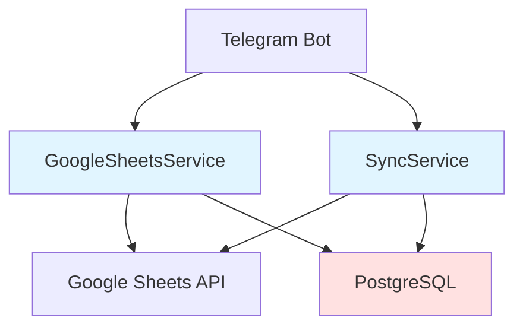

# Технический дизайн: Добавление столбца Username

## Обзор

Данный дизайн описывает техническое решение для добавления нового столбца "Username" в Google Sheets таблицу после столбца "Telegram ID". Изменение затрагивает три основных компонента системы:

1. **GoogleSheetsService** - сервис для работы с Google Sheets API
2. **SyncService** - сервис синхронизации данных между Google Sheets и PostgreSQL
3. **База данных PostgreSQL** - схема таблицы prizes

Основная задача - обеспечить корректное чтение и запись данных с учётом нового столбца, при этом сохранив обратную совместимость с существующими данными.

### Текущая структура столбцов

```
A: Telegram ID
B: Prize Type (digital/physical)
C: Promo Code (для digital)
D: Instructions (для digital)
E-M: Delivery Data (для physical)
N: Claimed At
```

### Новая структура столбцов

```
A: Telegram ID
B: Username (новый столбец)
C: Prize Type (сдвинуто с B)
D: Promo Code (сдвинуто с C)
E: Instructions (сдвинуто с D)
F-N: Delivery Data (сдвинуто с E-M)
O: Claimed At (сдвинуто с N)
```

## Архитектура

### Компоненты системы



### Поток данных

1. **Чтение данных (GoogleSheetsService)**:
   - Пользователь вводит кодовое слово
   - Бот ищет Telegram ID в Google Sheets через GoogleSheetsService
   - Сервис читает данные из строки с учётом новых индексов столбцов
   - Возвращает данные приза пользователю

2. **Синхронизация (SyncService)**:
   - Периодически (каждые 60 секунд) запускается синхронизация
   - SyncService читает все листы Google Sheets
   - Парсит данные с учётом нового столбца Username
   - Выполняет batch upsert в PostgreSQL

3. **Запись данных (GoogleSheetsService)**:
   - Пользователь вводит данные доставки для физического приза
   - GoogleSheetsService записывает данные в правильные столбцы (F-N вместо E-M)

### Принципы проектирования

- **Обратная совместимость**: Система должна корректно обрабатывать строки без Username
- **Минимальные изменения**: Изменяем только индексы столбцов, логика остаётся прежней
- **Валидация данных**: Проверяем минимальную структуру строки перед обработкой
- **Graceful degradation**: При отсутствии Username сохраняем NULL в БД

## Компоненты и интерфейсы

### 1. GoogleSheetsService

#### Изменения в методе `_find_winner_sync`

**Текущая реализация**:
```python
result = {
    'row_id': cell.row,
    'telegram_id': int(row_values[0]),
    'prize_type': row_values[1] if len(row_values) > 1 else None,  # Индекс 1
}

if result['prize_type'] == 'digital':
    result['promo_code'] = row_values[2] if len(row_values) > 2 else None  # Индекс 2
    result['instructions'] = row_values[3] if len(row_values) > 3 else None  # Индекс 3
```

**Новая реализация**:
```python
result = {
    'row_id': cell.row,
    'telegram_id': int(row_values[0]),
    'username': row_values[1] if len(row_values) > 1 else None,  # Индекс 1 (новый)
    'prize_type': row_values[2] if len(row_values) > 2 else None,  # Индекс 2 (сдвинуто)
}

if result['prize_type'] == 'digital':
    result['promo_code'] = row_values[3] if len(row_values) > 3 else None  # Индекс 3 (сдвинуто)
    result['instructions'] = row_values[4] if len(row_values) > 4 else None  # Индекс 4 (сдвинуто)
```

#### Изменения в методе `_save_delivery_data_sync`

**Текущие индексы столбцов**:
```python
# E (индекс 4): last_name
# F (индекс 5): first_name
# G (индекс 6): patronymic
# H (индекс 7): city
# I (индекс 8): street
# J (индекс 9): house
# K (индекс 10): apartment
# L (индекс 11): phone
# M (индекс 12): comment
# N (индекс 13): claimed_at
```

**Новые индексы столбцов** (все сдвинуты на +1):
```python
# F (индекс 5): last_name (было: индекс 4)
# G (индекс 6): first_name (было: индекс 5)
# H (индекс 7): patronymic (было: индекс 6)
# I (индекс 8): city (было: индекс 7)
# J (индекс 9): street (было: индекс 8)
# K (индекс 10): house (было: индекс 9)
# L (индекс 11): apartment (было: индекс 10)
# M (индекс 12): phone (было: индекс 11)
# N (индекс 13): comment (было: индекс 12)
# O (индекс 14): claimed_at (было: индекс 13)
```

**Обновление кода**:
```python
updates = []

if 'last_name' in delivery_data:
    updates.append({'range': f'F{row_id}', 'values': [[delivery_data.get('last_name', '')]]})  # Было: E
if 'first_name' in delivery_data:
    updates.append({'range': f'G{row_id}', 'values': [[delivery_data.get('first_name', '')]]})  # Было: F
if 'patronymic' in delivery_data:
    updates.append({'range': f'H{row_id}', 'values': [[delivery_data.get('patronymic', '')]]})  # Было: G
if 'city' in delivery_data:
    updates.append({'range': f'I{row_id}', 'values': [[delivery_data.get('city', '')]]})  # Было: H
if 'street' in delivery_data:
    updates.append({'range': f'J{row_id}', 'values': [[delivery_data.get('street', '')]]})  # Было: I
if 'house' in delivery_data:
    updates.append({'range': f'K{row_id}', 'values': [[delivery_data.get('house', '')]]})  # Было: J
if 'apartment' in delivery_data:
    updates.append({'range': f'L{row_id}', 'values': [[delivery_data.get('apartment', '')]]})  # Было: K
if 'phone' in delivery_data:
    updates.append({'range': f'M{row_id}', 'values': [[delivery_data.get('phone', '')]]})  # Было: L
if 'comment' in delivery_data:
    updates.append({'range': f'N{row_id}', 'values': [[delivery_data.get('comment', '')]]})  # Было: M
if 'claimed_at' in delivery_data:
    updates.append({'range': f'O{row_id}', 'values': [[delivery_data.get('claimed_at', '')]]})  # Было: N
```

### 2. SyncService

#### Изменения в методе `_convert_sheet_data_to_prizes`

**Текущая структура валидации**:
```python
# Проверяем минимум 2 столбца (telegram_id, prize_type)
if len(row_values) < 2:
    logger.warning("invalid_row_skipped", reason="insufficient_columns")
    continue
```

**Новая структура валидации**:
```python
# Проверяем минимум 3 столбца (telegram_id, username, prize_type)
if len(row_values) < 3:
    logger.warning("invalid_row_skipped", reason="insufficient_columns")
    continue
```

**Текущее чтение данных**:
```python
telegram_id = int(row_values[0])
code_word = row_values[1].strip()  # Из столбца B

prize_data = {
    'telegram_id': telegram_id,
    'prize_type': row_values[1],  # Индекс 1
    'code_word': code_word,
    'sheet_name': sheet_name,
    'row_id': row_index + 2,
}

if prize_data['prize_type'] == 'digital':
    prize_data['promo_code'] = row_values[2] if len(row_values) > 2 else None  # Индекс 2
    prize_data['instructions'] = row_values[3] if len(row_values) > 3 else None  # Индекс 3
```

**Новое чтение данных**:
```python
telegram_id = int(row_values[0])
username = row_values[1].strip() if len(row_values) > 1 and row_values[1] else None  # Новый столбец B
code_word = row_values[2].strip()  # Сдвинуто на столбец C

prize_data = {
    'telegram_id': telegram_id,
    'username': username,  # Новое поле
    'prize_type': row_values[3],  # Индекс 3 (сдвинуто с 2)
    'code_word': code_word,
    'sheet_name': sheet_name,
    'row_id': row_index + 2,
}

if prize_data['prize_type'] == 'digital':
    prize_data['promo_code'] = row_values[4] if len(row_values) > 4 else None  # Индекс 4 (сдвинуто)
    prize_data['instructions'] = row_values[5] if len(row_values) > 5 else None  # Индекс 5 (сдвинуто)
```

**Обновление индексов для физических призов**:
```python
if prize_data['prize_type'] == 'physical' and len(row_values) > 6:
    # Все индексы сдвинуты на +1
    prize_data['last_name'] = row_values[6] if len(row_values) > 6 else None  # Было: 5
    prize_data['first_name'] = row_values[7] if len(row_values) > 7 else None  # Было: 6
    prize_data['patronymic'] = row_values[8] if len(row_values) > 8 else None  # Было: 7
    prize_data['city'] = row_values[9] if len(row_values) > 9 else None  # Было: 8
    prize_data['street'] = row_values[10] if len(row_values) > 10 else None  # Было: 9
    prize_data['house'] = row_values[11] if len(row_values) > 11 else None  # Было: 10
    prize_data['apartment'] = row_values[12] if len(row_values) > 12 else None  # Было: 11
    prize_data['phone'] = row_values[13] if len(row_values) > 13 else None  # Было: 12
    prize_data['comment'] = row_values[14] if len(row_values) > 14 else None  # Было: 13
```

### 3. База данных PostgreSQL

#### Модель Prize

**Добавление нового поля**:
```python
class Prize(Base):
    __tablename__ = 'prizes'
    
    # ... существующие поля ...
    
    # Telegram ID пользователя
    telegram_id: Mapped[int] = mapped_column(BigInteger, nullable=False)
    
    # Username пользователя в Telegram (новое поле)
    username: Mapped[Optional[str]] = mapped_column(String(255), nullable=True)
    
    # Тип приза: 'digital' или 'physical'
    prize_type: Mapped[str] = mapped_column(String(20), nullable=False)
    
    # ... остальные поля ...
```

#### Миграция базы данных

**Файл миграции**: `telegram-bot/alembic/versions/XXX_add_username_column.py`

```python
"""add username column to prizes table

Revision ID: XXX
Revises: YYY
Create Date: 2024-XX-XX

"""
from alembic import op
import sqlalchemy as sa

# revision identifiers
revision = 'XXX'
down_revision = 'YYY'
branch_labels = None
depends_on = None

def upgrade() -> None:
    """Добавляет столбец username в таблицу prizes"""
    op.add_column('prizes', sa.Column('username', sa.String(255), nullable=True))

def downgrade() -> None:
    """Удаляет столбец username из таблицы prizes"""
    op.drop_column('prizes', 'username')
```

## Модели данных

### Prize (PostgreSQL)

```python
class Prize:
    id: int                          # Первичный ключ
    telegram_id: int                 # Telegram ID пользователя
    username: Optional[str]          # Username пользователя (новое поле)
    prize_type: str                  # Тип приза: 'digital' или 'physical'
    promo_code: Optional[str]        # Промокод (для digital)
    instructions: Optional[str]      # Инструкции (для digital)
    last_name: Optional[str]         # Фамилия (для physical)
    first_name: Optional[str]        # Имя (для physical)
    patronymic: Optional[str]        # Отчество (для physical)
    city: Optional[str]              # Город (для physical)
    street: Optional[str]            # Улица (для physical)
    house: Optional[str]             # Дом (для physical)
    apartment: Optional[str]         # Квартира (для physical)
    phone: Optional[str]             # Телефон (для physical)
    comment: Optional[str]           # Комментарий (для physical)
    sheet_name: str                  # Название листа в Google Sheets
    code_word: str                   # Кодовое слово
    row_id: int                      # Номер строки в Google Sheets
    created_at: datetime             # Время создания записи
    updated_at: datetime             # Время последнего обновления
```

### Google Sheets Row Structure

```
Столбец A (индекс 0): telegram_id (int)
Столбец B (индекс 1): username (str, optional) - НОВЫЙ
Столбец C (индекс 2): prize_type (str: 'digital' | 'physical')
Столбец D (индекс 3): promo_code (str, optional, для digital)
Столбец E (индекс 4): instructions (str, optional, для digital)
Столбец F (индекс 5): last_name (str, optional, для physical)
Столбец G (индекс 6): first_name (str, optional, для physical)
Столбец H (индекс 7): patronymic (str, optional, для physical)
Столбец I (индекс 8): city (str, optional, для physical)
Столбец J (индекс 9): street (str, optional, для physical)
Столбец K (индекс 10): house (str, optional, для physical)
Столбец L (индекс 11): apartment (str, optional, для physical)
Столбец M (индекс 12): phone (str, optional, для physical)
Столбец N (индекс 13): comment (str, optional, для physical)
Столбец O (индекс 14): claimed_at (str, optional, для physical)
```

Столбец O (индекс 14): claimed_at (str, optional, для physical)
```

## Correctness Properties

*Свойство (property) - это характеристика или поведение, которое должно выполняться для всех валидных выполнений системы - по сути, формальное утверждение о том, что система должна делать. Свойства служат мостом между человекочитаемыми спецификациями и машинно-проверяемыми гарантиями корректности.*

### Property 1: Чтение полей из правильных индексов столбцов (GoogleSheetsService)

*Для любой* строки данных из Google Sheets, при чтении через GoogleSheetsService все поля должны извлекаться из правильных индексов столбцов с учётом сдвига: username из индекса 1, prize_type из индекса 2, promo_code из индекса 3, instructions из индекса 4, и данные доставки из индексов 5-14.

**Validates: Requirements 1.1, 1.2, 1.3, 1.4, 1.5**

### Property 2: Парсинг полей из правильных индексов столбцов (SyncService)

*Для любой* строки данных из Google Sheets, при парсинге через SyncService все поля должны извлекаться из правильных индексов столбцов: telegram_id из индекса 0, username из индекса 1, code_word из индекса 2, prize_type из индекса 3, и все остальные поля со сдвигом на +1 относительно старой структуры.

**Validates: Requirements 2.1, 2.2, 2.3, 2.4, 2.5, 2.6**

### Property 3: Запись данных доставки в правильные столбцы

*Для любых* данных доставки физического приза, при записи через GoogleSheetsService все поля должны записываться в правильные столбцы со сдвигом на +1: last_name в F, first_name в G, patronymic в H, city в I, street в J, house в K, apartment в L, phone в M, comment в N, claimed_at в O.

**Validates: Requirements 3.1, 3.2, 3.3, 3.4, 3.5, 3.6, 3.7, 3.8, 3.9, 3.10**

### Property 4: Корректное сохранение username в базу данных

*Для любой* строки данных из Google Sheets, при синхронизации через SyncService значение username должно корректно сохраняться в базу данных: если username присутствует и не пустой - сохраняется его значение, если отсутствует или пустой - сохраняется NULL.

**Validates: Requirements 2.7, 2.8**

### Property 5: Валидация минимальной структуры строки

*Для любой* строки данных из Google Sheets, SyncService должен валидировать минимальную структуру перед синхронизацией: строки с менее чем 4 столбцами (telegram_id, username, code_word, prize_type) должны отклоняться с предупреждением в логах.

**Validates: Requirements 5.4**

### Property 6: Обратная совместимость при отсутствии username

*Для любой* строки данных из Google Sheets без username или с пустым username, система должна корректно обрабатывать остальные данные: GoogleSheetsService должен успешно читать данные приза, SyncService должен успешно синхронизировать остальные поля, а в базу данных должен сохраняться NULL для username.

**Validates: Requirements 5.1, 5.2, 5.3**

### Property 7: Round-trip парсинга и форматирования данных

*Для любых* данных приза из Google Sheets, если выполнить парсинг данных в объект Prize, затем отформатировать обратно в структуру Google Sheets, затем снова распарсить, результирующий объект должен быть эквивалентен исходному (с учётом нормализации пустых строк в NULL).

**Validates: Requirements 6.6**

## Обработка ошибок

### Сценарии ошибок

1. **Отсутствие столбца Username в старых данных**
   - **Обработка**: Graceful degradation - сохраняем NULL в БД
   - **Логирование**: Не логируем как ошибку, это нормальное поведение

2. **Недостаточное количество столбцов в строке**
   - **Обработка**: Пропускаем строку с предупреждением в логах
   - **Логирование**: `logger.warning("invalid_row_skipped", reason="insufficient_columns")`

3. **Ошибка при чтении данных из Google Sheets**
   - **Обработка**: Retry логика с экспоненциальной задержкой (до 3 попыток)
   - **Логирование**: `logger.error("google_sheets_api_error")`

4. **Ошибка при записи в базу данных**
   - **Обработка**: Выбрасываем DatabaseUnavailableError
   - **Логирование**: `logger.error("database_unavailable_during_sync")`

5. **Ошибка при записи данных доставки в Google Sheets**
   - **Обработка**: Возвращаем False, логируем ошибку
   - **Логирование**: `logger.error("google_sheets_api_error_saving_delivery")`

### Валидация данных

```python
# Валидация минимальной структуры строки в SyncService
if len(row_values) < 4:
    logger.warning(
        "invalid_row_skipped",
        sheet_name=sheet_name,
        row_index=row_index + 2,
        reason="insufficient_columns",
        found_columns=len(row_values),
        required_columns=4,
        message="Требуется минимум 4 столбца: telegram_id, username, code_word, prize_type"
    )
    continue

# Валидация обязательных полей
if not row_values[0]:
    logger.warning("invalid_row_skipped", reason="missing_telegram_id")
    continue

if not row_values[2] or not row_values[2].strip():
    logger.warning("invalid_row_skipped", reason="missing_code_word")
    continue

if not row_values[3]:
    logger.warning("invalid_row_skipped", reason="missing_prize_type")
    continue
```

### Обработка NULL значений

```python
# Обработка пустого username
username = row_values[1].strip() if len(row_values) > 1 and row_values[1] else None

# В базе данных username может быть NULL
username: Mapped[Optional[str]] = mapped_column(String(255), nullable=True)
```

## Стратегия тестирования

### Двойной подход к тестированию

Для обеспечения полного покрытия функциональности используется комбинация unit-тестов и property-based тестов:

- **Unit-тесты**: Проверяют конкретные примеры, edge cases и условия ошибок
- **Property-тесты**: Проверяют универсальные свойства на множестве сгенерированных входных данных

Оба типа тестов дополняют друг друга и необходимы для комплексного покрытия.

### Property-Based Testing

**Библиотека**: Hypothesis (для Python)

**Конфигурация**:
- Минимум 100 итераций на каждый property-тест
- Каждый тест должен ссылаться на соответствующее свойство из дизайна
- Формат тега: `# Feature: add-username-column, Property {number}: {property_text}`

**Примеры property-тестов**:

```python
from hypothesis import given, strategies as st
import pytest

# Feature: add-username-column, Property 1: Чтение полей из правильных индексов столбцов (GoogleSheetsService)
@given(
    telegram_id=st.integers(min_value=1, max_value=999999999),
    username=st.one_of(st.none(), st.text(min_size=1, max_size=50)),
    prize_type=st.sampled_from(['digital', 'physical']),
    promo_code=st.one_of(st.none(), st.text(min_size=1, max_size=100)),
)
@pytest.mark.property_test
def test_google_sheets_service_reads_from_correct_column_indices(
    telegram_id, username, prize_type, promo_code
):
    """
    Property 1: Для любой строки данных из Google Sheets,
    GoogleSheetsService должен читать все поля из правильных индексов
    """
    # Формируем строку данных с новой структурой
    row_values = [
        str(telegram_id),           # Индекс 0
        username or '',             # Индекс 1 (новый)
        prize_type,                 # Индекс 2 (сдвинуто)
        promo_code or '',           # Индекс 3 (сдвинуто)
    ]
    
    # Парсим данные
    result = parse_winner_data(row_values)
    
    # Проверяем корректность извлечения
    assert result['telegram_id'] == telegram_id
    assert result['username'] == (username if username else None)
    assert result['prize_type'] == prize_type
    if prize_type == 'digital':
        assert result['promo_code'] == (promo_code if promo_code else None)


# Feature: add-username-column, Property 4: Корректное сохранение username в базу данных
@given(
    telegram_id=st.integers(min_value=1, max_value=999999999),
    username=st.one_of(st.none(), st.just(''), st.text(min_size=1, max_size=50)),
    code_word=st.text(min_size=1, max_size=50),
    prize_type=st.sampled_from(['digital', 'physical']),
)
@pytest.mark.property_test
async def test_sync_service_saves_username_correctly(
    telegram_id, username, code_word, prize_type
):
    """
    Property 4: Для любой строки данных, username должен корректно
    сохраняться в БД (значение или NULL)
    """
    # Формируем данные приза
    prize_data = {
        'telegram_id': telegram_id,
        'username': username if username and username.strip() else None,
        'code_word': code_word,
        'prize_type': prize_type,
        'sheet_name': 'test_sheet',
        'row_id': 2,
    }
    
    # Сохраняем в БД
    await prize_repository.upsert_prize(prize_data)
    
    # Читаем из БД
    saved_prize = await prize_repository.find_prize(telegram_id, code_word)
    
    # Проверяем корректность сохранения username
    if username and username.strip():
        assert saved_prize.username == username.strip()
    else:
        assert saved_prize.username is None


# Feature: add-username-column, Property 7: Round-trip парсинга и форматирования данных
@given(
    telegram_id=st.integers(min_value=1, max_value=999999999),
    username=st.one_of(st.none(), st.text(min_size=1, max_size=50)),
    code_word=st.text(min_size=1, max_size=50),
    prize_type=st.sampled_from(['digital', 'physical']),
)
@pytest.mark.property_test
def test_parse_format_parse_round_trip(telegram_id, username, code_word, prize_type):
    """
    Property 7: Для любых данных приза, парсинг -> форматирование -> парсинг
    должен возвращать эквивалентный объект
    """
    # Создаём исходные данные
    original_row = create_google_sheets_row(telegram_id, username, code_word, prize_type)
    
    # Парсим в объект
    parsed_1 = parse_sheet_row(original_row)
    
    # Форматируем обратно в строку
    formatted = format_to_sheet_row(parsed_1)
    
    # Парсим снова
    parsed_2 = parse_sheet_row(formatted)
    
    # Проверяем эквивалентность (с учётом нормализации пустых строк в NULL)
    assert normalize_prize_data(parsed_1) == normalize_prize_data(parsed_2)
```

### Unit-тесты

**Примеры unit-тестов**:

```python
import pytest

class TestGoogleSheetsServiceColumnIndices:
    """Unit-тесты для проверки корректности индексов столбцов в GoogleSheetsService"""
    
    def test_read_username_from_column_b(self):
        """Проверка чтения username из столбца B (индекс 1)"""
        row_values = ['123456789', '@testuser', 'digital', 'PROMO123']
        result = parse_winner_data(row_values)
        assert result['username'] == '@testuser'
    
    def test_read_prize_type_from_column_c(self):
        """Проверка чтения prize_type из столбца C (индекс 2)"""
        row_values = ['123456789', '@testuser', 'physical']
        result = parse_winner_data(row_values)
        assert result['prize_type'] == 'physical'
    
    def test_read_without_username(self):
        """Проверка чтения данных когда username отсутствует"""
        row_values = ['123456789', '', 'digital', 'PROMO123']
        result = parse_winner_data(row_values)
        assert result['username'] is None
        assert result['prize_type'] == 'digital'
    
    def test_save_delivery_data_to_shifted_columns(self):
        """Проверка записи данных доставки в сдвинутые столбцы"""
        delivery_data = {
            'last_name': 'Иванов',
            'first_name': 'Иван',
            'city': 'Москва',
        }
        updates = build_delivery_updates(row_id=2, delivery_data=delivery_data)
        
        # Проверяем правильные столбцы (сдвинуты на +1)
        assert any(u['range'] == 'F2' for u in updates)  # last_name в F (было E)
        assert any(u['range'] == 'G2' for u in updates)  # first_name в G (было F)
        assert any(u['range'] == 'I2' for u in updates)  # city в I (было H)


class TestSyncServiceColumnIndices:
    """Unit-тесты для проверки корректности индексов столбцов в SyncService"""
    
    def test_parse_row_with_username(self):
        """Проверка парсинга строки с username"""
        row_values = ['123456789', '@testuser', 'CODE123', 'digital', 'PROMO123']
        prize_data = convert_row_to_prize_data(row_values, 'test_sheet', 0)
        
        assert prize_data['telegram_id'] == 123456789
        assert prize_data['username'] == '@testuser'
        assert prize_data['code_word'] == 'CODE123'
        assert prize_data['prize_type'] == 'digital'
        assert prize_data['promo_code'] == 'PROMO123'
    
    def test_parse_row_without_username(self):
        """Проверка парсинга строки без username"""
        row_values = ['123456789', '', 'CODE123', 'physical']
        prize_data = convert_row_to_prize_data(row_values, 'test_sheet', 0)
        
        assert prize_data['username'] is None
        assert prize_data['code_word'] == 'CODE123'
    
    def test_validate_minimum_structure(self):
        """Проверка валидации минимальной структуры строки"""
        # Строка с недостаточным количеством столбцов должна быть отклонена
        row_values = ['123456789', '@testuser']  # Только 2 столбца
        
        with pytest.raises(ValidationError):
            convert_row_to_prize_data(row_values, 'test_sheet', 0)


class TestDatabaseSchema:
    """Unit-тесты для проверки схемы базы данных"""
    
    async def test_username_column_exists(self, db_session):
        """Проверка наличия столбца username в таблице prizes"""
        # Проверяем через метаданные SQLAlchemy
        assert 'username' in Prize.__table__.columns
    
    async def test_username_allows_null(self, db_session):
        """Проверка что столбец username допускает NULL"""
        prize_data = {
            'telegram_id': 123456789,
            'username': None,  # NULL значение
            'code_word': 'TEST',
            'prize_type': 'digital',
            'sheet_name': 'test',
            'row_id': 2,
        }
        
        # Должно успешно сохраниться
        prize = await prize_repository.upsert_prize(prize_data)
        assert prize.username is None
```

### Integration-тесты

```python
class TestEndToEndColumnShift:
    """Integration-тесты для проверки корректности работы всей системы с новой структурой"""
    
    async def test_full_sync_with_username(self, mock_google_sheets, db_session):
        """Проверка полной синхронизации данных с username"""
        # Подготавливаем mock данные в Google Sheets
        mock_google_sheets.add_row(['123456789', '@testuser', 'CODE123', 'digital', 'PROMO123'])
        
        # Запускаем синхронизацию
        sync_service = SyncService(google_sheets_config, sync_config)
        stats = await sync_service.sync_all_sheets()
        
        # Проверяем что данные корректно синхронизированы
        prize = await prize_repository.find_prize(123456789, 'CODE123')
        assert prize is not None
        assert prize.username == '@testuser'
        assert prize.prize_type == 'digital'
        assert prize.promo_code == 'PROMO123'
    
    async def test_full_sync_without_username(self, mock_google_sheets, db_session):
        """Проверка полной синхронизации данных без username (обратная совместимость)"""
        # Подготавливаем mock данные без username
        mock_google_sheets.add_row(['123456789', '', 'CODE123', 'physical'])
        
        # Запускаем синхронизацию
        sync_service = SyncService(google_sheets_config, sync_config)
        stats = await sync_service.sync_all_sheets()
        
        # Проверяем что данные корректно синхронизированы
        prize = await prize_repository.find_prize(123456789, 'CODE123')
        assert prize is not None
        assert prize.username is None  # NULL для отсутствующего username
        assert prize.prize_type == 'physical'
```

### Покрытие тестами

- **GoogleSheetsService**: 
  - Unit-тесты для чтения из правильных индексов
  - Unit-тесты для записи в правильные столбцы
  - Property-тесты для проверки корректности на случайных данных

- **SyncService**:
  - Unit-тесты для парсинга из правильных индексов
  - Unit-тесты для валидации структуры
  - Property-тесты для проверки корректности синхронизации

- **База данных**:
  - Unit-тесты для проверки схемы
  - Unit-тесты для проверки NULL значений
  - Integration-тесты для проверки миграций

- **End-to-End**:
  - Integration-тесты для полного цикла синхронизации
  - Integration-тесты для обратной совместимости

