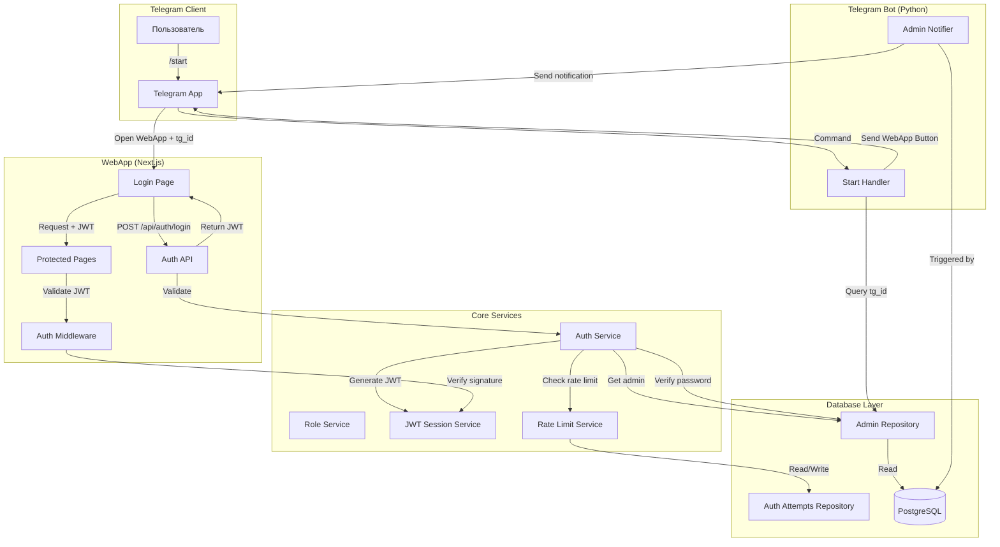
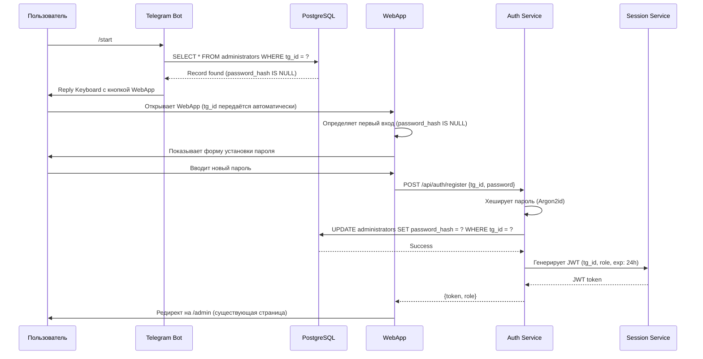
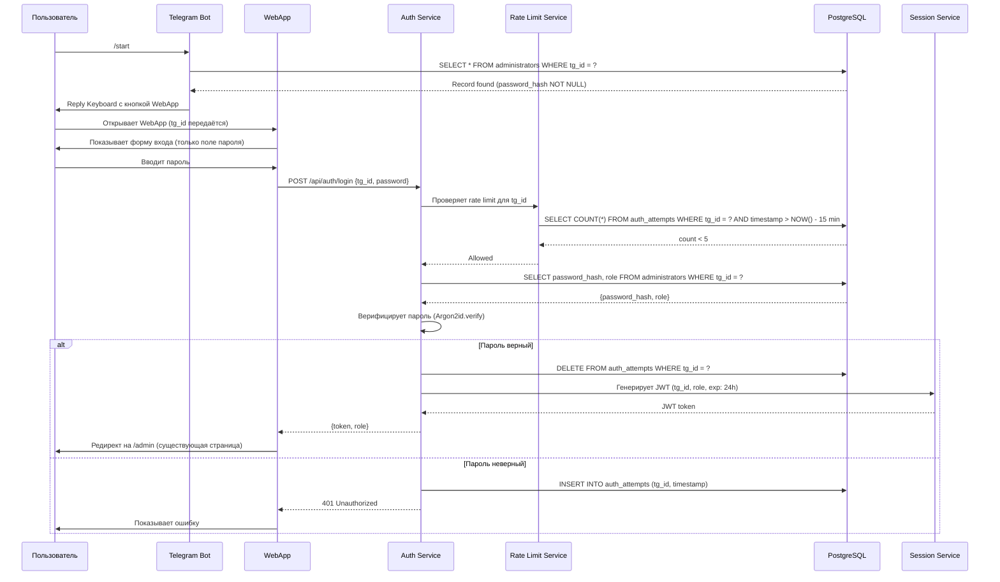
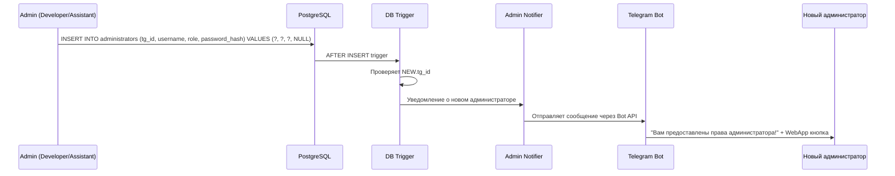

# Design Document: Система авторизации и ролевой модели администраторов

## Overview

Система авторизации администраторов обеспечивает безопасный доступ к административной панели Telegram-бота через WebApp. Система реализует многоуровневую ролевую модель, автоматическую регистрацию при первом входе, управление сессиями через JWT токены и защиту от несанкционированного доступа.

**ВАЖНО: Интеграция с существующей инфраструктурой**

Система интегрируется с существующими компонентами проекта:
- **nextjs-app/app/login/page.tsx** - существующая страница входа (обновляется, не создаётся заново)
- **nextjs-app/app/admin/page.tsx** - существующая админ-панель (используется как есть)
- **nextjs-app/middleware.ts** - существующий middleware (обновляется для JWT вместо NextAuth.js)
- **nextjs-app/lib/database/client.ts** - существующий DatabaseClient с connection pooling (используется в новых репозиториях)
- **nextjs-app/lib/telegram/initDataValidator.ts** - существующий валидатор Telegram WebApp (используется как референс)
- **telegram-bot/handlers/common_handler.py** - существующий обработчик /start (обновляется для проверки администраторов)
- **telegram-bot/services/session_manager.py** - существующий менеджер support сессий (НЕ трогаем, создаём отдельный jwt_session_service.py)

### Ключевые возможности

- Автоматическое определение администраторов при команде /start
- Первичная регистрация пароля для новых администраторов
- Аутентификация через безопасное хеширование паролей (Argon2id)
- Stateless сессии на основе JWT токенов для горизонтального масштабирования
- Четырёхуровневая ролевая модель (Developer, Assistant, Administrator, Operator)
- Защита от brute-force атак через rate limiting
- Автоматическая передача tg_id через Telegram WebApp API
- Конфигурируемое время жизни сессий

### Технологический стек

- **Backend**: Python (aiogram для Telegram Bot)
- **Frontend**: Next.js 16 (TypeScript, React 19)
- **Database**: PostgreSQL 15
- **Authentication**: JWT (PyJWT, jose для Next.js)
- **Password Hashing**: Argon2id (argon2-cffi)
- **Session Storage**: Stateless JWT (без серверного хранения)
- **Rate Limiting**: PostgreSQL (таблица auth_attempts)

## Architecture


### Архитектурные принципы

1. **Clean Architecture**: Разделение на слои (Domain, Application, Infrastructure)
2. **Dependency Injection**: Инверсия зависимостей для тестируемости
3. **Stateless Design**: JWT токены без серверного хранения сессий
4. **Single Responsibility**: Один модуль = один файл = одна ответственность
5. **Security by Design**: Безопасность на каждом уровне архитектуры

### Диаграмма компонентов



### Слои архитектуры


**1. Presentation Layer (Telegram Bot + Next.js)**
- Telegram Bot handlers для команды /start
- Next.js страницы (login, admin panel)
- API routes для аутентификации

**2. Application Layer (Services)**
- AuthService: логика аутентификации и регистрации
- JWTSessionService: генерация и валидация JWT
- RoleService: управление ролями и проверка прав
- RateLimitService: защита от brute-force

**3. Domain Layer (Models)**
- Administrator: модель администратора
- Role: перечисление ролей
- Session: модель сессии (JWT claims)
- AuthAttempt: модель попытки входа

**4. Infrastructure Layer (Repositories)**
- AdminRepository: работа с таблицей administrators
- AuthAttemptsRepository: работа с таблицей auth_attempts
- DatabaseConnection: управление connection pool

### Последовательность взаимодействия

#### Сценарий 1: Первый вход администратора



#### Сценарий 2: Повторный вход администратора



#### Сценарий 3: Динамическое предоставление прав



## Components and Interfaces


### 1. Telegram Bot Components

#### 1.1 AdminStartHandler (telegram-bot/handlers/admin_start_handler.py)

Обработчик команды /start с проверкой прав администратора.

**Примечание:** Интегрируется с существующим handlers/common_handler.py, который уже обрабатывает /start. Логика проверки администратора добавляется в начало существующего обработчика.

```python
class AdminStartHandler:
    """Обработчик команды /start для администраторов и обычных пользователей"""
    
    def __init__(self, admin_repository: AdminRepository, support_session_manager: SessionManager):
        self.admin_repo = admin_repository
        self.support_session_manager = support_session_manager  # Существующий SessionManager для support
    
    async def handle_start(self, message: Message, session_id: Optional[int]) -> None:
        """
        Обрабатывает команду /start
        
        Логика:
        1. Извлекает tg_id из message.from_user.id
        2. Проверяет наличие tg_id в таблице administrators
        3. Если найден - отправляет Reply Keyboard с WebApp кнопкой
        4. Если не найден - запускает Standard Flow (существующая логика из common_handler.py)
        
        Validates: Requirements 3.1, 3.2, 4.1, 4.2, 4.3
        """
```

**Интерфейс:**
- Input: Message (aiogram), session_id
- Output: None (отправляет сообщение пользователю)
- Dependencies: AdminRepository, SessionManager (существующий для support сессий)

#### 1.2 AdminNotificationService (telegram-bot/services/admin_notification_service.py)

Сервис для отправки уведомлений о предоставлении прав администратора.

```python
class AdminNotificationService:
    """Сервис уведомлений о предоставлении прав администратора"""
    
    def __init__(self, bot: Bot):
        self.bot = bot
    
    async def notify_new_admin(self, tg_id: int, username: str, role: int) -> None:
        """
        Отправляет уведомление новому администратору
        
        Логика:
        1. Формирует текст уведомления с указанием роли
        2. Создаёт Reply Keyboard с кнопкой WebApp
        3. Отправляет сообщение через Bot API
        
        Validates: Requirements 5.1, 5.2, 5.3, 5.4
        """
```

**Интерфейс:**
- Input: tg_id (int), username (str), role (int)
- Output: None (отправляет уведомление)
- Dependencies: Bot (aiogram)

### 2. WebApp Components (Next.js)

#### 2.1 Login Page (nextjs-app/app/login/page.tsx)

Обновление существующей страницы входа для администраторов с автоматическим определением первого входа.

**Существующая реализация:** Использует NextAuth.js с credentials provider (username/password)
**Изменения:** Заменить на прямые API вызовы с автоматическим извлечением tg_id из Telegram WebApp

```typescript
interface LoginPageProps {
  // Получает tg_id из Telegram WebApp API
}

interface LoginFormState {
  tgId: number | null;
  password: string;
  isFirstLogin: boolean;
  error: string | null;
  isLoading: boolean;
}

// Компонент автоматически:
// 1. Извлекает tg_id из window.Telegram.WebApp.initDataUnsafe.user.id
// 2. Проверяет через API, первый ли это вход (GET /api/auth/check-first-login)
// 3. Показывает соответствующую форму (установка пароля или вход)
// 4. Отправляет данные на соответствующий endpoint
```

**Интерфейс:**
- Input: tg_id (из Telegram WebApp API)
- Output: Редирект на /admin при успешной аутентификации
- API Calls: 
  - GET /api/auth/check-first-login?tgId={tg_id}
  - POST /api/auth/register (первый вход)
  - POST /api/auth/login (повторный вход)

**Изменения:**
- Заменить NextAuth.js signIn на прямые API вызовы
- Убрать поле username, оставить только password
- Добавить автоматическое извлечение tg_id из Telegram WebApp API
- Добавить проверку первого входа

**Validates:** Requirements 6.1, 6.2, 6.3, 6.4, 7.1, 7.2, 7.3, 7.4

#### 2.2 Auth API Routes

##### 2.2.1 Check First Login (nextjs-app/app/api/auth/check-first-login/route.ts)

```typescript
// GET /api/auth/check-first-login?tgId={tg_id}
interface CheckFirstLoginRequest {
  tgId: number;
}

interface CheckFirstLoginResponse {
  isFirstLogin: boolean;
  exists: boolean;
}

// Логика:
// 1. Валидирует tgId
// 2. Проверяет существование записи в administrators
// 3. Если запись есть, проверяет password_hash IS NULL
// 4. Возвращает флаги isFirstLogin и exists
```

**Validates:** Requirements 8.1

##### 2.2.2 Register (nextjs-app/app/api/auth/register/route.ts)

```typescript
// POST /api/auth/register
interface RegisterRequest {
  tgId: number;
  password: string;
}

interface RegisterResponse {
  token: string;
  role: number;
  expiresAt: string;
}

// Логика:
// 1. Валидирует входные данные (tgId существует, password не пустой)
// 2. Проверяет, что password_hash IS NULL (первый вход)
// 3. Хеширует пароль через Argon2id
// 4. Обновляет password_hash в БД
// 5. Генерирует JWT токен
// 6. Возвращает токен и роль
```

**Validates:** Requirements 8.1, 8.2, 8.3, 8.4, 8.5

##### 2.2.3 Login (nextjs-app/app/api/auth/login/route.ts)

```typescript
// POST /api/auth/login
interface LoginRequest {
  tgId: number;
  password: string;
}

interface LoginResponse {
  token: string;
  role: number;
  expiresAt: string;
}

interface LoginErrorResponse {
  error: string;
  remainingAttempts?: number;
}

// Логика:
// 1. Проверяет rate limit (RateLimitService)
// 2. Если заблокирован - возвращает 429 Too Many Requests
// 3. Получает admin из БД
// 4. Верифицирует пароль через Argon2id
// 5. Если успех - очищает auth_attempts, генерирует JWT
// 6. Если неудача - записывает попытку, возвращает 401
```

**Validates:** Requirements 9.1, 9.2, 9.3, 9.4, 9.5, 12.4, 12.5

##### 2.2.4 Validate Token (nextjs-app/app/api/auth/validate/route.ts)

```typescript
// POST /api/auth/validate
interface ValidateTokenRequest {
  token: string;
}

interface ValidateTokenResponse {
  valid: boolean;
  tgId?: number;
  role?: number;
  expiresAt?: string;
}

// Логика:
// 1. Верифицирует JWT подпись
// 2. Проверяет срок действия (exp claim)
// 3. Возвращает данные из токена если валиден
```

**Validates:** Requirements 10.3, 10.4, 12.1, 12.2, 12.3

#### 2.3 Auth Middleware (nextjs-app/middleware.ts)

**Существующая реализация:** Использует NextAuth.js getToken() для проверки аутентификации, добавляет CSP заголовки

**Изменения:**
- Заменить getToken() из next-auth/jwt на кастомную JWT валидацию через JWTSessionService
- Сохранить существующую логику CSP заголовков
- Редирект на /login остаётся (уже используется существующая страница)

```typescript
// Обновлённый middleware для защиты роутов
export function middleware(request: NextRequest) {
  // 1. Извлекает JWT из cookie 'admin-token'
  // 2. Валидирует токен через JWTSessionService
  // 3. Если невалиден - редирект на /login (существующая страница)
  // 4. Если валиден - добавляет claims в request headers
  // 5. Добавляет CSP заголовки (существующая логика)
  // 6. Пропускает запрос дальше
}

export const config = {
  matcher: ['/admin/:path*', '/api/admin/:path*', '/api/support/:path*']
}
```

**Validates:** Requirements 12.1, 12.2, 12.3

### 3. Core Services

#### 3.1 AuthService (telegram-bot/services/auth_service.py)


Центральный сервис аутентификации и регистрации.

```python
class AuthService:
    """Сервис аутентификации администраторов"""
    
    def __init__(
        self,
        admin_repository: AdminRepository,
        rate_limit_service: RateLimitService,
        password_hasher: PasswordHasher
    ):
        self.admin_repo = admin_repository
        self.rate_limiter = rate_limit_service
        self.hasher = password_hasher
    
    async def register_password(self, tg_id: int, password: str) -> Administrator:
        """Регистрирует пароль для нового администратора"""
    
    async def authenticate(self, tg_id: int, password: str) -> Optional[Administrator]:
        """Аутентифицирует администратора"""
    
    async def is_first_login(self, tg_id: int) -> bool:
        """Проверяет, первый ли это вход (password_hash IS NULL)"""
```

**Validates:** Requirements 8.2, 8.3, 8.4, 9.1, 9.2, 9.3, 9.4

#### 3.2 JWTSessionService (telegram-bot/services/jwt_session_service.py)

Сервис управления JWT сессиями для администраторов.

**Примечание:** Переименован в JWTSessionService, чтобы избежать конфликта с существующим services/session_manager.py (который управляет support сессиями пользователей).

```python
@dataclass
class SessionClaims:
    """JWT claims для сессии"""
    tg_id: int
    role: int
    exp: int  # Unix timestamp
    iat: int  # Unix timestamp

class JWTSessionService:
    """Сервис управления сессиями через JWT"""
    
    def __init__(self, secret_key: str, session_lifetime_hours: int = 24):
        self.secret_key = secret_key
        self.session_lifetime = session_lifetime_hours
    
    def generate_token(self, tg_id: int, role: int) -> str:
        """Генерирует JWT токен"""
    
    def validate_token(self, token: str) -> Optional[SessionClaims]:
        """Валидирует JWT токен и возвращает claims"""
    
    def is_token_expired(self, token: str) -> bool:
        """Проверяет истечение срока токена"""
```

**Validates:** Requirements 10.1, 10.2, 10.3, 10.4, 10.5


#### 3.3 RoleService (telegram-bot/services/role_service.py)

Сервис управления ролями и проверки прав доступа.

```python
from enum import IntEnum

class AdminRole(IntEnum):
    """Роли администраторов"""
    DEVELOPER = 0
    ASSISTANT = 1
    ADMINISTRATOR = 2
    OPERATOR = 3

class RoleService:
    """Сервис управления ролями"""
    
    @staticmethod
    def get_role_name(role: int) -> str:
        """Возвращает название роли"""
    
    @staticmethod
    def can_assign_operators(role: int) -> bool:
        """Проверяет право назначения операторов (role <= 2)"""
    
    @staticmethod
    def can_modify_session_lifetime(role: int) -> bool:
        """Проверяет право изменения времени жизни сессий (role <= 1)"""
    
    @staticmethod
    def can_respond_to_users(role: int) -> bool:
        """Проверяет право отвечать пользователям (role <= 3, т.е. все)"""
```

**Validates:** Requirements 2.1, 2.2, 2.3, 2.4, 2.5, 11.3

#### 3.4 RateLimitService (telegram-bot/services/rate_limit_service.py)

Сервис защиты от brute-force атак.

```python
@dataclass
class RateLimitResult:
    """Результат проверки rate limit"""
    allowed: bool
    attempts_count: int
    blocked_until: Optional[datetime]

class RateLimitService:
    """Сервис rate limiting для защиты от brute-force"""
    
    def __init__(self, auth_attempts_repo: AuthAttemptsRepository):
        self.attempts_repo = auth_attempts_repo
    
    async def check_rate_limit(self, tg_id: int) -> RateLimitResult:
        """
        Проверяет rate limit для tg_id
        
        Логика:
        1. Подсчитывает попытки за последние 15 минут
        2. Если >= 5 попыток - блокирует
        3. Возвращает результат с информацией о блокировке
        """
    
    async def record_failed_attempt(self, tg_id: int) -> None:
        """Записывает неудачную попытку входа"""
    
    async def clear_attempts(self, tg_id: int) -> None:
        """Очищает попытки после успешного входа"""
```

**Validates:** Requirements 12.4, 12.5

#### 3.5 PasswordHasher (telegram-bot/services/password_hasher.py)


Сервис безопасного хеширования паролей.

```python
class PasswordHasher:
    """Сервис хеширования паролей через Argon2id"""
    
    def __init__(self, time_cost: int = 2, memory_cost: int = 65536, parallelism: int = 4):
        """
        Инициализирует hasher с параметрами Argon2id
        
        Параметры по умолчанию соответствуют рекомендациям OWASP:
        - time_cost: 2 итерации
        - memory_cost: 64 MB
        - parallelism: 4 потока
        """
        self.hasher = argon2.PasswordHasher(
            time_cost=time_cost,
            memory_cost=memory_cost,
            parallelism=parallelism,
            hash_len=32,
            salt_len=16
        )
    
    def hash_password(self, password: str) -> str:
        """Хеширует пароль с автоматической генерацией соли"""
    
    def verify_password(self, password_hash: str, password: str) -> bool:
        """Верифицирует пароль против хеша"""
```

**Validates:** Requirements 13.1, 13.2, 13.3, 13.4, 13.5

#### 3.6 ConfigService (telegram-bot/services/config_service.py)

Сервис управления конфигурацией времени жизни сессий.

```python
class ConfigService:
    """Сервис управления конфигурацией системы"""
    
    def __init__(self, config_repo: ConfigRepository):
        self.config_repo = config_repo
    
    async def get_session_lifetime(self) -> int:
        """Получает текущее время жизни сессий в часах"""
    
    async def set_session_lifetime(self, hours: int, admin_role: int) -> bool:
        """
        Устанавливает время жизни сессий
        
        Проверяет права доступа (только Developer и Assistant)
        """
```

**Validates:** Requirements 11.1, 11.2, 11.3, 11.4, 11.5

### 4. Repository Layer

#### 4.1 AdminRepository (telegram-bot/database/repositories/admin_repository.py)


Репозиторий для работы с таблицей administrators.

```python
@dataclass
class Administrator:
    """Модель администратора"""
    tg_id: int
    username: str
    role: int
    password_hash: Optional[str]

class AdminRepository:
    """Репозиторий для работы с администраторами"""
    
    def __init__(self, db_connection: DatabaseConnection):
        self.db = db_connection
    
    async def get_by_tg_id(self, tg_id: int) -> Optional[Administrator]:
        """Получает администратора по tg_id"""
    
    async def exists(self, tg_id: int) -> bool:
        """Проверяет существование администратора"""
    
    async def create(self, tg_id: int, username: str, role: int) -> Administrator:
        """Создаёт нового администратора с password_hash = NULL"""
    
    async def update_password(self, tg_id: int, password_hash: str) -> None:
        """Обновляет password_hash для администратора"""
    
    async def get_all(self) -> List[Administrator]:
        """Получает всех администраторов"""
```

**Validates:** Requirements 1.1, 1.2, 1.3, 1.4, 1.5

#### 4.2 AuthAttemptsRepository (telegram-bot/database/repositories/auth_attempts_repository.py)

Репозиторий для работы с попытками входа (rate limiting).

```python
@dataclass
class AuthAttempt:
    """Модель попытки входа"""
    id: int
    tg_id: int
    timestamp: datetime
    ip_address: Optional[str]

class AuthAttemptsRepository:
    """Репозиторий для работы с попытками входа"""
    
    def __init__(self, db_connection: DatabaseConnection):
        self.db = db_connection
    
    async def count_recent_attempts(self, tg_id: int, minutes: int = 15) -> int:
        """Подсчитывает попытки за последние N минут"""
    
    async def record_attempt(self, tg_id: int, ip_address: Optional[str] = None) -> None:
        """Записывает попытку входа"""
    
    async def clear_attempts(self, tg_id: int) -> None:
        """Очищает все попытки для tg_id"""
    
    async def cleanup_old_attempts(self, hours: int = 24) -> int:
        """Удаляет старые попытки (для периодической очистки)"""
```

**Validates:** Requirements 12.4, 12.5

#### 4.3 ConfigRepository (telegram-bot/database/repositories/config_repository.py)


Репозиторий для работы с конфигурацией системы.

```python
class ConfigRepository:
    """Репозиторий для работы с конфигурацией"""
    
    def __init__(self, db_connection: DatabaseConnection):
        self.db = db_connection
    
    async def get_value(self, key: str) -> Optional[str]:
        """Получает значение конфигурации по ключу"""
    
    async def set_value(self, key: str, value: str) -> None:
        """Устанавливает значение конфигурации"""
    
    async def get_session_lifetime_hours(self) -> int:
        """Получает время жизни сессий (по умолчанию 24 часа)"""
    
    async def set_session_lifetime_hours(self, hours: int) -> None:
        """Устанавливает время жизни сессий"""
```

**Validates:** Requirements 11.1, 11.2, 11.4

### 5. Next.js Services (TypeScript)

#### 5.1 AdminAuthService (nextjs-app/lib/services/adminAuthService.ts)

TypeScript версия сервиса аутентификации для Next.js.

**Примечание:** Используем существующую структуру lib/services/ и lib/database/client.ts (DatabaseClient) для подключения к БД

```typescript
interface AuthResult {
  success: boolean;
  token?: string;
  role?: number;
  error?: string;
}

class AdminAuthService {
  constructor(
    private adminRepo: AdminRepository,
    private rateLimiter: RateLimitService,
    private passwordHasher: PasswordHasher
  ) {}
  
  async registerPassword(tgId: number, password: string): Promise<AuthResult>
  async authenticate(tgId: number, password: string): Promise<AuthResult>
  async isFirstLogin(tgId: number): Promise<boolean>
}
```

#### 5.2 JWTSessionService (nextjs-app/lib/services/jwtSessionService.ts)

TypeScript версия сервиса JWT сессий для Next.js.

**Примечание:** Используем название JWTSessionService для ясности (это JWT токены для админов, не support сессии)

```typescript
interface SessionClaims {
  tgId: number;
  role: number;
  exp: number;
  iat: number;
}

class JWTSessionService {
  constructor(
    private secretKey: string,
    private sessionLifetimeHours: number = 24
  ) {}
  
  generateToken(tgId: number, role: number): string
  validateToken(token: string): SessionClaims | null
  isTokenExpired(token: string): boolean
}
```

## Data Models


### Database Schema

#### Таблица administrators

```sql
-- Таблица администраторов системы
CREATE TABLE IF NOT EXISTS administrators (
    tg_id BIGINT PRIMARY KEY,
    username VARCHAR(255) NOT NULL,
    role INTEGER NOT NULL DEFAULT 3,
    password_hash VARCHAR(255),
    created_at TIMESTAMP DEFAULT NOW(),
    updated_at TIMESTAMP DEFAULT NOW(),
    
    -- Проверка валидности роли (0-3)
    CONSTRAINT chk_role CHECK (role >= 0 AND role <= 3)
);

-- Индексы
CREATE INDEX IF NOT EXISTS idx_administrators_role ON administrators(role);
CREATE INDEX IF NOT EXISTS idx_administrators_username ON administrators(username);

-- Комментарии
COMMENT ON TABLE administrators IS 'Администраторы системы с ролевой моделью';
COMMENT ON COLUMN administrators.tg_id IS 'Telegram ID администратора (Primary Key)';
COMMENT ON COLUMN administrators.username IS 'Telegram username администратора';
COMMENT ON COLUMN administrators.role IS 'Уровень роли: 0=Developer, 1=Assistant, 2=Administrator, 3=Operator';
COMMENT ON COLUMN administrators.password_hash IS 'Хеш пароля (Argon2id), NULL для новых администраторов';
COMMENT ON COLUMN administrators.created_at IS 'Время создания записи';
COMMENT ON COLUMN administrators.updated_at IS 'Время последнего обновления';
```

**Validates:** Requirements 1.1, 1.2, 1.3, 1.4, 1.5

#### Таблица auth_attempts

```sql
-- Таблица попыток входа для rate limiting
CREATE TABLE IF NOT EXISTS auth_attempts (
    id SERIAL PRIMARY KEY,
    tg_id BIGINT NOT NULL,
    timestamp TIMESTAMP DEFAULT NOW(),
    ip_address VARCHAR(45),
    success BOOLEAN DEFAULT FALSE,
    
    -- Внешний ключ на administrators (опционально)
    CONSTRAINT fk_admin
        FOREIGN KEY (tg_id)
        REFERENCES administrators(tg_id)
        ON DELETE CASCADE
);

-- Индексы для быстрого поиска
CREATE INDEX IF NOT EXISTS idx_auth_attempts_tg_id_timestamp 
    ON auth_attempts(tg_id, timestamp DESC);
CREATE INDEX IF NOT EXISTS idx_auth_attempts_timestamp 
    ON auth_attempts(timestamp);

-- Комментарии
COMMENT ON TABLE auth_attempts IS 'Попытки входа для rate limiting и аудита';
COMMENT ON COLUMN auth_attempts.tg_id IS 'Telegram ID администратора';
COMMENT ON COLUMN auth_attempts.timestamp IS 'Время попытки входа';
COMMENT ON COLUMN auth_attempts.ip_address IS 'IP адрес (если доступен)';
COMMENT ON COLUMN auth_attempts.success IS 'Успешность попытки входа';
```

**Validates:** Requirements 12.4, 12.5

#### Таблица system_config

```sql
-- Таблица конфигурации системы
CREATE TABLE IF NOT EXISTS system_config (
    key VARCHAR(255) PRIMARY KEY,
    value TEXT NOT NULL,
    updated_at TIMESTAMP DEFAULT NOW(),
    updated_by BIGINT,
    
    -- Внешний ключ на администратора, который обновил
    CONSTRAINT fk_updated_by
        FOREIGN KEY (updated_by)
        REFERENCES administrators(tg_id)
        ON DELETE SET NULL
);

-- Индексы
CREATE INDEX IF NOT EXISTS idx_system_config_updated_at ON system_config(updated_at DESC);

-- Комментарии
COMMENT ON TABLE system_config IS 'Конфигурация системы (key-value store)';
COMMENT ON COLUMN system_config.key IS 'Ключ конфигурации (например: session_lifetime_hours)';
COMMENT ON COLUMN system_config.value IS 'Значение конфигурации';
COMMENT ON COLUMN system_config.updated_at IS 'Время последнего обновления';
COMMENT ON COLUMN system_config.updated_by IS 'tg_id администратора, который обновил';

-- Начальные значения
INSERT INTO system_config (key, value) VALUES ('session_lifetime_hours', '24')
ON CONFLICT (key) DO NOTHING;
```

**Validates:** Requirements 11.1, 11.2, 11.4


#### Database Trigger для уведомлений

```sql
-- Функция для отправки уведомлений о новых администраторах
CREATE OR REPLACE FUNCTION notify_new_admin()
RETURNS TRIGGER AS $$
BEGIN
    -- Отправляем уведомление через NOTIFY
    PERFORM pg_notify(
        'new_admin_notification',
        json_build_object(
            'tg_id', NEW.tg_id,
            'username', NEW.username,
            'role', NEW.role
        )::text
    );
    RETURN NEW;
END;
$$ LANGUAGE plpgsql;

-- Триггер на INSERT в таблицу administrators
CREATE TRIGGER trigger_notify_new_admin
AFTER INSERT ON administrators
FOR EACH ROW
EXECUTE FUNCTION notify_new_admin();
```

**Validates:** Requirements 5.1, 5.4

### Domain Models

#### Administrator Model

```python
from dataclasses import dataclass
from typing import Optional
from datetime import datetime

@dataclass
class Administrator:
    """Модель администратора"""
    tg_id: int
    username: str
    role: int
    password_hash: Optional[str]
    created_at: datetime
    updated_at: datetime
    
    def is_first_login(self) -> bool:
        """Проверяет, первый ли это вход"""
        return self.password_hash is None
    
    def can_assign_operators(self) -> bool:
        """Может ли назначать операторов (role <= 2)"""
        return self.role <= 2
    
    def can_modify_config(self) -> bool:
        """Может ли изменять конфигурацию (role <= 1)"""
        return self.role <= 1
```

#### Role Enum

```python
from enum import IntEnum

class AdminRole(IntEnum):
    """Роли администраторов"""
    DEVELOPER = 0      # Полный доступ + изменение конфигурации
    ASSISTANT = 1      # Полный доступ + изменение конфигурации
    ADMINISTRATOR = 2  # Назначение операторов + ответы пользователям
    OPERATOR = 3       # Только ответы пользователям
    
    def get_display_name(self) -> str:
        """Возвращает отображаемое имя роли"""
        names = {
            0: "Разработчик",
            1: "Помощник",
            2: "Администратор",
            3: "Оператор"
        }
        return names[self.value]
```

#### Session Model

```python
@dataclass
class Session:
    """Модель сессии (JWT claims)"""
    tg_id: int
    role: int
    issued_at: datetime
    expires_at: datetime
    
    def is_expired(self) -> bool:
        """Проверяет истечение сессии"""
        return datetime.utcnow() > self.expires_at
    
    def to_jwt_claims(self) -> dict:
        """Конвертирует в JWT claims"""
        return {
            'tg_id': self.tg_id,
            'role': self.role,
            'iat': int(self.issued_at.timestamp()),
            'exp': int(self.expires_at.timestamp())
        }
```


### API Contracts

#### REST API Endpoints

##### GET /api/auth/check-first-login

Проверяет, первый ли это вход администратора.

**Request:**
```typescript
// Query parameters
{
  tgId: number
}
```

**Response (200 OK):**
```typescript
{
  isFirstLogin: boolean,  // true если password_hash IS NULL
  exists: boolean         // true если tg_id найден в БД
}
```

**Response (400 Bad Request):**
```typescript
{
  error: "Invalid tgId"
}
```

**Response (403 Forbidden):**
```typescript
{
  error: "Access denied: not an administrator"
}
```

##### POST /api/auth/register

Регистрирует пароль для нового администратора.

**Request:**
```typescript
{
  tgId: number,
  password: string  // Минимум 8 символов
}
```

**Response (200 OK):**
```typescript
{
  token: string,      // JWT токен
  role: number,       // Роль администратора (0-3)
  expiresAt: string   // ISO 8601 timestamp
}
```

**Response (400 Bad Request):**
```typescript
{
  error: "Password too short" | "Invalid tgId" | "Password already set"
}
```

**Response (403 Forbidden):**
```typescript
{
  error: "Access denied: not an administrator"
}
```

##### POST /api/auth/login

Аутентифицирует администратора.

**Request:**
```typescript
{
  tgId: number,
  password: string
}
```

**Response (200 OK):**
```typescript
{
  token: string,
  role: number,
  expiresAt: string
}
```

**Response (401 Unauthorized):**
```typescript
{
  error: "Invalid credentials"
}
```

**Response (429 Too Many Requests):**
```typescript
{
  error: "Too many attempts",
  blockedUntil: string,  // ISO 8601 timestamp
  remainingMinutes: number
}
```

##### POST /api/auth/validate

Валидирует JWT токен.

**Request:**
```typescript
{
  token: string
}
```

**Response (200 OK):**
```typescript
{
  valid: true,
  tgId: number,
  role: number,
  expiresAt: string
}
```

**Response (401 Unauthorized):**
```typescript
{
  valid: false,
  error: "Invalid token" | "Token expired" | "Invalid signature"
}
```


### Module Structure

Согласно принципу "один модуль = один файл", система организована следующим образом:

#### Python Backend (telegram-bot/)

```
telegram-bot/
├── handlers/
│   ├── common_handler.py               # Существующий обработчик /start (обновить)
│   └── admin_start_handler.py          # Новый обработчик /start для админов
├── services/
│   ├── auth_service.py                 # Логика аутентификации
│   ├── jwt_session_service.py          # Управление JWT сессиями (избегаем конфликта с session_manager.py)
│   ├── role_service.py                 # Управление ролями
│   ├── rate_limit_service.py           # Rate limiting
│   ├── password_hasher.py              # Хеширование паролей
│   ├── config_service.py               # Управление конфигурацией
│   ├── admin_notification_service.py   # Уведомления новым админам
│   └── session_manager.py              # Существующий менеджер support сессий (не трогать)
├── database/
│   ├── repositories/
│   │   ├── admin_repository.py         # Работа с administrators
│   │   ├── auth_attempts_repository.py # Работа с auth_attempts
│   │   └── config_repository.py        # Работа с system_config
│   └── migrations/
│       └── 009_create_admin_tables.sql # Миграция для создания таблиц
└── models/
    ├── administrator.py                # Модель Administrator
    ├── role.py                         # Enum AdminRole
    └── session.py                      # Модель Session
```

#### Next.js Frontend (nextjs-app/)

```
nextjs-app/
├── app/
│   ├── login/
│   │   └── page.tsx                    # Существующая страница входа (обновить)
│   └── api/
│       └── auth/
│           ├── check-first-login/
│           │   └── route.ts            # GET endpoint
│           ├── register/
│           │   └── route.ts            # POST endpoint
│           ├── login/
│           │   └── route.ts            # POST endpoint
│           └── validate/
│               └── route.ts            # POST endpoint
├── lib/
│   ├── services/
│   │   ├── adminAuthService.ts         # Auth logic (TypeScript)
│   │   ├── jwtSessionService.ts        # JWT logic (TypeScript)
│   │   └── rateLimitService.ts         # Rate limiting (TypeScript)
│   ├── repositories/
│   │   ├── adminRepository.ts          # DB queries для админов
│   │   └── authAttemptsRepository.ts   # DB queries для попыток
│   └── models/
│       ├── administrator.ts            # TypeScript interface
│       ├── role.ts                     # TypeScript enum
│       └── session.ts                  # TypeScript interface
└── middleware.ts                       # Существующий middleware (обновить)
```

### Dependency Injection

Все сервисы используют Dependency Injection для тестируемости и гибкости:

```python
# Пример инициализации в main.py
async def setup_admin_system(db_connection: DatabaseConnection, bot: Bot) -> AdminStartHandler:
    # Repositories
    admin_repo = AdminRepository(db_connection)
    auth_attempts_repo = AuthAttemptsRepository(db_connection)
    config_repo = ConfigRepository(db_connection)
    
    # Services
    password_hasher = PasswordHasher()
    rate_limiter = RateLimitService(auth_attempts_repo)
    config_service = ConfigService(config_repo)
    jwt_session_service = JWTSessionService(
        secret_key=os.getenv('JWT_SECRET'),
        session_lifetime_hours=await config_service.get_session_lifetime()
    )
    auth_service = AuthService(admin_repo, rate_limiter, password_hasher)
    notification_service = AdminNotificationService(bot)
    
    # Handler
    admin_handler = AdminStartHandler(admin_repo, support_session_manager)
    
    return admin_handler
```


## Correctness Properties

*Свойство корректности (property) - это характеристика или поведение, которое должно выполняться для всех валидных выполнений системы. По сути, это формальное утверждение о том, что система должна делать. Свойства служат мостом между человекочитаемыми спецификациями и машинно-проверяемыми гарантиями корректности.*

### Property 1: Администраторы могут быть созданы без пароля

*For any* новый администратор с валидным tg_id и username, создание записи с password_hash = NULL должно быть успешным.

**Validates: Requirements 1.5**

### Property 2: Проверка прав назначения операторов

*For any* администратор с role <= 2, функция can_assign_operators() должна возвращать true, а для role = 3 должна возвращать false.

**Validates: Requirements 2.3**

### Property 3: Все роли могут отвечать пользователям

*For any* администратор с role в диапазоне [0, 3], функция can_respond_to_users() должна возвращать true.

**Validates: Requirements 2.5**

### Property 4: Команда /start запрашивает БД

*For any* сообщение с командой /start, обработчик должен выполнить запрос к Admin_Table для проверки tg_id отправителя.

**Validates: Requirements 3.1, 4.1**

### Property 5: Несуществующий tg_id запускает Standard Flow

*For any* tg_id, который не существует в Admin_Table, команда /start должна инициировать Standard Flow вместо отправки админ-клавиатуры.

**Validates: Requirements 3.2**

### Property 6: Существующий tg_id получает админ-клавиатуру

*For any* tg_id, который существует в Admin_Table, команда /start должна отправить Reply Keyboard с кнопкой доступа к WebApp.

**Validates: Requirements 4.2**

### Property 7: Админ-клавиатура содержит WebApp кнопку

*For any* Reply Keyboard, отправляемая администратору (при /start или уведомлении), должна содержать кнопку с web_app полем, указывающим на административную панель.

**Validates: Requirements 4.3, 5.3**

### Property 8: Новые администраторы получают уведомления

*For any* новая запись в Admin_Table, система должна отправить уведомление на соответствующий tg_id через Telegram Bot.

**Validates: Requirements 5.1, 5.4**

### Property 9: Уведомление содержит информацию о правах

*For any* уведомление о предоставлении прав администратора, текст сообщения должен содержать информацию о предоставленном доступе.

**Validates: Requirements 5.2**

### Property 10: WebApp отклоняет доступ без tg_id

*For any* попытка доступа к WebApp без валидного tg_id из Telegram контекста, система должна отклонить доступ и вернуть ошибку.

**Validates: Requirements 6.3, 6.4**

### Property 11: Определение первого входа

*For any* администратор с password_hash = NULL, функция is_first_login() должна возвращать true, а для администраторов с установленным password_hash - false.

**Validates: Requirements 8.1**

### Property 12: Пароли всегда хешируются

*For any* введённый пароль (при регистрации или аутентификации), система должна хешировать его перед сравнением или сохранением, и никогда не хранить/передавать в открытом виде.

**Validates: Requirements 8.2, 9.1, 13.3**

### Property 13: Round-trip установки пароля

*For any* администратор и пароль, после установки пароля через register_password(), последующая аутентификация с тем же паролем через authenticate() должна быть успешной.

**Validates: Requirements 8.3, 8.4**

### Property 14: Верификация паролей

*For any* администратор с установленным паролем, аутентификация с правильным паролем должна возвращать Administrator объект, а с неправильным паролем - None.

**Validates: Requirements 9.2, 9.3, 9.4**

### Property 15: Единообразие сообщений об ошибках

*For any* неудачная попытка аутентификации (несуществующий tg_id или неправильный пароль), сообщение об ошибке должно быть идентичным и не раскрывать, существует ли tg_id в системе.

**Validates: Requirements 9.5**

### Property 16: Уникальность солей

*For any* два одинаковых пароля, хешированных через hash_password(), результирующие хеши должны быть различными из-за уникальных солей.

**Validates: Requirements 13.2**

### Property 17: JWT структура и срок действия

*For any* успешная аутентификация, сгенерированный Session_Token должен быть валидным JWT, содержать claims tg_id и role, и иметь exp = iat + session_lifetime_hours.

**Validates: Requirements 10.1, 10.2, 10.5**

### Property 18: Валидация токенов в middleware

*For any* запрос к защищённому endpoint без валидного токена (отсутствует, истёк или неправильная подпись), middleware должен вернуть 401 Unauthorized.

**Validates: Requirements 10.3, 12.1, 12.2, 12.3**

### Property 19: Истёкшие токены требуют повторной аутентификации

*For any* Session_Token с exp < текущее время, любая попытка использования токена должна быть отклонена с требованием повторной аутентификации.

**Validates: Requirements 10.4**

### Property 20: Конфигурация session lifetime

*For any* значение session_lifetime_hours, установленное через set_session_lifetime(), последующий вызов get_session_lifetime() должен вернуть то же значение (round-trip).

**Validates: Requirements 11.1, 11.2**

### Property 21: Права на изменение конфигурации

*For any* администратор с role <= 1, попытка изменения session_lifetime должна быть успешной, а для role > 1 должна быть отклонена.

**Validates: Requirements 11.3**

### Property 22: Применение конфигурации к токенам

*For any* установленное значение session_lifetime_hours, все новые JWT токены должны иметь exp = iat + session_lifetime_hours (в секундах).

**Validates: Requirements 11.4**

### Property 23: Валидация положительного времени жизни

*For any* попытка установить session_lifetime <= 0, система должна отклонить операцию с ошибкой валидации.

**Validates: Requirements 11.5**

### Property 24: Rate limiting после 5 попыток

*For any* tg_id, после 5 неудачных попыток аутентификации в течение 15 минут, следующая попытка должна быть заблокирована с возвратом 429 Too Many Requests.

**Validates: Requirements 12.4, 12.5**


## Error Handling

### Категории ошибок

#### 1. Ошибки валидации входных данных

**Сценарии:**
- Отсутствует tg_id при доступе к WebApp
- Пустой или слишком короткий пароль (< 8 символов)
- Невалидное значение role (< 0 или > 3)
- Отрицательное значение session_lifetime

**Обработка:**
- HTTP 400 Bad Request с описанием ошибки
- Логирование на уровне WARNING
- Не записывать в auth_attempts (это не попытка взлома)

**Пример ответа:**
```json
{
  "error": "Validation failed",
  "details": "Password must be at least 8 characters"
}
```

#### 2. Ошибки аутентификации

**Сценарии:**
- Неправильный пароль
- Несуществующий tg_id
- Попытка входа с незаполненным паролем

**Обработка:**
- HTTP 401 Unauthorized
- Единообразное сообщение: "Invalid credentials" (не раскрывать детали)
- Запись в auth_attempts для rate limiting
- Логирование на уровне INFO (не ERROR, это нормальное поведение)

**Пример ответа:**
```json
{
  "error": "Invalid credentials"
}
```

#### 3. Ошибки rate limiting

**Сценарии:**
- Превышен лимит попыток входа (> 5 за 15 минут)

**Обработка:**
- HTTP 429 Too Many Requests
- Указание времени разблокировки
- Логирование на уровне WARNING с tg_id
- Возможное уведомление администратора о подозрительной активности

**Пример ответа:**
```json
{
  "error": "Too many authentication attempts",
  "blockedUntil": "2024-01-15T14:30:00Z",
  "remainingMinutes": 12
}
```

#### 4. Ошибки авторизации (прав доступа)

**Сценарии:**
- Попытка изменить session_lifetime с role > 1
- Попытка назначить оператора с role > 2

**Обработка:**
- HTTP 403 Forbidden
- Сообщение: "Insufficient permissions"
- Логирование на уровне WARNING с указанием tg_id и попытки действия

**Пример ответа:**
```json
{
  "error": "Insufficient permissions",
  "required_role": "Administrator or higher"
}
```

#### 5. Ошибки JWT токенов

**Сценарии:**
- Истёкший токен (exp < now)
- Неправильная подпись (модифицированный токен)
- Отсутствие обязательных claims (tg_id, role, exp)
- Невалидный формат токена

**Обработка:**
- HTTP 401 Unauthorized
- Сообщение зависит от типа ошибки
- Логирование на уровне WARNING для подозрительных токенов (неправильная подпись)
- Логирование на уровне INFO для истёкших токенов

**Примеры ответов:**
```json
// Истёкший токен
{
  "error": "Token expired",
  "expired_at": "2024-01-15T12:00:00Z"
}

// Неправильная подпись
{
  "error": "Invalid token signature"
}
```

#### 6. Ошибки базы данных

**Сценарии:**
- Потеря соединения с PostgreSQL
- Нарушение constraints (например, дублирование tg_id)
- Timeout запроса

**Обработка:**
- HTTP 500 Internal Server Error (не раскрывать детали БД)
- Логирование на уровне ERROR с полным stack trace
- Retry логика для transient errors (connection pool)
- Graceful degradation где возможно

**Пример ответа:**
```json
{
  "error": "Service temporarily unavailable",
  "retry_after": 5
}
```

### Стратегия логирования

#### Уровни логирования

**DEBUG:**
- Детали JWT claims при генерации/валидации
- SQL запросы (только в dev окружении)

**INFO:**
- Успешные аутентификации
- Создание новых администраторов
- Изменение конфигурации
- Истёкшие токены (нормальное поведение)

**WARNING:**
- Неудачные попытки аутентификации
- Rate limiting срабатывания
- Попытки доступа без прав
- Подозрительные JWT токены

**ERROR:**
- Ошибки базы данных
- Ошибки хеширования паролей
- Критические ошибки конфигурации

#### Формат логов

```python
# Структурированное логирование (JSON)
logger.info(
    "authentication_success",
    tg_id=tg_id,
    role=role,
    session_lifetime_hours=session_lifetime
)

logger.warning(
    "authentication_failed",
    tg_id=tg_id,
    reason="invalid_password",
    attempts_count=3
)

logger.error(
    "database_error",
    operation="update_password",
    tg_id=tg_id,
    error=str(e),
    exc_info=True
)
```

### Безопасность логирования

**ЗАПРЕЩЕНО логировать:**
- Пароли в открытом виде
- Полные JWT токены (только первые 10 символов для идентификации)
- Password hashes
- JWT secret keys

**РАЗРЕШЕНО логировать:**
- tg_id (это публичный идентификатор)
- username
- role
- Timestamps
- IP адреса (для аудита)
- Результаты операций (success/failure)


## Testing Strategy

### Двойной подход к тестированию

Система использует комбинацию unit-тестов и property-based тестов для обеспечения корректности:

- **Unit-тесты**: Проверяют конкретные примеры, граничные случаи и обработку ошибок
- **Property-тесты**: Проверяют универсальные свойства на большом количестве сгенерированных входных данных

Оба типа тестов дополняют друг друга и необходимы для полного покрытия.

### Property-Based Testing

#### Библиотека

- **Python**: Hypothesis (уже используется в проекте)
- **TypeScript/Next.js**: fast-check (уже установлен в package.json)

#### Конфигурация

Каждый property-based тест должен:
- Выполнять минимум 100 итераций
- Иметь комментарий с тегом: `# Feature: admin-authorization-system, Property {N}: {текст свойства}`
- Ссылаться на соответствующее свойство из Design Document

#### Примеры property-тестов

**Python (Hypothesis):**

```python
from hypothesis import given, strategies as st
import pytest

# Feature: admin-authorization-system, Property 13: Round-trip установки пароля
@given(
    tg_id=st.integers(min_value=1, max_value=999999999),
    username=st.text(min_size=1, max_size=32),
    password=st.text(min_size=8, max_size=128)
)
@pytest.mark.asyncio
async def test_password_registration_roundtrip(tg_id, username, password):
    """
    Property 13: Для любого администратора и пароля, после установки пароля
    через register_password(), последующая аутентификация с тем же паролем
    должна быть успешной.
    """
    # Arrange
    admin_repo = AdminRepository(db_connection)
    auth_service = AuthService(admin_repo, rate_limiter, password_hasher)
    
    # Создаём администратора без пароля
    await admin_repo.create(tg_id, username, role=3)
    
    # Act: Регистрируем пароль
    admin = await auth_service.register_password(tg_id, password)
    
    # Assert: Аутентификация с тем же паролем должна быть успешной
    authenticated_admin = await auth_service.authenticate(tg_id, password)
    assert authenticated_admin is not None
    assert authenticated_admin.tg_id == tg_id
```

**TypeScript (fast-check):**

```typescript
import fc from 'fast-check';
import { describe, it, expect } from 'vitest';

// Feature: admin-authorization-system, Property 17: JWT структура и срок действия
describe('Property 17: JWT structure and expiration', () => {
  it('should generate valid JWT with correct claims and expiration', async () => {
    await fc.assert(
      fc.asyncProperty(
        fc.integer({ min: 1, max: 999999999 }), // tg_id
        fc.integer({ min: 0, max: 3 }),         // role
        async (tgId, role) => {
          // Arrange
          const jwtSessionService = new JWTSessionService(JWT_SECRET, 24);
          const beforeGeneration = Date.now();
          
          // Act
          const token = jwtSessionService.generateToken(tgId, role);
          const claims = jwtSessionService.validateToken(token);
          
          // Assert
          expect(claims).not.toBeNull();
          expect(claims!.tgId).toBe(tgId);
          expect(claims!.role).toBe(role);
          
          // Проверяем срок действия (24 часа = 86400 секунд)
          const expectedExp = claims!.iat + 86400;
          expect(claims!.exp).toBe(expectedExp);
        }
      ),
      { numRuns: 100 }
    );
  });
});
```

### Unit Testing

#### Фокус unit-тестов

Unit-тесты должны покрывать:

1. **Конкретные примеры** (примеры из requirements)
   - Создание администратора с role=0 (Developer)
   - Аутентификация с правильным паролем
   - Блокировка после 5 попыток

2. **Граничные случаи**
   - Пароль ровно 8 символов (минимум)
   - Пароль 128 символов (максимум)
   - session_lifetime = 1 час (минимум)
   - Ровно 5 попыток (граница блокировки)

3. **Обработка ошибок**
   - Попытка установить пароль дважды
   - Аутентификация несуществующего tg_id
   - Использование истёкшего токена
   - Модификация конфигурации без прав

4. **Интеграционные точки**
   - Взаимодействие AuthService с AdminRepository
   - Взаимодействие RateLimitService с AuthAttemptsRepository
   - Работа триггера notify_new_admin

#### Примеры unit-тестов

```python
import pytest

class TestAuthService:
    """Unit-тесты для AuthService"""
    
    @pytest.mark.asyncio
    async def test_register_password_success(self):
        """Успешная регистрация пароля для нового администратора"""
        # Arrange
        tg_id = 123456
        password = "secure_password_123"
        admin_repo = MockAdminRepository()
        auth_service = AuthService(admin_repo, rate_limiter, password_hasher)
        
        # Создаём администратора без пароля
        await admin_repo.create(tg_id, "testuser", role=3)
        
        # Act
        admin = await auth_service.register_password(tg_id, password)
        
        # Assert
        assert admin.password_hash is not None
        assert admin.password_hash != password  # Не хранится в открытом виде
    
    @pytest.mark.asyncio
    async def test_authenticate_wrong_password(self):
        """Аутентификация с неправильным паролем возвращает None"""
        # Arrange
        tg_id = 123456
        correct_password = "correct_password"
        wrong_password = "wrong_password"
        
        # Регистрируем правильный пароль
        await auth_service.register_password(tg_id, correct_password)
        
        # Act
        result = await auth_service.authenticate(tg_id, wrong_password)
        
        # Assert
        assert result is None
    
    @pytest.mark.asyncio
    async def test_rate_limiting_blocks_after_5_attempts(self):
        """После 5 неудачных попыток блокируется доступ"""
        # Arrange
        tg_id = 123456
        
        # Act: 5 неудачных попыток
        for i in range(5):
            await auth_service.authenticate(tg_id, "wrong_password")
        
        # Assert: 6-я попытка должна быть заблокирована
        with pytest.raises(RateLimitExceeded) as exc_info:
            await auth_service.authenticate(tg_id, "any_password")
        
        assert "Too many attempts" in str(exc_info.value)
```

### Тестирование безопасности

#### Security Test Cases

1. **SQL Injection Protection**
   - Попытки инъекции в поля username, password
   - Использование параметризованных запросов (защита встроена в SQLAlchemy)

2. **JWT Security**
   - Попытка модификации claims без изменения подписи
   - Использование токена с другим secret key
   - Replay attacks (проверка exp claim)

3. **Password Security**
   - Проверка, что пароли не логируются
   - Проверка минимальной сложности хеширования (cost factor)
   - Проверка уникальности солей

4. **Rate Limiting**
   - Проверка блокировки после лимита
   - Проверка очистки счётчика после успешного входа
   - Проверка изоляции между разными tg_id

#### Пример security теста

```python
@pytest.mark.asyncio
async def test_jwt_signature_tampering():
    """Модификация JWT без изменения подписи должна быть обнаружена"""
    # Arrange
    jwt_session_service = JWTSessionService(secret_key="test_secret")
    token = jwt_session_service.generate_token(tg_id=123, role=3)
    
    # Act: Модифицируем payload (меняем role на 0)
    parts = token.split('.')
    import base64
    import json
    payload = json.loads(base64.b64decode(parts[1] + '=='))
    payload['role'] = 0  # Пытаемся повысить права
    modified_payload = base64.b64encode(json.dumps(payload).encode()).decode().rstrip('=')
    tampered_token = f"{parts[0]}.{modified_payload}.{parts[2]}"
    
    # Assert: Валидация должна провалиться
    claims = jwt_session_service.validate_token(tampered_token)
    assert claims is None
```

### Тестирование производительности

#### Performance Benchmarks

1. **Password Hashing**
   - Время хеширования должно быть 100-500ms (защита от brute-force)
   - Проверка, что cost factor достаточно высокий

2. **JWT Generation/Validation**
   - Генерация токена < 10ms
   - Валидация токена < 5ms

3. **Database Queries**
   - Поиск администратора по tg_id < 10ms (благодаря PRIMARY KEY)
   - Подсчёт auth_attempts < 20ms (благодаря индексу)

4. **Rate Limiting**
   - Проверка rate limit < 50ms

#### Пример performance теста

```python
import time
import pytest

@pytest.mark.asyncio
async def test_password_hashing_performance():
    """Хеширование пароля должно занимать 100-500ms"""
    password_hasher = PasswordHasher()
    password = "test_password_123"
    
    start = time.time()
    password_hash = password_hasher.hash_password(password)
    duration = time.time() - start
    
    # Assert: Время в допустимых пределах
    assert 0.1 <= duration <= 0.5, f"Hashing took {duration}s, expected 0.1-0.5s"
```

### Интеграционное тестирование

#### Сценарии интеграционных тестов

1. **End-to-End: Первый вход администратора**
   - Создание администратора в БД
   - Команда /start → получение клавиатуры
   - Открытие WebApp → определение первого входа
   - Установка пароля → сохранение в БД
   - Генерация JWT → успешный доступ

2. **End-to-End: Повторный вход**
   - Администратор с установленным паролем
   - Команда /start → клавиатура
   - Вход с правильным паролем → JWT
   - Доступ к защищённому endpoint → успех

3. **End-to-End: Rate limiting**
   - 5 неудачных попыток входа
   - 6-я попытка → блокировка
   - Ожидание 15 минут → разблокировка

4. **Database Trigger: Уведомление нового администратора**
   - INSERT в administrators
   - Триггер срабатывает
   - Уведомление отправляется через бота

### Покрытие тестами

#### Целевые метрики

- **Line Coverage**: минимум 80%
- **Branch Coverage**: минимум 75%
- **Critical Paths Coverage**: 100% (аутентификация, JWT, rate limiting)

#### Приоритеты покрытия

**Высокий приоритет (100% покрытие):**
- AuthService
- JWTSessionService
- PasswordHasher
- RateLimitService
- Auth API endpoints

**Средний приоритет (80% покрытие):**
- AdminRepository
- AuthAttemptsRepository
- RoleService
- ConfigService

**Низкий приоритет (60% покрытие):**
- AdminStartHandler (зависит от Telegram API)
- AdminNotificationService (зависит от Telegram API)

### Тестовые данные

#### Генераторы для Hypothesis

```python
from hypothesis import strategies as st

# Стратегия для tg_id (валидные Telegram ID)
tg_id_strategy = st.integers(min_value=1, max_value=9999999999)

# Стратегия для username (валидные Telegram usernames)
username_strategy = st.text(
    alphabet=st.characters(whitelist_categories=('Lu', 'Ll', 'Nd'), whitelist_characters='_'),
    min_size=5,
    max_size=32
)

# Стратегия для паролей
password_strategy = st.text(min_size=8, max_size=128)

# Стратегия для ролей
role_strategy = st.integers(min_value=0, max_value=3)

# Стратегия для администраторов
administrator_strategy = st.builds(
    Administrator,
    tg_id=tg_id_strategy,
    username=username_strategy,
    role=role_strategy,
    password_hash=st.one_of(st.none(), st.text(min_size=50, max_size=100))
)
```

#### Генераторы для fast-check

```typescript
import fc from 'fast-check';

// Генератор для tg_id
const tgIdArbitrary = fc.integer({ min: 1, max: 9999999999 });

// Генератор для username
const usernameArbitrary = fc.stringMatching(/^[a-zA-Z0-9_]{5,32}$/);

// Генератор для паролей
const passwordArbitrary = fc.string({ minLength: 8, maxLength: 128 });

// Генератор для ролей
const roleArbitrary = fc.integer({ min: 0, max: 3 });

// Генератор для администраторов
const administratorArbitrary = fc.record({
  tgId: tgIdArbitrary,
  username: usernameArbitrary,
  role: roleArbitrary,
  passwordHash: fc.option(fc.string({ minLength: 50, maxLength: 100 }), { nil: null })
});
```

### Тестовое окружение

#### Python Tests

```bash
# Активация виртуального окружения
source venv/bin/activate  # Linux/Mac
# или
venv\Scripts\activate     # Windows

# Запуск всех тестов
pytest

# Запуск только property-тестов
pytest -m property

# Запуск с покрытием
pytest --cov=services --cov=database --cov=handlers --cov-report=html
```

#### TypeScript Tests

```bash
# Запуск всех тестов
npm test

# Запуск в watch mode (для разработки)
npm run test:watch

# Запуск с покрытием
npm test -- --coverage
```

### Continuous Integration

#### Pre-commit Hooks

- Запуск линтеров (eslint, pylint)
- Запуск быстрых unit-тестов
- Проверка типов (TypeScript, mypy)

#### CI Pipeline

1. **Lint Stage**: Проверка стиля кода
2. **Type Check Stage**: Проверка типов
3. **Unit Test Stage**: Быстрые unit-тесты
4. **Property Test Stage**: Property-based тесты (100+ итераций)
5. **Integration Test Stage**: End-to-end тесты
6. **Security Test Stage**: Security-специфичные тесты
7. **Coverage Report Stage**: Генерация отчёта покрытия


## Implementation Details

### Алгоритм хеширования паролей (Argon2id)

#### Выбор Argon2id

Argon2id выбран как современный стандарт хеширования паролей:
- Победитель Password Hashing Competition 2015
- Защита от GPU/ASIC атак (memory-hard)
- Защита от side-channel атак (data-independent memory access)
- Рекомендован OWASP для хранения паролей

#### Параметры Argon2id

```python
# Рекомендованные параметры OWASP (2023)
PasswordHasher(
    time_cost=2,        # Количество итераций
    memory_cost=65536,  # 64 MB памяти
    parallelism=4,      # 4 параллельных потока
    hash_len=32,        # 32 байта выходного хеша
    salt_len=16         # 16 байт соли
)
```

**Обоснование параметров:**
- time_cost=2: Баланс между безопасностью и производительностью (~200-300ms)
- memory_cost=64MB: Достаточно для защиты от GPU атак, не перегружает сервер
- parallelism=4: Использует многоядерность современных процессоров

#### Формат хеша

```
$argon2id$v=19$m=65536,t=2,p=4$<salt>$<hash>
```

Пример:
```
$argon2id$v=19$m=65536,t=2,p=4$c29tZXNhbHQxMjM0NTY=$YWJjZGVmZ2hpamtsbW5vcHFyc3R1dnd4eXoxMjM0NTY=
```

### JWT Token Structure

#### Claims

```json
{
  "tg_id": 123456789,
  "role": 2,
  "iat": 1705320000,
  "exp": 1705406400
}
```

#### Алгоритм подписи

- **HS256** (HMAC-SHA256): Симметричное шифрование
- Secret key: 256-bit случайная строка (из переменной окружения JWT_SECRET)
- Преимущества: Быстрая генерация/валидация, достаточная безопасность для internal API

#### Генерация secret key

```bash
# Генерация безопасного secret key
openssl rand -base64 32
# или
python -c "import secrets; print(secrets.token_urlsafe(32))"
```

### Rate Limiting Algorithm

#### Sliding Window

Используется алгоритм sliding window для точного подсчёта попыток:

```python
async def check_rate_limit(self, tg_id: int) -> RateLimitResult:
    """
    Алгоритм:
    1. Текущее время: now = datetime.utcnow()
    2. Окно: window_start = now - 15 minutes
    3. Запрос: SELECT COUNT(*) FROM auth_attempts 
               WHERE tg_id = ? AND timestamp > window_start
    4. Если count >= 5: blocked = True
    5. Если blocked: blocked_until = oldest_attempt_timestamp + 15 minutes
    """
    now = datetime.utcnow()
    window_start = now - timedelta(minutes=15)
    
    attempts = await self.attempts_repo.count_recent_attempts(tg_id, minutes=15)
    
    if attempts >= 5:
        # Находим самую старую попытку в окне
        oldest = await self.attempts_repo.get_oldest_in_window(tg_id, window_start)
        blocked_until = oldest.timestamp + timedelta(minutes=15)
        
        return RateLimitResult(
            allowed=False,
            attempts_count=attempts,
            blocked_until=blocked_until
        )
    
    return RateLimitResult(
        allowed=True,
        attempts_count=attempts,
        blocked_until=None
    )
```

#### Очистка старых записей

Периодическая задача для очистки auth_attempts старше 24 часов:

```python
# Cron job или scheduled task
async def cleanup_old_auth_attempts():
    """Очищает попытки старше 24 часов"""
    repo = AuthAttemptsRepository(db_connection)
    deleted_count = await repo.cleanup_old_attempts(hours=24)
    logger.info("auth_attempts_cleaned", deleted_count=deleted_count)
```

### Telegram WebApp Integration

#### Извлечение tg_id на клиенте

```typescript
// nextjs-app/lib/utils/telegramWebApp.ts

interface TelegramWebAppUser {
  id: number;
  first_name: string;
  last_name?: string;
  username?: string;
  language_code?: string;
}

export function getTelegramUserId(): number | null {
  if (typeof window === 'undefined') {
    return null;
  }
  
  // Проверяем наличие Telegram WebApp API
  const telegram = (window as any).Telegram?.WebApp;
  if (!telegram) {
    return null;
  }
  
  // Извлекаем user из initDataUnsafe
  const user: TelegramWebAppUser | undefined = telegram.initDataUnsafe?.user;
  return user?.id ?? null;
}

export function isTelegramWebApp(): boolean {
  if (typeof window === 'undefined') {
    return false;
  }
  
  return !!(window as any).Telegram?.WebApp;
}
```

#### Валидация initData на сервере (опционально)

Для дополнительной безопасности можно валидировать initData через HMAC:

```python
import hmac
import hashlib
from urllib.parse import parse_qs

def validate_telegram_init_data(init_data: str, bot_token: str) -> bool:
    """
    Валидирует initData от Telegram WebApp
    
    Алгоритм:
    1. Парсим init_data как query string
    2. Извлекаем hash
    3. Создаём data_check_string из остальных параметров
    4. Вычисляем HMAC-SHA256 с secret_key = SHA256(bot_token)
    5. Сравниваем с переданным hash
    """
    parsed = parse_qs(init_data)
    received_hash = parsed.get('hash', [''])[0]
    
    # Удаляем hash из параметров
    del parsed['hash']
    
    # Создаём data_check_string
    data_check_string = '\n'.join(
        f"{k}={v[0]}" for k, v in sorted(parsed.items())
    )
    
    # Вычисляем secret_key
    secret_key = hashlib.sha256(bot_token.encode()).digest()
    
    # Вычисляем HMAC
    calculated_hash = hmac.new(
        secret_key,
        data_check_string.encode(),
        hashlib.sha256
    ).hexdigest()
    
    return hmac.compare_digest(calculated_hash, received_hash)
```

### Configuration Management

#### Переменные окружения

Новые переменные для .env:

```bash
# JWT Configuration
JWT_SECRET=<сгенерировать через openssl rand -base64 32>
JWT_ALGORITHM=HS256

# Session Configuration
SESSION_LIFETIME_HOURS=24

# Rate Limiting Configuration
RATE_LIMIT_MAX_ATTEMPTS=5
RATE_LIMIT_WINDOW_MINUTES=15

# Password Hashing Configuration (Argon2id)
ARGON2_TIME_COST=2
ARGON2_MEMORY_COST=65536
ARGON2_PARALLELISM=4
```

#### Конфигурация в config.py

```python
@dataclass
class AuthConfig:
    """Конфигурация системы авторизации"""
    jwt_secret: str
    jwt_algorithm: str
    session_lifetime_hours: int
    rate_limit_max_attempts: int
    rate_limit_window_minutes: int
    argon2_time_cost: int
    argon2_memory_cost: int
    argon2_parallelism: int
    
    @classmethod
    def from_env(cls) -> 'AuthConfig':
        """Создаёт конфигурацию из переменных окружения"""
        jwt_secret = os.getenv('JWT_SECRET')
        if not jwt_secret:
            raise ValueError('JWT_SECRET не установлен')
        
        return cls(
            jwt_secret=jwt_secret,
            jwt_algorithm=os.getenv('JWT_ALGORITHM', 'HS256'),
            session_lifetime_hours=int(os.getenv('SESSION_LIFETIME_HOURS', '24')),
            rate_limit_max_attempts=int(os.getenv('RATE_LIMIT_MAX_ATTEMPTS', '5')),
            rate_limit_window_minutes=int(os.getenv('RATE_LIMIT_WINDOW_MINUTES', '15')),
            argon2_time_cost=int(os.getenv('ARGON2_TIME_COST', '2')),
            argon2_memory_cost=int(os.getenv('ARGON2_MEMORY_COST', '65536')),
            argon2_parallelism=int(os.getenv('ARGON2_PARALLELISM', '4'))
        )
```

### Deployment Considerations

#### Database Migrations

Миграция для создания таблиц должна быть идемпотентной:

```sql
-- telegram-bot/database/migrations/009_create_admin_tables.sql

-- Создание таблицы administrators
CREATE TABLE IF NOT EXISTS administrators (
    tg_id BIGINT PRIMARY KEY,
    username VARCHAR(255) NOT NULL,
    role INTEGER NOT NULL DEFAULT 3,
    password_hash VARCHAR(255),
    created_at TIMESTAMP DEFAULT NOW(),
    updated_at TIMESTAMP DEFAULT NOW(),
    CONSTRAINT chk_role CHECK (role >= 0 AND role <= 3)
);

-- Создание таблицы auth_attempts
CREATE TABLE IF NOT EXISTS auth_attempts (
    id SERIAL PRIMARY KEY,
    tg_id BIGINT NOT NULL,
    timestamp TIMESTAMP DEFAULT NOW(),
    ip_address VARCHAR(45),
    success BOOLEAN DEFAULT FALSE,
    CONSTRAINT fk_admin FOREIGN KEY (tg_id) 
        REFERENCES administrators(tg_id) ON DELETE CASCADE
);

-- Создание таблицы system_config
CREATE TABLE IF NOT EXISTS system_config (
    key VARCHAR(255) PRIMARY KEY,
    value TEXT NOT NULL,
    updated_at TIMESTAMP DEFAULT NOW(),
    updated_by BIGINT,
    CONSTRAINT fk_updated_by FOREIGN KEY (updated_by)
        REFERENCES administrators(tg_id) ON DELETE SET NULL
);

-- Индексы
CREATE INDEX IF NOT EXISTS idx_administrators_role ON administrators(role);
CREATE INDEX IF NOT EXISTS idx_auth_attempts_tg_id_timestamp 
    ON auth_attempts(tg_id, timestamp DESC);
CREATE INDEX IF NOT EXISTS idx_system_config_updated_at 
    ON system_config(updated_at DESC);

-- Триггер для уведомлений
CREATE OR REPLACE FUNCTION notify_new_admin() RETURNS TRIGGER AS $$
BEGIN
    PERFORM pg_notify(
        'new_admin_notification',
        json_build_object('tg_id', NEW.tg_id, 'username', NEW.username, 'role', NEW.role)::text
    );
    RETURN NEW;
END;
$$ LANGUAGE plpgsql;

DROP TRIGGER IF EXISTS trigger_notify_new_admin ON administrators;
CREATE TRIGGER trigger_notify_new_admin
AFTER INSERT ON administrators
FOR EACH ROW EXECUTE FUNCTION notify_new_admin();

-- Начальные данные конфигурации
INSERT INTO system_config (key, value) VALUES ('session_lifetime_hours', '24')
ON CONFLICT (key) DO NOTHING;
```

#### Зависимости

**Python (requirements.txt):**
```
argon2-cffi>=23.1.0
PyJWT>=2.8.0
```

**TypeScript (package.json):**
```json
{
  "dependencies": {
    "jose": "^5.2.0",
    "bcrypt": "^5.1.1"
  }
}
```

#### Первоначальная настройка

1. Применить миграцию 009_create_admin_tables.sql
2. Создать первого администратора (Developer) вручную:

```sql
INSERT INTO administrators (tg_id, username, role, password_hash)
VALUES (YOUR_TG_ID, 'your_username', 0, NULL);
```

3. Сгенерировать JWT_SECRET и добавить в .env
4. Перезапустить бота и WebApp

