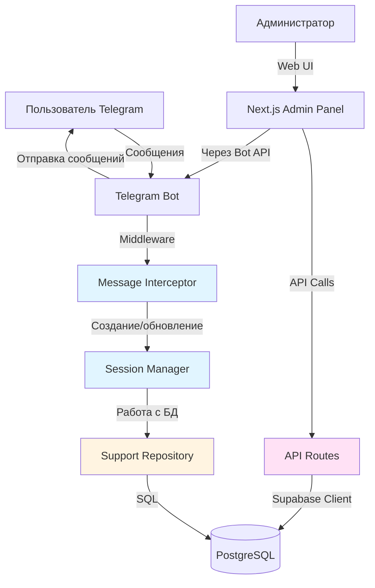
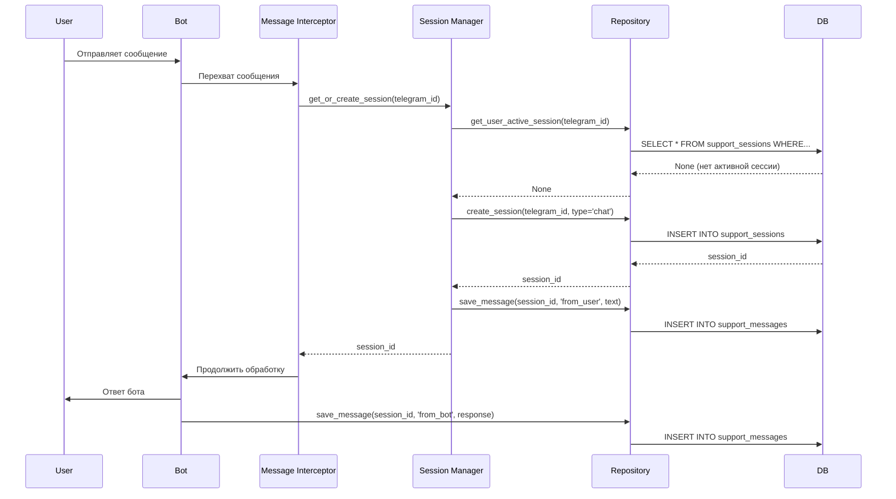
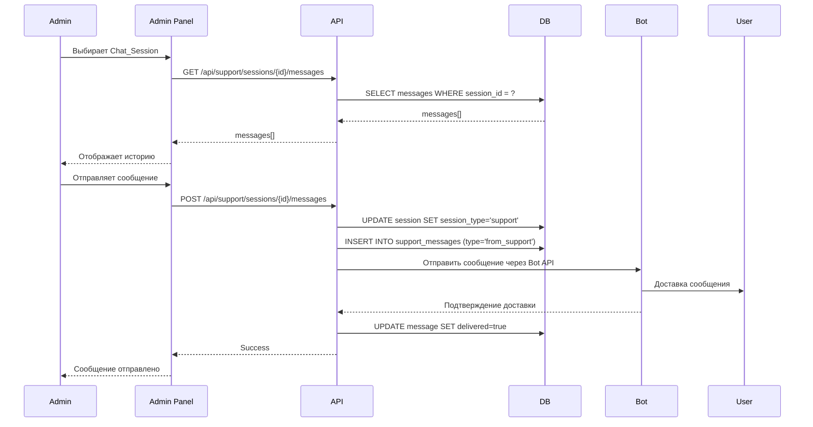

# Технический дизайн: Сохранение всех диалогов с ботом в админке

## Обзор

Данная фича расширяет существующую систему поддержки, добавляя автоматическое сохранение всех диалогов пользователей с ботом (не только тех, где была нажата кнопка "Позвать человека"). Это позволит администраторам видеть полную картину взаимодействия пользователей с ботом и проактивно предлагать помощь.

### Ключевые изменения

1. **Автоматическое создание Chat_Session** при первом сообщении пользователя
2. **Сохранение всех сообщений** (текст и медиа) в базу данных
3. **Расширение админ-панели** для отображения всех диалогов
4. **Возможность подключения** администратора к любому диалогу
5. **Управление жизненным циклом** сессий (автозакрытие через 24 часа)
6. **Обратная совместимость** с существующей функцией "Позвать человека"

### Технологический стек

- **Backend (Bot)**: Python 3.14, aiogram 3.x, SQLAlchemy 2.x, PostgreSQL
- **Frontend (Admin)**: Next.js 14, TypeScript, React, TailwindCSS
- **Testing**: pytest + Hypothesis (property-based testing), Vitest (frontend)

## Архитектура

### Общая архитектура системы



### Компоненты системы

#### Backend (Telegram Bot)

1. **MessageInterceptor** (новый) - middleware для перехвата всех сообщений
2. **SessionManager** (новый) - управление жизненным циклом сессий
3. **ChatSessionRepository** (расширение существующего) - работа с Chat_Session
4. **SupportRepository** (существующий) - работа с Support_Session
5. **SupportHandler** (модификация) - обработчик режима поддержки

#### Frontend (Admin Panel)

1. **SessionList** (модификация) - список всех сессий с фильтрацией
2. **ChatWindow** (модификация) - окно чата с возможностью подключения
3. **API Routes** (расширение) - новые endpoints для работы с Chat_Session

#### База данных

1. **support_sessions** (модификация) - добавление поля `session_type`
2. **support_messages** (модификация) - добавление типа `from_bot`

### Поток данных

#### Сценарий 1: Пользователь отправляет первое сообщение



#### Сценарий 2: Администратор подключается к диалогу



## Компоненты и интерфейсы

### Backend компоненты

#### 1. MessageInterceptor (новый)

**Файл**: `telegram-bot/middleware/message_interceptor.py`

**Назначение**: Middleware для перехвата всех входящих сообщений и автоматического создания/обновления Chat_Session.

**Интерфейс**:

```python
class MessageInterceptor:
    """
    Middleware для автоматического сохранения всех сообщений пользователей
    """
    
    def __init__(self, session_manager: SessionManager):
        """
        Args:
            session_manager: Менеджер сессий для создания и управления
        """
        pass
    
    async def __call__(
        self,
        handler: Callable,
        event: Message,
        data: dict
    ) -> Any:
        """
        Перехватывает сообщение, создаёт/обновляет сессию, сохраняет сообщение
        
        Args:
            handler: Следующий обработчик в цепочке
            event: Сообщение от пользователя
            data: Данные контекста
            
        Returns:
            Результат выполнения следующего обработчика
        """
        pass
```

**Логика работы**:
1. Проверяет, не является ли сообщение системной командой (/start, /help)
2. Получает или создаёт активную сессию для пользователя
3. Сохраняет сообщение пользователя в БД
4. Передаёт управление следующему обработчику
5. После обработки сохраняет ответ бота (если есть)

#### 2. SessionManager (новый)

**Файл**: `telegram-bot/services/session_manager.py`

**Назначение**: Управление жизненным циклом сессий диалогов.

**Интерфейс**:

```python
class SessionManager:
    """
    Сервис управления сессиями диалогов
    """
    
    def __init__(self, repository: SupportRepository):
        """
        Args:
            repository: Репозиторий для работы с БД
        """
        pass
    
    async def get_or_create_session(
        self,
        telegram_id: int,
        session_type: str = 'chat'
    ) -> int:
        """
        Получает активную сессию или создаёт новую
        
        Args:
            telegram_id: Telegram ID пользователя
            session_type: Тип сессии ('chat' или 'support')
            
        Returns:
            ID сессии
        """
        pass
    
    async def convert_to_support_session(
        self,
        session_id: int
    ) -> bool:
        """
        Преобразует обычную Chat_Session в Support_Session
        
        Args:
            session_id: ID сессии для преобразования
            
        Returns:
            True если успешно преобразовано
        """
        pass
    
    async def close_inactive_sessions(
        self,
        inactive_hours: int = 24
    ) -> int:
        """
        Закрывает сессии без активности более указанного времени
        
        Args:
            inactive_hours: Количество часов неактивности
            
        Returns:
            Количество закрытых сессий
        """
        pass
    
    async def save_user_message(
        self,
        session_id: int,
        telegram_id: int,
        message_text: str,
        file_id: Optional[str] = None
    ) -> int:
        """
        Сохраняет сообщение пользователя
        
        Args:
            session_id: ID сессии
            telegram_id: Telegram ID пользователя
            message_text: Текст сообщения
            file_id: ID файла (для медиа)
            
        Returns:
            ID созданного сообщения
        """
        pass
    
    async def save_bot_message(
        self,
        session_id: int,
        message_text: str
    ) -> int:
        """
        Сохраняет ответ бота
        
        Args:
            session_id: ID сессии
            message_text: Текст ответа бота
            
        Returns:
            ID созданного сообщения
        """
        pass
```

#### 3. SupportRepository (расширение)

**Файл**: `telegram-bot/database/repository.py` (модификация)

**Новые методы**:

```python
async def update_session_type(
    self,
    session_id: int,
    session_type: str
) -> bool:
    """
    Обновляет тип сессии
    
    Args:
        session_id: ID сессии
        session_type: Новый тип ('chat' или 'support')
        
    Returns:
        True если успешно обновлено
    """
    pass

async def get_all_sessions(
    self,
    status: Optional[str] = None,
    session_type: Optional[str] = None,
    limit: Optional[int] = None,
    offset: int = 0
) -> List[SupportSession]:
    """
    Получает список всех сессий с фильтрацией
    
    Args:
        status: Фильтр по статусу ('active' или 'closed')
        session_type: Фильтр по типу ('chat' или 'support')
        limit: Максимальное количество сессий
        offset: Смещение для пагинации
        
    Returns:
        Список сессий
    """
    pass

async def close_sessions_by_inactivity(
    self,
    inactive_hours: int
) -> int:
    """
    Закрывает сессии без активности
    
    Args:
        inactive_hours: Количество часов неактивности
        
    Returns:
        Количество закрытых сессий
    """
    pass

async def get_session_last_activity(
    self,
    session_id: int
) -> Optional[datetime]:
    """
    Получает время последней активности в сессии
    
    Args:
        session_id: ID сессии
        
    Returns:
        Время последнего сообщения или None
    """
    pass
```

### Frontend компоненты

#### 1. SessionList (модификация)

**Файл**: `nextjs-app/components/admin/SessionList.tsx`

**Изменения**:
- Добавить фильтр по типу сессии (chat/support)
- Визуально различать обычные диалоги и сессии поддержки
- Отображать время последнего сообщения
- Добавить индикатор новых сообщений

#### 2. ChatWindow (модификация)

**Файл**: `nextjs-app/components/admin/ChatWindow.tsx`

**Изменения**:
- Добавить кнопку "Подключиться к диалогу" для обычных Chat_Session
- Автоматически преобразовывать Chat_Session в Support_Session при первом сообщении админа
- Отображать сообщения бота с отдельным стилем
- Добавить индикатор типа сессии

#### 3. API Routes (новые/модификация)

**Новые endpoints**:

```typescript
// GET /api/support/sessions
// Получение списка всех сессий с фильтрацией
interface GetSessionsQuery {
  status?: 'active' | 'closed';
  session_type?: 'chat' | 'support';
  page?: number;
  limit?: number;
}

// POST /api/support/sessions/{id}/convert
// Преобразование Chat_Session в Support_Session
interface ConvertSessionRequest {
  session_id: number;
}

// POST /api/support/sessions/{id}/messages
// Отправка сообщения от администратора
interface SendMessageRequest {
  session_id: number;
  message_text: string;
  telegram_id: number; // ID пользователя-получателя
}
```

## Модели данных

### Изменения в схеме БД

#### Таблица support_sessions (модификация)

```sql
ALTER TABLE support_sessions 
ADD COLUMN session_type VARCHAR(20) NOT NULL DEFAULT 'support';

ALTER TABLE support_sessions
ADD CONSTRAINT chk_session_type CHECK (session_type IN ('chat', 'support'));

CREATE INDEX idx_sessions_session_type ON support_sessions(session_type);
CREATE INDEX idx_sessions_last_activity ON support_sessions(created_at DESC);
```

**Поля**:
- `id` (SERIAL PRIMARY KEY) - уникальный идентификатор
- `telegram_id` (BIGINT NOT NULL) - Telegram ID пользователя
- `status` (VARCHAR(20) NOT NULL) - статус сессии ('active', 'closed')
- `session_type` (VARCHAR(20) NOT NULL) - тип сессии ('chat', 'support')
- `created_at` (TIMESTAMP NOT NULL) - время создания
- `closed_at` (TIMESTAMP NULL) - время закрытия

**Индексы**:
- `idx_sessions_telegram_id` - для быстрого поиска по пользователю
- `idx_sessions_status` - для фильтрации по статусу
- `idx_sessions_session_type` - для фильтрации по типу
- `idx_sessions_created_at` - для сортировки по времени

#### Таблица support_messages (модификация)

```sql
ALTER TABLE support_messages
DROP CONSTRAINT chk_message_type;

ALTER TABLE support_messages
ADD CONSTRAINT chk_message_type CHECK (message_type IN ('from_user', 'from_support', 'from_bot'));
```

**Новый тип сообщения**: `from_bot` - для сообщений, отправленных ботом

### SQLAlchemy модели (модификация)

**Файл**: `telegram-bot/database/models.py`

```python
class SupportSession(Base):
    """Модель сессии диалога"""
    __tablename__ = 'support_sessions'
    
    id: Mapped[int] = mapped_column(Integer, primary_key=True, autoincrement=True)
    telegram_id: Mapped[int] = mapped_column(BigInteger, nullable=False, index=True)
    status: Mapped[str] = mapped_column(String(20), nullable=False, default='active', index=True)
    session_type: Mapped[str] = mapped_column(String(20), nullable=False, default='chat', index=True)
    created_at: Mapped[datetime] = mapped_column(DateTime, nullable=False, default=datetime.utcnow, index=True)
    closed_at: Mapped[Optional[datetime]] = mapped_column(DateTime, nullable=True)
    
    messages: Mapped[List["SupportMessage"]] = relationship(
        "SupportMessage",
        back_populates="session",
        cascade="all, delete-orphan",
        lazy="selectin"
    )
    
    def is_chat_session(self) -> bool:
        """Проверяет, является ли сессия обычным диалогом"""
        return self.session_type == 'chat'
    
    def is_support_session(self) -> bool:
        """Проверяет, является ли сессия сессией поддержки"""
        return self.session_type == 'support'
    
    def convert_to_support(self) -> None:
        """Преобразует обычный диалог в сессию поддержки"""
        self.session_type = 'support'
```

### TypeScript типы (модификация)

**Файл**: `nextjs-app/types/support.ts`

```typescript
export type SessionType = 'chat' | 'support';

export interface SupportSession {
  id: number;
  telegram_id: number;
  status: 'active' | 'closed';
  session_type: SessionType;
  created_at: string;
  closed_at: string | null;
  last_message_at?: string; // Время последнего сообщения
  unread_count?: number; // Количество непрочитанных сообщений
}

export type MessageType = 'from_user' | 'from_support' | 'from_bot';

export interface SupportMessage {
  id: number;
  session_id: number;
  telegram_id: number;
  message_type: MessageType;
  message_text: string;
  file_id: string | null;
  created_at: string;
  delivered: boolean;
}
```


## Correctness Properties

*Property (свойство) — это характеристика или поведение, которое должно выполняться для всех валидных выполнений системы. По сути, это формальное утверждение о том, что система должна делать. Properties служат мостом между человекочитаемыми спецификациями и машинно-проверяемыми гарантиями корректности.*

### Property 1: Автоматическое создание сессии при первом сообщении

*For any* пользователя, который отправляет первое сообщение боту, система должна автоматически создать новую Chat_Session с типом 'chat' и корректным telegram_id.

**Validates: Requirements 1.1**

### Property 2: Отсутствие дублирующих активных сессий

*For any* пользователя с активной Chat_Session, отправка нового сообщения не должна создавать новую сессию, а должна использовать существующую.

**Validates: Requirements 1.2**

### Property 3: Полнота структуры Chat_Session

*For any* созданной Chat_Session, она должна содержать все обязательные поля: telegram_id, created_at, status, session_type.

**Validates: Requirements 1.3**

### Property 4: Преобразование Chat_Session в Support_Session с сохранением истории

*For any* Chat_Session с историей сообщений, при преобразовании в Support_Session (через кнопку "Позвать человека" или первое сообщение админа), тип сессии должен измениться на 'support', а все сообщения должны сохраниться.

**Validates: Requirements 1.5, 4.3, 6.4**

### Property 5: Сохранение текстовых сообщений пользователя

*For any* текстового сообщения от пользователя, система должна сохранить его в базу данных с правильным session_id, telegram_id и типом 'from_user'.

**Validates: Requirements 2.1**

### Property 6: Сохранение медиа-контента

*For any* медиа-сообщения (фото, документ, видео, аудио, голосовое) от пользователя, система должна сохранить file_id и caption (если есть) в базу данных.

**Validates: Requirements 2.2**

### Property 7: Полнота структуры сообщения

*For any* сохранённого сообщения, оно должно содержать все обязательные поля: session_id, telegram_id, message_type, message_text, created_at, и message_type должен быть одним из ('from_user', 'from_bot', 'from_support').

**Validates: Requirements 2.3, 2.4**

### Property 8: Сохранение ответов бота

*For any* ответного сообщения от бота пользователю, система должна сохранить его в базу данных с типом 'from_bot'.

**Validates: Requirements 2.5**

### Property 9: Сортировка сессий по времени последнего сообщения

*For any* набора сессий, API должен возвращать их отсортированными по времени последнего сообщения (новые первыми).

**Validates: Requirements 3.1**

### Property 10: Полнота данных сессии в API

*For any* сессии, возвращаемой через API, она должна содержать все необходимые поля: id, telegram_id, status, session_type, created_at, и опционально closed_at.

**Validates: Requirements 3.2**

### Property 11: Получение полной истории сообщений сессии

*For any* сессии с сообщениями, запрос истории должен возвращать все сообщения этой сессии, отсортированные по времени создания.

**Validates: Requirements 3.4**

### Property 12: Доставка сообщений от администратора

*For any* сообщения, отправленного администратором через Admin_Panel, система должна доставить его пользователю в Telegram и сохранить в базу данных с типом 'from_support'.

**Validates: Requirements 4.2, 4.4, 4.5**

### Property 13: Автоматическое закрытие неактивных сессий

*For any* сессии без активности более 24 часов, Session_Manager должен автоматически закрыть её, установив status='closed' и closed_at.

**Validates: Requirements 5.1**

### Property 14: Корректное закрытие сессии администратором

*For any* активной Support_Session, при закрытии администратором система должна установить status='closed' и временную метку closed_at.

**Validates: Requirements 5.2**

### Property 15: Фильтрация сессий по статусу

*For any* запроса списка сессий с фильтром по статусу (active/closed), API должен возвращать только сессии с указанным статусом.

**Validates: Requirements 5.3**

### Property 16: Сохранение закрытых сессий в БД

*For any* закрытой сессии, она должна оставаться в базе данных и быть доступной для запросов с фильтром status='closed'.

**Validates: Requirements 5.5**

### Property 17: Пагинация списка сессий

*For any* запроса списка сессий без указания limit, API должен возвращать не более 50 сессий на странице.

**Validates: Requirements 7.1**

### Property 18: Пагинация истории сообщений

*For any* запроса истории сообщений с указанием limit, API должен возвращать не более указанного количества сообщений.

**Validates: Requirements 7.3**

### Property 19: Защита API от неавторизованного доступа

*For any* запроса к API endpoints работы с сессиями без валидной аутентификации, система должна возвращать HTTP 401 Unauthorized.

**Validates: Requirements 8.1, 8.5**

### Property 20: Логирование действий администратора

*For any* действия администратора (просмотр сессии, отправка сообщения, закрытие сессии), система должна создать запись в логе с информацией о действии, времени и идентификаторе администратора.

**Validates: Requirements 8.3**

### Property 21: Фильтрация системных команд

*For any* запроса истории сообщений сессии, API не должен возвращать сообщения, содержащие системные команды (/start, /help).

**Validates: Requirements 8.4**

## Обработка ошибок

### Стратегия обработки ошибок

#### Backend (Telegram Bot)

1. **MessageInterceptor**:
   - При ошибке создания сессии: логировать ошибку, пропустить сохранение, продолжить обработку сообщения
   - При ошибке сохранения сообщения: логировать ошибку, не блокировать работу бота
   - Использовать try-except блоки для изоляции ошибок

2. **SessionManager**:
   - При ошибке БД: выбросить исключение с детальным сообщением
   - При попытке преобразовать несуществующую сессию: вернуть False
   - При попытке закрыть несуществующую сессию: вернуть False
   - Валидация входных параметров перед операциями с БД

3. **SupportRepository**:
   - При ошибке подключения к БД: выбросить исключение
   - При нарушении constraints: выбросить ValueError с описанием
   - Логировать все ошибки с полным контекстом (structlog)

#### Frontend (Admin Panel)

1. **API Routes**:
   - Валидация всех входных параметров
   - Возврат стандартизированных ошибок:
     - 400 Bad Request - невалидные параметры
     - 401 Unauthorized - нет аутентификации
     - 404 Not Found - сессия не найдена
     - 500 Internal Server Error - ошибка сервера
   - Логирование всех ошибок с контекстом

2. **React компоненты**:
   - ErrorBoundary для перехвата ошибок рендеринга
   - Отображение понятных сообщений об ошибках пользователю
   - Retry механизм для failed запросов
   - Graceful degradation при недоступности API

### Примеры обработки ошибок

```python
# MessageInterceptor
async def __call__(self, handler, event, data):
    try:
        session_id = await self.session_manager.get_or_create_session(
            telegram_id=event.from_user.id
        )
        
        try:
            await self.session_manager.save_user_message(
                session_id=session_id,
                telegram_id=event.from_user.id,
                message_text=event.text or event.caption or "",
                file_id=self._extract_file_id(event)
            )
        except Exception as e:
            logger.error(
                "failed_to_save_message",
                session_id=session_id,
                error=str(e),
                exc_info=True
            )
            # Не блокируем обработку сообщения
        
        return await handler(event, data)
        
    except Exception as e:
        logger.error(
            "message_interceptor_error",
            telegram_id=event.from_user.id,
            error=str(e),
            exc_info=True
        )
        # Продолжаем обработку даже при ошибке
        return await handler(event, data)
```

```typescript
// API Route error handling
export async function GET(request: NextRequest) {
  try {
    const session = await getServerSession(authOptions);
    
    if (!session) {
      return NextResponse.json(
        { error: 'Unauthorized', message: 'Требуется авторизация' },
        { status: 401 }
      );
    }

    // ... бизнес-логика ...

  } catch (error) {
    console.error('API error:', error);
    
    if (error instanceof ValidationError) {
      return NextResponse.json(
        { error: 'Validation failed', message: error.message },
        { status: 400 }
      );
    }
    
    return NextResponse.json(
      { error: 'Internal server error', message: 'Попробуйте позже' },
      { status: 500 }
    );
  }
}
```

## Стратегия тестирования

### Двойной подход к тестированию

Система использует комбинацию unit-тестов и property-based тестов для обеспечения максимального покрытия:

- **Unit-тесты**: проверяют конкретные примеры, граничные случаи и обработку ошибок
- **Property-based тесты**: проверяют универсальные свойства на большом количестве сгенерированных входных данных

Оба типа тестов дополняют друг друга и необходимы для комплексного покрытия.

### Property-Based Testing

#### Библиотека

Для Python используется **Hypothesis** - зрелая библиотека для property-based testing.

```python
# requirements.txt
hypothesis>=6.100.0
pytest>=8.0.0
```

#### Конфигурация

Каждый property-based тест должен:
- Выполняться минимум 100 итераций (настройка Hypothesis)
- Иметь комментарий с ссылкой на property из дизайна
- Использовать стратегии генерации данных из Hypothesis

```python
from hypothesis import given, settings, strategies as st

@settings(max_examples=100)
@given(
    telegram_id=st.integers(min_value=1, max_value=999999999),
    message_text=st.text(min_size=1, max_size=4000)
)
async def test_property_1_auto_create_session(telegram_id, message_text):
    """
    Feature: admin-chat-persistence, Property 1: Автоматическое создание сессии при первом сообщении
    
    For any пользователя, который отправляет первое сообщение боту,
    система должна автоматически создать новую Chat_Session.
    """
    # Arrange
    session_manager = SessionManager(repository)
    
    # Act
    session_id = await session_manager.get_or_create_session(telegram_id)
    
    # Assert
    session = await repository.get_session_by_id(session_id)
    assert session is not None
    assert session.telegram_id == telegram_id
    assert session.session_type == 'chat'
    assert session.status == 'active'
```

#### Стратегии генерации данных

```python
# Генераторы для тестов
telegram_ids = st.integers(min_value=1, max_value=999999999)
message_texts = st.text(min_size=0, max_size=4000)
file_ids = st.text(min_size=10, max_size=100).filter(lambda x: x.isalnum())
session_types = st.sampled_from(['chat', 'support'])
message_types = st.sampled_from(['from_user', 'from_bot', 'from_support'])
statuses = st.sampled_from(['active', 'closed'])

# Композитные генераторы
@st.composite
def session_data(draw):
    return {
        'telegram_id': draw(telegram_ids),
        'session_type': draw(session_types),
        'status': draw(statuses)
    }

@st.composite
def message_data(draw):
    return {
        'telegram_id': draw(telegram_ids),
        'message_type': draw(message_types),
        'message_text': draw(message_texts),
        'file_id': draw(st.one_of(st.none(), file_ids))
    }
```

### Unit Testing

#### Структура тестов

```
telegram-bot/tests/
├── test_message_interceptor.py
├── test_session_manager.py
├── test_repository_extensions.py
└── test_support_handler_integration.py

nextjs-app/__tests__/
├── api/
│   ├── sessions.test.ts
│   └── messages.test.ts
└── components/
    ├── SessionList.test.tsx
    └── ChatWindow.test.tsx
```

#### Примеры unit-тестов

```python
# test_session_manager.py

async def test_get_or_create_session_creates_new_for_first_message():
    """Проверяет создание новой сессии для первого сообщения"""
    # Arrange
    telegram_id = 123456789
    session_manager = SessionManager(repository)
    
    # Act
    session_id = await session_manager.get_or_create_session(telegram_id)
    
    # Assert
    assert session_id > 0
    session = await repository.get_session_by_id(session_id)
    assert session.telegram_id == telegram_id
    assert session.session_type == 'chat'

async def test_get_or_create_session_reuses_existing():
    """Проверяет переиспользование существующей активной сессии"""
    # Arrange
    telegram_id = 123456789
    session_manager = SessionManager(repository)
    first_session_id = await session_manager.get_or_create_session(telegram_id)
    
    # Act
    second_session_id = await session_manager.get_or_create_session(telegram_id)
    
    # Assert
    assert first_session_id == second_session_id

async def test_convert_to_support_session_preserves_messages():
    """Проверяет сохранение истории при преобразовании в Support_Session"""
    # Arrange
    telegram_id = 123456789
    session_manager = SessionManager(repository)
    session_id = await session_manager.get_or_create_session(telegram_id)
    
    # Добавляем сообщения
    msg1_id = await session_manager.save_user_message(
        session_id, telegram_id, "Привет"
    )
    msg2_id = await session_manager.save_bot_message(
        session_id, "Здравствуйте!"
    )
    
    # Act
    success = await session_manager.convert_to_support_session(session_id)
    
    # Assert
    assert success
    session = await repository.get_session_by_id(session_id)
    assert session.session_type == 'support'
    messages = await repository.get_messages(session_id)
    assert len(messages) == 2
    assert messages[0].id == msg1_id
    assert messages[1].id == msg2_id

async def test_close_inactive_sessions():
    """Проверяет закрытие неактивных сессий"""
    # Arrange
    session_manager = SessionManager(repository)
    
    # Создаём старую сессию (имитируем через прямую вставку в БД)
    old_session_id = await create_old_session(
        telegram_id=123456789,
        hours_ago=25
    )
    
    # Создаём свежую сессию
    fresh_session_id = await session_manager.get_or_create_session(987654321)
    
    # Act
    closed_count = await session_manager.close_inactive_sessions(inactive_hours=24)
    
    # Assert
    assert closed_count == 1
    old_session = await repository.get_session_by_id(old_session_id)
    assert old_session.status == 'closed'
    fresh_session = await repository.get_session_by_id(fresh_session_id)
    assert fresh_session.status == 'active'
```

```typescript
// __tests__/api/sessions.test.ts

describe('GET /api/support/sessions', () => {
  it('should return 401 for unauthenticated requests', async () => {
    // Arrange
    mockGetServerSession.mockResolvedValue(null);
    
    // Act
    const response = await GET(mockRequest);
    
    // Assert
    expect(response.status).toBe(401);
    const data = await response.json();
    expect(data.error).toBe('Unauthorized');
  });

  it('should return paginated sessions with default limit 50', async () => {
    // Arrange
    mockGetServerSession.mockResolvedValue({ user: { id: 'admin' } });
    const mockSessions = Array.from({ length: 60 }, (_, i) => ({
      id: i + 1,
      telegram_id: 123456789 + i,
      status: 'active',
      session_type: 'chat',
      created_at: new Date().toISOString()
    }));
    mockGetDb.mockReturnValue({
      getSessions: jest.fn().mockResolvedValue({
        sessions: mockSessions.slice(0, 50),
        total: 60,
        page: 1,
        limit: 50
      })
    });
    
    // Act
    const response = await GET(mockRequest);
    
    // Assert
    expect(response.status).toBe(200);
    const data = await response.json();
    expect(data.sessions).toHaveLength(50);
    expect(data.total).toBe(60);
  });

  it('should filter sessions by status', async () => {
    // Arrange
    mockGetServerSession.mockResolvedValue({ user: { id: 'admin' } });
    const mockRequest = new NextRequest(
      'http://localhost/api/support/sessions?status=closed'
    );
    
    // Act
    const response = await GET(mockRequest);
    
    // Assert
    const data = await response.json();
    expect(data.sessions.every(s => s.status === 'closed')).toBe(true);
  });
});
```

### Интеграционные тесты

Интеграционные тесты проверяют взаимодействие компонентов:

```python
# test_support_handler_integration.py

async def test_full_flow_user_message_to_admin_response():
    """
    Интеграционный тест полного потока:
    1. Пользователь отправляет сообщение
    2. Создаётся Chat_Session
    3. Админ видит сессию в списке
    4. Админ отправляет ответ
    5. Сессия преобразуется в Support_Session
    6. Пользователь получает сообщение
    """
    # 1. Пользователь отправляет сообщение
    user_message = create_mock_message(
        telegram_id=123456789,
        text="Помогите с заказом"
    )
    await message_interceptor(handler, user_message, {})
    
    # 2. Проверяем создание Chat_Session
    sessions = await repository.get_all_sessions(
        status='active',
        session_type='chat'
    )
    assert len(sessions) == 1
    session = sessions[0]
    assert session.telegram_id == 123456789
    
    # 3. Админ получает список сессий через API
    api_response = await api_get_sessions(status='active')
    assert len(api_response['sessions']) == 1
    
    # 4. Админ отправляет ответ
    admin_message = {
        'session_id': session.id,
        'message_text': 'Здравствуйте! Чем могу помочь?',
        'telegram_id': 123456789
    }
    await api_send_message(admin_message)
    
    # 5. Проверяем преобразование в Support_Session
    updated_session = await repository.get_session_by_id(session.id)
    assert updated_session.session_type == 'support'
    
    # 6. Проверяем сохранение сообщения
    messages = await repository.get_messages(session.id)
    assert len(messages) == 2
    assert messages[0].message_type == 'from_user'
    assert messages[1].message_type == 'from_support'
```

### Покрытие тестами

Целевые метрики покрытия:
- **Backend**: минимум 85% покрытие кода
- **Frontend**: минимум 80% покрытие компонентов
- **Property-based тесты**: все 21 property должны быть покрыты
- **Integration тесты**: минимум 3 end-to-end сценария

### Continuous Integration

Все тесты должны выполняться автоматически при каждом commit:

```yaml
# .github/workflows/test.yml
name: Tests

on: [push, pull_request]

jobs:
  backend-tests:
    runs-on: ubuntu-latest
    steps:
      - uses: actions/checkout@v3
      - name: Set up Python
        uses: actions/setup-python@v4
        with:
          python-version: '3.14'
      - name: Install dependencies
        run: |
          cd telegram-bot
          python -m venv venv
          source venv/bin/activate
          pip install -r requirements.txt
      - name: Run tests
        run: |
          cd telegram-bot
          source venv/bin/activate
          pytest --cov=. --cov-report=xml
      - name: Upload coverage
        uses: codecov/codecov-action@v3

  frontend-tests:
    runs-on: ubuntu-latest
    steps:
      - uses: actions/checkout@v3
      - name: Set up Node.js
        uses: actions/setup-node@v3
        with:
          node-version: '18'
      - name: Install dependencies
        run: |
          cd nextjs-app
          npm ci
      - name: Run tests
        run: |
          cd nextjs-app
          npm test -- --coverage
```

