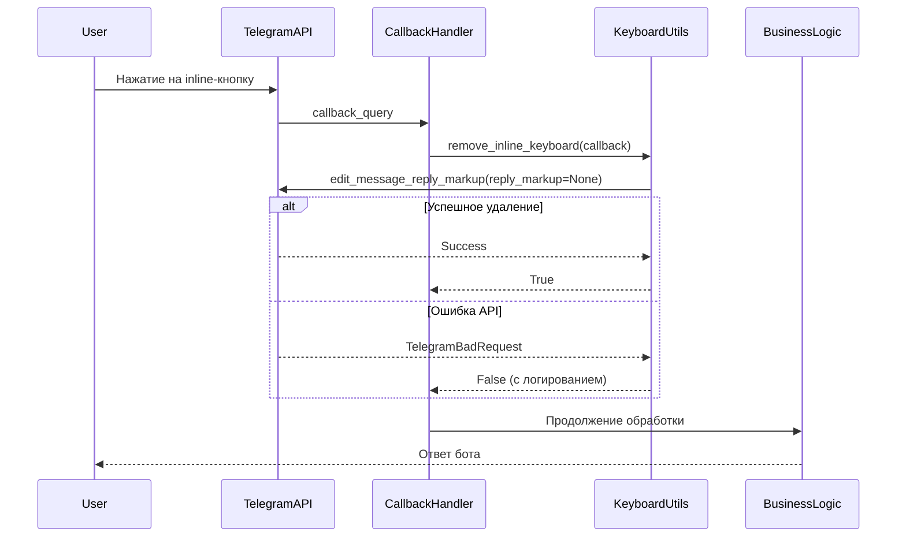

# Design Document: Button Auto-Hide on Click

## Overview

Данный дизайн описывает механизм автоматического удаления inline-кнопок в Telegram боте после их нажатия. Функциональность направлена на улучшение пользовательского опыта путём предотвращения повторных нажатий и устранения визуального беспорядка в интерфейсе.

### Цели

1. Автоматическое удаление inline-клавиатур после обработки callback-запросов
2. Graceful degradation при ошибках Telegram API
3. Минимальные изменения в существующем коде
4. Переиспользуемый механизм для всех типов inline-кнопок

### Область применения

Механизм будет применён к следующим inline-кнопкам:
- "Получить приз" (callback_data="get_prize")
- "Согласен" / "Назад" (callback_data="consent_agree", "consent_back")
- "📦 Указать данные доставки" (WebApp кнопка)
- "Завершить диалог" (callback_data="support_end")

## Architecture

### Компонентная структура

```
telegram-bot/
├── utils/
│   └── keyboard_utils.py          # Новая утилита для удаления клавиатур
├── handlers/
│   ├── prize_flow_handler.py      # Модификация: интеграция remove_keyboard
│   ├── delivery_handler.py        # Модификация: интеграция remove_keyboard + сохранение message_id
│   └── support_handler.py         # Модификация: интеграция remove_keyboard
└── keyboards/
    └── reply_keyboards.py         # Модификация: возврат message_id для WebApp кнопок
```

### Архитектурные принципы

1. **Separation of Concerns**: Утилитная функция изолирована от бизнес-логики обработчиков
2. **Fail-Safe Design**: Ошибки удаления клавиатуры не прерывают основной процесс
3. **Minimal Invasiveness**: Интеграция через добавление одного вызова функции в начале обработчиков
4. **Reusability**: Единая функция для всех типов callback-обработчиков

### Поток выполнения



## Components and Interfaces

### 1. KeyboardUtils (telegram-bot/utils/keyboard_utils.py)

**Назначение**: Утилитный модуль для работы с inline-клавиатурами

**Функции**:

```python
async def remove_inline_keyboard(
    callback: CallbackQuery,
    logger: Optional[structlog.BoundLogger] = None
) -> bool:
    """
    Удаляет inline-клавиатуру из сообщения.
    
    Args:
        callback: CallbackQuery объект от aiogram
        logger: Логгер для записи событий (опционально)
    
    Returns:
        bool: True если клавиатура успешно удалена или уже отсутствует,
              False если произошла ошибка
    
    Validates:
        Requirements 4.1, 4.2, 4.3, 4.4, 4.5
        Requirements 5.1, 5.2, 5.3, 5.4, 5.5
        Requirements 6.1, 6.2, 6.3, 6.4
    """
```

```python
async def remove_inline_keyboard_by_id(
    bot: Bot,
    chat_id: int,
    message_id: int,
    logger: Optional[structlog.BoundLogger] = None
) -> bool:
    """
    Удаляет inline-клавиатуру из сообщения по его ID.
    Используется для WebApp кнопок, где callback недоступен.
    
    Args:
        bot: Bot объект от aiogram
        chat_id: ID чата
        message_id: ID сообщения с клавиатурой
        logger: Логгер для записи событий (опционально)
    
    Returns:
        bool: True если клавиатура успешно удалена или уже отсутствует,
              False если произошла ошибка
    
    Validates:
        Requirements 3.1, 3.2, 3.3, 3.4, 3.5
        Requirements 4.1, 4.2, 4.3, 4.4, 4.5
        Requirements 5.1, 5.2, 5.3, 5.4, 5.5
    """
```

**Обработка ошибок**:
- `message is not modified` → считается успехом (клавиатура уже удалена)
- `message to edit not found` → логируется WARNING, возвращается False
- `message can't be edited` → логируется WARNING, возвращается False
- Другие ошибки → логируются ERROR, возвращается False

### 2. PrizeFlowHandler (модификация)

**Изменения в методах**:

```python
async def handle_get_prize_callback(
    self,
    callback: CallbackQuery,
    state: FSMContext,
    session_id: Optional[int] = None
) -> None:
    """
    Validates: Requirements 1.1, 1.2, 1.3, 1.4
    """
    # НОВОЕ: Удаление клавиатуры в начале обработки
    await remove_inline_keyboard(callback, logger)
    
    # Существующая логика
    await self.start_prize_flow_from_callback(callback, state, session_id)
    await callback.answer()
```

```python
async def handle_consent_callback(
    self,
    callback: CallbackQuery,
    state: FSMContext,
    session_id: Optional[int] = None
) -> None:
    """
    Validates: Requirements 2.1, 2.2, 2.3, 2.4
    """
    # НОВОЕ: Удаление клавиатуры в начале обработки
    await remove_inline_keyboard(callback, logger)
    
    # Существующая логика обработки consent_agree / consent_back
    # ...
    await callback.answer()
```

### 3. DeliveryHandler (модификация)

**Изменения**:

1. Сохранение `message_id` при отправке WebApp кнопки (в PrizeFlowHandler)
2. Удаление клавиатуры в `handle_delivery_data()`

```python
async def handle_delivery_data(
    self,
    message: Message,
    state: FSMContext,
    session_id: Optional[int] = None
) -> None:
    """
    Validates: Requirements 3.1, 3.2, 3.3, 3.4, 3.5
    """
    telegram_id = message.from_user.id
    
    # Существующая валидация web_app_data и prize_id
    # ...
    
    # НОВОЕ: Получение message_id из FSM и удаление клавиатуры
    data = await state.get_data()
    webapp_message_id = data.get('webapp_message_id')
    
    if webapp_message_id:
        await remove_inline_keyboard_by_id(
            bot=message.bot,
            chat_id=telegram_id,
            message_id=webapp_message_id,
            logger=logger
        )
    
    # Существующая логика сохранения данных
    # ...
```

### 4. SupportHandler (модификация)

**Изменения в методе**:

```python
async def handle_support_end_callback(
    self,
    callback: CallbackQuery,
    state: FSMContext
) -> None:
    """
    Validates: Requirements 8.1, 8.2, 8.3
    """
    # НОВОЕ: Удаление клавиатуры в начале обработки
    await remove_inline_keyboard(callback, logger)
    
    # Существующая логика завершения сессии
    # ...
    await callback.answer()
```

### 5. ReplyKeyboards (модификация)

**Изменения**: Функция отправки WebApp кнопки должна возвращать `message_id`

```python
async def send_physical_prize_webapp_button(
    message: Message,
    prize_id: int,
    webapp_url: str
) -> int:
    """
    Отправляет inline-кнопку для открытия WebApp формы доставки.
    
    Returns:
        int: message_id отправленного сообщения
    
    Validates: Requirements 3.1, 3.2
    """
    keyboard = InlineKeyboardMarkup(inline_keyboard=[
        [InlineKeyboardButton(
            text=PHYSICAL_PRIZE_BUTTON_TEXT,
            web_app=WebAppInfo(url=f"{webapp_url}?prize_id={prize_id}")
        )]
    ])
    
    sent_message = await message.answer(
        PHYSICAL_PRIZE_INSTRUCTION,
        reply_markup=keyboard
    )
    
    return sent_message.message_id
```

## Data Models

### FSM State Data (расширение)

```python
# Добавление в FSM data для WebApp кнопок
{
    "webapp_message_id": int,  # ID сообщения с WebApp кнопкой
    # ... существующие поля
}
```

### Logging Context

```python
# Структура лог-записи для операций удаления клавиатуры
{
    "event": "inline_keyboard_removed" | "inline_keyboard_removal_failed",
    "telegram_id": int,
    "message_id": int,
    "callback_data": str,  # опционально
    "success": bool,
    "error": str,  # опционально
    "error_type": str  # опционально: "not_modified", "not_found", "cant_edit", "other"
}
```


## Correctness Properties

*A property is a characteristic or behavior that should hold true across all valid executions of a system-essentially, a formal statement about what the system should do. Properties serve as the bridge between human-readable specifications and machine-verifiable correctness guarantees.*


### Property 1: Клавиатура удаляется для всех callback-обработчиков

*For any* callback_query с любым callback_data ("get_prize", "consent_agree", "consent_back", "support_end"), вызов соответствующего обработчика должен привести к вызову `edit_message_reply_markup(reply_markup=None)` на сообщении callback'а.

**Validates: Requirements 1.1, 2.1, 2.2, 8.1**

### Property 2: Удаление клавиатуры происходит до других операций

*For any* callback-обработчик, вызов функции удаления клавиатуры должен происходить до вызова любых других операций (отправка сообщений, вызов сервисов, изменение FSM состояния).

**Validates: Requirements 1.2, 2.3, 8.2**

### Property 3: Успешное удаление не прерывает обработку

*For any* callback-обработчик, если удаление клавиатуры завершается успешно, то все последующие операции обработчика должны быть выполнены (проверяется через вызов методов сервисов и отправку сообщений).

**Validates: Requirements 1.3**

### Property 4: Ошибки удаления не прерывают основной процесс

*For any* callback-обработчик и любую ошибку Telegram API при удалении клавиатуры, основной процесс обработки должен продолжиться (все последующие операции выполняются, исключение не пробрасывается наверх).

**Validates: Requirements 1.4, 2.4, 3.5, 5.5, 8.3**

### Property 5: WebApp клавиатура удаляется по message_id

*For any* web_app_data с валидным prize_id, если в FSM сохранён webapp_message_id, то должен быть вызван `bot.edit_message_reply_markup(chat_id, message_id, reply_markup=None)` с этим message_id до вызова NotificationService.

**Validates: Requirements 3.1, 3.2, 3.3, 3.4**

### Property 6: Утилитная функция использует правильный API

*For any* вызов `remove_inline_keyboard(callback)`, функция должна вызвать `callback.message.edit_reply_markup(reply_markup=None)`.

**Validates: Requirements 4.3**

### Property 7: Утилитная функция возвращает корректный статус

*For any* вызов утилитной функции, если API вызов успешен или возвращает "message is not modified", функция должна вернуть True; для всех других ошибок - False.

**Validates: Requirements 4.4, 5.1**

### Property 8: Все операции логируются с полным контекстом

*For any* вызов функции удаления клавиатуры, должна быть создана лог-запись содержащая telegram_id, message_id, callback_data (если доступен) и статус операции (success/failure).

**Validates: Requirements 4.5, 6.3**

### Property 9: Уровень логирования соответствует результату

*For any* операцию удаления клавиатуры, если операция успешна, лог должен иметь уровень INFO; если операция завершилась ошибкой, лог должен иметь уровень WARNING или ERROR.

**Validates: Requirements 6.1, 6.2**

### Property 10: Логи ошибок содержат текст ошибки

*For any* неуспешную операцию удаления клавиатуры, лог-запись должна содержать текст ошибки из исключения.

**Validates: Requirements 6.4**

### Property 11: Специфические ошибки API обрабатываются корректно

*For any* ошибку типа "message to edit not found" или "message can't be edited", функция должна залогировать WARNING, вернуть False и не пробросить исключение.

**Validates: Requirements 5.2, 5.3, 5.4**

### Property 12: Механизм совместим с callback.answer()

*For any* callback-обработчик, вызов `remove_inline_keyboard()` не должен препятствовать последующему вызову `callback.answer()` (оба вызова должны выполниться без ошибок).

**Validates: Requirements 7.3**

### Property 13: Удаление старой клавиатуры не влияет на новые сообщения

*For any* последовательность операций: удаление клавиатуры из старого сообщения → отправка нового сообщения с клавиатурой, новое сообщение должно содержать клавиатуру (удаление не влияет на новые сообщения).

**Validates: Requirements 7.4**

## Error Handling

### Стратегия обработки ошибок

Система использует принцип **graceful degradation**: ошибки удаления клавиатуры не должны прерывать основной бизнес-процесс.

### Категории ошибок

#### 1. Ожидаемые ошибки (Expected Errors)

**"message is not modified"**
- Причина: Клавиатура уже удалена или отсутствует
- Обработка: Считается успехом, логируется INFO
- Действие: Продолжить обработку

**"message to edit not found"**
- Причина: Пользователь удалил сообщение
- Обработка: Логируется WARNING, возвращается False
- Действие: Продолжить обработку

**"message can't be edited"**
- Причина: Сообщение старше 48 часов
- Обработка: Логируется WARNING, возвращается False
- Действие: Продолжить обработку

#### 2. Неожиданные ошибки (Unexpected Errors)

**Любые другие TelegramBadRequest**
- Обработка: Логируется ERROR с полным контекстом
- Действие: Продолжить обработку, вернуть False

**Сетевые ошибки (NetworkError, TimeoutError)**
- Обработка: Логируется ERROR с retry информацией
- Действие: Продолжить обработку, вернуть False

### Логирование ошибок

```python
# Структура лог-записи при ошибке
{
    "event": "inline_keyboard_removal_failed",
    "telegram_id": int,
    "message_id": int,
    "callback_data": str,  # опционально
    "error_type": "not_modified" | "not_found" | "cant_edit" | "network" | "other",
    "error_message": str,
    "success": False
}
```

### Гарантии

1. **Никогда не пробрасывать исключения**: Все исключения перехватываются внутри утилитной функции
2. **Всегда возвращать статус**: True/False для индикации успеха
3. **Всегда логировать**: Каждая попытка удаления записывается в лог
4. **Продолжать обработку**: Callback-обработчики продолжают работу независимо от результата

## Testing Strategy

### Подход к тестированию

Используется **dual testing approach**: комбинация unit-тестов для конкретных сценариев и property-based тестов для проверки универсальных свойств.

### Unit Testing

**Фокус**: Конкретные примеры, edge cases, интеграционные точки

**Тестовые сценарии**:

1. **Успешное удаление клавиатуры**
   - Mock callback с клавиатурой
   - Проверка вызова `edit_reply_markup(reply_markup=None)`
   - Проверка возврата True

2. **Обработка "message is not modified"**
   - Mock API возвращает эту ошибку
   - Проверка возврата True (считается успехом)
   - Проверка INFO лога

3. **Обработка "message to edit not found"**
   - Mock API возвращает эту ошибку
   - Проверка возврата False
   - Проверка WARNING лога

4. **Обработка "message can't be edited"**
   - Mock API возвращает эту ошибку
   - Проверка возврата False
   - Проверка WARNING лога

5. **Интеграция в PrizeFlowHandler**
   - Проверка вызова `remove_inline_keyboard` в начале `handle_get_prize_callback`
   - Проверка вызова в начале `handle_consent_callback`
   - Проверка продолжения Prize Flow после удаления

6. **Интеграция в DeliveryHandler**
   - Проверка сохранения `webapp_message_id` в FSM
   - Проверка вызова `remove_inline_keyboard_by_id` с правильными параметрами
   - Проверка удаления до вызова NotificationService

7. **Интеграция в SupportHandler**
   - Проверка вызова `remove_inline_keyboard` в начале `handle_support_end_callback`
   - Проверка продолжения обработки после удаления

### Property-Based Testing

**Библиотека**: Hypothesis (Python)

**Конфигурация**: Минимум 100 итераций на тест

**Тег формат**: `# Feature: button-auto-hide-on-click, Property {N}: {property_text}`

**Property тесты**:

1. **Property 1: Клавиатура удаляется для всех callback'ов**
   ```python
   @given(callback_data=st.sampled_from(["get_prize", "consent_agree", "consent_back", "support_end"]))
   @settings(max_examples=100)
   def test_keyboard_removed_for_all_callbacks(callback_data):
       # Feature: button-auto-hide-on-click, Property 1
       # Генерируем mock callback с разными callback_data
       # Вызываем обработчик
       # Проверяем вызов edit_reply_markup(reply_markup=None)
   ```

2. **Property 4: Ошибки не прерывают процесс**
   ```python
   @given(
       callback_data=st.sampled_from(["get_prize", "consent_agree", "consent_back", "support_end"]),
       error_type=st.sampled_from(["not_found", "cant_edit", "network", "unknown"])
   )
   @settings(max_examples=100)
   def test_errors_dont_interrupt_flow(callback_data, error_type):
       # Feature: button-auto-hide-on-click, Property 4
       # Mock API выбрасывает различные ошибки
       # Вызываем обработчик
       # Проверяем, что последующие операции выполнены
       # Проверяем, что исключение не пробросилось
   ```

3. **Property 7: Корректный статус возврата**
   ```python
   @given(
       api_result=st.one_of(
           st.just("success"),
           st.just("not_modified"),
           st.sampled_from(["not_found", "cant_edit", "other_error"])
       )
   )
   @settings(max_examples=100)
   def test_correct_return_status(api_result):
       # Feature: button-auto-hide-on-click, Property 7
       # Mock API с различными результатами
       # Вызываем remove_inline_keyboard
       # Проверяем: True для success/not_modified, False для остальных
   ```

4. **Property 8: Полный контекст в логах**
   ```python
   @given(
       telegram_id=st.integers(min_value=1, max_value=999999999),
       message_id=st.integers(min_value=1, max_value=999999),
       callback_data=st.text(min_size=1, max_size=50)
   )
   @settings(max_examples=100)
   def test_logs_contain_full_context(telegram_id, message_id, callback_data):
       # Feature: button-auto-hide-on-click, Property 8
       # Генерируем callback с случайными данными
       # Вызываем remove_inline_keyboard
       # Проверяем наличие всех полей в лог-записи
   ```

5. **Property 9: Уровень логирования**
   ```python
   @given(
       operation_success=st.booleans()
   )
   @settings(max_examples=100)
   def test_log_level_matches_result(operation_success):
       # Feature: button-auto-hide-on-click, Property 9
       # Mock API: успех или ошибка
       # Вызываем remove_inline_keyboard
       # Проверяем: INFO для успеха, WARNING/ERROR для ошибки
   ```

6. **Property 13: Независимость операций**
   ```python
   @given(
       old_message_id=st.integers(min_value=1, max_value=999999),
       new_keyboard_buttons=st.lists(st.text(min_size=1), min_size=1, max_size=5)
   )
   @settings(max_examples=100)
   def test_removal_doesnt_affect_new_messages(old_message_id, new_keyboard_buttons):
       # Feature: button-auto-hide-on-click, Property 13
       # Удаляем клавиатуру из старого сообщения
       # Отправляем новое сообщение с клавиатурой
       # Проверяем, что новое сообщение содержит клавиатуру
   ```

### Тестовые данные

**Генераторы для Hypothesis**:

```python
# Генератор callback_query
@st.composite
def callback_query_strategy(draw):
    return MockCallbackQuery(
        id=draw(st.text(min_size=10, max_size=20)),
        from_user=MockUser(
            id=draw(st.integers(min_value=1, max_value=999999999)),
            username=draw(st.text(min_size=3, max_size=20))
        ),
        message=MockMessage(
            message_id=draw(st.integers(min_value=1, max_value=999999)),
            chat=MockChat(id=draw(st.integers(min_value=1, max_value=999999999)))
        ),
        data=draw(st.sampled_from(["get_prize", "consent_agree", "consent_back", "support_end"]))
    )

# Генератор ошибок API
@st.composite
def telegram_error_strategy(draw):
    error_messages = [
        "Bad Request: message is not modified",
        "Bad Request: message to edit not found",
        "Bad Request: message can't be edited",
        "Bad Request: BUTTON_URL_INVALID"
    ]
    return TelegramBadRequest(
        method="editMessageReplyMarkup",
        message=draw(st.sampled_from(error_messages))
    )
```

### Покрытие тестами

**Целевое покрытие**: 90%+ для нового кода

**Критические пути**:
- ✅ Утилитная функция `remove_inline_keyboard` - 100%
- ✅ Утилитная функция `remove_inline_keyboard_by_id` - 100%
- ✅ Интеграция в callback-обработчики - 100%
- ✅ Обработка всех типов ошибок - 100%

### Регрессионное тестирование

**Требование**: Все существующие тесты должны продолжать проходить после интеграции

**Проверяемые модули**:
- `test_prize_flow_handler.py` - все тесты Prize Flow
- `test_delivery_handler.py` - все тесты Delivery Handler
- `test_support_handler.py` - все тесты Support Handler

**Стратегия**: Запуск полного набора тестов после каждого изменения

