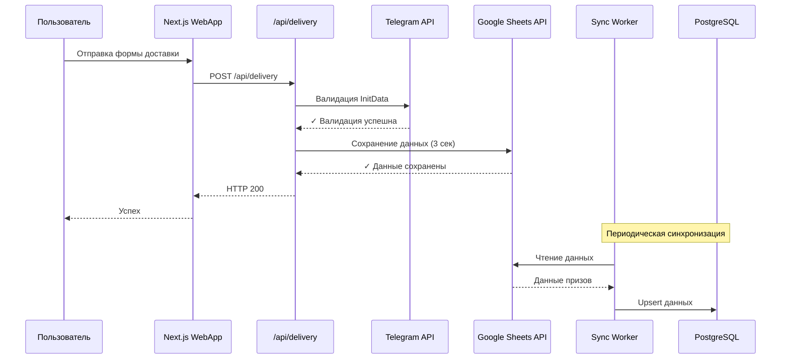
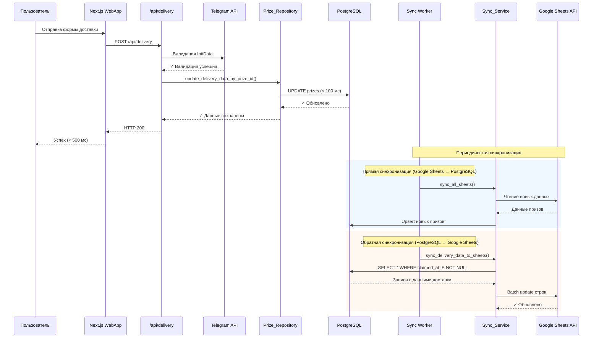
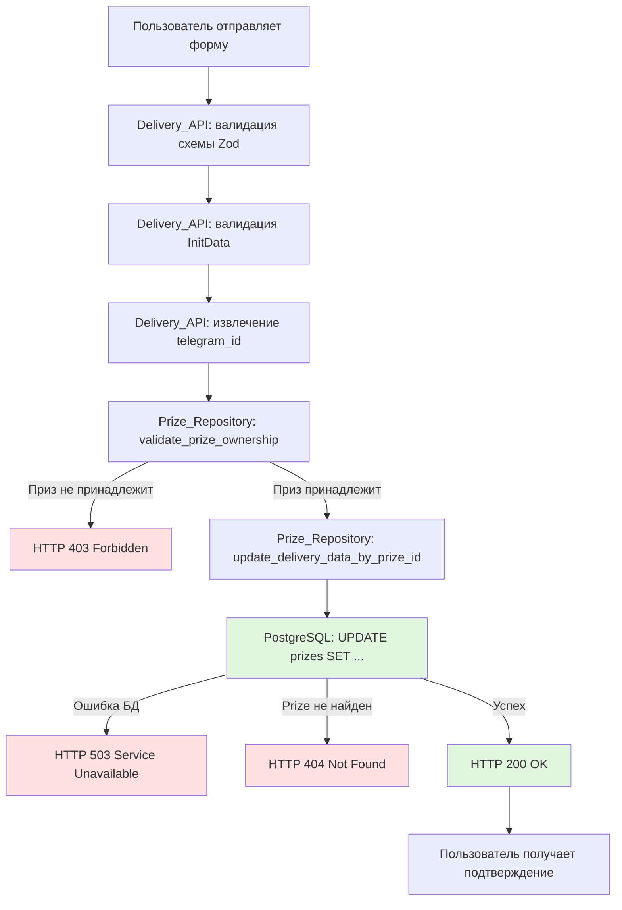
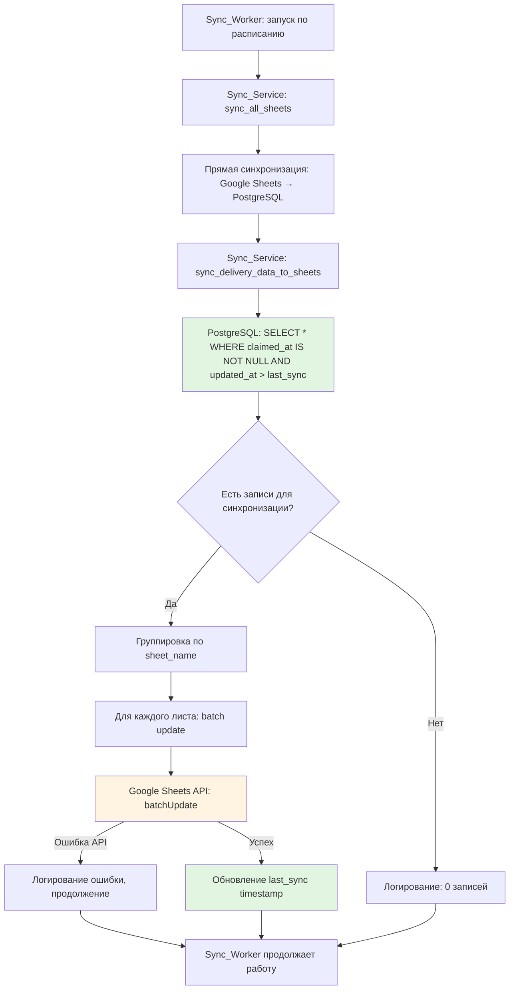

# Технический дизайн: delivery-data-postgres-first

## Overview

Данная фича изменяет архитектуру потока данных для обработки информации о доставке физических призов. Текущая реализация имеет критическую проблему производительности: при отправке формы доставки данные сохраняются напрямую в Google Sheets через API, что создаёт задержку до 3 секунд и риск потери данных при недоступности Google Sheets API.

Новая архитектура использует PostgreSQL как основное хранилище данных доставки с последующей асинхронной синхронизацией в Google Sheets. Это обеспечивает:

- Быстрый ответ пользователю (< 500 мс вместо 3 секунд)
- Высокую надёжность (PostgreSQL как источник истины)
- Устойчивость к недоступности Google Sheets API
- Сохранение обратной совместимости с существующими данными

### Ключевые изменения

1. **Delivery_API** (`/api/delivery`): удаление прямого вызова Google Sheets API, сохранение данных в PostgreSQL
2. **Prize_Repository**: новый метод `update_delivery_data_by_prize_id()` для обновления данных доставки
3. **Database Migration**: добавление столбцов `country` и `postal_code` в таблицу `prizes`
4. **Sync_Service**: новый метод `sync_delivery_data_to_sheets()` для обратной синхронизации PostgreSQL → Google Sheets
5. **Sync_Worker**: интеграция обратной синхронизации в существующий цикл синхронизации

## Architecture

### Текущая архитектура (до изменений)



**Проблемы текущей архитектуры:**
- Задержка 3 секунды при отправке формы из-за Google Sheets API
- Зависимость от доступности Google Sheets API в критическом пути
- Риск потери данных при недоступности Google Sheets
- Плохой пользовательский опыт

### Новая архитектура (после изменений)



**Преимущества новой архитектуры:**
- Быстрый ответ пользователю (< 500 мс вместо 3 секунд)
- PostgreSQL как источник истины для данных доставки
- Устойчивость к недоступности Google Sheets API
- Асинхронная синхронизация не блокирует пользовательские запросы
- Сохранение обратной совместимости с Google Sheets

### Поток данных для формы доставки



### Поток обратной синхронизации



## Components and Interfaces

### 1. Delivery_API (`nextjs-app/app/api/delivery/route.ts`)

**Назначение:** API endpoint для обработки данных доставки физических призов.

**Изменения:**
- Удаление импорта `GoogleSheetsClient`
- Удаление вызова `sheetsClient.saveDeliveryData()`
- Добавление вызова `PrizeClient` для получения информации о призе (уже существует)
- Добавление вызова `Prize_Repository.update_delivery_data_by_prize_id()` через Backend API
- Обновление обработки ошибок (удаление `SheetNotFoundError`, `SheetAccessDeniedError`)

**Интерфейс запроса:**
```typescript
interface DeliveryRequest {
  prize_id: number;
  initData: string;
  last_name: string;
  first_name: string;
  patronymic?: string;
  country: string;        // НОВОЕ ПОЛЕ
  postal_code: string;    // НОВОЕ ПОЛЕ
  city: string;
  street: string;
  house: string;
  apartment?: string;
  phone: string;
  comment?: string;
}
```

**Интерфейс ответа:**
```typescript
// Успех
{
  success: true,
  message: "Данные доставки успешно сохранены"
}

// Ошибка валидации
{
  error: "Validation error",
  message: "Ошибка валидации данных",
  details: [
    { field: "country", message: "Страна должна содержать минимум 2 символа" }
  ]
}

// Ошибка доступа
{
  error: "Access denied",
  message: "Доступ запрещён"
}

// Ошибка БД
{
  error: "Database unavailable",
  message: "База данных временно недоступна"
}
```

**Зависимости:**
- `InitDataValidator` - валидация Telegram InitData
- `PrizeClient` - получение информации о призе из Backend API
- Backend API endpoint `/api/delivery/update` - новый endpoint для обновления данных доставки

### 2. Backend API Endpoint (`/api/delivery/update`)

**Назначение:** Новый endpoint в Python Backend для обновления данных доставки через Prize_Repository.

**Интерфейс запроса:**
```python
POST /api/delivery/update
Content-Type: application/json

{
  "prize_id": 123,
  "telegram_id": 456789,
  "delivery_data": {
    "last_name": "Иванов",
    "first_name": "Иван",
    "patronymic": "Иванович",
    "country": "Россия",
    "postal_code": "123456",
    "city": "Москва",
    "street": "Ленина",
    "house": "10",
    "apartment": "5",
    "phone": "+79991234567",
    "comment": "Комментарий"
  }
}
```

**Интерфейс ответа:**
```python
# Успех (HTTP 200)
{
  "success": true,
  "message": "Данные доставки обновлены"
}

# Приз не найден (HTTP 404)
{
  "error": "Prize not found",
  "message": "Приз не найден"
}

# Доступ запрещён (HTTP 403)
{
  "error": "Access denied",
  "message": "Приз не принадлежит пользователю"
}

# БД недоступна (HTTP 503)
{
  "error": "Database unavailable",
  "message": "База данных временно недоступна"
}
```

**Логика обработки:**
1. Валидация входных данных (prize_id, telegram_id, delivery_data)
2. Вызов `Prize_Repository.validate_prize_ownership(prize_id, telegram_id)`
3. Вызов `Prize_Repository.update_delivery_data_by_prize_id(prize_id, delivery_data)`
4. Обработка ошибок и возврат соответствующего HTTP статуса

### 3. Prize_Repository (`telegram-bot/database/repositories/prize_repository.py`)

**Назначение:** Repository для работы с таблицей prizes в PostgreSQL.

**Новый метод:**

```python
async def update_delivery_data_by_prize_id(
    self,
    prize_id: int,
    delivery_data: Dict[str, Any]
) -> Prize:
    """
    Обновляет данные доставки для приза по prize_id
    
    Args:
        prize_id: ID приза
        delivery_data: Данные доставки (словарь с полями)
    
    Returns:
        Prize: Обновлённый объект Prize
    
    Raises:
        PrizeNotFoundError: Если приз не найден
        DatabaseUnavailableError: Если БД недоступна
        ValueError: Если переданы невалидные поля
    """
```

**Обновляемые поля:**
- `last_name`, `first_name`, `patronymic`
- `country`, `postal_code` (новые поля)
- `city`, `street`, `house`, `apartment`
- `phone`, `comment`
- `claimed_at` (устанавливается в текущее время UTC)
- `updated_at` (автоматически обновляется)

**Транзакционность:**
- Все обновления выполняются в рамках одной транзакции
- При ошибке транзакция откатывается автоматически
- Используется существующий `_get_session_context()` для управления сессиями

**Валидация:**
- Проверка существования prize_id
- Валидация полей delivery_data (только разрешённые поля)
- Логирование всех операций с метриками производительности

### 4. Sync_Service (`telegram-bot/services/sync_service.py`)

**Назначение:** Сервис синхронизации данных между PostgreSQL и Google Sheets.

**Новый метод:**

```python
async def sync_delivery_data_to_sheets(self) -> Dict[str, Any]:
    """
    Синхронизирует данные доставки из PostgreSQL в Google Sheets
    
    Находит все записи с claimed_at IS NOT NULL и обновляет
    соответствующие строки в Google Sheets.
    
    Returns:
        Статистика синхронизации:
        - records_processed: количество обработанных записей
        - records_updated: количество обновлённых записей
        - sheets_updated: количество обновлённых листов
        - errors: список ошибок
        - elapsed_seconds: время выполнения
    """
```

**Логика работы:**
1. Запрос к PostgreSQL: `SELECT * FROM prizes WHERE claimed_at IS NOT NULL AND updated_at > last_sync_timestamp`
2. Группировка записей по `sheet_name` для batch операций
3. Для каждого листа: формирование batch update запроса к Google Sheets API
4. Обновление столбцов E-O (last_name, first_name, patronymic, city, street, house, apartment, phone, comment, country, postal_code)
5. Обновление столбца P (claimed_at)
6. Логирование результатов и обновление `last_sync_timestamp`

**Обработка ошибок:**
- Ошибки Google Sheets API для конкретного листа не блокируют синхронизацию других листов
- Все ошибки логируются с полным контекстом
- При критических ошибках возвращается статистика с описанием проблем

**Оптимизация:**
- Batch update для минимизации количества запросов к Google Sheets API
- Использование `updated_at` для инкрементальной синхронизации
- Кэширование `last_sync_timestamp` для избежания повторной синхронизации

### 5. Sync_Worker (`telegram-bot/sync_worker.py`)

**Назначение:** Автономный процесс для периодической синхронизации данных.

**Изменения:**
- Добавление вызова `sync_service.sync_delivery_data_to_sheets()` после `sync_service.sync_all_sheets()`
- Обработка ошибок обратной синхронизации без блокировки прямой синхронизации
- Логирование статистики обратной синхронизации

**Обновлённый метод `_run_sync()`:**

```python
async def _run_sync(self) -> None:
    """
    Выполняет полный цикл синхронизации:
    1. Прямая синхронизация: Google Sheets → PostgreSQL
    2. Обратная синхронизация: PostgreSQL → Google Sheets
    """
    try:
        logger.info("sync_job_started")
        
        # Прямая синхронизация
        forward_stats = await self.sync_service.sync_all_sheets()
        logger.info("forward_sync_completed", **forward_stats)
        
        # Обратная синхронизация
        try:
            backward_stats = await self.sync_service.sync_delivery_data_to_sheets()
            logger.info("backward_sync_completed", **backward_stats)
        except Exception as e:
            # Ошибка обратной синхронизации не блокирует работу
            logger.error("backward_sync_failed", error=str(e), exc_info=True)
        
        logger.info("sync_job_completed")
        
    except Exception as e:
        logger.error("sync_job_execution_failed", error=str(e), exc_info=True)
```

### 6. Database Migration

**Файл:** `telegram-bot/database/migrations/012_add_country_postal_code_to_prizes.sql`

**Содержание:**
```sql
-- Миграция: Добавление полей country и postal_code в таблицу prizes
-- Дата: 2024-01-XX

-- Добавление столбца country
ALTER TABLE prizes 
ADD COLUMN IF NOT EXISTS country VARCHAR(100);

-- Добавление столбца postal_code
ALTER TABLE prizes 
ADD COLUMN IF NOT EXISTS postal_code VARCHAR(20);

-- Комментарии к полям
COMMENT ON COLUMN prizes.country IS 'Страна доставки физического приза';
COMMENT ON COLUMN prizes.postal_code IS 'Почтовый индекс для доставки физического приза';

-- Индексы не требуются, так как эти поля не используются для поиска
```

**Обратная совместимость:**
- Столбцы допускают NULL значения
- Существующие данные не затрагиваются
- Миграция выполняется без downtime

## Data Models

### Prize (PostgreSQL)

**Таблица:** `prizes`

**Существующие столбцы:**
```sql
id SERIAL PRIMARY KEY
telegram_id BIGINT NOT NULL
username VARCHAR(255)
prize_type VARCHAR(20) NOT NULL  -- 'digital' | 'physical'
promo_code VARCHAR(255)
instructions TEXT
last_name VARCHAR(255)
first_name VARCHAR(255)
patronymic VARCHAR(255)
city VARCHAR(255)
street VARCHAR(255)
house VARCHAR(50)
apartment VARCHAR(50)
phone VARCHAR(50)
comment TEXT
sheet_name VARCHAR(255) NOT NULL
code_word VARCHAR(255) NOT NULL
row_id INTEGER NOT NULL
created_at TIMESTAMP WITH TIME ZONE NOT NULL DEFAULT NOW()
updated_at TIMESTAMP WITH TIME ZONE NOT NULL DEFAULT NOW()
gdpr_consent_date TIMESTAMP WITH TIME ZONE
claimed_at TIMESTAMP WITH TIME ZONE
```

**Новые столбцы:**
```sql
country VARCHAR(100)        -- Страна доставки
postal_code VARCHAR(20)     -- Почтовый индекс
```

**Индексы:**
- `idx_prizes_telegram_code` (UNIQUE): `(telegram_id, code_word)`
- `idx_prizes_code_word`: `(code_word)`
- `idx_prizes_sheet_name`: `(sheet_name)`
- `idx_prizes_claimed_at`: `(telegram_id, claimed_at)`

**Новый индекс для обратной синхронизации:**
```sql
CREATE INDEX IF NOT EXISTS idx_prizes_sync_delivery 
ON prizes(claimed_at, updated_at) 
WHERE claimed_at IS NOT NULL;
```

Этот индекс оптимизирует запрос для поиска записей, требующих синхронизации в Google Sheets.

### DeliveryData (TypeScript)

**Интерфейс для Delivery_API:**

```typescript
interface DeliveryData {
  last_name: string;
  first_name: string;
  patronymic?: string;
  country: string;        // НОВОЕ ПОЛЕ
  postal_code: string;    // НОВОЕ ПОЛЕ
  city: string;
  street: string;
  house: string;
  apartment?: string;
  phone: string;
  comment?: string;
}
```

**Валидация (Zod schema):**
```typescript
const deliverySchema = z.object({
  prize_id: z.number().int().positive(),
  initData: z.string().min(1),
  last_name: z.string().trim().min(2).max(50),
  first_name: z.string().trim().min(2).max(50),
  patronymic: z.string().trim().min(2).max(50).optional().or(z.literal('')),
  country: z.string().trim().min(2).max(100),        // НОВОЕ
  postal_code: z.string().trim().min(3).max(20),     // НОВОЕ
  city: z.string().trim().min(2).max(100),
  street: z.string().trim().min(2).max(200),
  house: z.string().trim().min(1).max(20),
  apartment: z.string().trim().min(1).max(20).optional().or(z.literal('')),
  phone: z.string().trim().regex(/^\+?[0-9]{10,15}$/),
  comment: z.string().trim().max(500).optional(),
});
```

### DeliveryDataDict (Python)

**Тип для Prize_Repository:**

```python
from typing import TypedDict, Optional

class DeliveryDataDict(TypedDict, total=False):
    """Данные доставки для обновления в PostgreSQL"""
    last_name: str
    first_name: str
    patronymic: Optional[str]
    country: str              # НОВОЕ ПОЛЕ
    postal_code: str          # НОВОЕ ПОЛЕ
    city: str
    street: str
    house: str
    apartment: Optional[str]
    phone: str
    comment: Optional[str]
    claimed_at: datetime      # Устанавливается автоматически
```

### SyncStats (Python)

**Статистика обратной синхронизации:**

```python
class BackwardSyncStats(TypedDict):
    """Статистика обратной синхронизации PostgreSQL → Google Sheets"""
    records_processed: int      # Количество записей из PostgreSQL
    records_updated: int        # Количество успешно обновлённых записей
    sheets_updated: int         # Количество обновлённых листов
    errors: List[Dict[str, str]]  # Список ошибок
    elapsed_seconds: float      # Время выполнения
    last_sync_timestamp: str    # ISO 8601 timestamp последней синхронизации
```

### Google Sheets Structure

**Структура столбцов (без изменений):**

| Столбец | Поле | Описание |
|---------|------|----------|
| A | telegram_id | Telegram ID пользователя |
| B | username | Username пользователя |
| C | code_word | Кодовое слово |
| D | prize_type | Тип приза (digital/physical) |
| E | last_name | Фамилия |
| F | first_name | Имя |
| G | patronymic | Отчество |
| H | city | Город |
| I | street | Улица |
| J | house | Дом |
| K | apartment | Квартира |
| L | phone | Телефон |
| M | comment | Комментарий |
| N | country | Страна (НОВЫЙ) |
| O | postal_code | Почтовый индекс (НОВЫЙ) |
| P | claimed_at | Дата получения приза |

**Примечание:** Столбцы N и O добавляются в конец для обратной совместимости с существующими данными.


## Correctness Properties

*Свойство корректности (correctness property) — это характеристика или поведение, которое должно выполняться во всех валидных сценариях работы системы. По сути, это формальное утверждение о том, что система должна делать. Свойства служат мостом между человекочитаемыми спецификациями и машинно-проверяемыми гарантиями корректности.*


### Property 1: Сохранение всех полей данных доставки

*Для любых* валидных данных доставки (last_name, first_name, patronymic, country, postal_code, city, street, house, apartment, phone, comment), после вызова `update_delivery_data_by_prize_id()`, все указанные поля должны быть корректно сохранены в PostgreSQL и доступны при последующем чтении.

**Validates: Requirements 1.1, 1.2, 3.2, 3.3**

### Property 2: Установка claimed_at при сохранении

*Для любого* приза без установленного claimed_at, после успешного сохранения данных доставки, поле claimed_at должно быть установлено в текущее время UTC (с точностью до 5 секунд).

**Validates: Requirements 1.3**

### Property 3: Атомарность обновления данных

*Для любых* данных доставки, если обновление завершается с ошибкой, то либо все поля обновлены, либо ни одно поле не изменено (атомарность транзакции).

**Validates: Requirements 1.4**

### Property 4: Успешный ответ при валидных данных

*Для любых* валидных данных доставки и валидного initData, Delivery_API должен вернуть HTTP 200 с сообщением об успехе.

**Validates: Requirements 1.5**

### Property 5: Производительность обработки запроса

*Для любых* валидных данных доставки, время обработки запроса POST /api/delivery должно быть менее 500 миллисекунд.

**Validates: Requirements 2.4**

### Property 6: Валидация длины строковых полей

*Для любых* строк, используемых в полях country и postal_code, валидация должна отклонять строки короче минимальной длины (country < 2, postal_code < 3) и длиннее максимальной (country > 100, postal_code > 20).

**Validates: Requirements 9.1, 9.2**

### Property 7: Нормализация данных через trim

*Для любых* данных доставки с пробелами в начале или конце полей country и postal_code, после сохранения эти поля должны быть сохранены без пробелов (trim применён).

**Validates: Requirements 9.5**

### Property 8: Обработка несуществующего prize_id

*Для любого* несуществующего prize_id, вызов `update_delivery_data_by_prize_id()` должен выбросить исключение `PrizeNotFoundError`.

**Validates: Requirements 3.4**

### Property 9: Возврат обновлённого объекта

*Для любого* успешного обновления данных доставки, метод `update_delivery_data_by_prize_id()` должен вернуть объект Prize с обновлёнными полями, соответствующими переданным данным.

**Validates: Requirements 3.5**

### Property 10: Валидация владения призом

*Для любого* prize_id и telegram_id, если prize_id не принадлежит пользователю с telegram_id, то Delivery_API должен вернуть HTTP 403.

**Validates: Requirements 8.2**

### Property 11: Идемпотентность обновления данных

*Для любых* данных доставки и prize_id, отправка одних и тех же данных N раз (N ≥ 1) должна привести к одному и тому же состоянию в PostgreSQL, без создания дубликатов записей.

**Validates: Requirements 11.1, 11.2**

### Property 12: Обновление updated_at при изменениях

*Для любого* приза, при каждом обновлении данных доставки, поле updated_at должно быть обновлено на текущее время UTC, и новое значение должно быть больше предыдущего.

**Validates: Requirements 11.3**

### Property 13: Синхронизация последней версии данных

*Для любого* приза с данными доставки, если данные обновлялись несколько раз, то после обратной синхронизации в Google Sheets должна быть сохранена последняя версия данных (с максимальным updated_at).

**Validates: Requirements 11.5**

### Property 14: Поиск записей для обратной синхронизации

*Для любого* набора записей в PostgreSQL, метод `sync_delivery_data_to_sheets()` должен найти и обработать только записи с claimed_at IS NOT NULL.

**Validates: Requirements 5.2**

### Property 15: Синхронизация данных PostgreSQL → Google Sheets

*Для любой* записи с данными доставки в PostgreSQL, после вызова `sync_delivery_data_to_sheets()`, соответствующая строка в Google Sheets должна содержать идентичные данные (по всем полям доставки).

**Validates: Requirements 5.3, 18.1**

### Property 16: Корректное использование sheet_name и row_id

*Для любой* записи в PostgreSQL с полями sheet_name и row_id, обратная синхронизация должна обновить именно строку row_id в листе sheet_name (а не в другом листе или другой строке).

**Validates: Requirements 5.4**

### Property 17: Защита данных с claimed_at при прямой синхронизации

*Для любой* записи в PostgreSQL с claimed_at IS NOT NULL, прямая синхронизация (Google Sheets → PostgreSQL) не должна перезаписывать поля данных доставки, даже если данные в Google Sheets отличаются.

**Validates: Requirements 12.2, 18.2**

### Property 18: Инкрементальная синхронизация

*Для любого* набора записей в PostgreSQL, обратная синхронизация должна обрабатывать только записи с updated_at > last_sync_timestamp, избегая повторной синхронизации неизменённых данных.

**Validates: Requirements 12.3**

### Property 19: Отсутствие раскрытия внутренних ошибок

*Для любой* ошибки PostgreSQL (connection error, constraint violation, timeout), ответ Delivery_API не должен содержать SQL запросы, имена таблиц, или другие внутренние детали реализации.

**Validates: Requirements 7.5**

### Property 20: Обновление updated_at при любом изменении

*Для любого* приза, при любом обновлении полей данных доставки, поле updated_at должно автоматически обновляться на текущее время.

**Validates: Requirements 18.5**

## Error Handling

### Delivery_API Error Handling

**Категории ошибок:**

1. **Ошибки валидации (HTTP 400)**
   - Невалидная схема данных (Zod validation)
   - Отсутствие обязательных полей
   - Некорректный формат данных (например, телефон)
   - Превышение лимитов длины строк

2. **Ошибки аутентификации и авторизации (HTTP 403)**
   - Невалидная подпись InitData
   - Prize_id не принадлежит пользователю
   - Отсутствие прав доступа

3. **Ошибки ресурсов (HTTP 404)**
   - Prize_id не найден в PostgreSQL

4. **Ошибки сервера (HTTP 500)**
   - Неожиданные ошибки при обработке запроса
   - Ошибки транзакций PostgreSQL

5. **Ошибки доступности (HTTP 503)**
   - PostgreSQL недоступен
   - Timeout при подключении к БД

**Стратегия обработки:**
- Все ошибки логируются с полным контекстом (prize_id, telegram_id, stack trace)
- Внутренние детали ошибок не раскрываются пользователю
- Пользователю возвращаются понятные сообщения на русском языке
- Транзакции автоматически откатываются при ошибках

**Пример обработки:**

```typescript
try {
  await prizeRepository.updateDeliveryDataByPrizeId(prizeId, deliveryData);
  return NextResponse.json({ success: true }, { status: 200 });
} catch (error) {
  if (error instanceof PrizeNotFoundError) {
    console.error('Prize not found', { prize_id: prizeId, telegram_id });
    return NextResponse.json(
      { error: 'Prize not found', message: 'Приз не найден' },
      { status: 404 }
    );
  }
  if (error instanceof DatabaseUnavailableError) {
    console.error('Database unavailable', { error: error.message, prize_id: prizeId });
    return NextResponse.json(
      { error: 'Database unavailable', message: 'База данных временно недоступна' },
      { status: 503 }
    );
  }
  // Общая обработка
  console.error('Unexpected error', { error, prize_id: prizeId, telegram_id });
  return NextResponse.json(
    { error: 'Internal server error', message: 'Произошла внутренняя ошибка' },
    { status: 500 }
  );
}
```

### Sync_Service Error Handling

**Категории ошибок:**

1. **Ошибки Google Sheets API**
   - Rate limiting (429)
   - Недоступность API (503)
   - Невалидный spreadsheet_id
   - Лист не найден
   - Недостаточно прав доступа

2. **Ошибки PostgreSQL**
   - Недоступность БД
   - Timeout при запросе
   - Ошибки транзакций

3. **Ошибки данных**
   - Невалидный sheet_name
   - Невалидный row_id
   - Конфликты данных

**Стратегия обработки:**

- **Graceful degradation:** Ошибка синхронизации одного листа не блокирует синхронизацию других листов
- **Retry logic:** Автоматические повторные попытки для временных ошибок (rate limiting, timeout)
- **Logging:** Все ошибки логируются с полным контекстом для debugging
- **Isolation:** Ошибки обратной синхронизации не блокируют прямую синхронизацию

**Пример обработки:**

```python
async def sync_delivery_data_to_sheets(self) -> Dict[str, Any]:
    stats = {
        'records_processed': 0,
        'records_updated': 0,
        'sheets_updated': 0,
        'errors': []
    }
    
    try:
        # Получаем записи для синхронизации
        records = await self.prize_repository.get_claimed_prizes_for_sync()
        stats['records_processed'] = len(records)
        
        # Группируем по sheet_name
        by_sheet = self._group_by_sheet(records)
        
        # Синхронизируем каждый лист
        for sheet_name, sheet_records in by_sheet.items():
            try:
                await self._sync_sheet_delivery_data(sheet_name, sheet_records)
                stats['records_updated'] += len(sheet_records)
                stats['sheets_updated'] += 1
            except gspread.exceptions.APIError as e:
                # Ошибка для конкретного листа - логируем и продолжаем
                logger.error('google_sheets_api_error', sheet_name=sheet_name, error=str(e))
                stats['errors'].append({
                    'sheet_name': sheet_name,
                    'error': str(e),
                    'error_type': 'GoogleSheetsAPIError'
                })
                continue
        
        return stats
        
    except DatabaseUnavailableError as e:
        # Критическая ошибка БД
        logger.error('database_unavailable_during_backward_sync', error=str(e))
        stats['errors'].append({
            'stage': 'database_query',
            'error': str(e),
            'error_type': 'DatabaseUnavailableError'
        })
        return stats
```

### Prize_Repository Error Handling

**Исключения:**

```python
class PrizeNotFoundError(Exception):
    """Приз не найден в БД"""
    pass

class DatabaseUnavailableError(Exception):
    """БД недоступна"""
    pass

class PrizeOwnershipError(Exception):
    """Приз не принадлежит пользователю"""
    pass
```

**Обработка в методе `update_delivery_data_by_prize_id()`:**

1. Валидация полей delivery_data (ValueError для невалидных полей)
2. Проверка существования prize_id (PrizeNotFoundError)
3. Обработка ошибок БД (DatabaseUnavailableError)
4. Логирование всех операций с метриками производительности

## Testing Strategy

### Dual Testing Approach

Для обеспечения корректности системы используется комбинация unit тестов и property-based тестов:

- **Unit тесты:** Проверяют конкретные примеры, edge cases и обработку ошибок
- **Property тесты:** Проверяют универсальные свойства на большом количестве сгенерированных входных данных

Оба подхода дополняют друг друга: unit тесты ловят конкретные баги, property тесты проверяют общую корректность.

### Property-Based Testing Configuration

**Библиотека:** Hypothesis (Python), fast-check (TypeScript)

**Конфигурация:**
- Минимум 100 итераций на каждый property тест
- Каждый тест должен ссылаться на свойство из дизайна
- Формат тега: `Feature: delivery-data-postgres-first, Property {number}: {property_text}`

**Пример property теста (Python):**

```python
from hypothesis import given, strategies as st
import pytest

@given(
    last_name=st.text(min_size=2, max_size=50),
    first_name=st.text(min_size=2, max_size=50),
    country=st.text(min_size=2, max_size=100),
    postal_code=st.text(min_size=3, max_size=20),
    city=st.text(min_size=2, max_size=100),
    street=st.text(min_size=2, max_size=200),
    house=st.text(min_size=1, max_size=20),
    phone=st.from_regex(r'^\+?[0-9]{10,15}$')
)
@pytest.mark.property_test
async def test_property_1_all_fields_saved(
    last_name, first_name, country, postal_code, 
    city, street, house, phone, prize_repository
):
    """
    Feature: delivery-data-postgres-first
    Property 1: Сохранение всех полей данных доставки
    
    Для любых валидных данных доставки, все поля должны быть 
    корректно сохранены в PostgreSQL.
    """
    # Создаём тестовый приз
    prize = await create_test_prize()
    
    # Формируем данные доставки
    delivery_data = {
        'last_name': last_name,
        'first_name': first_name,
        'country': country,
        'postal_code': postal_code,
        'city': city,
        'street': street,
        'house': house,
        'phone': phone
    }
    
    # Обновляем данные
    updated_prize = await prize_repository.update_delivery_data_by_prize_id(
        prize.id, delivery_data
    )
    
    # Проверяем, что все поля сохранены
    assert updated_prize.last_name == last_name
    assert updated_prize.first_name == first_name
    assert updated_prize.country == country
    assert updated_prize.postal_code == postal_code
    assert updated_prize.city == city
    assert updated_prize.street == street
    assert updated_prize.house == house
    assert updated_prize.phone == phone
```

### Unit Testing Strategy

**Компоненты для unit тестирования:**

1. **Delivery_API (`nextjs-app/app/api/delivery/__tests__/route.test.ts`)**
   - Тест успешного сохранения данных
   - Тест валидации схемы (невалидные данные)
   - Тест валидации InitData (невалидная подпись)
   - Тест валидации владения призом (чужой prize_id)
   - Тест обработки ошибок PostgreSQL (503, 404, 500)
   - Тест производительности (< 500 мс)

2. **Prize_Repository (`telegram-bot/database/repositories/__tests__/test_prize_repository.py`)**
   - Тест метода `update_delivery_data_by_prize_id()` с валидными данными
   - Тест обновления всех полей
   - Тест установки claimed_at
   - Тест обработки несуществующего prize_id (PrizeNotFoundError)
   - Тест валидации полей (ValueError для невалидных полей)
   - Тест транзакционности (rollback при ошибке)
   - Тест идемпотентности (повторные обновления)

3. **Sync_Service (`telegram-bot/services/__tests__/test_sync_service.py`)**
   - Тест метода `sync_delivery_data_to_sheets()` с mock Google Sheets
   - Тест поиска записей с claimed_at IS NOT NULL
   - Тест группировки по sheet_name
   - Тест batch update в Google Sheets
   - Тест обработки ошибок Google Sheets API
   - Тест инкрементальной синхронизации (updated_at > last_sync)
   - Тест логирования статистики

4. **Sync_Worker (`telegram-bot/__tests__/test_sync_worker.py`)**
   - Тест интеграции обратной синхронизации в цикл
   - Тест обработки ошибок обратной синхронизации
   - Тест независимости прямой и обратной синхронизации
   - Тест логирования статистики

5. **Backend API Endpoint (`telegram-bot/api/__tests__/test_delivery_api.py`)**
   - Тест успешного обновления данных
   - Тест валидации входных данных
   - Тест валидации владения призом
   - Тест обработки ошибок Prize_Repository

### Integration Testing Strategy

**Сценарии для integration тестов:**

1. **End-to-End тест полного цикла:**
   - Создание приза в PostgreSQL
   - Отправка формы доставки через Delivery_API
   - Проверка сохранения в PostgreSQL
   - Запуск обратной синхронизации
   - Проверка данных в Google Sheets
   - Проверка идентичности данных в PostgreSQL и Google Sheets

2. **Тест обратной совместимости:**
   - Создание данных в Google Sheets (старый формат)
   - Запуск прямой синхронизации
   - Проверка данных в PostgreSQL
   - Обновление данных через Delivery_API
   - Запуск обратной синхронизации
   - Проверка, что данные в Google Sheets обновлены

3. **Тест устойчивости к недоступности Google Sheets:**
   - Отключение Google Sheets API (mock)
   - Отправка формы доставки через Delivery_API
   - Проверка успешного сохранения в PostgreSQL
   - Проверка, что API вернул HTTP 200
   - Включение Google Sheets API
   - Запуск обратной синхронизации
   - Проверка синхронизации данных

4. **Тест конфликтов данных:**
   - Создание данных доставки в PostgreSQL
   - Изменение данных в Google Sheets вручную
   - Запуск обратной синхронизации
   - Проверка, что данные из PostgreSQL перезаписали данные в Google Sheets

### Test Data Generation

**Стратегии генерации тестовых данных:**

1. **Валидные данные:**
   - Случайные строки с соблюдением ограничений длины
   - Валидные телефонные номера (regex)
   - Случайные prize_id из существующих записей

2. **Невалидные данные (edge cases):**
   - Пустые строки
   - Строки только из пробелов
   - Строки с превышением максимальной длины
   - Строки с специальными символами
   - Невалидные телефонные номера
   - Несуществующие prize_id

3. **Граничные значения:**
   - Минимальная длина строк (2 символа для country, 3 для postal_code)
   - Максимальная длина строк (100 для country, 20 для postal_code)
   - Пустые опциональные поля (patronymic, apartment, comment)

### Performance Testing

**Метрики для мониторинга:**

1. **Delivery_API:**
   - Время обработки запроса (target: < 500 мс)
   - Время сохранения в PostgreSQL (target: < 100 мс)
   - Throughput (запросов в секунду)

2. **Sync_Service (обратная синхронизация):**
   - Время выполнения полной синхронизации
   - Количество записей в секунду
   - Количество запросов к Google Sheets API

3. **End-to-End:**
   - Задержка между сохранением в PostgreSQL и появлением в Google Sheets
   - Target: не более 1 интервала синхронизации (например, 5 минут)

**Инструменты:**
- Логирование времени выполнения в каждом компоненте
- Метрики в формате structured logging (JSON)
- Мониторинг через анализ логов

### Test Coverage Goals

- **Unit тесты:** Минимум 80% покрытие кода
- **Property тесты:** Все 20 свойств корректности должны быть покрыты
- **Integration тесты:** Все 4 сценария должны быть реализованы
- **Edge cases:** Все граничные значения и ошибки должны быть протестированы

### Continuous Testing

- Все тесты запускаются в CI/CD pipeline
- Property тесты запускаются с минимум 100 итерациями
- Integration тесты запускаются с реальным PostgreSQL (testcontainers)
- Google Sheets API мокируется в большинстве тестов (кроме E2E)
