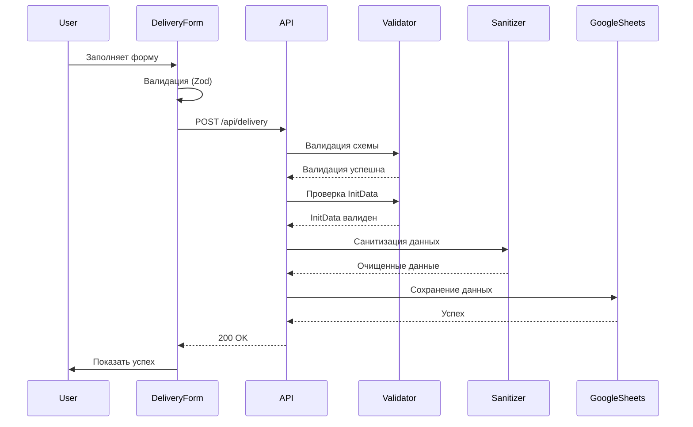
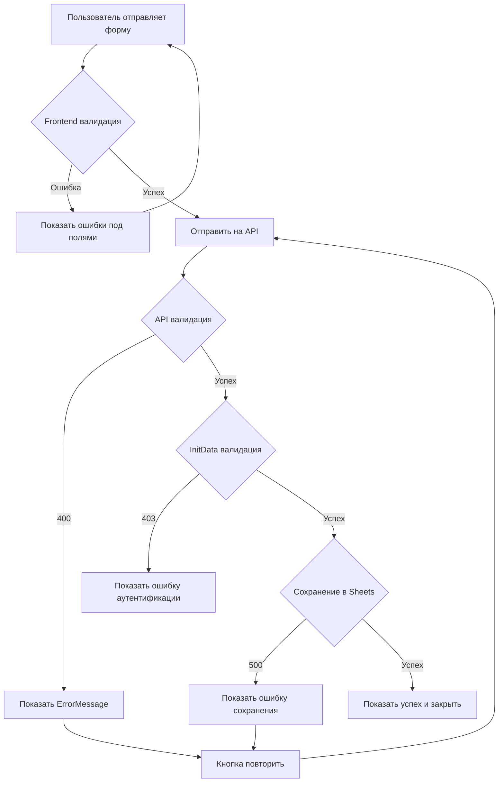

# Документ дизайна: Разделение полей формы доставки

## Обзор

Данный дизайн описывает техническую реализацию разделения составных полей "ФИО" и "Адрес доставки" на отдельные структурированные поля в форме доставки Telegram WebApp.

### Цели дизайна

- Разделить поле "ФИО" на три отдельных поля: Фамилия, Имя, Отчество
- Разделить поле "Адрес доставки" на четыре отдельных поля: Город, Улица, Дом, Квартира
- Обновить схемы валидации для новой структуры данных
- Обеспечить обратную совместимость с существующей инфраструктурой
- Сохранить все существующие функции формы (телефон, комментарий, обработка ошибок)

### Затрагиваемые компоненты

1. **Frontend**: `DeliveryForm.tsx` - React-компонент формы
2. **Validation**: Zod-схемы валидации (frontend и backend)
3. **API**: `/api/delivery/route.ts` - серверный endpoint
4. **Types**: `types/delivery.ts` - TypeScript интерфейсы
5. **Storage**: `lib/google/sheetsClient.ts` - клиент для сохранения в Google Sheets
6. **Utilities**: `lib/utils/sanitize.ts` - санитизация данных

## Архитектура

### Текущая архитектура

```
┌─────────────────┐
│  DeliveryForm   │
│   (Frontend)    │
│                 │
│  - full_name    │
│  - address      │
│  - phone        │
│  - comment      │
└────────┬────────┘
         │
         │ POST /api/delivery
         ▼
┌─────────────────┐
│  API Route      │
│  /api/delivery  │
│                 │
│  - Validation   │
│  - InitData     │
│  - Sanitize     │
└────────┬────────┘
         │
         ▼
┌─────────────────┐
│ GoogleSheets    │
│    Client       │
│                 │
│  - Save to      │
│    Sheet1       │
└─────────────────┘
```

### Новая архитектура

```
┌─────────────────────────────┐
│      DeliveryForm           │
│       (Frontend)            │
│                             │
│  FullName Fields:           │
│  - last_name                │
│  - first_name               │
│  - patronymic (optional)    │
│                             │
│  Address Fields:            │
│  - city                     │
│  - street                   │
│  - house                    │
│  - apartment (optional)     │
│                             │
│  Other Fields:              │
│  - phone                    │
│  - comment (optional)       │
└──────────┬──────────────────┘
           │
           │ POST /api/delivery
           │ {
           │   last_name, first_name, patronymic,
           │   city, street, house, apartment,
           │   phone, comment, prize_id, initData
           │ }
           ▼
┌─────────────────────────────┐
│      API Route              │
│     /api/delivery           │
│                             │
│  1. Zod Validation          │
│     - Separate fields       │
│     - Optional fields       │
│                             │
│  2. InitData Validation     │
│     - Crypto check          │
│                             │
│  3. Data Sanitization       │
│     - XSS prevention        │
│                             │
│  4. Data Transformation     │
│     - Prepare for storage   │
└──────────┬──────────────────┘
           │
           ▼
┌─────────────────────────────┐
│    GoogleSheetsClient       │
│                             │
│  Updated columns:           │
│  E: last_name               │
│  F: first_name              │
│  G: patronymic              │
│  H: city                    │
│  I: street                  │
│  J: house                   │
│  K: apartment               │
│  L: phone                   │
│  M: comment                 │
│  N: claimed_at              │
└─────────────────────────────┘
```

## Компоненты и интерфейсы

### 1. Обновление TypeScript интерфейсов

**Файл**: `nextjs-app/types/delivery.ts`

Текущая структура:
```typescript
export interface DeliveryData {
  full_name: string;
  address: string;
  phone: string;
  comment?: string;
}
```

Новая структура:
```typescript
export interface DeliveryData {
  // ФИО разделено на компоненты
  last_name: string;
  first_name: string;
  patronymic?: string; // Опционально
  
  // Адрес разделен на компоненты
  city: string;
  street: string;
  house: string;
  apartment?: string; // Опционально
  
  // Существующие поля
  phone: string;
  comment?: string;
}
```

### 2. Обновление Zod-схемы валидации (Frontend)

**Файл**: `nextjs-app/components/webapp/DeliveryForm.tsx`

Текущая схема:
```typescript
const formSchema = z.object({
  full_name: z.string().min(2).max(100),
  address: z.string().min(10).max(500),
  phone: z.string().regex(/^\+?[0-9]{10,15}$/),
  comment: z.string().max(500).optional(),
});
```

Новая схема:
```typescript
const formSchema = z.object({
  // ФИО поля
  last_name: z
    .string()
    .min(2, 'Минимум 2 символа')
    .max(50, 'Максимум 50 символов')
    .trim(),
  first_name: z
    .string()
    .min(2, 'Минимум 2 символа')
    .max(50, 'Максимум 50 символов')
    .trim(),
  patronymic: z
    .string()
    .min(2, 'Минимум 2 символа')
    .max(50, 'Максимум 50 символов')
    .trim()
    .optional()
    .or(z.literal('')), // Разрешаем пустую строку
  
  // Адресные поля
  city: z
    .string()
    .min(2, 'Минимум 2 символа')
    .max(100, 'Максимум 100 символов')
    .trim(),
  street: z
    .string()
    .min(2, 'Минимум 2 символа')
    .max(200, 'Максимум 200 символов')
    .trim(),
  house: z
    .string()
    .min(1, 'Минимум 1 символ')
    .max(20, 'Максимум 20 символов')
    .trim(),
  apartment: z
    .string()
    .min(1, 'Минимум 1 символ')
    .max(20, 'Максимум 20 символов')
    .trim()
    .optional()
    .or(z.literal('')), // Разрешаем пустую строку
  
  // Существующие поля
  phone: z
    .string()
    .regex(/^\+?[0-9]{10,15}$/, 'Неверный формат телефона')
    .trim(),
  comment: z
    .string()
    .max(500, 'Максимум 500 символов')
    .trim()
    .optional(),
});
```

**Обоснование дизайна**:
- Использование `.trim()` для автоматического удаления пробелов
- `.optional().or(z.literal(''))` для опциональных полей позволяет принимать как undefined, так и пустую строку
- Разные лимиты длины для разных типов полей (имя короче адреса)
- Сохранение существующей валидации телефона

### 3. Обновление UI компонента DeliveryForm

**Файл**: `nextjs-app/components/webapp/DeliveryForm.tsx`

#### Структура формы

Форма будет содержать следующие секции:

1. **Секция ФИО** (3 поля):
   - Фамилия (обязательное)
   - Имя (обязательное)
   - Отчество (опциональное)

2. **Секция Адрес** (4 поля):
   - Город (обязательное)
   - Улица (обязательное)
   - Дом (обязательное)
   - Квартира (опциональное)

3. **Секция Контакты** (2 поля):
   - Телефон (обязательное)
   - Комментарий (опциональное)

#### Визуальная группировка

Для улучшения UX поля будут визуально сгруппированы:

```tsx
<form>
  {/* Группа ФИО */}
  <div className="space-y-3">
    <h3>Получатель</h3>
    <Input name="last_name" label="Фамилия" required />
    <Input name="first_name" label="Имя" required />
    <Input name="patronymic" label="Отчество" />
  </div>
  
  {/* Группа Адрес */}
  <div className="space-y-3">
    <h3>Адрес доставки</h3>
    <Input name="city" label="Город" required />
    <Input name="street" label="Улица" required />
    <div className="grid grid-cols-2 gap-2">
      <Input name="house" label="Дом" required />
      <Input name="apartment" label="Квартира" />
    </div>
  </div>
  
  {/* Группа Контакты */}
  <div className="space-y-3">
    <h3>Контактная информация</h3>
    <Input name="phone" label="Телефон" required />
    <Textarea name="comment" label="Комментарий" />
  </div>
  
  <Button type="submit">Отправить</Button>
</form>
```

**Дизайн решения**:
- Поля "Дом" и "Квартира" в одной строке (grid-cols-2) для экономии места
- Визуальные заголовки секций для лучшей читаемости
- Сохранение существующей стилизации Telegram-темы
- Сохранение placeholder-текстов согласно требованиям

### 4. Обновление API endpoint

**Файл**: `nextjs-app/app/api/delivery/route.ts`

#### Обновление Zod-схемы (Backend)

```typescript
const deliverySchema = z.object({
  // ФИО поля
  last_name: z
    .string()
    .min(2, 'Фамилия должна содержать минимум 2 символа')
    .max(50, 'Фамилия не должна превышать 50 символов')
    .trim(),
  first_name: z
    .string()
    .min(2, 'Имя должно содержать минимум 2 символа')
    .max(50, 'Имя не должно превышать 50 символов')
    .trim(),
  patronymic: z
    .string()
    .min(2, 'Отчество должно содержать минимум 2 символа')
    .max(50, 'Отчество не должно превышать 50 символов')
    .trim()
    .optional()
    .or(z.literal('')),
  
  // Адресные поля
  city: z
    .string()
    .min(2, 'Город должен содержать минимум 2 символа')
    .max(100, 'Город не должен превышать 100 символов')
    .trim(),
  street: z
    .string()
    .min(2, 'Улица должна содержать минимум 2 символа')
    .max(200, 'Улица не должна превышать 200 символов')
    .trim(),
  house: z
    .string()
    .min(1, 'Дом должен содержать минимум 1 символ')
    .max(20, 'Дом не должен превышать 20 символов')
    .trim(),
  apartment: z
    .string()
    .min(1, 'Квартира должна содержать минимум 1 символ')
    .max(20, 'Квартира не должна превышать 20 символов')
    .trim()
    .optional()
    .or(z.literal('')),
  
  // Существующие поля
  phone: z
    .string()
    .regex(
      /^\+?[0-9]{10,15}$/,
      'Неверный формат телефона. Используйте формат: +79991234567'
    )
    .trim(),
  comment: z
    .string()
    .max(500, 'Комментарий не должен превышать 500 символов')
    .trim()
    .optional(),
  
  // Служебные поля
  prize_id: z
    .number()
    .int('Prize ID должен быть целым числом')
    .positive('Prize ID должен быть положительным числом'),
  initData: z.string().min(1, 'InitData обязателен'),
});
```

#### Обработка опциональных полей

```typescript
// После валидации
const sanitizedData = sanitizeDeliveryData({
  last_name: validatedData.last_name,
  first_name: validatedData.first_name,
  patronymic: validatedData.patronymic || null, // Преобразуем пустую строку в null
  city: validatedData.city,
  street: validatedData.street,
  house: validatedData.house,
  apartment: validatedData.apartment || null, // Преобразуем пустую строку в null
  phone: validatedData.phone,
  comment: validatedData.comment,
  telegram_id: telegramId,
});
```

### 5. Обновление Google Sheets Client

**Файл**: `nextjs-app/lib/google/sheetsClient.ts`

#### Обновление интерфейса DeliveryData

```typescript
export interface DeliveryData {
  last_name: string;
  first_name: string;
  patronymic: string | null;
  city: string;
  street: string;
  house: string;
  apartment: string | null;
  phone: string;
  comment?: string;
  telegram_id: number;
}
```

#### Обновление метода saveDeliveryData

```typescript
async saveDeliveryData(rowId: number, deliveryData: DeliveryData): Promise<boolean> {
  try {
    // Подготовка данных для записи
    // Новая структура столбцов:
    // E: last_name
    // F: first_name
    // G: patronymic
    // H: city
    // I: street
    // J: house
    // K: apartment
    // L: phone
    // M: comment
    const values = [
      [
        deliveryData.last_name,
        deliveryData.first_name,
        deliveryData.patronymic || '',
        deliveryData.city,
        deliveryData.street,
        deliveryData.house,
        deliveryData.apartment || '',
        deliveryData.phone,
        deliveryData.comment || '',
      ],
    ];

    // Определение диапазона для обновления (строка rowId, столбцы E-M)
    const range = `Sheet1!E${rowId}:M${rowId}`;

    // Выполнение обновления
    await this.sheets.spreadsheets.values.update({
      spreadsheetId: this.spreadsheetId,
      range,
      valueInputOption: 'RAW',
      requestBody: {
        values,
      },
    });

    // Отметка времени получения приза в столбце N
    const claimedAtRange = `Sheet1!N${rowId}`;
    await this.sheets.spreadsheets.values.update({
      spreadsheetId: this.spreadsheetId,
      range: claimedAtRange,
      valueInputOption: 'RAW',
      requestBody: {
        values: [[new Date().toISOString()]],
      },
    });

    return true;
  } catch (error) {
    console.error('Error saving delivery data to Google Sheets:', error);
    throw new Error(
      `Failed to save delivery data: ${error instanceof Error ? error.message : 'Unknown error'}`
    );
  }
}
```

**Важно**: Потребуется обновить структуру Google Sheets таблицы, добавив дополнительные столбцы.

### 6. Обновление утилиты санитизации

**Файл**: `nextjs-app/lib/utils/sanitize.ts`

Функция `sanitizeDeliveryData` должна быть обновлена для обработки новых полей:

```typescript
export function sanitizeDeliveryData(data: {
  last_name: string;
  first_name: string;
  patronymic: string | null;
  city: string;
  street: string;
  house: string;
  apartment: string | null;
  phone: string;
  comment?: string;
  telegram_id: number;
}) {
  return {
    last_name: sanitizeString(data.last_name),
    first_name: sanitizeString(data.first_name),
    patronymic: data.patronymic ? sanitizeString(data.patronymic) : null,
    city: sanitizeString(data.city),
    street: sanitizeString(data.street),
    house: sanitizeString(data.house),
    apartment: data.apartment ? sanitizeString(data.apartment) : null,
    phone: sanitizeString(data.phone),
    comment: data.comment ? sanitizeString(data.comment) : undefined,
    telegram_id: data.telegram_id,
  };
}
```

## Модели данных

### Диаграмма потока данных



### Структура данных на каждом этапе

#### 1. Frontend Form State
```typescript
{
  last_name: string;
  first_name: string;
  patronymic?: string;
  city: string;
  street: string;
  house: string;
  apartment?: string;
  phone: string;
  comment?: string;
}
```

#### 2. API Request Body
```typescript
{
  last_name: string;
  first_name: string;
  patronymic?: string;
  city: string;
  street: string;
  house: string;
  apartment?: string;
  phone: string;
  comment?: string;
  prize_id: number;
  initData: string;
}
```

#### 3. Validated & Sanitized Data
```typescript
{
  last_name: string;
  first_name: string;
  patronymic: string | null;
  city: string;
  street: string;
  house: string;
  apartment: string | null;
  phone: string;
  comment?: string;
  telegram_id: number;
}
```

#### 4. Google Sheets Row
```
[last_name, first_name, patronymic, city, street, house, apartment, phone, comment, claimed_at]
```


## Correctness Properties

*Свойство (property) — это характеристика или поведение, которое должно выполняться для всех валидных выполнений системы. По сути, это формальное утверждение о том, что система должна делать. Свойства служат мостом между человекочитаемыми спецификациями и машинно-проверяемыми гарантиями корректности.*

### Property 1: Валидация длины полей ФИО

*Для любого* поля ФИО (last_name, first_name, patronymic), валидация должна отклонять строки короче 2 символов или длиннее 50 символов (для непустых значений patronymic).

**Validates: Requirements 1.2, 1.3, 1.4**

**Обоснование**: Это свойство объединяет три похожих требования валидации в одно универсальное правило. Все три поля имеют одинаковые ограничения по длине, поэтому логично тестировать их единообразно.

### Property 2: Валидация длины поля "Город"

*Для любой* строки, представляющей город, валидация должна принимать строки от 2 до 100 символов и отклонять строки вне этого диапазона.

**Validates: Requirements 2.2**

### Property 3: Валидация длины поля "Улица"

*Для любой* строки, представляющей улицу, валидация должна принимать строки от 2 до 200 символов и отклонять строки вне этого диапазона.

**Validates: Requirements 2.3**

### Property 4: Валидация длины поля "Дом"

*Для любой* строки, представляющей номер дома, валидация должна принимать строки от 1 до 20 символов и отклонять строки вне этого диапазона.

**Validates: Requirements 2.4**

### Property 5: Валидация длины поля "Квартира"

*Для любой* строки, представляющей номер квартиры, валидация должна принимать строки от 1 до 20 символов (для непустых значений) и отклонять строки вне этого диапазона.

**Validates: Requirements 2.5**

### Property 6: Валидация формата телефона

*Для любой* строки, представляющей номер телефона, валидация должна принимать только строки, соответствующие regex `/^\+?[0-9]{10,15}$/`, и отклонять все остальные.

**Validates: Requirements 3.1**

### Property 7: Валидация длины комментария

*Для любой* строки комментария, валидация должна принимать строки до 500 символов и отклонять строки длиннее 500 символов.

**Validates: Requirements 3.2**

### Property 8: Обработка опциональных полей

*Для любого* опционального поля (patronymic, apartment, comment), система должна корректно обрабатывать пустые значения (пустая строка или undefined), не вызывая ошибок валидации.

**Validates: Requirements 1.5, 2.6, 4.3, 4.4**

**Обоснование**: Это свойство объединяет все требования к обработке опциональных полей. Все опциональные поля должны вести себя одинаково: принимать пустые значения без ошибок.

### Property 9: Структура данных API запроса

*Для любых* валидных данных формы, отправленных на API, тело запроса должно содержать все обязательные поля: last_name, first_name, city, street, house, phone, prize_id, initData.

**Validates: Requirements 1.6, 2.7, 3.4, 4.1**

**Обоснование**: Это свойство объединяет все требования к структуре данных, отправляемых на API. Вместо проверки отдельных групп полей, мы проверяем полную структуру запроса.

### Property 10: Валидация обязательных полей на API

*Для любого* запроса к API с отсутствующим обязательным полем (last_name, first_name, city, street, house, phone), API должен возвращать HTTP статус 400 с описанием ошибки.

**Validates: Requirements 4.5, 4.6**

**Обоснование**: Это свойство проверяет, что API корректно обрабатывает невалидные запросы, отклоняя их с правильным статусом ошибки.

### Property 11: Round-trip сохранения данных

*Для любых* валидных данных доставки, отправленных через API, данные должны быть сохранены в Google Sheets в том же структурированном виде (с сохранением всех полей и их значений).

**Validates: Requirements 4.2**

**Обоснование**: Это round-trip свойство проверяет, что данные корректно проходят через всю цепочку обработки: от API до хранилища. Это критически важно для целостности данных.

### Property 12: Автоматическая обрезка пробелов

*Для любого* текстового поля формы, система должна автоматически удалять начальные и конечные пробелы (trim) перед валидацией и сохранением.

**Validates: Implicit requirement from schema design**

**Обоснование**: Все схемы валидации используют `.trim()`, что является важным свойством для предотвращения ошибок пользователей и обеспечения чистоты данных.

## Обработка ошибок

### Типы ошибок

#### 1. Ошибки валидации формы (Frontend)

**Источник**: Zod-схема в DeliveryForm.tsx

**Обработка**:
- Ошибки отображаются под соответствующими полями
- Красный цвет текста ошибки
- Форма не отправляется до устранения всех ошибок
- Пользователь видит конкретное сообщение для каждого поля

**Примеры сообщений**:
- "Минимум 2 символа"
- "Максимум 50 символов"
- "Неверный формат телефона"

#### 2. Ошибки валидации API (Backend)

**Источник**: Zod-схема в /api/delivery/route.ts

**HTTP статус**: 400 Bad Request

**Формат ответа**:
```json
{
  "error": "Validation error",
  "message": "Ошибка валидации данных",
  "details": [
    {
      "field": "last_name",
      "message": "Фамилия должна содержать минимум 2 символа"
    }
  ]
}
```

**Обработка на frontend**:
- Отображение через компонент ErrorMessage
- Возможность повторной отправки (кнопка "Повторить")
- Возможность закрыть сообщение

#### 3. Ошибки аутентификации

**Источник**: InitDataValidator

**HTTP статус**: 403 Forbidden

**Формат ответа**:
```json
{
  "error": "Invalid signature",
  "message": "Невалидная подпись InitData",
  "details": "Signature verification failed"
}
```

**Обработка**:
- Критическая ошибка безопасности
- Пользователь не может продолжить
- Рекомендация открыть форму через Telegram

#### 4. Ошибки сохранения данных

**Источник**: GoogleSheetsClient

**HTTP статус**: 500 Internal Server Error

**Формат ответа**:
```json
{
  "error": "Failed to save delivery data",
  "message": "Не удалось сохранить данные доставки. Попробуйте позже."
}
```

**Обработка**:
- Отображение дружественного сообщения пользователю
- Логирование детальной ошибки на сервере
- Возможность повторной попытки

#### 5. Ошибки конфигурации

**Источник**: Отсутствующие переменные окружения

**HTTP статус**: 500 Internal Server Error

**Обработка**:
- Проверка при старте сервера
- Логирование в консоль сервера
- Общее сообщение пользователю без раскрытия деталей конфигурации

### Стратегия обработки ошибок



### Принципы обработки ошибок

1. **Fail Fast**: Валидация на frontend предотвращает ненужные запросы к API
2. **Defensive Programming**: API повторно валидирует все данные
3. **User-Friendly Messages**: Понятные сообщения на русском языке
4. **Security First**: Не раскрывать внутренние детали системы в сообщениях об ошибках
5. **Logging**: Детальное логирование всех ошибок на сервере для отладки
6. **Retry Capability**: Возможность повторной попытки для временных ошибок

## Стратегия тестирования

### Двойной подход к тестированию

Для обеспечения полного покрытия и корректности системы используется комбинация двух типов тестов:

#### 1. Unit-тесты (Example-based testing)

**Назначение**:
- Проверка конкретных примеров и сценариев
- Тестирование edge cases
- Проверка интеграционных точек между компонентами
- Тестирование обработки ошибок

**Примеры unit-тестов**:
- Форма рендерит все необходимые поля
- Placeholder-тексты соответствуют требованиям
- Кнопка отправки отключается во время отправки
- ErrorMessage отображается при ошибке API
- Telegram WebApp SDK вызывается при успехе
- Пустое отчество принимается валидацией
- Пустая квартира принимается валидацией

**Инструменты**:
- Jest для тестирования логики
- React Testing Library для тестирования компонентов
- MSW (Mock Service Worker) для мокирования API

#### 2. Property-based тесты

**Назначение**:
- Проверка универсальных свойств на большом количестве сгенерированных входных данных
- Обнаружение edge cases, о которых не подумали при написании unit-тестов
- Проверка корректности валидации на широком спектре входных данных

**Библиотека**: fast-check (для TypeScript/JavaScript)

**Конфигурация**:
- Минимум 100 итераций на каждый property-тест
- Каждый тест помечен комментарием с ссылкой на свойство из дизайна

**Примеры property-тестов**:

```typescript
/**
 * Feature: delivery-form-field-separation, Property 1:
 * Для любого поля ФИО, валидация должна отклонять строки короче 2 или длиннее 50 символов
 */
test('ФИО поля валидируют длину строк', () => {
  fc.assert(
    fc.property(
      fc.oneof(
        fc.string({ minLength: 0, maxLength: 1 }),
        fc.string({ minLength: 51, maxLength: 100 })
      ),
      (invalidString) => {
        const fields = ['last_name', 'first_name', 'patronymic'];
        fields.forEach(field => {
          const result = formSchema.safeParse({ [field]: invalidString });
          expect(result.success).toBe(false);
        });
      }
    ),
    { numRuns: 100 }
  );
});

/**
 * Feature: delivery-form-field-separation, Property 6:
 * Для любой строки телефона, валидация должна принимать только строки, соответствующие regex
 */
test('Валидация формата телефона', () => {
  fc.assert(
    fc.property(
      fc.string().filter(s => !/^\+?[0-9]{10,15}$/.test(s)),
      (invalidPhone) => {
        const result = formSchema.safeParse({ phone: invalidPhone });
        expect(result.success).toBe(false);
      }
    ),
    { numRuns: 100 }
  );
});

/**
 * Feature: delivery-form-field-separation, Property 8:
 * Для любого опционального поля, система должна корректно обрабатывать пустые значения
 */
test('Опциональные поля принимают пустые значения', () => {
  fc.assert(
    fc.property(
      fc.record({
        last_name: fc.string({ minLength: 2, maxLength: 50 }),
        first_name: fc.string({ minLength: 2, maxLength: 50 }),
        patronymic: fc.constant(''), // Пустое отчество
        city: fc.string({ minLength: 2, maxLength: 100 }),
        street: fc.string({ minLength: 2, maxLength: 200 }),
        house: fc.string({ minLength: 1, maxLength: 20 }),
        apartment: fc.constant(''), // Пустая квартира
        phone: fc.string().filter(s => /^\+?[0-9]{10,15}$/.test(s)),
      }),
      (data) => {
        const result = formSchema.safeParse(data);
        expect(result.success).toBe(true);
      }
    ),
    { numRuns: 100 }
  );
});

/**
 * Feature: delivery-form-field-separation, Property 11:
 * Round-trip сохранения данных
 */
test('Данные сохраняются и извлекаются без потерь', async () => {
  fc.assert(
    fc.asyncProperty(
      fc.record({
        last_name: fc.string({ minLength: 2, maxLength: 50 }),
        first_name: fc.string({ minLength: 2, maxLength: 50 }),
        patronymic: fc.option(fc.string({ minLength: 2, maxLength: 50 })),
        city: fc.string({ minLength: 2, maxLength: 100 }),
        street: fc.string({ minLength: 2, maxLength: 200 }),
        house: fc.string({ minLength: 1, maxLength: 20 }),
        apartment: fc.option(fc.string({ minLength: 1, maxLength: 20 })),
        phone: fc.string().filter(s => /^\+?[0-9]{10,15}$/.test(s)),
        comment: fc.option(fc.string({ maxLength: 500 })),
      }),
      async (data) => {
        // Отправить данные через API
        const response = await sendDeliveryData(data);
        expect(response.success).toBe(true);
        
        // Извлечь данные из Google Sheets
        const savedData = await getDeliveryData(response.rowId);
        
        // Проверить, что все поля сохранены корректно
        expect(savedData.last_name).toBe(data.last_name);
        expect(savedData.first_name).toBe(data.first_name);
        expect(savedData.patronymic).toBe(data.patronymic || null);
        expect(savedData.city).toBe(data.city);
        expect(savedData.street).toBe(data.street);
        expect(savedData.house).toBe(data.house);
        expect(savedData.apartment).toBe(data.apartment || null);
        expect(savedData.phone).toBe(data.phone);
        expect(savedData.comment).toBe(data.comment);
      }
    ),
    { numRuns: 100 }
  );
});

/**
 * Feature: delivery-form-field-separation, Property 12:
 * Автоматическая обрезка пробелов
 */
test('Система обрезает пробелы в начале и конце строк', () => {
  fc.assert(
    fc.property(
      fc.string({ minLength: 2, maxLength: 50 }),
      fc.nat({ max: 10 }),
      fc.nat({ max: 10 }),
      (str, leadingSpaces, trailingSpaces) => {
        const paddedStr = ' '.repeat(leadingSpaces) + str + ' '.repeat(trailingSpaces);
        const result = formSchema.safeParse({ last_name: paddedStr });
        
        if (result.success) {
          expect(result.data.last_name).toBe(str.trim());
        }
      }
    ),
    { numRuns: 100 }
  );
});
```

### Структура тестов

```
nextjs-app/
├── __tests__/
│   ├── components/
│   │   └── DeliveryForm.test.tsx          # Unit-тесты компонента
│   ├── api/
│   │   └── delivery.test.ts               # Unit-тесты API
│   ├── lib/
│   │   ├── sheetsClient.test.ts           # Unit-тесты Google Sheets
│   │   └── sanitize.test.ts               # Unit-тесты санитизации
│   └── properties/
│       ├── validation.property.test.ts     # Property-тесты валидации
│       ├── api.property.test.ts            # Property-тесты API
│       └── roundtrip.property.test.ts      # Property-тесты round-trip
```

### Покрытие тестами

**Unit-тесты покрывают**:
- Рендеринг компонентов
- Обработку событий
- Обработку ошибок
- Интеграцию с Telegram WebApp SDK
- Конкретные edge cases (пустые опциональные поля)
- Визуальные требования (placeholders, стили)

**Property-тесты покрывают**:
- Все 12 correctness properties из дизайна
- Валидацию на широком спектре входных данных
- Round-trip сохранения данных
- Обработку граничных значений

### Баланс между unit и property тестами

**Принципы**:
- Unit-тесты фокусируются на конкретных примерах и интеграционных точках
- Property-тесты фокусируются на универсальных правилах и генерации большого количества входных данных
- Избегаем дублирования: если property-тест покрывает общее правило, не пишем множество unit-тестов для частных случаев
- Unit-тесты дополняют property-тесты в областях, где property-based testing неприменим (UI, интеграция с внешними сервисами)

### Запуск тестов

```bash
# Все тесты
npm test

# Только unit-тесты
npm test -- --testPathPattern="__tests__/(components|api|lib)"

# Только property-тесты
npm test -- --testPathPattern="__tests__/properties"

# С покрытием
npm test -- --coverage

# Watch mode для разработки
npm test -- --watch
```

### CI/CD интеграция

Все тесты (unit и property) должны проходить перед мерджем в main ветку:

```yaml
# .github/workflows/test.yml
name: Tests
on: [push, pull_request]
jobs:
  test:
    runs-on: ubuntu-latest
    steps:
      - uses: actions/checkout@v2
      - uses: actions/setup-node@v2
      - run: npm ci
      - run: npm test -- --coverage
      - run: npm test -- --testPathPattern="properties" --verbose
```

## Миграция и развертывание

### План миграции

#### Этап 1: Подготовка инфраструктуры

1. **Обновление Google Sheets структуры**:
   - Добавить новые столбцы: E-N
   - Переименовать заголовки столбцов
   - Сохранить существующие данные (если есть)

2. **Обновление переменных окружения** (если требуется):
   - Проверить актуальность GOOGLE_CREDENTIALS_PATH
   - Проверить актуальность SPREADSHEET_ID

#### Этап 2: Обновление кода

1. **Backend изменения**:
   - Обновить `types/delivery.ts`
   - Обновить `lib/google/sheetsClient.ts`
   - Обновить `lib/utils/sanitize.ts`
   - Обновить `app/api/delivery/route.ts`

2. **Frontend изменения**:
   - Обновить `components/webapp/DeliveryForm.tsx`

3. **Тесты**:
   - Написать property-based тесты
   - Обновить существующие unit-тесты
   - Добавить новые unit-тесты для новых полей

#### Этап 3: Тестирование

1. **Локальное тестирование**:
   - Запустить все тесты
   - Проверить форму в браузере
   - Проверить отправку данных в тестовую Google Sheets таблицу

2. **Staging тестирование**:
   - Развернуть на staging окружение
   - Протестировать через Telegram WebApp
   - Проверить сохранение данных в Google Sheets

#### Этап 4: Развертывание

1. **Production deployment**:
   - Развернуть изменения на production
   - Мониторить логи на наличие ошибок
   - Проверить первые несколько отправок формы

2. **Rollback план**:
   - Сохранить предыдущую версию кода
   - Подготовить скрипт быстрого отката
   - Мониторить метрики ошибок

### Обратная совместимость

**Важно**: Данная миграция НЕ обратно совместима на уровне данных, так как меняется структура полей.

**Стратегия**:
- Если в системе уже есть данные в старом формате (full_name, address), потребуется миграция данных
- Рекомендуется создать скрипт миграции для разделения существующих данных на компоненты
- Альтернатива: начать использовать новую структуру только для новых записей

### Мониторинг после развертывания

**Метрики для отслеживания**:
- Количество успешных отправок формы
- Количество ошибок валидации (400)
- Количество ошибок сохранения (500)
- Время ответа API
- Количество ошибок InitData валидации (403)

**Алерты**:
- Резкое увеличение ошибок 500
- Резкое увеличение ошибок 400
- Увеличение времени ответа API более 2 секунд

## Заключение

Данный дизайн обеспечивает структурированный подход к разделению полей формы доставки с сохранением всей существующей функциональности. Ключевые аспекты:

1. **Модульность**: Изменения затрагивают четко определенные компоненты
2. **Валидация**: Двухуровневая валидация (frontend + backend) обеспечивает надежность
3. **Тестирование**: Комбинация unit и property-based тестов обеспечивает полное покрытие
4. **Безопасность**: Сохранение всех существующих механизмов безопасности (InitData, санитизация)
5. **UX**: Улучшение пользовательского опыта через структурированные поля
6. **Maintainability**: Чистая архитектура облегчает будущие изменения

Реализация данного дизайна приведет к более точным данным доставки, упрощению валидации и улучшению общего качества системы.
