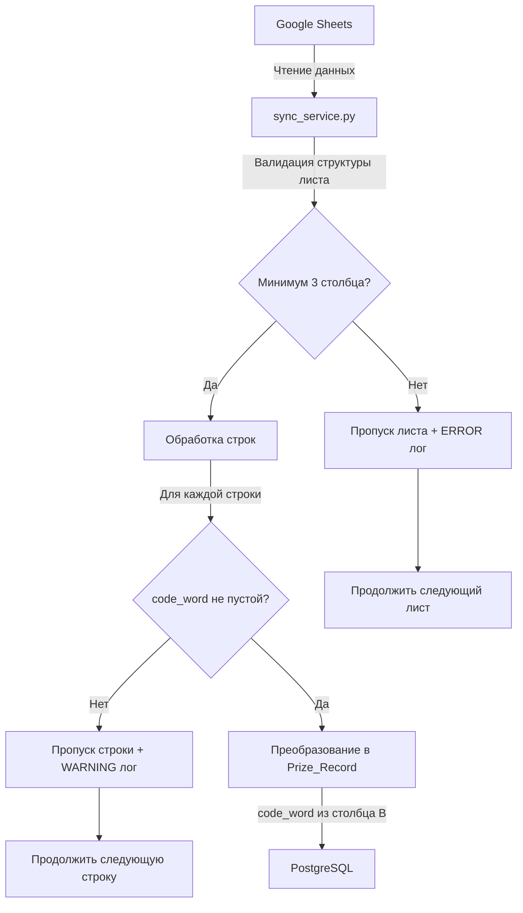

# Design Document: Google Sheets Code Word Column

## Overview

Данный документ описывает техническое решение для изменения способа чтения кодового слова (code_word) в системе синхронизации данных из Google Sheets в PostgreSQL. 

### Текущее состояние

В текущей реализации система использует название листа Google Sheets (`sheet_name`) в качестве кодового слова для идентификации призов. Это создаёт жёсткую связь между структурой документа и данными.

### Целевое состояние

Новая реализация будет читать кодовое слово из отдельного столбца B в таблице Google Sheets. Это обеспечит:
- Независимость данных от названия листа
- Гибкость в организации листов
- Возможность использования одного листа для разных кодовых слов
- Сохранение sheet_name для целей аудита и отладки

### Затронутые компоненты

- `telegram-bot/services/sync_service.py` - основной модуль синхронизации
- `telegram-bot/database/models/prize.py` - модель данных (без изменений, уже поддерживает code_word)
- `telegram-bot/tests/test_sync_service_unit.py` - unit тесты
- `telegram-bot/tests/test_sync_service_properties.py` - property-based тесты
- Новый скрипт миграции данных

## Architecture

### Структура данных Google Sheets

**Новая структура столбцов:**

```
Столбец A (индекс 0): telegram_id      - Telegram ID пользователя
Столбец B (индекс 1): code_word        - Кодовое слово для идентификации приза
Столбец C (индекс 2): prize_type       - Тип приза (digital/physical)
Столбец D (индекс 3): promo_code       - Промокод (для digital)
Столбец E (индекс 4): instructions     - Инструкции (для digital)
Столбцы F-M (индексы 5-12): ...        - Данные доставки (для physical)
```

**Изменение относительно старой структуры:**
- Добавлен столбец B (code_word) между telegram_id и prize_type
- Все последующие столбцы сдвинуты на одну позицию вправо

### Поток данных



### Архитектурные решения

1. **Валидация на уровне сервиса**: Вся валидация структуры и данных выполняется в `SyncService` до попытки записи в БД
2. **Fail-safe обработка**: Ошибки в одном листе или строке не прерывают обработку остальных данных
3. **Детальное логирование**: Каждая ошибка валидации логируется с контекстом для упрощения отладки
4. **Сохранение метаданных**: Поле `sheet_name` сохраняется в БД для аудита, даже если не используется как code_word

## Components and Interfaces

### 1. SyncService._convert_sheet_data_to_prizes()

**Текущая сигнатура** (без изменений):
```python
def _convert_sheet_data_to_prizes(
    self,
    sheet_data: List[List[str]],
    sheet_name: str
) -> List[Dict[str, Any]]
```

**Изменения в логике:**


#### Изменение 1.1: Валидация структуры листа

**Добавить в начало метода:**
```python
# Валидация структуры листа - минимум 3 столбца
if not sheet_data:
    logger.error(
        "sheet_structure_invalid",
        sheet_name=sheet_name,
        reason="empty_sheet",
        found_columns=0,
        required_columns=3
    )
    return []

# Проверяем первую строку данных на наличие минимум 3 столбцов
first_row = sheet_data[0] if sheet_data else []
if len(first_row) < 3:
    logger.error(
        "sheet_structure_invalid",
        sheet_name=sheet_name,
        reason="insufficient_columns",
        found_columns=len(first_row),
        required_columns=3,
        message="Требуется минимум 3 столбца: telegram_id, code_word, prize_type"
    )
    return []
```

#### Изменение 1.2: Чтение code_word из столбца B

**Было:**
```python
# Проверяем минимальные требования (telegram_id и prize_type)
if len(row_values) < 2 or not row_values[0] or not row_values[1]:
    logger.warning(...)
    continue

telegram_id = int(row_values[0])

prize_data = {
    'telegram_id': telegram_id,
    'prize_type': row_values[1],  # Было: индекс 1
    'code_word': sheet_name,      # Было: sheet_name
    ...
}
```

**Стало:**
```python
# Проверяем минимальные требования (telegram_id, code_word и prize_type)
if len(row_values) < 3:
    logger.warning(
        "invalid_row_skipped",
        sheet_name=sheet_name,
        row_index=row_index + 2,
        reason="insufficient_columns",
        found_columns=len(row_values),
        required_columns=3
    )
    continue

# Проверяем обязательные поля
if not row_values[0]:
    logger.warning(
        "invalid_row_skipped",
        sheet_name=sheet_name,
        row_index=row_index + 2,
        reason="missing_telegram_id"
    )
    continue

if not row_values[1] or not row_values[1].strip():
    logger.warning(
        "invalid_row_skipped",
        sheet_name=sheet_name,
        row_index=row_index + 2,
        reason="missing_code_word",
        message="Столбец code_word (B) обязателен для заполнения"
    )
    continue

if not row_values[2]:
    logger.warning(
        "invalid_row_skipped",
        sheet_name=sheet_name,
        row_index=row_index + 2,
        reason="missing_prize_type"
    )
    continue

telegram_id = int(row_values[0])
code_word = row_values[1].strip()

prize_data = {
    'telegram_id': telegram_id,
    'prize_type': row_values[2],      # Теперь: индекс 2
    'code_word': code_word,            # Теперь: из столбца B
    'sheet_name': sheet_name,          # Сохраняем для аудита
    ...
}
```

#### Изменение 1.3: Сдвиг индексов для остальных полей

**Для цифровых призов:**
```python
if prize_data['prize_type'] == 'digital':
    prize_data['promo_code'] = row_values[3] if len(row_values) > 3 else None      # Было: индекс 2
    prize_data['instructions'] = row_values[4] if len(row_values) > 4 else None    # Было: индекс 3
```

**Для физических призов:**
```python
if prize_data['prize_type'] == 'physical' and len(row_values) > 5:
    prize_data['last_name'] = row_values[5] if len(row_values) > 5 else None      # Было: индекс 4
    prize_data['first_name'] = row_values[6] if len(row_values) > 6 else None     # Было: индекс 5
    prize_data['patronymic'] = row_values[7] if len(row_values) > 7 else None     # Было: индекс 6
    prize_data['city'] = row_values[8] if len(row_values) > 8 else None           # Было: индекс 7
    prize_data['street'] = row_values[9] if len(row_values) > 9 else None         # Было: индекс 8
    prize_data['house'] = row_values[10] if len(row_values) > 10 else None        # Было: индекс 9
    prize_data['apartment'] = row_values[11] if len(row_values) > 11 else None    # Было: индекс 10
    prize_data['phone'] = row_values[12] if len(row_values) > 12 else None        # Было: индекс 11
    prize_data['comment'] = row_values[13] if len(row_values) > 13 else None      # Было: индекс 12
```

### 2. Скрипт миграции данных

**Расположение:** `telegram-bot/scripts/migrate_code_word_column.py`

**Назначение:** Одноразовое обновление существующих записей в PostgreSQL для соответствия новой структуре.

**Функциональность:**


1. **Создание резервной копии** перед изменениями
2. **Проверка необходимости миграции** - подсчёт записей, где code_word == sheet_name
3. **Обновление записей** - для существующих данных code_word остаётся равным sheet_name (данные уже корректны)
4. **Логирование статистики** - количество проверенных и обновлённых записей
5. **Возврат статуса** - успех/ошибка с детальной информацией

**Интерфейс:**
```python
async def migrate_code_word_column() -> Dict[str, Any]:
    """
    Миграция существующих данных для поддержки нового формата с code_word в столбце B
    
    Returns:
        Dict с ключами:
        - success: bool - успешность выполнения
        - records_checked: int - количество проверенных записей
        - records_updated: int - количество обновлённых записей
        - backup_created: bool - создана ли резервная копия
        - errors: List[str] - список ошибок (если есть)
    """
```

**Примечание:** В текущей реализации все записи уже имеют code_word = sheet_name, поэтому фактически обновлять нечего. Скрипт нужен для:
- Проверки целостности данных
- Создания резервной копии перед развёртыванием новой версии
- Документирования процесса миграции

## Data Models

### Prize Model

Модель `Prize` в `telegram-bot/database/models/prize.py` уже поддерживает необходимые поля и не требует изменений.

**Ключевые поля:**
```python
telegram_id: Mapped[int]           # Telegram ID пользователя
code_word: Mapped[str]             # Кодовое слово (теперь из столбца B)
sheet_name: Mapped[str]            # Название листа (для аудита)
prize_type: Mapped[str]            # Тип приза: 'digital' или 'physical'
row_id: Mapped[int]                # Номер строки в Google Sheets
```

**Индексы:**
- `idx_prizes_telegram_code` - уникальный индекс на (telegram_id, code_word)
- `idx_prizes_code_word` - индекс для быстрого поиска по code_word
- `idx_prizes_sheet_name` - индекс для быстрого поиска по sheet_name

**Инвариант уникальности:**
Комбинация (telegram_id, code_word) должна быть уникальной в рамках всей таблицы. Это обеспечивается уникальным индексом на уровне БД.

### Формат данных для batch_upsert_prizes

```python
prize_data = {
    'telegram_id': int,              # Обязательное
    'code_word': str,                # Обязательное, из столбца B
    'prize_type': str,               # Обязательное: 'digital' или 'physical'
    'sheet_name': str,               # Обязательное, для аудита
    'row_id': int,                   # Обязательное
    'promo_code': Optional[str],     # Для digital призов
    'instructions': Optional[str],   # Для digital призов
    'last_name': Optional[str],      # Для physical призов
    'first_name': Optional[str],     # Для physical призов
    # ... остальные поля адреса
    'created_at': datetime,
    'updated_at': datetime
}
```

## Correctness Properties

*Свойство (property) - это характеристика или поведение, которое должно выполняться для всех допустимых входных данных системы. По сути, это формальное утверждение о том, что должна делать система. Свойства служат мостом между человекочитаемыми спецификациями и машинно-проверяемыми гарантиями корректности.*

### Property 1: Извлечение code_word из столбца B

*Для любых* данных листа Google Sheets, где строка содержит минимум 3 столбца с непустыми значениями telegram_id, code_word и prize_type, преобразованная запись Prize_Record должна содержать значение code_word из столбца B (индекс 1), а не из sheet_name.

**Validates: Requirements 1.1, 1.3**

### Property 2: Сохранение sheet_name для аудита

*Для любой* валидной строки из Google Sheets, преобразованная запись Prize_Record должна содержать поле sheet_name, равное названию листа, из которого была прочитана строка.

**Validates: Requirements 1.4**

### Property 3: Отклонение строк с пустым code_word

*Для любой* строки из Google Sheets, где столбец code_word (индекс 1) пустой или содержит только пробельные символы, эта строка должна быть пропущена и не должна попасть в результирующий список Prize_Record.

**Validates: Requirements 2.1, 2.2**

### Property 4: Продолжение обработки после невалидной строки

*Для любого* листа Google Sheets, содержащего как валидные, так и невалидные строки (с пустым code_word), все валидные строки должны быть успешно обработаны независимо от позиции невалидных строк.

**Validates: Requirements 2.4**

### Property 5: Отклонение листов с недостаточным количеством столбцов

*Для любого* листа Google Sheets, где хотя бы одна строка содержит менее 3 столбцов, весь лист должен быть отклонён на этапе валидации структуры, и метод должен вернуть пустой список.

**Validates: Requirements 4.1, 4.2**

### Property 6: Продолжение обработки после невалидного листа

*Для любого* набора листов Google Sheets, где некоторые листы имеют невалидную структуру (менее 3 столбцов), валидные листы должны быть успешно обработаны независимо от наличия невалидных листов.

**Validates: Requirements 4.4**

### Property 7: Корректный сдвиг индексов для полей приза

*Для любой* валидной строки с типом приза 'digital', поля promo_code и instructions должны извлекаться из столбцов D (индекс 3) и E (индекс 4) соответственно, а не из прежних позиций.

**Validates: Requirements 1.1** (косвенно, проверка корректности сдвига)

### Property 8: Уникальность комбинации (telegram_id, code_word)

*Для любых* двух записей Prize_Record с одинаковыми значениями telegram_id и code_word, попытка вставки второй записи должна быть отклонена базой данных с ошибкой уникальности.

**Validates: Requirements 3.2**

## Error Handling

### Типы ошибок и стратегии обработки

#### 1. Ошибки валидации структуры листа

**Условие:** Лист содержит менее 3 столбцов

**Обработка:**
- Логирование с уровнем ERROR
- Пропуск всего листа
- Продолжение обработки следующих листов
- Возврат пустого списка из `_convert_sheet_data_to_prizes()`

**Формат лога:**
```python
logger.error(
    "sheet_structure_invalid",
    sheet_name=sheet_name,
    reason="insufficient_columns",
    found_columns=len(first_row),
    required_columns=3,
    message="Требуется минимум 3 столбца: telegram_id, code_word, prize_type"
)
```

#### 2. Ошибки валидации строки - отсутствие code_word

**Условие:** Столбец code_word пустой или содержит только пробелы

**Обработка:**
- Логирование с уровнем WARNING
- Пропуск строки
- Продолжение обработки следующих строк

**Формат лога:**
```python
logger.warning(
    "invalid_row_skipped",
    sheet_name=sheet_name,
    row_index=row_index + 2,
    reason="missing_code_word",
    message="Столбец code_word (B) обязателен для заполнения"
)
```

#### 3. Ошибки валидации строки - недостаточно столбцов

**Условие:** Строка содержит менее 3 столбцов

**Обработка:**
- Логирование с уровнем WARNING
- Пропуск строки
- Продолжение обработки следующих строк

**Формат лога:**
```python
logger.warning(
    "invalid_row_skipped",
    sheet_name=sheet_name,
    row_index=row_index + 2,
    reason="insufficient_columns",
    found_columns=len(row_values),
    required_columns=3
)
```

#### 4. Ошибки уникальности при вставке в БД

**Условие:** Попытка вставить запись с дублирующейся комбинацией (telegram_id, code_word)

**Обработка:**
- Ошибка обрабатывается на уровне PostgreSQL (уникальный индекс)
- Логирование конфликта (уже реализовано в `batch_upsert_prizes`)
- Операция upsert обновляет существующую запись

**Примечание:** Текущая реализация использует `ON CONFLICT ... DO UPDATE`, поэтому дубликаты не вызывают ошибок, а обновляют существующие записи.

#### 5. Ошибки парсинга данных

**Условие:** Невалидный формат telegram_id или других полей

**Обработка:**
- Логирование с уровнем WARNING
- Пропуск строки
- Продолжение обработки следующих строк

**Формат лога:**
```python
logger.warning(
    "invalid_row_data_skipped",
    sheet_name=sheet_name,
    row_index=row_index + 2,
    error=str(e),
    row_values=row_values[:5]
)
```

### Принципы обработки ошибок

1. **Fail-safe**: Ошибка в одном элементе (строке/листе) не прерывает обработку остальных
2. **Детальное логирование**: Каждая ошибка логируется с достаточным контекстом для отладки
3. **Уровни логирования**:
   - ERROR: Критические проблемы структуры (невалидный лист)
   - WARNING: Проблемы с отдельными строками (пропуск данных)
   - INFO: Успешная обработка с статистикой
   - DEBUG: Детальная информация о каждой обработанной строке

## Testing Strategy

### Dual Testing Approach

Для обеспечения корректности реализации используется комбинированный подход:

1. **Unit тесты** - проверка конкретных сценариев, граничных случаев и обработки ошибок
2. **Property-based тесты** - проверка универсальных свойств на большом количестве сгенерированных входных данных

Оба типа тестов дополняют друг друга:
- Unit тесты ловят конкретные баги и проверяют специфические примеры
- Property тесты обеспечивают широкое покрытие входных данных и проверяют общую корректность

### Unit Testing

**Файл:** `telegram-bot/tests/test_sync_service_unit.py`

**Обновляемые тесты:**

1. **test_sync_sheet_with_valid_data** - обновить тестовые данные для включения столбца code_word
2. **test_sync_sheet_skips_header_row** - обновить структуру данных
3. **test_sync_sheet_skips_invalid_rows** - добавить сценарии с пустым code_word
4. **test_convert_sheet_data_fills_metadata_correctly** - проверить корректность извлечения code_word

**Новые тесты:**

1. **test_validate_sheet_structure_rejects_insufficient_columns** - проверка валидации структуры листа
2. **test_skip_row_with_empty_code_word** - проверка пропуска строк с пустым code_word
3. **test_skip_row_with_whitespace_code_word** - проверка пропуска строк с code_word из пробелов
4. **test_code_word_extracted_from_column_b** - проверка извлечения code_word из правильного столбца
5. **test_sheet_name_preserved_for_audit** - проверка сохранения sheet_name
6. **test_column_indices_shifted_correctly** - проверка корректного сдвига индексов для promo_code, instructions и т.д.
7. **test_processing_continues_after_invalid_row** - проверка продолжения обработки после невалидной строки
8. **test_processing_continues_after_invalid_sheet** - проверка продолжения обработки после невалидного листа

**Примеры тестовых данных:**

```python
# Валидные данные с code_word
valid_data = [
    ['123456789', 'SUMMER2024', 'digital', 'PROMO123', 'Инструкции'],
    ['987654321', 'WINTER2024', 'physical', '', '', 'Иванов', 'Иван', ...]
]

# Невалидные данные - пустой code_word
invalid_data_empty_code = [
    ['123456789', '', 'digital', 'PROMO123'],  # Пустой code_word
    ['987654321', '   ', 'digital', 'PROMO456']  # Только пробелы
]

# Невалидные данные - недостаточно столбцов
invalid_data_insufficient_columns = [
    ['123456789', 'SUMMER2024'],  # Только 2 столбца
    ['987654321']  # Только 1 столбец
]
```

### Property-Based Testing

**Файл:** `telegram-bot/tests/test_sync_service_properties.py`

**Библиотека:** Hypothesis (уже используется в проекте)

**Конфигурация:** Минимум 100 итераций на каждый property тест

**Обновляемые тесты:**

1. **test_all_valid_rows_are_converted** - обновить генератор данных для включения code_word
2. **test_metadata_fields_always_present** - добавить проверку code_word из столбца B

**Новые property тесты:**

#### Property Test 1: Извлечение code_word из столбца B
```python
@given(st.lists(
    st.tuples(
        st.integers(min_value=1, max_value=999999999),  # telegram_id
        st.text(min_size=1, max_size=50).filter(lambda x: x.strip()),  # code_word
        st.sampled_from(['digital', 'physical']),  # prize_type
    ),
    min_size=1,
    max_size=100
))
@settings(max_examples=100)
def test_property_code_word_extracted_from_column_b(self, rows_data):
    """
    Feature: google-sheets-code-word-column, Property 1:
    Для любых данных листа, code_word должен извлекаться из столбца B
    """
```

#### Property Test 2: Сохранение sheet_name
```python
@given(
    st.text(min_size=1, max_size=50),  # sheet_name
    st.lists(st.tuples(...), min_size=1, max_size=100)  # rows
)
@settings(max_examples=100)
def test_property_sheet_name_preserved(self, sheet_name, rows_data):
    """
    Feature: google-sheets-code-word-column, Property 2:
    Для любой валидной строки, sheet_name должен сохраняться
    """
```

#### Property Test 3: Отклонение пустых code_word
```python
@given(st.lists(
    st.tuples(
        st.integers(min_value=1, max_value=999999999),
        st.sampled_from(['', '   ', '\t', '\n']),  # Пустые code_word
        st.sampled_from(['digital', 'physical']),
    ),
    min_size=1,
    max_size=50
))
@settings(max_examples=100)
def test_property_empty_code_word_rejected(self, rows_data):
    """
    Feature: google-sheets-code-word-column, Property 3:
    Для любой строки с пустым code_word, строка должна быть отклонена
    """
```

#### Property Test 4: Продолжение после невалидной строки
```python
@given(
    st.lists(st.tuples(...), min_size=1, max_size=20),  # valid_rows
    st.lists(st.tuples(...), min_size=1, max_size=10),  # invalid_rows
    st.integers(min_value=0, max_value=10)  # insert_position
)
@settings(max_examples=100)
def test_property_processing_continues_after_invalid_row(
    self, valid_rows, invalid_rows, insert_position
):
    """
    Feature: google-sheets-code-word-column, Property 4:
    Для любого листа с валидными и невалидными строками,
    все валидные строки должны быть обработаны
    """
```

#### Property Test 5: Отклонение листов с недостаточным количеством столбцов
```python
@given(st.lists(
    st.lists(st.text(), min_size=0, max_size=2),  # Менее 3 столбцов
    min_size=1,
    max_size=50
))
@settings(max_examples=100)
def test_property_insufficient_columns_rejected(self, sheet_data):
    """
    Feature: google-sheets-code-word-column, Property 5:
    Для любого листа с менее чем 3 столбцами, лист должен быть отклонён
    """
```

#### Property Test 6: Корректный сдвиг индексов
```python
@given(st.lists(
    st.tuples(
        st.integers(min_value=1, max_value=999999999),
        st.text(min_size=1, max_size=50).filter(lambda x: x.strip()),
        st.just('digital'),
        st.text(min_size=1, max_size=50),  # promo_code
        st.text(min_size=1, max_size=200),  # instructions
    ),
    min_size=1,
    max_size=100
))
@settings(max_examples=100)
def test_property_column_indices_shifted_correctly(self, rows_data):
    """
    Feature: google-sheets-code-word-column, Property 7:
    Для любой строки с digital призом, promo_code и instructions
    должны извлекаться из столбцов D и E
    """
```

### Integration Testing

**Тесты с реальной БД** (опционально, для CI/CD):
- Проверка уникального индекса на (telegram_id, code_word)
- Проверка поведения upsert при конфликтах
- Проверка производительности с большим объёмом данных

### Migration Testing

**Тесты для скрипта миграции:**
1. Проверка создания резервной копии
2. Проверка подсчёта записей для миграции
3. Проверка корректности обновления данных
4. Проверка возврата статистики

### Test Data Updates

Все существующие тестовые данные должны быть обновлены для соответствия новой структуре:
- Добавить столбец code_word на позицию B (индекс 1)
- Сдвинуть все последующие столбцы на одну позицию вправо
- Добавить тестовые сценарии с пустым code_word
- Добавить тестовые сценарии с недостаточным количеством столбцов
