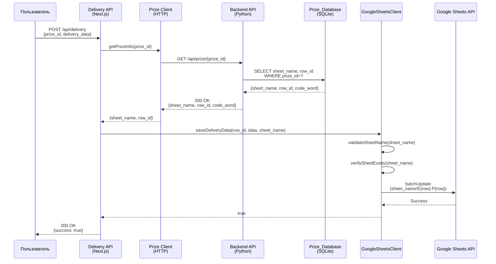
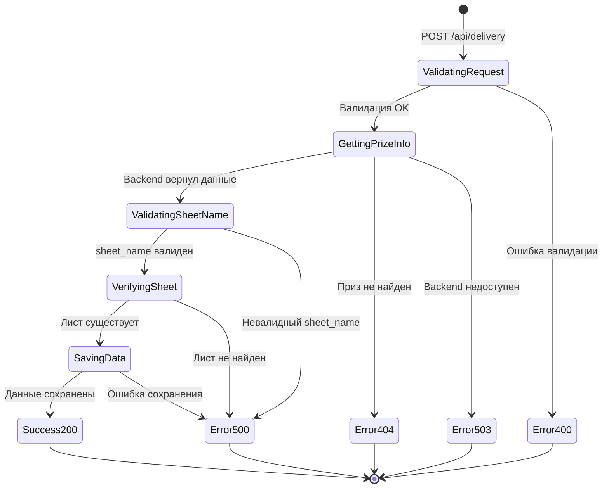

# Design Document: Google Sheets Dynamic Worksheet Selection

## Введение

Данный документ описывает техническое решение для исправления критической ошибки в GoogleSheetsClient, которая приводит к сохранению данных доставки на неправильный лист Google Таблицы. Текущая реализация всегда использует первый лист, игнорируя информацию о целевом листе из базы данных.

Решение добавляет поддержку динамического выбора листа на основе данных из Prize_Database, обеспечивая корректное сохранение данных доставки на тот лист, где находится запись победителя.

## Overview

### Проблема

GoogleSheetsClient использует метод `getSheetName()`, который всегда возвращает название первого листа таблицы. Это приводит к тому, что данные доставки сохраняются не на тот лист, где находится запись победителя, если она находится на другом листе.

### Решение

Система будет получать `sheet_name` из базы данных Prize_Database через Backend API и передавать его в GoogleSheetsClient для использования при формировании диапазонов ячеек.

### Ключевые изменения

1. **Backend API**: Новый endpoint для получения информации о призе (включая sheet_name)
2. **Frontend API**: Интеграция с Backend API для получения sheet_name перед сохранением
3. **GoogleSheetsClient**: Добавление параметра sheet_name в метод saveDeliveryData
4. **Валидация**: Проверка существования листа и валидация sheet_name
5. **Обратная совместимость**: Обновление существующих тестов

## Architecture

### High-Level Architecture



### Component Architecture

```mermaid
graph TB
    subgraph "Next.js Frontend"
        DeliveryRoute["/api/delivery/route.ts"]
        PrizeClient["lib/api/prizeClient.ts<br/>(новый модуль)"]
        SheetsClient["lib/google/sheetsClient.ts<br/>(модифицирован)"]
        Validator["lib/utils/sheetNameValidator.ts<br/>(новый модуль)"]
    end
    
    subgraph "Python Backend"
        PrizeAPI["API: /api/prize/{prize_id}<br/>(новый endpoint)"]
        PrizeDB["Prize_Database"]
    end
    
    subgraph "External"
        GoogleSheets["Google Sheets API"]
    end
    
    DeliveryRoute -->|1. getPrizeInfo| PrizeClient
    PrizeClient -->|2. HTTP GET| PrizeAPI
    PrizeAPI -->|3. Query| PrizeDB
    DeliveryRoute -->|4. saveDeliveryData| SheetsClient
    SheetsClient -->|5. validate| Validator
    SheetsClient -->|6. batchUpdate| GoogleSheets


### Модульная структура

Согласно принципу "один модуль = один файл", создаются следующие новые модули:

1. **lib/api/prizeClient.ts** - HTTP клиент для взаимодействия с Backend API
2. **lib/utils/sheetNameValidator.ts** - Валидация sheet_name
3. **lib/types/prize.ts** - Типы для работы с данными призов

## Components and Interfaces

### 1. Prize Client (новый модуль)

**Файл**: `nextjs-app/lib/api/prizeClient.ts`

**Назначение**: HTTP клиент для получения информации о призе из Backend API

**Интерфейсы**:

```typescript
/**
 * Информация о призе из Backend API
 */
export interface PrizeInfo {
  sheet_name: string;
  row_id: number;
  code_word: string;
}

/**
 * Ошибка при получении информации о призе
 */
export class PrizeNotFoundError extends Error {
  constructor(prizeId: number) {
    super(`Prize with ID ${prizeId} not found`);
    this.name = 'PrizeNotFoundError';
  }
}

export class BackendUnavailableError extends Error {
  constructor(message: string) {
    super(`Backend service unavailable: ${message}`);
    this.name = 'BackendUnavailableError';
  }
}
```

**Сигнатура класса**:

```typescript
export class PrizeClient {
  private backendUrl: string;
  
  constructor(backendUrl: string);
  
  /**
   * Получает информацию о призе по prize_id
   * 
   * @param prizeId - ID приза
   * @returns Информация о призе
   * @throws PrizeNotFoundError если приз не найден
   * @throws BackendUnavailableError если Backend недоступен
   */
  async getPrizeInfo(prizeId: number): Promise<PrizeInfo>;
}
```

### 2. Sheet Name Validator (новый модуль)

**Файл**: `nextjs-app/lib/utils/sheetNameValidator.ts`

**Назначение**: Валидация названий листов Google Sheets

**Интерфейсы**:

```typescript
/**
 * Результат валидации sheet_name
 */
export interface ValidationResult {
  valid: boolean;
  error?: string;
}

/**
 * Ошибка валидации sheet_name
 */
export class InvalidSheetNameError extends Error {
  constructor(sheetName: string, reason: string) {
    super(`Invalid sheet name "${sheetName}": ${reason}`);
    this.name = 'InvalidSheetNameError';
  }
}
```

**Сигнатуры функций**:

```typescript
/**
 * Валидирует название листа Google Sheets
 * 
 * Проверяет:
 * - Не пустая строка
 * - Длина не превышает 100 символов
 * - Не содержит недопустимые символы: [ ] * / \ ? :
 * 
 * @param sheetName - Название листа для валидации
 * @throws InvalidSheetNameError если валидация не прошла
 */
export function validateSheetName(sheetName: string): void;

/**
 * Проверяет название листа без выброса исключений
 * 
 * @param sheetName - Название листа для проверки
 * @returns Результат валидации
 */
export function isValidSheetName(sheetName: string): ValidationResult;

/**
 * Список недопустимых символов для названий листов
 */
export const FORBIDDEN_CHARACTERS = ['[', ']', '*', '/', '\\', '?', ':'];

/**
 * Максимальная длина названия листа
 */
export const MAX_SHEET_NAME_LENGTH = 100;
```

### 3. GoogleSheetsClient (модификация)

**Файл**: `nextjs-app/lib/google/sheetsClient.ts`

**Изменения в интерфейсе**:

```typescript
export class GoogleSheetsClient {
  private auth: JWT;
  private spreadsheetId: string;
  private sheets: ReturnType<typeof google.sheets>;
  private sheetCache: Map<string, boolean>; // Кэш существующих листов
  
  constructor(credentialsPath: string, spreadsheetId: string);
  
  /**
   * Сохраняет данные доставки в Google Sheets
   * 
   * ИЗМЕНЕНИЕ: Добавлен обязательный параметр sheetName
   * 
   * @param rowId - Номер строки для обновления
   * @param deliveryData - Данные доставки
   * @param sheetName - Название листа (ОБЯЗАТЕЛЬНЫЙ)
   * @returns true если сохранение успешно
   * @throws Error если sheetName не передан
   * @throws Error если лист не существует
   * @throws Error если произошла ошибка при сохранении
   */
  async saveDeliveryData(
    rowId: number, 
    deliveryData: DeliveryData,
    sheetName: string  // НОВЫЙ ОБЯЗАТЕЛЬНЫЙ ПАРАМЕТР
  ): Promise<boolean>;
  
  /**
   * Проверяет существование листа в таблице
   * 
   * НОВЫЙ МЕТОД
   * 
   * @param sheetName - Название листа
   * @returns true если лист существует
   */
  private async verifySheetExists(sheetName: string): Promise<boolean>;
  
  /**
   * Получает список всех листов в таблице
   * 
   * НОВЫЙ МЕТОД
   * 
   * @returns Массив названий листов
   */
  private async getAllSheetNames(): Promise<string[]>;
  
  /**
   * УДАЛЯЕТСЯ: метод getSheetName больше не нужен
   */
  // private async getSheetName(): Promise<string>; // УДАЛИТЬ
  
  async healthCheck(): Promise<boolean>; // БЕЗ ИЗМЕНЕНИЙ
}
```

### 4. Delivery API Route (модификация)

**Файл**: `nextjs-app/app/api/delivery/route.ts`

**Изменения**:

```typescript
export async function POST(request: NextRequest) {
  // ... существующая валидация ...
  
  // НОВОЕ: Получение информации о призе из Backend
  const backendUrl = process.env.BACKEND_API_URL;
  if (!backendUrl) {
    return NextResponse.json(
      { error: 'Configuration error', message: 'Backend URL not configured' },
      { status: 500 }
    );
  }
  
  const prizeClient = new PrizeClient(backendUrl);
  
  let prizeInfo: PrizeInfo;
  try {
    prizeInfo = await prizeClient.getPrizeInfo(validatedData.prize_id);
  } catch (error) {
    if (error instanceof PrizeNotFoundError) {
      return NextResponse.json(
        { error: 'Prize not found', message: 'Приз не найден' },
        { status: 404 }
      );
    }
    if (error instanceof BackendUnavailableError) {
      return NextResponse.json(
        { error: 'Backend unavailable', message: 'Сервис временно недоступен' },
        { status: 503 }
      );
    }
    throw error;
  }
  
  // НОВОЕ: Валидация sheet_name
  try {
    validateSheetName(prizeInfo.sheet_name);
  } catch (error) {
    console.error('Invalid sheet name:', error);
    return NextResponse.json(
      { error: 'Invalid sheet name', message: 'Некорректное название листа' },
      { status: 500 }
    );
  }
  
  // НОВОЕ: Логирование sheet_name
  console.log(`Using sheet: ${prizeInfo.sheet_name} for prize ${validatedData.prize_id}`);
  
  // ИЗМЕНЕНИЕ: Передача sheet_name в saveDeliveryData
  const success = await sheetsClient.saveDeliveryData(
    prizeInfo.row_id,  // Используем row_id из Backend
    sanitizedData,
    prizeInfo.sheet_name  // НОВЫЙ ПАРАМЕТР
  );
  
  // ... остальной код ...
}
```

## Data Models

### PrizeInfo

```typescript
interface PrizeInfo {
  sheet_name: string;  // Название листа в Google Таблице
  row_id: number;      // Номер строки с записью победителя
  code_word: string;   // Кодовое слово для верификации
}
```

**Источник**: Backend API endpoint `/api/prize/{prize_id}`

**Валидация**:
- `sheet_name`: не пустая строка, длина ≤ 100, без недопустимых символов
- `row_id`: положительное целое число
- `code_word`: не пустая строка

### Backend API Response

```json
{
  "sheet_name": "Лист1",
  "row_id": 42,
  "code_word": "SECRET123"
}
```

**HTTP коды ответа**:
- `200 OK`: Успешное получение данных
- `404 Not Found`: Приз с указанным prize_id не найден
- `400 Bad Request`: Невалидный prize_id (не число, отрицательное)
- `500 Internal Server Error`: Ошибка на стороне Backend

### Sheet Cache Structure

```typescript
// Кэш для оптимизации проверок существования листов
private sheetCache: Map<string, boolean>;

// Пример использования:
// sheetCache.set("Лист1", true);  // Лист существует
// sheetCache.set("Лист2", true);  // Лист существует
```

**Стратегия кэширования**:
- Кэш заполняется при первой проверке существования листа
- Кэш сбрасывается при ошибках Google Sheets API
- Время жизни кэша: на время жизни экземпляра GoogleSheetsClient


## Correctness Properties

*Property (свойство) — это характеристика или поведение, которое должно выполняться для всех валидных входных данных системы. Properties служат мостом между человеко-читаемыми спецификациями и машинно-проверяемыми гарантиями корректности.*

### Property Reflection

Перед формулировкой properties проведен анализ на избыточность:

**Объединенные properties**:
- Requirements 1.1 и 1.5 объединены: успешный запрос возвращает объект с нужными полями
- Requirements 2.2 и 9.5 объединены: передача sheet_name в GoogleSheetsClient
- Requirements 2.5 и 7.5 объединены: логирование sheet_name на уровне API
- Requirements 6.3 и 7.4 объединены: логирование ошибок с контекстом
- Requirements 10.1 и 2.4 объединены: валидация пустой строки
- Requirements 10.2 и 10.4 объединены: валидация недопустимых символов

**Исключенные как meta-requirements**:
- Requirements 8.1-8.5: требования о наличии тестов (будут реализованы в Testing Strategy)

**Покрытые другими properties**:
- Requirement 4.4: покрывается properties о сохранении данных
- Requirement 5.5: проверяется на этапе компиляции TypeScript

### Property 1: Backend API возвращает полную информацию о призе

*Для любого* существующего в Prize_Database prize_id, Backend API должен вернуть объект, содержащий все обязательные поля: sheet_name, row_id и code_word.

**Validates: Requirements 1.1, 1.5**

### Property 2: Backend API отклоняет несуществующие prize_id

*Для любого* prize_id, которого не существует в Prize_Database, Backend API должен вернуть HTTP 404 с сообщением об ошибке.

**Validates: Requirements 1.2**

### Property 3: Backend API валидирует формат prize_id

*Для любого* невалидного prize_id (отрицательное число, нецелое число, не число), Backend API должен вернуть HTTP 400 с сообщением об ошибке валидации.

**Validates: Requirements 1.4**

### Property 4: Delivery API получает sheet_name из Backend

*Для любого* валидного prize_id, Delivery API должен выполнить запрос к Backend API и получить sheet_name перед сохранением данных.

**Validates: Requirements 2.1, 9.2**

### Property 5: Delivery API передает sheet_name в GoogleSheetsClient

*Для любого* полученного из Backend sheet_name, Delivery API должен передать его как параметр в метод saveDeliveryData класса GoogleSheetsClient.

**Validates: Requirements 2.2, 9.5**

### Property 6: Delivery API логирует sheet_name

*Для любого* успешно полученного sheet_name, Delivery API должен записать в лог сообщение, содержащее название листа и prize_id.

**Validates: Requirements 2.5, 7.5**

### Property 7: GoogleSheetsClient использует переданный sheet_name в диапазонах

*Для любого* переданного в saveDeliveryData sheet_name, GoogleSheetsClient должен использовать его для формирования всех диапазонов ячеек в формате `{sheet_name}!{column}{row}`.

**Validates: Requirements 3.2, 3.5**

### Property 8: GoogleSheetsClient не вызывает getSheetName при явной передаче

*Для любого* вызова saveDeliveryData с явно переданным sheet_name, метод getSheetName не должен вызываться (оптимизация).

**Validates: Requirements 3.3**

### Property 9: GoogleSheetsClient проверяет существование листа

*Для любого* переданного sheet_name, GoogleSheetsClient должен проверить существование листа в таблице перед сохранением данных.

**Validates: Requirements 4.1**

### Property 10: GoogleSheetsClient отклоняет несуществующие листы

*Для любого* sheet_name, который не существует в Google Таблице, GoogleSheetsClient должен выбросить ошибку с сообщением "Sheet '{sheet_name}' not found".

**Validates: Requirements 4.2**

### Property 11: GoogleSheetsClient кэширует проверки существования

*Для любого* sheet_name, повторная проверка существования листа не должна приводить к повторному запросу к Google Sheets API (используется кэш).

**Validates: Requirements 4.3**

### Property 12: GoogleSheetsClient логирует проверку существования

*Для любого* sheet_name, при выполнении проверки существования должно записываться сообщение "Verifying sheet '{sheet_name}' exists".

**Validates: Requirements 4.5, 7.2**

### Property 13: GoogleSheetsClient логирует использование листа

*Для любого* вызова saveDeliveryData с sheet_name и row_id, должно записываться сообщение "Using sheet: {sheet_name} for row {row_id}".

**Validates: Requirements 7.1**

### Property 14: GoogleSheetsClient логирует успешное сохранение

*Для любого* успешного сохранения данных, должно записываться сообщение "Successfully saved delivery data to sheet '{sheet_name}', row {row_id}".

**Validates: Requirements 7.3**

### Property 15: GoogleSheetsClient логирует ошибки с контекстом

*Для любой* ошибки при сохранении данных, в лог должны записываться sheet_name, row_id и полный текст ошибки.

**Validates: Requirements 6.3, 7.4**

### Property 16: Delivery API обрабатывает ошибки GoogleSheetsClient

*Для любой* ошибки, выброшенной GoogleSheetsClient, Delivery API должен перехватить её и вернуть HTTP 500 с понятным сообщением пользователю.

**Validates: Requirements 6.4**

### Property 17: Система валидирует пустые sheet_name

*Для любого* sheet_name, являющегося пустой строкой или содержащего только пробелы, система должна выбросить ошибку валидации.

**Validates: Requirements 2.4, 10.1**

### Property 18: Система валидирует недопустимые символы в sheet_name

*Для любого* sheet_name, содержащего недопустимые символы (`[`, `]`, `*`, `/`, `\`, `?`, `:`), система должна выбросить ошибку "Invalid sheet name: contains forbidden characters".

**Validates: Requirements 10.2, 10.4**

### Property 19: Система валидирует длину sheet_name

*Для любого* sheet_name длиной более 100 символов, система должна выбросить ошибку валидации.

**Validates: Requirements 10.3**

### Property 20: Delivery API парсит JSON ответ Backend

*Для любого* валидного JSON ответа от Backend API, Delivery API должен корректно извлечь поле sheet_name.

**Validates: Requirements 9.3**

### Property 21: Round-trip сохранения с динамическим листом

*Для любого* валидного sheet_name, row_id и delivery_data, сохранение данных через saveDeliveryData должно привести к тому, что данные окажутся на указанном листе в указанной строке.

**Validates: Requirements 3.2, 3.5** (общая корректность работы)

### Property 22: Идемпотентность сохранения на динамический лист

*Для любого* набора данных (sheet_name, row_id, delivery_data), повторное сохранение тех же данных должно давать тот же результат (перезапись данных в тех же ячейках).

**Validates: Requirements 3.2, 3.5** (стабильность работы)


## Error Handling

### Иерархия ошибок

```typescript
// Базовая ошибка для всех ошибок, связанных с sheet_name
export class SheetError extends Error {
  constructor(message: string) {
    super(message);
    this.name = 'SheetError';
  }
}

// Ошибка валидации sheet_name
export class InvalidSheetNameError extends SheetError {
  constructor(sheetName: string, reason: string) {
    super(`Invalid sheet name "${sheetName}": ${reason}`);
    this.name = 'InvalidSheetNameError';
  }
}

// Ошибка: лист не найден
export class SheetNotFoundError extends SheetError {
  constructor(sheetName: string) {
    super(`Sheet "${sheetName}" does not exist in spreadsheet`);
    this.name = 'SheetNotFoundError';
  }
}

// Ошибка доступа к листу
export class SheetAccessDeniedError extends SheetError {
  constructor(sheetName: string) {
    super(`Access denied to sheet "${sheetName}"`);
    this.name = 'SheetAccessDeniedError';
  }
}

// Ошибка: приз не найден
export class PrizeNotFoundError extends Error {
  constructor(prizeId: number) {
    super(`Prize with ID ${prizeId} not found`);
    this.name = 'PrizeNotFoundError';
  }
}

// Ошибка: Backend недоступен
export class BackendUnavailableError extends Error {
  constructor(message: string) {
    super(`Backend service unavailable: ${message}`);
    this.name = 'BackendUnavailableError';
  }
}
```

### Обработка ошибок по слоям

#### 1. GoogleSheetsClient

```typescript
async saveDeliveryData(rowId: number, deliveryData: DeliveryData, sheetName: string): Promise<boolean> {
  try {
    // Валидация sheet_name
    validateSheetName(sheetName); // Может выбросить InvalidSheetNameError
    
    // Проверка существования листа
    const exists = await this.verifySheetExists(sheetName); // Может выбросить SheetNotFoundError
    
    // Логирование
    console.log(`Using sheet: ${sheetName} for row ${rowId}`);
    
    // Сохранение данных
    await this.sheets.spreadsheets.values.batchUpdate({...});
    
    console.log(`Successfully saved delivery data to sheet '${sheetName}', row ${rowId}`);
    return true;
    
  } catch (error) {
    // Логирование ошибки с контекстом
    console.error('Error saving delivery data:', {
      sheetName,
      rowId,
      error: error instanceof Error ? error.message : 'Unknown error',
      stack: error instanceof Error ? error.stack : undefined,
    });
    
    // Обработка специфичных ошибок Google Sheets API
    if (error instanceof Error) {
      if (error.message.includes('Unable to parse range')) {
        throw new SheetNotFoundError(sheetName);
      }
      if (error.message.includes('permission') || error.message.includes('access')) {
        throw new SheetAccessDeniedError(sheetName);
      }
    }
    
    // Проброс ошибки выше
    throw error;
  }
}
```

#### 2. Delivery API

```typescript
export async function POST(request: NextRequest) {
  try {
    // ... валидация данных ...
    
    // Получение информации о призе
    let prizeInfo: PrizeInfo;
    try {
      prizeInfo = await prizeClient.getPrizeInfo(validatedData.prize_id);
    } catch (error) {
      if (error instanceof PrizeNotFoundError) {
        return NextResponse.json(
          { error: 'Prize not found', message: 'Приз не найден' },
          { status: 404 }
        );
      }
      if (error instanceof BackendUnavailableError) {
        return NextResponse.json(
          { error: 'Backend unavailable', message: 'Сервис временно недоступен' },
          { status: 503 }
        );
      }
      throw error; // Неожиданная ошибка
    }
    
    // Валидация sheet_name
    try {
      validateSheetName(prizeInfo.sheet_name);
    } catch (error) {
      console.error('Invalid sheet name from backend:', error);
      return NextResponse.json(
        { error: 'Invalid sheet name', message: 'Некорректное название листа' },
        { status: 500 }
      );
    }
    
    // Сохранение данных
    try {
      await sheetsClient.saveDeliveryData(prizeInfo.row_id, sanitizedData, prizeInfo.sheet_name);
    } catch (error) {
      if (error instanceof SheetNotFoundError) {
        console.error('Sheet not found:', error.message);
        return NextResponse.json(
          { error: 'Sheet not found', message: 'Лист не найден в таблице' },
          { status: 500 }
        );
      }
      if (error instanceof SheetAccessDeniedError) {
        console.error('Access denied to sheet:', error.message);
        return NextResponse.json(
          { error: 'Access denied', message: 'Нет доступа к листу' },
          { status: 500 }
        );
      }
      
      // Общая ошибка сохранения
      console.error('Failed to save delivery data:', error);
      return NextResponse.json(
        { error: 'Failed to save', message: 'Не удалось сохранить данные' },
        { status: 500 }
      );
    }
    
    return NextResponse.json({ success: true }, { status: 200 });
    
  } catch (error) {
    console.error('Unexpected error in delivery API:', error);
    return NextResponse.json(
      { error: 'Internal error', message: 'Внутренняя ошибка сервера' },
      { status: 500 }
    );
  }
}
```

#### 3. Prize Client

```typescript
async getPrizeInfo(prizeId: number): Promise<PrizeInfo> {
  try {
    const response = await fetch(`${this.backendUrl}/api/prize/${prizeId}`, {
      method: 'GET',
      headers: { 'Content-Type': 'application/json' },
    });
    
    if (response.status === 404) {
      throw new PrizeNotFoundError(prizeId);
    }
    
    if (!response.ok) {
      throw new BackendUnavailableError(`HTTP ${response.status}: ${response.statusText}`);
    }
    
    const data = await response.json();
    
    // Валидация структуры ответа
    if (!data.sheet_name || !data.row_id) {
      throw new BackendUnavailableError('Invalid response structure from backend');
    }
    
    return data as PrizeInfo;
    
  } catch (error) {
    if (error instanceof PrizeNotFoundError || error instanceof BackendUnavailableError) {
      throw error;
    }
    
    // Сетевые ошибки
    if (error instanceof TypeError && error.message.includes('fetch')) {
      throw new BackendUnavailableError('Network error: unable to reach backend');
    }
    
    throw new BackendUnavailableError(`Unexpected error: ${error instanceof Error ? error.message : 'Unknown'}`);
  }
}
```

### Матрица ошибок и HTTP кодов

| Ошибка | Слой | HTTP код | Сообщение пользователю |
|--------|------|----------|------------------------|
| PrizeNotFoundError | Prize Client | 404 | "Приз не найден" |
| BackendUnavailableError | Prize Client | 503 | "Сервис временно недоступен" |
| InvalidSheetNameError | Validator | 500 | "Некорректное название листа" |
| SheetNotFoundError | GoogleSheetsClient | 500 | "Лист не найден в таблице" |
| SheetAccessDeniedError | GoogleSheetsClient | 500 | "Нет доступа к листу" |
| Validation Error (Zod) | Delivery API | 400 | "Ошибка валидации данных" |
| InitData Invalid | Delivery API | 403 | "Невалидная подпись InitData" |
| Generic Error | Any | 500 | "Внутренняя ошибка сервера" |

## Testing Strategy

### Dual Testing Approach

Система использует комбинацию unit-тестов и property-based тестов для обеспечения полного покрытия:

- **Unit тесты**: Проверяют конкретные примеры, edge cases и обработку ошибок
- **Property тесты**: Проверяют универсальные свойства на большом количестве сгенерированных входных данных

### Property-Based Testing

**Библиотека**: `@fast-check/vitest` (уже используется в проекте)

**Конфигурация**:
- Минимум 100 итераций на каждый property тест
- Timeout: 10000ms для тестов с внешними вызовами
- Каждый тест помечен комментарием с ссылкой на property из design документа

**Формат тега**:
```typescript
/**
 * Feature: google-sheets-dynamic-worksheet-selection, Property 7:
 * GoogleSheetsClient использует переданный sheet_name в диапазонах
 * 
 * Validates: Requirements 3.2, 3.5
 */
```

### Тестовые модули

#### 1. Unit тесты для PrizeClient

**Файл**: `nextjs-app/lib/api/__tests__/prizeClient.unit.test.ts`

Тесты:
- Успешное получение информации о призе
- Обработка 404 (приз не найден)
- Обработка сетевых ошибок
- Обработка невалидного JSON ответа
- Обработка отсутствующих полей в ответе

#### 2. Property тесты для PrizeClient

**Файл**: `nextjs-app/lib/api/__tests__/prizeClient.property.test.ts`

Properties:
- Property 1: Backend API возвращает полную информацию о призе
- Property 2: Backend API отклоняет несуществующие prize_id
- Property 3: Backend API валидирует формат prize_id

#### 3. Unit тесты для SheetNameValidator

**Файл**: `nextjs-app/lib/utils/__tests__/sheetNameValidator.unit.test.ts`

Тесты:
- Валидация корректных названий
- Отклонение пустых строк
- Отклонение строк с недопустимыми символами
- Отклонение слишком длинных названий
- Проверка каждого недопустимого символа отдельно

#### 4. Property тесты для SheetNameValidator

**Файл**: `nextjs-app/lib/utils/__tests__/sheetNameValidator.property.test.ts`

Properties:
- Property 17: Система валидирует пустые sheet_name
- Property 18: Система валидирует недопустимые символы
- Property 19: Система валидирует длину sheet_name

#### 5. Обновление unit тестов GoogleSheetsClient

**Файл**: `nextjs-app/lib/google/__tests__/sheetsClient.unit.test.ts`

Новые тесты:
- Сохранение данных с явно переданным sheet_name
- Проверка использования sheet_name в диапазонах
- Проверка существования листа
- Обработка несуществующего листа
- Кэширование проверок существования
- Логирование использования листа
- Логирование проверки существования
- Логирование успешного сохранения
- Логирование ошибок с контекстом

Обновление существующих тестов:
- Все вызовы `saveDeliveryData` должны передавать третий параметр `sheetName`
- Моки должны включать проверку sheet_name в диапазонах

#### 6. Обновление property тестов GoogleSheetsClient

**Файл**: `nextjs-app/lib/google/__tests__/sheetsClient.property.test.ts`

Новые properties:
- Property 7: GoogleSheetsClient использует переданный sheet_name в диапазонах
- Property 8: GoogleSheetsClient не вызывает getSheetName при явной передаче
- Property 9: GoogleSheetsClient проверяет существование листа
- Property 10: GoogleSheetsClient отклоняет несуществующие листы
- Property 11: GoogleSheetsClient кэширует проверки существования
- Property 21: Round-trip сохранения с динамическим листом
- Property 22: Идемпотентность сохранения на динамический лист

Обновление существующих properties:
- Все генераторы должны включать валидный sheet_name
- Все assertions должны проверять использование sheet_name

#### 7. Integration тесты для Delivery API

**Файл**: `nextjs-app/app/api/delivery/__tests__/route.integration.test.ts` (новый)

Тесты:
- End-to-end flow: получение sheet_name из Backend и сохранение в Google Sheets
- Обработка ошибки 404 от Backend
- Обработка ошибки 503 (Backend недоступен)
- Обработка невалидного sheet_name от Backend
- Обработка несуществующего листа в Google Sheets

### План миграции существующих тестов

#### Этап 1: Подготовка моков

1. Обновить моки Google Sheets API для поддержки проверки существования листов
2. Добавить мок для метода `spreadsheets.get()` с возвратом списка листов
3. Обновить мок `batchUpdate` для проверки sheet_name в диапазонах

#### Этап 2: Обновление unit тестов (16 тестов)

Для каждого существующего теста:

```typescript
// БЫЛО:
await client.saveDeliveryData(rowId, deliveryData);

// СТАЛО:
await client.saveDeliveryData(rowId, deliveryData, 'Sheet1');
```

Дополнительные изменения:
- Обновить assertions для проверки sheet_name в диапазонах
- Добавить моки для `verifySheetExists`

#### Этап 3: Обновление property тестов (4 теста)

Для каждого существующего property теста:

```typescript
// Добавить генератор sheet_name
const sheetNameArbitrary = fc.string({ minLength: 1, maxLength: 100 })
  .filter(s => !FORBIDDEN_CHARACTERS.some(c => s.includes(c)));

// Обновить вызовы
await fc.assert(
  fc.asyncProperty(
    // ... существующие генераторы ...
    sheetNameArbitrary,
    async (...args, sheetName) => {
      await client.saveDeliveryData(rowId, deliveryData, sheetName);
      // ... assertions ...
    }
  ),
  { numRuns: 100 }
);
```

#### Этап 4: Проверка обратной совместимости

1. Запустить все существующие тесты: `npm test`
2. Убедиться, что все 20 тестов (16 unit + 4 property) проходят
3. Проверить отсутствие регрессий в функциональности

### Генераторы для Property-Based Testing

```typescript
import { fc } from '@fast-check/vitest';

// Генератор валидных sheet_name
export const validSheetNameArbitrary = fc.string({ minLength: 1, maxLength: 100 })
  .filter(s => {
    const trimmed = s.trim();
    return trimmed.length > 0 && 
           !FORBIDDEN_CHARACTERS.some(c => s.includes(c));
  });

// Генератор невалидных sheet_name (пустые)
export const emptySheetNameArbitrary = fc.constantFrom('', '   ', '\t', '\n');

// Генератор невалидных sheet_name (с недопустимыми символами)
export const invalidSheetNameArbitrary = fc.tuple(
  fc.string({ minLength: 0, maxLength: 50 }),
  fc.constantFrom(...FORBIDDEN_CHARACTERS),
  fc.string({ minLength: 0, maxLength: 50 })
).map(([prefix, forbidden, suffix]) => `${prefix}${forbidden}${suffix}`);

// Генератор невалидных sheet_name (слишком длинные)
export const tooLongSheetNameArbitrary = fc.string({ 
  minLength: MAX_SHEET_NAME_LENGTH + 1, 
  maxLength: MAX_SHEET_NAME_LENGTH + 100 
});

// Генератор валидных prize_id
export const validPrizeIdArbitrary = fc.integer({ min: 1, max: 1000000 });

// Генератор невалидных prize_id
export const invalidPrizeIdArbitrary = fc.oneof(
  fc.integer({ max: 0 }),           // Отрицательные и ноль
  fc.double({ noNaN: true }),       // Нецелые числа
  fc.constant(NaN)                  // NaN
);
```

### Покрытие тестами

**Целевое покрытие**:
- Unit тесты: 100% покрытие новых модулей (PrizeClient, SheetNameValidator)
- Property тесты: Все 22 correctness properties реализованы
- Integration тесты: Основные сценарии использования
- Существующие тесты: Все 20 тестов обновлены и проходят

**Метрики**:
- Общее количество тестов: ~60 (20 существующих + 40 новых)
- Property тесты: минимум 100 итераций каждый
- Время выполнения: < 30 секунд для всего набора


## Implementation Plan

### Фаза 1: Создание новых модулей

#### 1.1 SheetNameValidator

**Файл**: `nextjs-app/lib/utils/sheetNameValidator.ts`

**Приоритет**: Высокий (используется всеми остальными компонентами)

**Реализация**:
```typescript
export const FORBIDDEN_CHARACTERS = ['[', ']', '*', '/', '\\', '?', ':'];
export const MAX_SHEET_NAME_LENGTH = 100;

export class InvalidSheetNameError extends Error {
  constructor(sheetName: string, reason: string) {
    super(`Invalid sheet name "${sheetName}": ${reason}`);
    this.name = 'InvalidSheetNameError';
  }
}

export function validateSheetName(sheetName: string): void {
  // Проверка на пустую строку
  if (!sheetName || sheetName.trim().length === 0) {
    throw new InvalidSheetNameError(sheetName, 'sheet name cannot be empty');
  }
  
  // Проверка длины
  if (sheetName.length > MAX_SHEET_NAME_LENGTH) {
    throw new InvalidSheetNameError(
      sheetName, 
      `sheet name exceeds maximum length of ${MAX_SHEET_NAME_LENGTH} characters`
    );
  }
  
  // Проверка недопустимых символов
  for (const char of FORBIDDEN_CHARACTERS) {
    if (sheetName.includes(char)) {
      throw new InvalidSheetNameError(
        sheetName, 
        `contains forbidden character: ${char}`
      );
    }
  }
}

export function isValidSheetName(sheetName: string): ValidationResult {
  try {
    validateSheetName(sheetName);
    return { valid: true };
  } catch (error) {
    if (error instanceof InvalidSheetNameError) {
      return { valid: false, error: error.message };
    }
    return { valid: false, error: 'Unknown validation error' };
  }
}
```

#### 1.2 Prize Types

**Файл**: `nextjs-app/lib/types/prize.ts`

**Реализация**:
```typescript
/**
 * Информация о призе из Backend API
 */
export interface PrizeInfo {
  sheet_name: string;
  row_id: number;
  code_word: string;
}

/**
 * Ошибка: приз не найден
 */
export class PrizeNotFoundError extends Error {
  constructor(prizeId: number) {
    super(`Prize with ID ${prizeId} not found`);
    this.name = 'PrizeNotFoundError';
  }
}

/**
 * Ошибка: Backend недоступен
 */
export class BackendUnavailableError extends Error {
  constructor(message: string) {
    super(`Backend service unavailable: ${message}`);
    this.name = 'BackendUnavailableError';
  }
}
```

#### 1.3 PrizeClient

**Файл**: `nextjs-app/lib/api/prizeClient.ts`

**Зависимости**: `lib/types/prize.ts`

**Реализация**:
```typescript
import { PrizeInfo, PrizeNotFoundError, BackendUnavailableError } from '@/lib/types/prize';

export class PrizeClient {
  private backendUrl: string;
  
  constructor(backendUrl: string) {
    this.backendUrl = backendUrl;
  }
  
  async getPrizeInfo(prizeId: number): Promise<PrizeInfo> {
    try {
      const response = await fetch(`${this.backendUrl}/api/prize/${prizeId}`, {
        method: 'GET',
        headers: { 'Content-Type': 'application/json' },
        // Timeout для предотвращения зависания
        signal: AbortSignal.timeout(5000),
      });
      
      if (response.status === 404) {
        throw new PrizeNotFoundError(prizeId);
      }
      
      if (!response.ok) {
        throw new BackendUnavailableError(
          `HTTP ${response.status}: ${response.statusText}`
        );
      }
      
      const data = await response.json();
      
      // Валидация структуры ответа
      if (!data.sheet_name || typeof data.sheet_name !== 'string') {
        throw new BackendUnavailableError('Missing or invalid sheet_name in response');
      }
      
      if (!data.row_id || typeof data.row_id !== 'number') {
        throw new BackendUnavailableError('Missing or invalid row_id in response');
      }
      
      if (!data.code_word || typeof data.code_word !== 'string') {
        throw new BackendUnavailableError('Missing or invalid code_word in response');
      }
      
      return data as PrizeInfo;
      
    } catch (error) {
      // Проброс известных ошибок
      if (error instanceof PrizeNotFoundError || error instanceof BackendUnavailableError) {
        throw error;
      }
      
      // Обработка timeout
      if (error instanceof Error && error.name === 'TimeoutError') {
        throw new BackendUnavailableError('Request timeout: backend did not respond');
      }
      
      // Обработка сетевых ошибок
      if (error instanceof TypeError && error.message.includes('fetch')) {
        throw new BackendUnavailableError('Network error: unable to reach backend');
      }
      
      // Неожиданные ошибки
      throw new BackendUnavailableError(
        `Unexpected error: ${error instanceof Error ? error.message : 'Unknown'}`
      );
    }
  }
}
```

### Фаза 2: Модификация GoogleSheetsClient

**Файл**: `nextjs-app/lib/google/sheetsClient.ts`

**Изменения**:

1. Добавить кэш для листов:
```typescript
private sheetCache: Map<string, boolean> = new Map();
```

2. Удалить метод `getSheetName()` и поле `sheetName`

3. Добавить метод `getAllSheetNames()`:
```typescript
private async getAllSheetNames(): Promise<string[]> {
  try {
    const response = await this.sheets.spreadsheets.get({
      spreadsheetId: this.spreadsheetId,
    });
    
    const sheets = response.data.sheets;
    if (!sheets || sheets.length === 0) {
      return [];
    }
    
    return sheets
      .map(sheet => sheet.properties?.title)
      .filter((title): title is string => !!title);
      
  } catch (error) {
    console.error('Failed to get sheet names:', error);
    throw new Error(
      `Failed to get sheet names: ${error instanceof Error ? error.message : 'Unknown error'}`
    );
  }
}
```

4. Добавить метод `verifySheetExists()`:
```typescript
private async verifySheetExists(sheetName: string): Promise<boolean> {
  // Проверка кэша
  if (this.sheetCache.has(sheetName)) {
    return this.sheetCache.get(sheetName)!;
  }
  
  console.log(`Verifying sheet '${sheetName}' exists`);
  
  try {
    const allSheets = await this.getAllSheetNames();
    
    // Заполнение кэша
    allSheets.forEach(name => this.sheetCache.set(name, true));
    
    const exists = allSheets.includes(sheetName);
    
    if (!exists) {
      throw new SheetNotFoundError(sheetName);
    }
    
    return true;
    
  } catch (error) {
    if (error instanceof SheetNotFoundError) {
      throw error;
    }
    
    // Сброс кэша при ошибках API
    this.sheetCache.clear();
    throw error;
  }
}
```

5. Модифицировать `saveDeliveryData()`:
```typescript
async saveDeliveryData(
  rowId: number, 
  deliveryData: DeliveryData,
  sheetName: string  // НОВЫЙ ОБЯЗАТЕЛЬНЫЙ ПАРАМЕТР
): Promise<boolean> {
  try {
    // Валидация sheet_name
    validateSheetName(sheetName);
    
    // Проверка существования листа
    await this.verifySheetExists(sheetName);
    
    // Логирование
    console.log(`Using sheet: ${sheetName} for row ${rowId}`);
    
    // Подготовка batch update с использованием sheetName
    const updates = [
      { range: `${sheetName}!E${rowId}:E${rowId}`, values: [[deliveryData.last_name]] },
      { range: `${sheetName}!F${rowId}:F${rowId}`, values: [[deliveryData.first_name]] },
      { range: `${sheetName}!G${rowId}:G${rowId}`, values: [[deliveryData.patronymic || '']] },
      { range: `${sheetName}!H${rowId}:H${rowId}`, values: [[deliveryData.city]] },
      { range: `${sheetName}!I${rowId}:I${rowId}`, values: [[deliveryData.street]] },
      { range: `${sheetName}!J${rowId}:J${rowId}`, values: [[deliveryData.house]] },
      { range: `${sheetName}!K${rowId}:K${rowId}`, values: [[deliveryData.apartment || '']] },
      { range: `${sheetName}!L${rowId}:L${rowId}`, values: [[deliveryData.phone]] },
      { range: `${sheetName}!M${rowId}:M${rowId}`, values: [[deliveryData.comment || '']] },
      { range: `${sheetName}!N${rowId}:N${rowId}`, values: [[deliveryData.country]] },
      { range: `${sheetName}!O${rowId}:O${rowId}`, values: [[deliveryData.postal_code]] },
    ];
    
    const claimedAt = new Date().toISOString();
    updates.push({ range: `${sheetName}!P${rowId}:P${rowId}`, values: [[claimedAt]] });
    
    // Выполнение batch update
    await this.sheets.spreadsheets.values.batchUpdate({
      spreadsheetId: this.spreadsheetId,
      requestBody: {
        valueInputOption: 'RAW',
        data: updates,
      },
    });
    
    console.log(`Successfully saved delivery data to sheet '${sheetName}', row ${rowId}`);
    return true;
    
  } catch (error) {
    // Логирование ошибки с контекстом
    console.error('Error saving delivery data to Google Sheets:', {
      sheetName,
      rowId,
      error: error instanceof Error ? error.message : 'Unknown error',
      stack: error instanceof Error ? error.stack : undefined,
    });
    
    // Обработка специфичных ошибок Google Sheets API
    if (error instanceof Error) {
      if (error.message.includes('Unable to parse range')) {
        throw new SheetNotFoundError(sheetName);
      }
      if (error.message.includes('permission') || error.message.includes('access')) {
        throw new SheetAccessDeniedError(sheetName);
      }
    }
    
    // Проброс ошибки
    throw new Error(
      `Failed to save delivery data: ${error instanceof Error ? error.message : 'Unknown error'}`
    );
  }
}
```

6. Добавить импорты:
```typescript
import { validateSheetName } from '@/lib/utils/sheetNameValidator';
import { SheetNotFoundError, SheetAccessDeniedError } from '@/lib/types/sheet';
```

### Фаза 3: Модификация Delivery API

**Файл**: `nextjs-app/app/api/delivery/route.ts`

**Изменения**:

1. Добавить импорты:
```typescript
import { PrizeClient } from '@/lib/api/prizeClient';
import { PrizeInfo, PrizeNotFoundError, BackendUnavailableError } from '@/lib/types/prize';
import { validateSheetName } from '@/lib/utils/sheetNameValidator';
import { SheetNotFoundError, SheetAccessDeniedError } from '@/lib/types/sheet';
```

2. Добавить проверку переменной окружения `BACKEND_API_URL`:
```typescript
const backendUrl = process.env.BACKEND_API_URL;
if (!backendUrl) {
  console.error('BACKEND_API_URL environment variable is not set');
  return NextResponse.json(
    { error: 'Configuration error', message: 'Сервер неправильно настроен' },
    { status: 500 }
  );
}
```

3. Добавить получение информации о призе (после валидации InitData):
```typescript
// Получение информации о призе из Backend
const prizeClient = new PrizeClient(backendUrl);

let prizeInfo: PrizeInfo;
try {
  prizeInfo = await prizeClient.getPrizeInfo(validatedData.prize_id);
} catch (error) {
  if (error instanceof PrizeNotFoundError) {
    return NextResponse.json(
      { error: 'Prize not found', message: 'Приз не найден' },
      { status: 404 }
    );
  }
  if (error instanceof BackendUnavailableError) {
    console.error('Backend unavailable:', error.message);
    return NextResponse.json(
      { error: 'Backend unavailable', message: 'Сервис временно недоступен' },
      { status: 503 }
    );
  }
  throw error;
}

// Валидация sheet_name
try {
  validateSheetName(prizeInfo.sheet_name);
} catch (error) {
  console.error('Invalid sheet name from backend:', error);
  return NextResponse.json(
    { error: 'Invalid sheet name', message: 'Некорректное название листа' },
    { status: 500 }
  );
}

// Логирование
console.log(`Using sheet: ${prizeInfo.sheet_name} for prize ${validatedData.prize_id}`);
```

4. Обновить вызов `saveDeliveryData`:
```typescript
try {
  const success = await sheetsClient.saveDeliveryData(
    prizeInfo.row_id,        // Используем row_id из Backend
    sanitizedData,
    prizeInfo.sheet_name     // Передаем sheet_name
  );
  
  if (!success) {
    throw new Error('saveDeliveryData returned false');
  }
  
  return NextResponse.json(
    { success: true, message: 'Данные доставки успешно сохранены' },
    { status: 200 }
  );
  
} catch (error) {
  // Обработка специфичных ошибок
  if (error instanceof SheetNotFoundError) {
    console.error('Sheet not found:', error.message);
    return NextResponse.json(
      { error: 'Sheet not found', message: 'Лист не найден в таблице' },
      { status: 500 }
    );
  }
  
  if (error instanceof SheetAccessDeniedError) {
    console.error('Access denied to sheet:', error.message);
    return NextResponse.json(
      { error: 'Access denied', message: 'Нет доступа к листу' },
      { status: 500 }
    );
  }
  
  // Общая ошибка
  const errorMessage = error instanceof Error ? error.message : 'Unknown error';
  console.error('Failed to save delivery data to Google Sheets:', {
    error: errorMessage,
    prize_id: validatedData.prize_id,
    sheet_name: prizeInfo.sheet_name,
    telegram_id: telegramId,
  });
  
  return NextResponse.json(
    { error: 'Failed to save delivery data', message: 'Не удалось сохранить данные доставки' },
    { status: 500 }
  );
}
```

### Фаза 4: Backend API (Python)

**Файл**: Новый endpoint в Python backend

**Endpoint**: `GET /api/prize/{prize_id}`

**Реализация** (примерная структура):
```python
from flask import Flask, jsonify, request
from database import get_prize_info  # Функция для работы с БД

@app.route('/api/prize/<int:prize_id>', methods=['GET'])
def get_prize(prize_id):
    """
    Получает информацию о призе по prize_id
    
    Returns:
        200: {sheet_name, row_id, code_word}
        404: Prize not found
        400: Invalid prize_id
    """
    # Валидация prize_id
    if prize_id <= 0:
        return jsonify({
            'error': 'Invalid prize_id',
            'message': 'prize_id must be a positive integer'
        }), 400
    
    try:
        # Запрос к базе данных
        prize_info = get_prize_info(prize_id)
        
        if not prize_info:
            return jsonify({
                'error': 'Prize not found',
                'message': f'Prize with ID {prize_id} not found'
            }), 404
        
        return jsonify({
            'sheet_name': prize_info['sheet_name'],
            'row_id': prize_info['row_id'],
            'code_word': prize_info['code_word']
        }), 200
        
    except Exception as e:
        app.logger.error(f'Error getting prize info: {e}')
        return jsonify({
            'error': 'Internal server error',
            'message': 'Failed to retrieve prize information'
        }), 500
```

**Функция для работы с БД**:
```python
import sqlite3

def get_prize_info(prize_id: int) -> dict | None:
    """
    Получает информацию о призе из Prize_Database
    
    Args:
        prize_id: ID приза
        
    Returns:
        dict с полями sheet_name, row_id, code_word или None
    """
    conn = sqlite3.connect('prize_database.db')
    conn.row_factory = sqlite3.Row
    cursor = conn.cursor()
    
    try:
        cursor.execute('''
            SELECT sheet_name, row_id, code_word
            FROM Prize_Database
            WHERE prize_id = ?
        ''', (prize_id,))
        
        row = cursor.fetchone()
        
        if row:
            return {
                'sheet_name': row['sheet_name'],
                'row_id': row['row_id'],
                'code_word': row['code_word']
            }
        
        return None
        
    finally:
        conn.close()
```

### Фаза 5: Обновление тестов

#### 5.1 Обновление существующих unit тестов

Для каждого теста в `sheetsClient.unit.test.ts`:

1. Обновить моки:
```typescript
mockSheetsGet.mockResolvedValue({ 
  data: { 
    spreadsheetId: testSpreadsheetId,
    sheets: [
      { properties: { title: 'Sheet1', sheetId: 0 } },
      { properties: { title: 'Sheet2', sheetId: 1 } },
      { properties: { title: 'Лист1', sheetId: 2 } },
    ],
  } 
});
```

2. Обновить вызовы:
```typescript
// БЫЛО:
await client.saveDeliveryData(rowId, deliveryData);

// СТАЛО:
await client.saveDeliveryData(rowId, deliveryData, 'Sheet1');
```

3. Обновить assertions:
```typescript
expect(mockSheetsBatchUpdate).toHaveBeenCalledWith({
  spreadsheetId: testSpreadsheetId,
  requestBody: {
    valueInputOption: 'RAW',
    data: expect.arrayContaining([
      { range: `Sheet1!E${rowId}:E${rowId}`, values: [[deliveryData.last_name]] },
      // ... остальные поля ...
    ]),
  },
});
```

#### 5.2 Обновление существующих property тестов

Добавить генератор sheet_name и обновить вызовы:

```typescript
const validSheetNameArbitrary = fc.string({ minLength: 1, maxLength: 100 })
  .filter(s => {
    const trimmed = s.trim();
    return trimmed.length > 0 && 
           !['[', ']', '*', '/', '\\', '?', ':'].some(c => s.includes(c));
  });

await fc.assert(
  fc.asyncProperty(
    // ... существующие генераторы ...
    validSheetNameArbitrary,
    async (...args, sheetName) => {
      await client.saveDeliveryData(rowId, deliveryData, sheetName);
      
      // Проверка использования sheetName в диапазонах
      const call = mockSheetsBatchUpdate.mock.calls[0][0];
      const ranges = call.requestBody.data.map((d: any) => d.range);
      ranges.forEach((range: string) => {
        expect(range).toContain(`${sheetName}!`);
      });
    }
  ),
  { numRuns: 100 }
);
```

### Фаза 6: Переменные окружения

Добавить в `.env` и `.env.test`:

```bash
# Backend API URL
BACKEND_API_URL=http://localhost:5000
```

Добавить в `.env.example`:
```bash
# Backend API URL для получения информации о призах
BACKEND_API_URL=http://localhost:5000
```

### Порядок реализации

1. **День 1**: Фаза 1 - Создание новых модулей (SheetNameValidator, PrizeClient, типы)
2. **День 2**: Фаза 2 - Модификация GoogleSheetsClient
3. **День 3**: Фаза 3 - Модификация Delivery API
4. **День 4**: Фаза 4 - Backend API endpoint
5. **День 5**: Фаза 5 - Обновление и создание тестов
6. **День 6**: Интеграционное тестирование и исправление ошибок

### Критерии завершения

- ✅ Все новые модули созданы и протестированы
- ✅ GoogleSheetsClient модифицирован и использует динамический sheet_name
- ✅ Delivery API интегрирован с Backend API
- ✅ Backend API endpoint реализован и работает
- ✅ Все 20 существующих тестов обновлены и проходят
- ✅ Все 22 correctness properties реализованы в property тестах
- ✅ Покрытие кода тестами ≥ 90%
- ✅ Документация обновлена
- ✅ Переменные окружения настроены

## Risks and Mitigations

### Risk 1: Несовместимость с существующими тестами

**Вероятность**: Средняя  
**Влияние**: Высокое

**Митигация**:
- Тщательное обновление всех моков перед изменением кода
- Запуск тестов после каждого изменения
- Использование TypeScript для выявления несовместимостей на этапе компиляции

### Risk 2: Backend API недоступен

**Вероятность**: Низкая  
**Влияние**: Критическое

**Митигация**:
- Реализация timeout для запросов к Backend (5 секунд)
- Корректная обработка ошибок с возвратом HTTP 503
- Логирование всех ошибок взаимодействия с Backend
- Мониторинг доступности Backend API

### Risk 3: Некорректные данные в Prize_Database

**Вероятность**: Средняя  
**Влияние**: Высокое

**Митигация**:
- Валидация sheet_name на стороне Frontend
- Проверка существования листа перед сохранением
- Подробное логирование ошибок с контекстом
- Возврат понятных сообщений об ошибках пользователю

### Risk 4: Производительность при проверке существования листов

**Вероятность**: Низкая  
**Влияние**: Среднее

**Митигация**:
- Кэширование списка листов на время жизни экземпляра GoogleSheetsClient
- Однократный запрос к Google Sheets API для получения всех листов
- Мониторинг времени выполнения операций

### Risk 5: Регрессия в существующей функциональности

**Вероятность**: Низкая  
**Влияние**: Критическое

**Митигация**:
- Обязательное прохождение всех существующих тестов
- Property-based тестирование для выявления edge cases
- Постепенное внедрение изменений с проверкой на каждом этапе
- Code review перед merge

## Appendix

### A. Примеры использования

#### Пример 1: Успешное сохранение данных

```typescript
// 1. Пользователь отправляет форму доставки
const response = await fetch('/api/delivery', {
  method: 'POST',
  body: JSON.stringify({
    prize_id: 42,
    last_name: 'Иванов',
    first_name: 'Иван',
    // ... остальные поля ...
    initData: '...',
  }),
});

// 2. Delivery API получает sheet_name из Backend
// Backend возвращает: { sheet_name: 'Лист2', row_id: 15, code_word: 'SECRET' }

// 3. GoogleSheetsClient сохраняет данные на 'Лист2', строка 15
// Диапазоны: Лист2!E15:E15, Лист2!F15:F15, ...

// 4. Успешный ответ
// { success: true, message: 'Данные доставки успешно сохранены' }
```

#### Пример 2: Обработка ошибки - приз не найден

```typescript
const response = await fetch('/api/delivery', {
  method: 'POST',
  body: JSON.stringify({
    prize_id: 99999, // Несуществующий приз
    // ... остальные поля ...
  }),
});

// Backend возвращает 404
// Delivery API возвращает:
// { error: 'Prize not found', message: 'Приз не найден' }
// HTTP 404
```

#### Пример 3: Обработка ошибки - лист не существует

```typescript
// Backend возвращает: { sheet_name: 'НесуществующийЛист', row_id: 10, ... }

// GoogleSheetsClient проверяет существование листа
// Лист не найден в таблице

// Delivery API возвращает:
// { error: 'Sheet not found', message: 'Лист не найден в таблице' }
// HTTP 500
```

### B. Диаграмма состояний



### C. Глоссарий терминов

- **sheet_name**: Название листа в Google Таблице, где находится запись победителя
- **row_id**: Номер строки в Google Sheets, соответствующий записи победителя
- **prize_id**: Уникальный идентификатор приза в Prize_Database
- **Prize_Database**: SQLite база данных в Python backend, хранящая информацию о призах
- **Delivery_API**: API endpoint `/api/delivery` в Next.js приложении
- **GoogleSheetsClient**: TypeScript класс для работы с Google Sheets API
- **Backend**: Python Telegram bot приложение
- **Frontend**: Next.js TypeScript приложение
- **Property-based testing**: Метод тестирования, проверяющий универсальные свойства на большом количестве сгенерированных входных данных
- **Round-trip property**: Свойство, проверяющее, что операция и её обратная операция возвращают исходное значение
- **Idempotence**: Свойство операции, при котором повторное применение даёт тот же результат

### D. Ссылки на документацию

- [Google Sheets API v4](https://developers.google.com/sheets/api/reference/rest)
- [fast-check Documentation](https://fast-check.dev/)
- [Next.js API Routes](https://nextjs.org/docs/api-routes/introduction)
- [Zod Validation](https://zod.dev/)
- [Vitest Testing Framework](https://vitest.dev/)

---

**Версия документа**: 1.0  
**Дата создания**: 2024  
**Статус**: Ready for Implementation
