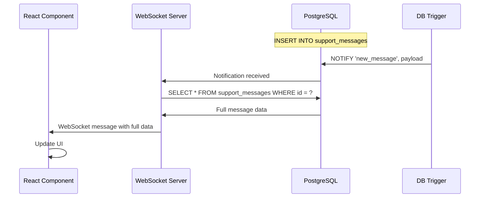
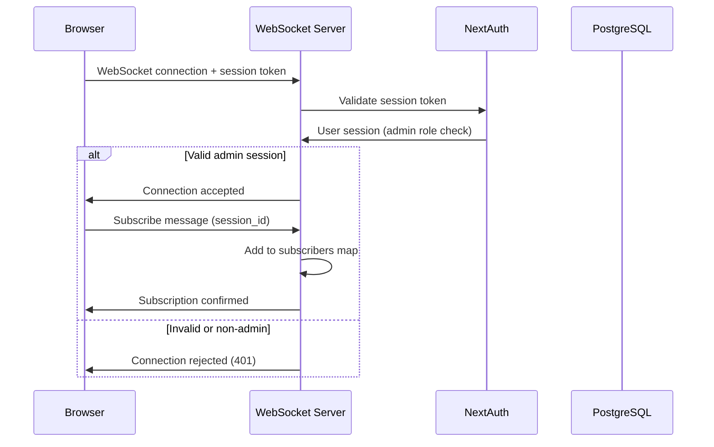
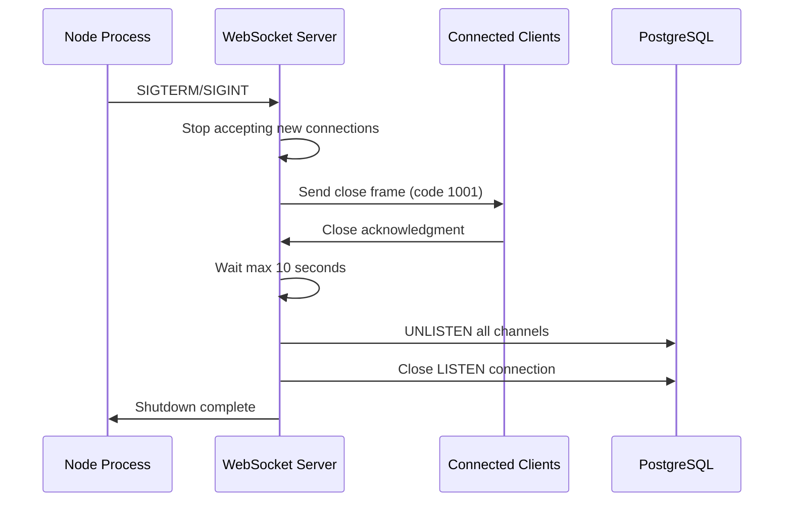

# Design Document: PostgreSQL Realtime Notifications

## Overview

### Цель

Заменить внешний Supabase Realtime сервис на нативный PostgreSQL LISTEN/NOTIFY механизм для real-time обновлений в админ-панели. Это устранит CSP (Content Security Policy) ошибки в браузере, уберёт зависимость от внешнего сервиса и обеспечит полный контроль над real-time коммуникацией.

### Контекст

Текущая реализация использует Supabase Realtime WebSocket сервер для получения уведомлений о новых сообщениях и изменениях статусов сессий. Это создаёт следующие проблемы:

- CSP ошибки из-за подключения к внешнему WebSocket серверу
- Зависимость от внешнего сервиса Supabase
- Дополнительная точка отказа в архитектуре
- Ограниченный контроль над конфигурацией и мониторингом

Новая реализация будет использовать:
- PostgreSQL LISTEN/NOTIFY для асинхронных уведомлений от базы данных
- Собственный WebSocket сервер на базе Next.js API Routes
- Database triggers для автоматической отправки уведомлений
- Полная обратная совместимость с существующим клиентским кодом

### Ключевые требования

1. Полная обратная совместимость API с существующим SupabaseRealtimeClient
2. Задержка доставки уведомлений < 500ms в 95% случаев
3. Поддержка минимум 100 одновременных WebSocket подключений
4. Graceful shutdown без потери данных
5. Автоматическое переподключение клиентов при разрыве соединения


## Architecture

### Общая архитектура системы

Система состоит из четырёх основных компонентов:

```
┌─────────────────────────────────────────────────────────────────┐
│                         Browser (Client)                         │
│  ┌────────────────────────────────────────────────────────────┐ │
│  │  PostgresRealtimeClient                                     │ │
│  │  - subscribeToSessionMessages()                             │ │
│  │  - subscribeToAllMessages()                                 │ │
│  │  - subscribeToSessionStatusChanges()                        │ │
│  │  - Auto-reconnect with exponential backoff                  │ │
│  └────────────────────────────────────────────────────────────┘ │
└─────────────────────────────────────────────────────────────────┘
                              │
                              │ WebSocket (wss://)
                              │ + NextAuth session token
                              ▼
┌─────────────────────────────────────────────────────────────────┐
│                    Next.js API Route                             │
│  ┌────────────────────────────────────────────────────────────┐ │
│  │  /api/realtime (WebSocket Handler)                          │ │
│  │  - Authentication & Authorization                           │ │
│  │  - Connection management                                    │ │
│  │  - Subscription management                                  │ │
│  │  - Heartbeat (ping/pong)                                    │ │
│  │  - Message routing to clients                               │ │
│  └────────────────────────────────────────────────────────────┘ │
└─────────────────────────────────────────────────────────────────┘
                              │
                              │ PostgreSQL LISTEN
                              │ (dedicated connection)
                              ▼
┌─────────────────────────────────────────────────────────────────┐
│                         PostgreSQL                               │
│  ┌────────────────────────────────────────────────────────────┐ │
│  │  Database Triggers                                          │ │
│  │  - trigger_notify_new_message                               │ │
│  │  - trigger_notify_session_status_change                     │ │
│  │  - trigger_notify_session_type_change                       │ │
│  └────────────────────────────────────────────────────────────┘ │
│  ┌────────────────────────────────────────────────────────────┐ │
│  │  Notification Channels                                      │ │
│  │  - new_message                                              │ │
│  │  - session_status_change                                    │ │
│  │  - session_type_change                                      │ │
│  └────────────────────────────────────────────────────────────┘ │
└─────────────────────────────────────────────────────────────────┘
```


### Поток данных

#### 1. Новое сообщение в базе данных



#### 2. Подключение клиента



#### 3. Graceful Shutdown




### Архитектурные решения

#### WebSocket в Next.js

Next.js не поддерживает WebSocket нативно в API Routes. Решение:

**Вариант 1: Использование Custom Server (выбран)**
- Создать custom server с Express/Fastify
- Интегрировать ws библиотеку для WebSocket
- Next.js работает как middleware в custom server
- Полный контроль над WebSocket lifecycle

**Вариант 2: Отдельный WebSocket сервер**
- Запустить отдельный Node.js процесс для WebSocket
- Требует дополнительной координации между процессами
- Усложняет deployment и мониторинг

Выбран Вариант 1 для простоты deployment и единой точки входа.

#### Управление подключениями PostgreSQL

**LISTEN Connection:**
- Выделенное долгоживущее подключение вне connection pool
- Автоматическое переподключение при разрыве (5 секунд задержка)
- Критическое логирование при 3+ последовательных разрывах

**Query Connection Pool:**
- Используется для загрузки полных данных сообщений/сессий
- Стандартный pg.Pool с настройками из существующего DatabaseClient
- Переиспользование существующей конфигурации

#### Фильтрация и роутинг уведомлений

Subscribers хранятся в Map структуре:

```typescript
// Подписки на конкретные сессии
sessionSubscribers: Map<number, Set<ClientConnection>>

// Подписки на все сообщения
allMessagesSubscribers: Set<ClientConnection>

// Подписки на изменения статусов
statusChangeSubscribers: Set<ClientConnection>
```

При получении уведомления от PostgreSQL:
1. Парсинг JSON payload для извлечения session_id
2. Загрузка полных данных из БД
3. Роутинг к релевантным подписчикам на основе session_id
4. Отправка через WebSocket с обработкой ошибок


## Components and Interfaces

### 1. Database Triggers (PostgreSQL)

#### trigger_notify_new_message

Триггер на таблице `support_messages` для события INSERT.

```sql
CREATE OR REPLACE FUNCTION notify_new_message()
RETURNS TRIGGER AS $$
DECLARE
    payload JSON;
BEGIN
    payload = json_build_object(
        'operation', TG_OP,
        'table', TG_TABLE_NAME,
        'session_id', NEW.session_id,
        'message_id', NEW.id,
        'data', row_to_json(NEW)
    );
    
    PERFORM pg_notify('new_message', payload::text);
    RETURN NEW;
END;
$$ LANGUAGE plpgsql;

CREATE TRIGGER trigger_notify_new_message
    AFTER INSERT ON support_messages
    FOR EACH ROW
    EXECUTE FUNCTION notify_new_message();
```

#### trigger_notify_session_status_change

Триггер на таблице `support_sessions` для события UPDATE (только при изменении status).

```sql
CREATE OR REPLACE FUNCTION notify_session_status_change()
RETURNS TRIGGER AS $$
DECLARE
    payload JSON;
BEGIN
    -- Отправляем уведомление только если статус изменился
    IF OLD.status IS DISTINCT FROM NEW.status THEN
        payload = json_build_object(
            'operation', TG_OP,
            'table', TG_TABLE_NAME,
            'session_id', NEW.id,
            'old_status', OLD.status,
            'new_status', NEW.status,
            'data', row_to_json(NEW)
        );
        
        PERFORM pg_notify('session_status_change', payload::text);
    END IF;
    
    RETURN NEW;
END;
$$ LANGUAGE plpgsql;

CREATE TRIGGER trigger_notify_session_status_change
    AFTER UPDATE ON support_sessions
    FOR EACH ROW
    EXECUTE FUNCTION notify_session_status_change();
```

#### trigger_notify_session_type_change

Триггер на таблице `support_sessions` для события UPDATE (только при изменении session_type).

```sql
CREATE OR REPLACE FUNCTION notify_session_type_change()
RETURNS TRIGGER AS $$
DECLARE
    payload JSON;
BEGIN
    -- Отправляем уведомление только если тип сессии изменился
    IF OLD.session_type IS DISTINCT FROM NEW.session_type THEN
        payload = json_build_object(
            'operation', TG_OP,
            'table', TG_TABLE_NAME,
            'session_id', NEW.id,
            'old_type', OLD.session_type,
            'new_type', NEW.session_type,
            'data', row_to_json(NEW)
        );
        
        PERFORM pg_notify('session_type_change', payload::text);
    END IF;
    
    RETURN NEW;
END;
$$ LANGUAGE plpgsql;

CREATE TRIGGER trigger_notify_session_type_change
    AFTER UPDATE ON support_sessions
    FOR EACH ROW
    EXECUTE FUNCTION notify_session_type_change();
```


### 2. WebSocket Server (Next.js Custom Server)

#### RealtimeWebSocketServer

Основной класс для управления WebSocket сервером.

```typescript
class RealtimeWebSocketServer {
  private wss: WebSocketServer;
  private pgListenClient: pg.Client;
  private pgPool: pg.Pool;
  private clients: Map<string, ClientConnection>;
  private sessionSubscribers: Map<number, Set<string>>;
  private allMessagesSubscribers: Set<string>;
  private statusChangeSubscribers: Set<string>;
  private isShuttingDown: boolean;
  
  constructor(server: http.Server, pgPool: pg.Pool);
  
  // Инициализация WebSocket сервера и PostgreSQL LISTEN
  async initialize(): Promise<void>;
  
  // Обработка нового WebSocket подключения
  private handleConnection(ws: WebSocket, request: http.IncomingMessage): Promise<void>;
  
  // Аутентификация клиента через NextAuth
  private async authenticateClient(request: http.IncomingMessage): Promise<Session | null>;
  
  // Обработка сообщений от клиента
  private handleClientMessage(clientId: string, message: ClientMessage): void;
  
  // Обработка уведомлений от PostgreSQL
  private handlePostgresNotification(channel: string, payload: string): Promise<void>;
  
  // Подписка клиента на сессию
  private subscribeToSession(clientId: string, sessionId: number): void;
  
  // Подписка клиента на все сообщения
  private subscribeToAllMessages(clientId: string): void;
  
  // Подписка клиента на изменения статусов
  private subscribeToStatusChanges(clientId: string): void;
  
  // Отписка клиента
  private unsubscribe(clientId: string, subscriptionId: string): void;
  
  // Отправка сообщения клиенту
  private sendToClient(clientId: string, message: ServerMessage): boolean;
  
  // Отправка сообщения всем подписчикам
  private broadcastToSubscribers(subscribers: Set<string>, message: ServerMessage): void;
  
  // Heartbeat механизм
  private startHeartbeat(): void;
  
  // Graceful shutdown
  async shutdown(): Promise<void>;
  
  // Переподключение к PostgreSQL LISTEN
  private async reconnectPostgresListen(): Promise<void>;
}
```

#### ClientConnection

Структура для хранения информации о подключённом клиенте.

```typescript
interface ClientConnection {
  id: string;                    // Уникальный ID клиента (UUID)
  ws: WebSocket;                 // WebSocket соединение
  userId: number;                // ID пользователя из NextAuth
  isAdmin: boolean;              // Флаг администратора
  subscriptions: Set<string>;    // Активные подписки
  lastPing: number;              // Timestamp последнего ping
  lastPong: number;              // Timestamp последнего pong
  connectedAt: number;           // Timestamp подключения
}
```


### 3. PostgresRealtimeClient (Browser)

Клиентский класс для подключения к WebSocket серверу. Полностью совместим с API SupabaseRealtimeClient.

```typescript
class PostgresRealtimeClient {
  private ws: WebSocket | null;
  private subscriptions: Map<string, Subscription>;
  private reconnectAttempts: number;
  private reconnectTimeout: NodeJS.Timeout | null;
  private heartbeatInterval: NodeJS.Timeout | null;
  private static instance: PostgresRealtimeClient | null;
  
  private constructor();
  
  // Singleton pattern
  static getInstance(): PostgresRealtimeClient;
  
  // Подключение к WebSocket серверу
  private connect(): Promise<void>;
  
  // Переподключение с экспоненциальной задержкой
  private reconnect(): void;
  
  // Подписка на сообщения конкретной сессии
  subscribeToSessionMessages(
    sessionId: number,
    onMessage: MessageCallback,
    onError?: ErrorCallback
  ): () => void;
  
  // Подписка на все сообщения
  subscribeToAllMessages(
    onMessage: MessageCallback,
    onError?: ErrorCallback
  ): () => void;
  
  // Подписка на изменения статусов сессий
  subscribeToSessionStatusChanges(
    onStatusChange: (sessionId: number, status: string) => void,
    onError?: ErrorCallback
  ): () => void;
  
  // Отписка от всех подписок
  async unsubscribeAll(): Promise<void>;
  
  // Обработка входящих сообщений от сервера
  private handleMessage(event: MessageEvent): void;
  
  // Отправка heartbeat ping
  private sendHeartbeat(): void;
  
  // Закрытие соединения
  private close(): void;
}
```

#### Subscription

Структура для хранения информации о подписке.

```typescript
interface Subscription {
  id: string;                    // Уникальный ID подписки
  type: 'session' | 'all' | 'status';
  sessionId?: number;            // Для подписок на конкретную сессию
  onMessage?: MessageCallback;
  onStatusChange?: (sessionId: number, status: string) => void;
  onError?: ErrorCallback;
  unsubscribe: () => void;       // Функция отписки
}
```


### 4. WebSocket Protocol

#### Client → Server Messages

```typescript
// Подписка на сообщения конкретной сессии
interface SubscribeSessionMessage {
  type: 'subscribe';
  channel: 'session_messages';
  sessionId: number;
  subscriptionId: string;
}

// Подписка на все сообщения
interface SubscribeAllMessage {
  type: 'subscribe';
  channel: 'all_messages';
  subscriptionId: string;
}

// Подписка на изменения статусов
interface SubscribeStatusMessage {
  type: 'subscribe';
  channel: 'status_changes';
  subscriptionId: string;
}

// Отписка
interface UnsubscribeMessage {
  type: 'unsubscribe';
  subscriptionId: string;
}

// Pong ответ на ping
interface PongMessage {
  type: 'pong';
  timestamp: number;
}

type ClientMessage = 
  | SubscribeSessionMessage 
  | SubscribeAllMessage 
  | SubscribeStatusMessage 
  | UnsubscribeMessage 
  | PongMessage;
```

#### Server → Client Messages

```typescript
// Подтверждение подписки
interface SubscriptionConfirmedMessage {
  type: 'subscription_confirmed';
  subscriptionId: string;
  channel: string;
}

// Новое сообщение
interface NewMessageNotification {
  type: 'new_message';
  data: SupportMessage;
}

// Изменение статуса сессии
interface StatusChangeNotification {
  type: 'status_change';
  sessionId: number;
  oldStatus: string;
  newStatus: string;
  data: SupportSession;
}

// Изменение типа сессии
interface TypeChangeNotification {
  type: 'type_change';
  sessionId: number;
  oldType: string;
  newType: string;
  data: SupportSession;
}

// Ошибка
interface ErrorMessage {
  type: 'error';
  code: string;
  message: string;
  subscriptionId?: string;
}

// Ping для heartbeat
interface PingMessage {
  type: 'ping';
  timestamp: number;
}

// Уведомление о закрытии
interface ClosingMessage {
  type: 'closing';
  reason: string;
}

type ServerMessage = 
  | SubscriptionConfirmedMessage 
  | NewMessageNotification 
  | StatusChangeNotification 
  | TypeChangeNotification 
  | ErrorMessage 
  | PingMessage 
  | ClosingMessage;
```


## Data Models

### PostgreSQL Notification Payload

Структура JSON payload, отправляемого через NOTIFY:

```typescript
// Payload для new_message канала
interface NewMessagePayload {
  operation: 'INSERT';
  table: 'support_messages';
  session_id: number;
  message_id: number;
  data: {
    id: number;
    session_id: number;
    telegram_id: number;
    message_type: 'from_user' | 'from_support' | 'from_bot';
    message_text: string;
    file_id?: string;
    created_at: string;
    delivered: boolean;
  };
}

// Payload для session_status_change канала
interface SessionStatusChangePayload {
  operation: 'UPDATE';
  table: 'support_sessions';
  session_id: number;
  old_status: 'active' | 'closed';
  new_status: 'active' | 'closed';
  data: {
    id: number;
    telegram_id: number;
    status: 'active' | 'closed';
    session_type: 'chat' | 'support';
    created_at: string;
    closed_at?: string;
  };
}

// Payload для session_type_change канала
interface SessionTypeChangePayload {
  operation: 'UPDATE';
  table: 'support_sessions';
  session_id: number;
  old_type: 'chat' | 'support';
  new_type: 'chat' | 'support';
  data: {
    id: number;
    telegram_id: number;
    status: 'active' | 'closed';
    session_type: 'chat' | 'support';
    created_at: string;
    closed_at?: string;
  };
}
```

### Server State

Внутреннее состояние WebSocket сервера:

```typescript
interface ServerState {
  // Все подключённые клиенты
  clients: Map<string, ClientConnection>;
  
  // Подписки на конкретные сессии: session_id -> Set<client_id>
  sessionSubscribers: Map<number, Set<string>>;
  
  // Подписки на все сообщения
  allMessagesSubscribers: Set<string>;
  
  // Подписки на изменения статусов
  statusChangeSubscribers: Set<string>;
  
  // PostgreSQL LISTEN соединение
  pgListenClient: pg.Client | null;
  
  // Connection pool для запросов
  pgPool: pg.Pool;
  
  // Флаг graceful shutdown
  isShuttingDown: boolean;
  
  // Счётчик попыток переподключения к PostgreSQL
  pgReconnectAttempts: number;
  
  // Метрики
  metrics: {
    totalConnections: number;
    activeConnections: number;
    totalNotifications: number;
    totalErrors: number;
    lastNotificationAt: number;
  };
}
```


### Client State

Внутреннее состояние клиента в браузере:

```typescript
interface ClientState {
  // WebSocket соединение
  ws: WebSocket | null;
  
  // Статус подключения
  connectionState: 'disconnected' | 'connecting' | 'connected' | 'reconnecting';
  
  // Активные подписки: subscription_id -> Subscription
  subscriptions: Map<string, Subscription>;
  
  // Счётчик попыток переподключения
  reconnectAttempts: number;
  
  // Таймер переподключения
  reconnectTimeout: NodeJS.Timeout | null;
  
  // Интервал heartbeat
  heartbeatInterval: NodeJS.Timeout | null;
  
  // Timestamp последнего полученного pong
  lastPongAt: number;
  
  // Очередь сообщений для отправки после переподключения
  messageQueue: ClientMessage[];
}
```

### Configuration

Конфигурация для WebSocket сервера и клиента:

```typescript
// Серверная конфигурация
interface ServerConfig {
  // Порт для WebSocket сервера (если отличается от Next.js)
  port?: number;
  
  // Интервал heartbeat ping (мс)
  heartbeatInterval: number; // default: 30000
  
  // Timeout для pong ответа (мс)
  heartbeatTimeout: number; // default: 60000
  
  // Задержка переподключения к PostgreSQL (мс)
  pgReconnectDelay: number; // default: 5000
  
  // Максимальное количество последовательных ошибок PostgreSQL
  pgMaxReconnectAttempts: number; // default: 3
  
  // Timeout для graceful shutdown (мс)
  shutdownTimeout: number; // default: 10000
  
  // PostgreSQL connection string
  databaseUrl: string;
}

// Клиентская конфигурация
interface ClientConfig {
  // URL WebSocket сервера
  wsUrl: string; // default: ws://localhost:3000/api/realtime
  
  // Начальная задержка переподключения (мс)
  reconnectDelay: number; // default: 1000
  
  // Максимальная задержка переподключения (мс)
  maxReconnectDelay: number; // default: 30000
  
  // Множитель для экспоненциальной задержки
  reconnectBackoffMultiplier: number; // default: 2
  
  // Интервал heartbeat (мс)
  heartbeatInterval: number; // default: 30000
}
```


## Correctness Properties

*A property is a characteristic or behavior that should hold true across all valid executions of a system-essentially, a formal statement about what the system should do. Properties serve as the bridge between human-readable specifications and machine-verifiable correctness guarantees.*

### Property 1: Database trigger notification round-trip

*For any* INSERT or UPDATE operation on support_messages or support_sessions tables, the notification payload received through LISTEN should contain data that matches the inserted/updated record.

**Validates: Requirements 1.1, 1.2, 1.3**

### Property 2: Notification payload JSON structure

*For any* notification sent through PostgreSQL NOTIFY, the payload should be valid JSON containing fields: operation, table, session_id, and data with the complete record.

**Validates: Requirements 1.4**

### Property 3: WebSocket authentication enforcement

*For any* WebSocket connection attempt, if the session token is missing or invalid, the connection should be rejected with code 401.

**Validates: Requirements 2.2, 8.1, 8.2**

### Property 4: Session-specific subscription filtering

*For any* client subscribed to a specific session_id, that client should receive notifications only for messages and changes related to that session_id, and not for other sessions.

**Validates: Requirements 2.3, 4.1**

### Property 5: All-messages subscription completeness

*For any* client subscribed to all messages, that client should receive notifications for new messages from all sessions without filtering.

**Validates: Requirements 2.4, 4.2**

### Property 6: Subscription cleanup on disconnect

*For any* WebSocket connection that closes, all subscriptions associated with that client should be automatically removed from the server's subscription maps.

**Validates: Requirements 2.6**

### Property 7: Heartbeat ping interval

*For any* active WebSocket connection, the server should send ping messages at intervals of 30 seconds (±5 seconds tolerance).

**Validates: Requirements 2.7**

### Property 8: Notification data enrichment round-trip

*For any* notification received from PostgreSQL LISTEN, when the server loads full data from the database, the loaded data should match the data in the original INSERT/UPDATE operation.

**Validates: Requirements 3.4, 3.5**

### Property 9: Notification routing to subscribers

*For any* notification about a specific session, all clients subscribed to that session (or to all messages) should receive the notification, and no other clients should receive it.

**Validates: Requirements 3.6, 4.3, 4.4**

### Property 10: Multiple subscriptions per client

*For any* client with subscriptions to multiple different sessions, that client should receive notifications for all subscribed sessions independently.

**Validates: Requirements 4.5**

### Property 11: Client subscription message sending

*For any* subscription method call on the client, if the WebSocket connection is established, a subscribe message with correct parameters should be sent to the server.

**Validates: Requirements 5.4, 5.5**

### Property 12: Client callback invocation

*For any* notification received by the client from the server, the appropriate callback (onMessage or onStatusChange) should be invoked with the notification data.

**Validates: Requirements 5.6**

### Property 13: Client reconnection exponential backoff

*For any* sequence of connection failures, the reconnection delays should follow exponential backoff: 1s, 2s, 4s, 8s, 16s, capped at 30s maximum.

**Validates: Requirements 5.7**

### Property 14: Unsubscribe message sending

*For any* subscription, when the unsubscribe function is called, an unsubscribe message should be sent to the server with the correct subscription ID.

**Validates: Requirements 2.5, 5.8**

### Property 15: Client data transformation consistency

*For any* message data received from the server, the transformed SupportMessage object should contain all required fields (id, session_id, telegram_id, message_type, message_text, created_at, delivered) with correct types.

**Validates: Requirements 6.4**

### Property 16: PostgreSQL LISTEN reconnection

*For any* disconnection of the PostgreSQL LISTEN connection, the server should attempt to reconnect after a 5-second delay.

**Validates: Requirements 7.2**

### Property 17: Admin role authorization

*For any* authenticated user attempting to connect via WebSocket, if the user does not have admin role, the connection should be rejected.

**Validates: Requirements 8.4**

### Property 18: Comprehensive event logging

*For any* significant event (connection, disconnection, notification, error), a log entry should be created containing relevant context (timestamp, client_id, user_id, event type, details).

**Validates: Requirements 7.5, 8.5, 9.1, 9.2, 9.3, 9.5**

### Property 19: Metrics accuracy

*For any* sequence of connections, disconnections, and notifications, the server metrics (activeConnections, totalNotifications, totalErrors) should accurately reflect the actual counts.

**Validates: Requirements 9.6**

### Property 20: Graceful shutdown connection closure

*For any* graceful shutdown initiated by SIGTERM/SIGINT, all connected clients should receive a close frame with code 1001, and the server should wait up to 10 seconds for clean disconnection.

**Validates: Requirements 10.2, 10.3, 10.4**

### Property 21: Graceful shutdown PostgreSQL cleanup

*For any* graceful shutdown, after all clients disconnect (or timeout expires), the PostgreSQL LISTEN connection should be properly closed with UNLISTEN commands.

**Validates: Requirements 10.5**

### Property 22: End-to-end latency

*For any* message inserted into the database, 95% of notifications should be delivered to subscribed clients within 500ms.

**Validates: Requirements 12.1**

### Property 23: Concurrent connection capacity

*For any* load test with 100 simultaneous WebSocket connections, all connections should remain stable and responsive without errors or disconnections.

**Validates: Requirements 12.2**

### Property 24: Notification throughput

*For any* load test generating 1000 notifications per second, all notifications should be delivered to subscribed clients without loss.

**Validates: Requirements 12.3**

### Property 25: Feature flag switching

*For any* configuration with feature flag enabled/disabled, the correct Realtime client implementation (PostgreSQL or Supabase) should be used by the Admin Panel.

**Validates: Requirements 13.3**


## Error Handling

### Database Trigger Errors

**Scenario:** Ошибка при формировании JSON payload в триггере

**Handling:**
- Триггер должен использовать EXCEPTION блок для перехвата ошибок
- Логировать ошибку в PostgreSQL logs
- Возвращать NEW/OLD для продолжения операции INSERT/UPDATE
- Не блокировать основную операцию из-за ошибки уведомления

```sql
BEGIN
    -- trigger logic
EXCEPTION
    WHEN OTHERS THEN
        RAISE WARNING 'Failed to send notification: %', SQLERRM;
        RETURN NEW; -- или OLD для DELETE
END;
```

### WebSocket Server Errors

**Scenario:** Ошибка при подключении к PostgreSQL LISTEN

**Handling:**
- Логировать ошибку с уровнем ERROR
- Запустить таймер переподключения (5 секунд)
- После 3 последовательных неудач - логировать CRITICAL
- Продолжать попытки переподключения бесконечно
- WebSocket сервер продолжает работать, но уведомления не доставляются

**Scenario:** Ошибка при загрузке данных из БД после получения уведомления

**Handling:**
- Логировать ошибку с session_id и message_id
- Пропустить это уведомление (не отправлять клиентам)
- Продолжить обработку следующих уведомлений
- Клиенты могут получить данные через polling API

**Scenario:** Ошибка при отправке сообщения клиенту через WebSocket

**Handling:**
- Логировать ошибку с client_id
- Проверить состояние WebSocket соединения
- Если соединение закрыто - удалить клиента из подписчиков
- Если соединение активно - попробовать отправить ещё раз (1 retry)
- После неудачи - закрыть соединение с клиентом

**Scenario:** Ошибка парсинга JSON payload от PostgreSQL

**Handling:**
- Логировать ошибку с raw payload
- Пропустить это уведомление
- Продолжить обработку следующих уведомлений

### Client Errors

**Scenario:** Ошибка подключения к WebSocket серверу

**Handling:**
- Вызвать onError callback для всех активных подписок
- Запустить процесс переподключения с экспоненциальной задержкой
- Сохранить подписки для восстановления после переподключения
- Показать пользователю индикатор "Переподключение..."

**Scenario:** Неожиданное закрытие WebSocket соединения

**Handling:**
- Определить причину закрытия по close code
- Если code 1000 (normal) - не переподключаться
- Если code 1001 (going away) - переподключиться через 5 секунд
- Если code 1006 (abnormal) - переподключиться немедленно
- Для других кодов - использовать экспоненциальную задержку

**Scenario:** Timeout при ожидании pong от сервера

**Handling:**
- Закрыть WebSocket соединение
- Запустить процесс переподключения
- Логировать событие в консоль

**Scenario:** Ошибка парсинга сообщения от сервера

**Handling:**
- Логировать ошибку с raw message
- Вызвать onError callback с описанием ошибки
- Продолжить обработку следующих сообщений
- Не закрывать соединение

### Authentication Errors

**Scenario:** Отсутствие session token при подключении

**Handling:**
- Отклонить WebSocket подключение с code 401
- Отправить error message: "Authentication required"
- Логировать попытку подключения без токена

**Scenario:** Невалидный или истёкший session token

**Handling:**
- Отклонить WebSocket подключение с code 401
- Отправить error message: "Invalid or expired session"
- Логировать попытку с user_id (если доступен)

**Scenario:** Пользователь не является администратором

**Handling:**
- Отклонить WebSocket подключение с code 403
- Отправить error message: "Admin access required"
- Логировать попытку с user_id


## Testing Strategy

### Dual Testing Approach

Система будет тестироваться с использованием двух комплементарных подходов:

**Unit Tests:**
- Проверка конкретных примеров и edge cases
- Тестирование интеграционных точек между компонентами
- Проверка обработки ошибок и граничных условий
- Быстрое выполнение для CI/CD pipeline

**Property-Based Tests:**
- Проверка универсальных свойств на множестве сгенерированных входных данных
- Comprehensive coverage через рандомизацию
- Выявление edge cases, которые сложно предусмотреть вручную
- Минимум 100 итераций на каждый property test

Оба подхода необходимы: unit tests ловят конкретные баги, property tests проверяют общую корректность.

### Property-Based Testing Library

**Выбор:** fast-check для TypeScript/JavaScript

**Обоснование:**
- Нативная поддержка TypeScript
- Богатая библиотека генераторов (arbitrary)
- Shrinking для минимизации failing examples
- Интеграция с Vitest

**Конфигурация:**
```typescript
import fc from 'fast-check';

// Минимум 100 итераций для каждого property test
fc.assert(
  fc.property(/* ... */),
  { numRuns: 100 }
);
```

### Test Organization

```
nextjs-app/
├── __tests__/
│   ├── realtime/
│   │   ├── triggers.unit.test.ts          # Unit тесты для триггеров
│   │   ├── triggers.property.test.ts      # Property тесты для триггеров
│   │   ├── websocket-server.unit.test.ts  # Unit тесты для сервера
│   │   ├── websocket-server.property.test.ts
│   │   ├── client.unit.test.ts            # Unit тесты для клиента
│   │   ├── client.property.test.ts
│   │   ├── integration.test.ts            # End-to-end интеграционные тесты
│   │   ├── performance.test.ts            # Performance и load тесты
│   │   └── migration.test.ts              # Тесты миграции
```

### Property Test Tags

Каждый property test должен содержать комментарий с ссылкой на design property:

```typescript
/**
 * Feature: postgres-realtime-notifications
 * Property 1: Database trigger notification round-trip
 * 
 * For any INSERT or UPDATE operation on support_messages or support_sessions tables,
 * the notification payload received through LISTEN should contain data that matches
 * the inserted/updated record.
 */
test('database trigger notification round-trip', async () => {
  await fc.assert(
    fc.asyncProperty(
      arbitrarySupportMessage(),
      async (message) => {
        // Test implementation
      }
    ),
    { numRuns: 100 }
  );
});
```


### Test Coverage by Requirement

#### Requirement 1: Database Triggers

**Unit Tests:**
- Проверка формирования JSON payload для INSERT на support_messages
- Проверка формирования JSON payload для UPDATE на support_sessions (status)
- Проверка формирования JSON payload для UPDATE на support_sessions (session_type)
- Проверка использования OLD записи для DELETE операций
- Проверка обработки NULL значений в полях

**Property Tests:**
- Property 1: Round-trip для любых INSERT/UPDATE операций
- Property 2: Валидность JSON структуры для любых уведомлений

#### Requirement 2: WebSocket Server для клиентских подключений

**Unit Tests:**
- Подключение клиента с валидным токеном
- Отклонение подключения с невалидным токеном
- Подписка на конкретную сессию
- Подписка на все сообщения
- Отписка от канала
- Автоматическая очистка при закрытии соединения
- Отправка ping каждые 30 секунд
- Закрытие соединения при timeout pong

**Property Tests:**
- Property 3: Аутентификация для любых токенов
- Property 4: Фильтрация для любых session_id
- Property 5: Доставка всех сообщений при подписке на все
- Property 6: Очистка подписок при любом отключении
- Property 7: Интервал ping для любого соединения

#### Requirement 3: PostgreSQL LISTEN подписка

**Unit Tests:**
- Создание выделенного LISTEN подключения при старте
- Выполнение LISTEN для всех трёх каналов
- Парсинг JSON payload
- Загрузка данных сообщения из БД
- Загрузка данных сессии из БД
- Обработка ошибки загрузки данных

**Property Tests:**
- Property 8: Round-trip загрузки данных для любых уведомлений
- Property 9: Роутинг к подписчикам для любых session_id

#### Requirement 4: Фильтрация уведомлений

**Unit Tests:**
- Отправка уведомления только подписанным клиентам
- Отправка уведомления о статусе всем подписчикам сессии
- Отправка уведомления о типе всем подписчикам сессии

**Property Tests:**
- Property 4: Фильтрация по session_id для любых клиентов
- Property 5: Доставка всех для подписки на все
- Property 9: Роутинг для любых комбинаций подписчиков
- Property 10: Множественные подписки для любого клиента

#### Requirement 5: Realtime Client в браузере

**Unit Tests:**
- Вызов subscribeToSessionMessages устанавливает соединение
- Вызов subscribeToAllMessages устанавливает соединение
- Вызов subscribeToSessionStatusChanges устанавливает соединение
- Получение уведомления вызывает callback
- Функция отписки отправляет unsubscribe
- Ошибка подключения вызывает onError

**Property Tests:**
- Property 11: Отправка subscribe для любых подписок
- Property 12: Вызов callback для любых уведомлений
- Property 13: Экспоненциальная задержка для любых разрывов
- Property 14: Отправка unsubscribe для любых отписок
- Property 15: Трансформация данных для любых сообщений

#### Requirement 6: Обратная совместимость

**Unit Tests:**
- Экспорт из правильного модуля
- Наличие метода getInstance()
- Наличие метода unsubscribeAll()
- Совместимость типов SupportMessage
- Совместимость обработки ошибок
- Совместимость логирования

**Property Tests:**
- Property 15: Трансформация данных совместима с текущей реализацией

#### Requirement 7: Управление подключениями PostgreSQL

**Unit Tests:**
- Отдельное подключение для LISTEN
- Переподключение при разрыве
- Закрытие при остановке сервера
- Использование pool для запросов
- Логирование событий подключения
- Критическое логирование после 3 разрывов

**Property Tests:**
- Property 16: Переподключение для любых разрывов

#### Requirement 8: Безопасность и аутентификация

**Unit Tests:**
- Проверка session token в cookies
- Проверка session token в query параметрах
- Отклонение без токена (401)
- Отклонение с невалидным токеном (401)
- Использование NextAuth для валидации
- Проверка роли администратора (403)
- Логирование попыток подключения

**Property Tests:**
- Property 3: Аутентификация для любых токенов
- Property 17: Авторизация админа для любых пользователей

#### Requirement 9: Мониторинг и логирование

**Unit Tests:**
- Логирование подключения с timestamp, client_id, user_id
- Логирование отключения с причиной
- Логирование уведомлений с типом и session_id
- Периодическое логирование количества подключений
- Логирование ошибок отправки
- Предоставление метрик

**Property Tests:**
- Property 18: Логирование для любых событий
- Property 19: Точность метрик для любых последовательностей событий

#### Requirement 10: Graceful Shutdown

**Unit Tests:**
- Обработка SIGTERM
- Обработка SIGINT
- Прекращение приёма новых подключений
- Отправка close всем клиентам
- Ожидание 10 секунд
- Закрытие PostgreSQL подключения
- Логирование завершения

**Property Tests:**
- Property 20: Закрытие соединений для любого количества клиентов
- Property 21: Очистка PostgreSQL для любого shutdown

#### Requirement 11: Тестирование и надёжность

Это мета-требование о наличии тестов, покрывается всеми вышеперечисленными тестами.

#### Requirement 12: Производительность

**Performance Tests:**
- Измерение latency для 1000 сообщений (проверка 95 перцентиля < 500ms)
- Load test с 100 одновременными подключениями
- Throughput test с 1000 уведомлений/сек
- Измерение времени выполнения триггера
- Измерение использования памяти клиентом

**Property Tests:**
- Property 22: Latency для любых сообщений
- Property 23: Стабильность при любой нагрузке 100 клиентов
- Property 24: Throughput для любых последовательностей уведомлений

#### Requirement 13: Миграция с Supabase

**Migration Tests:**
- Применение SQL скрипта миграции
- Проверка работы триггеров после миграции
- Переключение через feature flag
- Rollback к Supabase

**Property Tests:**
- Property 25: Переключение реализации для любого состояния feature flag

### Test Execution

**CI/CD Pipeline:**
```bash
# Unit tests (быстрые)
npm run test:unit

# Property tests (медленные, 100+ итераций)
npm run test:property

# Integration tests (требуют PostgreSQL)
npm run test:integration

# Performance tests (требуют production-like окружение)
npm run test:performance

# Все тесты
npm run test:all
```

**Local Development:**
```bash
# Watch mode для unit tests
npm run test:watch

# Конкретный property test с verbose output
npm run test:property -- triggers.property.test.ts --verbose
```

