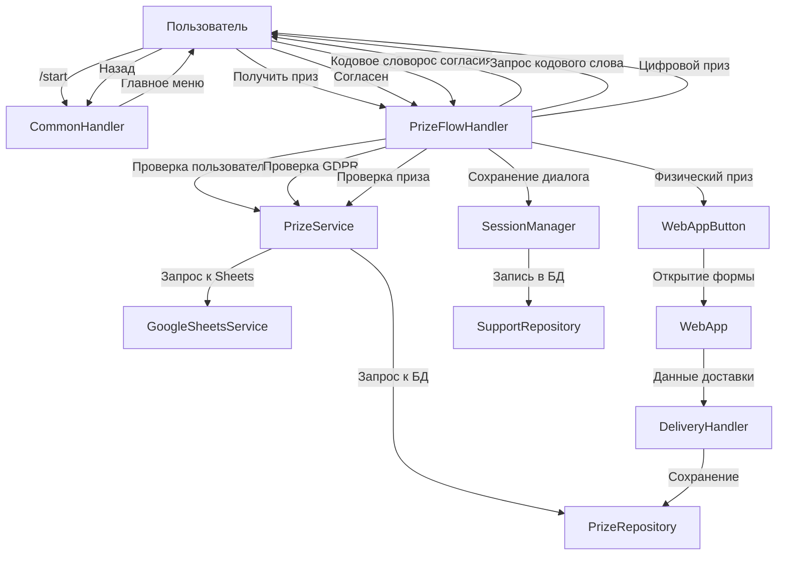
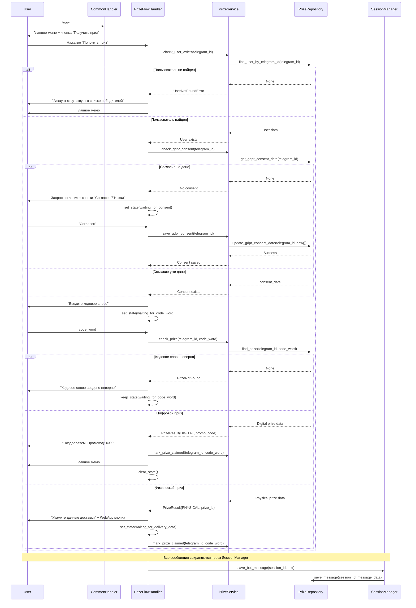

# Design Document: Prize Flow Update

## Overview

Данный документ описывает техническое проектирование обновления логики получения призов в Telegram боте. Новая реализация добавляет главное меню, проверку согласия на обработку персональных данных (GDPR), улучшенное управление состояниями через FSM и более структурированный процесс получения призов.

### Цели дизайна

1. **Улучшение UX**: Добавление главного меню с понятным описанием функций
2. **Соответствие GDPR**: Запрос и сохранение согласия на обработку персональных данных
3. **Управление состояниями**: Использование FSM для контроля процесса получения приза
4. **Модульность**: Разделение логики на независимые компоненты
5. **Интеграция**: Сохранение совместимости с существующей архитектурой

### Ключевые изменения

- Новый handler `PrizeFlowHandler` для управления процессом получения приза
- Новые FSM состояния в `PrizeFlowStates` для управления диалогом
- Обновление `CommonHandler` для отображения главного меню
- Расширение `PrizeService` для проверки пользователя и согласия GDPR
- Добавление поля `gdpr_consent_date` в таблицу `prizes`
- Новые клавиатуры для главного меню и кнопок согласия

## Architecture

### High-Level Architecture




### Component Interaction Flow




### Architectural Principles

1. **Separation of Concerns**: Каждый компонент отвечает за свою область
   - `CommonHandler`: Общие команды и главное меню
   - `PrizeFlowHandler`: Процесс получения приза
   - `PrizeService`: Бизнес-логика работы с призами
   - `PrizeRepository`: Доступ к данным призов

2. **FSM State Management**: Использование aiogram FSM для управления состояниями диалога
   - Чёткие переходы между состояниями
   - Валидация входных данных в зависимости от состояния
   - Автоматический сброс состояния при завершении флоу

3. **Error Handling**: Обработка ошибок на каждом уровне
   - Graceful degradation при недоступности БД
   - Понятные сообщения об ошибках для пользователя
   - Логирование всех ошибок с контекстом

4. **Integration**: Использование существующих сервисов
   - `PrizeService` для проверки призов
   - `SessionManager` для сохранения диалогов
   - `GoogleSheetsService` для синхронизации с таблицами

## Components and Interfaces

### 1. FSM States (fsm/states.py)


**Новые состояния для Prize Flow:**

```python
class PrizeFlowStates(StatesGroup):
    """
    Состояния для процесса получения приза.
    
    Управляет диалогом от нажатия кнопки "Получить приз" 
    до выдачи промокода или заполнения формы доставки.
    """
    waiting_for_consent = State()      # Ожидание согласия на обработку данных
    waiting_for_code_word = State()    # Ожидание ввода кодового слова
    waiting_for_delivery_data = State() # Ожидание данных доставки из WebApp
```

**State Transitions:**

```
default_state 
    → waiting_for_consent (при отсутствии GDPR согласия)
    → waiting_for_code_word (при наличии GDPR согласия)

waiting_for_consent
    → waiting_for_code_word (при нажатии "Согласен")
    → default_state (при нажатии "Назад")

waiting_for_code_word
    → waiting_for_delivery_data (при верном кодовом слове для физического приза)
    → default_state (при верном кодовом слове для цифрового приза)
    → waiting_for_code_word (при неверном кодовом слове - остаётся в состоянии)

waiting_for_delivery_data
    → default_state (при получении данных из WebApp)
```

### 2. PrizeFlowHandler (handlers/prize_flow_handler.py)

**Назначение:** Управление процессом получения приза от нажатия кнопки до выдачи.

**Зависимости:**
- `PrizeService`: Проверка пользователя, GDPR согласия, призов
- `SessionManager`: Сохранение истории диалога
- `FSMContext`: Управление состояниями

**Основные методы:**

```python
class PrizeFlowHandler:
    """Обработчик процесса получения приза"""
    
    async def start_prize_flow(
        self, 
        message: Message, 
        state: FSMContext,
        session_id: Optional[int] = None
    ) -> None:
        """
        Начинает процесс получения приза.
        
        Validates: Requirements 2.1, 2.3, 2.4, 2.6
        
        Логика:
        1. Проверяет наличие пользователя в Prize_Table
        2. Если не найден - отправляет сообщение и главное меню
        3. Если найден - проверяет GDPR согласие
        4. Если согласия нет - запрашивает согласие
        5. Если согласие есть - запрашивает кодовое слово
        """
        pass
    
    async def handle_consent_response(
        self,
        message: Message,
        state: FSMContext,
        session_id: Optional[int] = None
    ) -> None:
        """
        Обрабатывает ответ на запрос согласия GDPR.
        
        Validates: Requirements 3.3, 3.4, 8.2, 8.3, 8.4
        
        Логика:
        1. Если "Согласен" - сохраняет согласие и запрашивает кодовое слово
        2. Если "Назад" - отображает главное меню и сбрасывает состояние
        """
        pass
    
    async def handle_code_word_input(
        self,
        message: Message,
        state: FSMContext,
        session_id: Optional[int] = None
    ) -> None:
        """
        Обрабатывает ввод кодового слова.
        
        Validates: Requirements 5.3, 5.4, 5.5, 5.6, 5.7
        
        Логика:
        1. Проверяет кодовое слово через PrizeService
        2. Если неверно - отправляет сообщение об ошибке, остаётся в состоянии
        3. Если верно и цифровой приз - выдаёт промокод
        4. Если верно и физический приз - отправляет WebApp кнопку
        """
        pass
    
    async def _send_digital_prize(
        self,
        message: Message,
        prize_result: PrizeResult,
        state: FSMContext,
        session_id: Optional[int] = None
    ) -> None:
        """
        Выдаёт цифровой приз (промокод).
        
        Validates: Requirements 6.1, 6.2, 6.3, 6.4, 6.5
        
        Логика:
        1. Отправляет поздравление с промокодом
        2. Отправляет инструкцию по использованию
        3. Отмечает приз как полученный (claimed_at)
        4. Отображает главное меню
        5. Сбрасывает FSM состояние
        """
        pass
    
    async def _send_physical_prize_form(
        self,
        message: Message,
        prize_result: PrizeResult,
        state: FSMContext,
        session_id: Optional[int] = None
    ) -> None:
        """
        Отправляет форму для физического приза.
        
        Validates: Requirements 7.1, 7.2, 7.3
        
        Логика:
        1. Отправляет инструкцию по заполнению формы
        2. Отправляет WebApp кнопку с prize_id
        3. Устанавливает состояние waiting_for_delivery_data
        4. Отмечает приз как полученный (claimed_at)
        """
        pass
```

### 3. CommonHandler Updates (handlers/common_handler.py)

**Изменения:**

```python
class CommonHandler:
    """Обработчик общих команд"""
    
    async def handle_start(
        self, 
        message: Message, 
        session_id: Optional[int] = None
    ) -> None:
        """
        Обрабатывает команду /start.
        
        Validates: Requirements 1.1, 1.2, 1.3, 1.4
        
        Изменения:
        - Добавлено отображение главного меню
        - Добавлена кнопка "Получить приз"
        - Текст не содержит слово "бот"
        """
        welcome_text = (
            f"Привет, {username}! 👋\n\n"
            "Здесь вы можете проверить, выиграли ли вы приз в розыгрыше.\n\n"
            "Нажмите кнопку ниже, чтобы начать."
        )
        
        keyboard = get_main_menu_keyboard()
        await message.answer(welcome_text, reply_markup=keyboard)
```

### 4. PrizeService Extensions (services/prize_service.py)

**Новые методы:**

```python
class PrizeService:
    """Сервис для работы с призами"""
    
    async def check_user_exists(self, telegram_id: int) -> bool:
        """
        Проверяет наличие пользователя в таблице призов.
        
        Validates: Requirements 2.1, 2.2
        
        Args:
            telegram_id: Telegram ID пользователя
            
        Returns:
            True если пользователь найден, False иначе
            
        Raises:
            DatabaseUnavailableError: Если БД недоступна
        """
        pass
    
    async def check_gdpr_consent(self, telegram_id: int) -> bool:
        """
        Проверяет наличие GDPR согласия у пользователя.
        
        Validates: Requirements 3.1
        
        Args:
            telegram_id: Telegram ID пользователя
            
        Returns:
            True если согласие дано, False иначе
            
        Raises:
            DatabaseUnavailableError: Если БД недоступна
        """
        pass
    
    async def save_gdpr_consent(self, telegram_id: int) -> None:
        """
        Сохраняет GDPR согласие пользователя.
        
        Validates: Requirements 3.3
        
        Args:
            telegram_id: Telegram ID пользователя
            
        Raises:
            DatabaseUnavailableError: Если БД недоступна
        """
        pass
    
    async def validate_code_word(
        self, 
        telegram_id: int, 
        code_word: str
    ) -> bool:
        """
        Проверяет корректность кодового слова для пользователя.
        
        Validates: Requirements 5.3
        
        Args:
            telegram_id: Telegram ID пользователя
            code_word: Кодовое слово для проверки
            
        Returns:
            True если кодовое слово верно, False иначе
            
        Raises:
            DatabaseUnavailableError: Если БД недоступна
        """
        pass
```

### 5. Keyboard Layouts (keyboards/reply_keyboards.py)

**Новый модуль для клавиатур:**

```python
from aiogram.types import ReplyKeyboardMarkup, KeyboardButton

def get_main_menu_keyboard() -> ReplyKeyboardMarkup:
    """
    Создаёт клавиатуру главного меню.
    
    Validates: Requirements 1.2
    
    Returns:
        Клавиатура с кнопкой "Получить приз"
    """
    keyboard = ReplyKeyboardMarkup(
        keyboard=[
            [KeyboardButton(text="🎁 Получить приз")]
        ],
        resize_keyboard=True,
        one_time_keyboard=False
    )
    return keyboard

def get_consent_keyboard() -> ReplyKeyboardMarkup:
    """
    Создаёт клавиатуру для запроса GDPR согласия.
    
    Validates: Requirements 3.2, 8.1
    
    Returns:
        Клавиатура с кнопками "Согласен" и "Назад"
    """
    keyboard = ReplyKeyboardMarkup(
        keyboard=[
            [KeyboardButton(text="✅ Согласен")],
            [KeyboardButton(text="◀️ Назад")]
        ],
        resize_keyboard=True,
        one_time_keyboard=True
    )
    return keyboard

def remove_keyboard() -> ReplyKeyboardRemove:
    """
    Удаляет клавиатуру.
    
    Returns:
        Объект для удаления клавиатуры
    """
    from aiogram.types import ReplyKeyboardRemove
    return ReplyKeyboardRemove()
```

### 6. DeliveryHandler Updates (handlers/delivery_handler.py)

**Изменения для интеграции с Prize Flow:**

```python
class DeliveryHandler:
    """Обработчик данных доставки из WebApp"""
    
    async def handle_delivery_data(
        self,
        message: Message,
        session_id: Optional[int] = None
    ) -> None:
        """
        Обрабатывает данные доставки из WebApp.
        
        Validates: Requirements 7.8, 7.9, 7.10, 7.11
        
        Изменения:
        - Добавлено отображение главного меню после сохранения
        - Добавлен сброс FSM состояния
        """
        # ... существующая логика сохранения ...
        
        # Новое: отображение главного меню
        keyboard = get_main_menu_keyboard()
        await message.answer(
            "✅ Данные доставки сохранены! Ваш приз будет отправлен в ближайшее время.",
            reply_markup=keyboard
        )
        
        # Новое: сброс FSM состояния
        state = FSMContext(...)
        await state.clear()
```

## Data Models

### Database Schema Changes

**Таблица `prizes` - добавление поля GDPR согласия:**

```sql
ALTER TABLE prizes 
ADD COLUMN gdpr_consent_date TIMESTAMP WITH TIME ZONE;

CREATE INDEX idx_prizes_gdpr_consent ON prizes(telegram_id, gdpr_consent_date);
```

**Модель Prize (database/models/prize.py):**

```python
class Prize(Base):
    """Модель приза из Google Sheets"""
    __tablename__ = 'prizes'
    
    # ... существующие поля ...
    
    # Новое поле: дата согласия на обработку персональных данных
    gdpr_consent_date: Mapped[Optional[datetime]] = mapped_column(
        DateTime(timezone=True),
        nullable=True,
        comment="Дата и время согласия на обработку персональных данных"
    )
    
    def has_gdpr_consent(self) -> bool:
        """
        Проверяет наличие GDPR согласия.
        
        Returns:
            True если согласие дано, False иначе
        """
        return self.gdpr_consent_date is not None
```

### PrizeRepository Extensions (database/repositories/prize_repository.py)

**Новые методы:**

```python
class PrizeRepository:
    """Repository для работы с призами"""
    
    async def check_user_exists(self, telegram_id: int) -> bool:
        """
        Проверяет наличие пользователя в таблице призов.
        
        Args:
            telegram_id: Telegram ID пользователя
            
        Returns:
            True если пользователь найден, False иначе
        """
        pass
    
    async def get_gdpr_consent_date(
        self, 
        telegram_id: int
    ) -> Optional[datetime]:
        """
        Получает дату GDPR согласия пользователя.
        
        Args:
            telegram_id: Telegram ID пользователя
            
        Returns:
            Дата согласия или None если согласие не дано
        """
        pass
    
    async def update_gdpr_consent(
        self, 
        telegram_id: int, 
        consent_date: datetime
    ) -> None:
        """
        Сохраняет дату GDPR согласия пользователя.
        
        Args:
            telegram_id: Telegram ID пользователя
            consent_date: Дата и время согласия
        """
        pass
```

### Error Classes

**Новые исключения (services/prize_service.py):**

```python
class UserNotFoundError(Exception):
    """Исключение при отсутствии пользователя в таблице призов"""
    pass

class InvalidCodeWordError(Exception):
    """Исключение при неверном кодовом слове"""
    pass
```


## Correctness Properties

*A property is a characteristic or behavior that should hold true across all valid executions of a system—essentially, a formal statement about what the system should do. Properties serve as the bridge between human-readable specifications and machine-verifiable correctness guarantees.*

### Property 1: User Existence Check

*For any* telegram_id, when the user presses "Получить приз" button, the system should check the user's existence in Prize_Table before proceeding with the prize flow.

**Validates: Requirements 2.1**

### Property 2: User Not Found Response

*For any* telegram_id NOT IN Prize_Table, the system should send the message "Ваш аккаунт отсутствует в списке победителей" and display the main menu.

**Validates: Requirements 2.4, 2.5, 2.6**

### Property 3: GDPR Consent Check for Found Users

*For any* telegram_id IN Prize_Table, the system should check for GDPR consent before requesting the code word.

**Validates: Requirements 2.3, 3.1**

### Property 4: GDPR Consent Request

*For any* user without GDPR consent, the system should display a consent request with "Согласен" and "Назад" buttons.

**Validates: Requirements 3.2, 8.1**

### Property 5: GDPR Consent Persistence

*For any* user, if the user clicks "Согласен", then the system should save gdpr_consent_date in Prize_Table with the current timestamp, and querying the database should return this consent date.

**Validates: Requirements 3.3**

### Property 6: Back Button Behavior

*For any* user in waiting_for_consent state, if the user clicks "Назад", then the system should display the main menu, reset FSM state to default_state, and NOT save GDPR consent.

**Validates: Requirements 3.4, 8.2, 8.3, 8.4**

### Property 7: Skip Consent for Existing Consent

*For any* user with existing GDPR consent, the system should skip the consent request and proceed directly to code word request.

**Validates: Requirements 3.5**

### Property 8: FSM State Relevance

*For any* FSM state, the system should only process messages relevant to that state and ignore or provide guidance for irrelevant messages.

**Validates: Requirements 4.4, 12.4**

### Property 9: Code Word Validation

*For any* text message in waiting_for_code_word state, the system should validate the code word against Prize_Table.

**Validates: Requirements 5.3**

### Property 10: Prize Type Determination

*For any* valid code word, the system should correctly determine whether the prize is digital or physical based on Prize_Table data.

**Validates: Requirements 5.4**

### Property 11: Invalid Code Word Response

*For any* invalid code word, the system should send "Кодовое слово введено неверно. Попробуйте ещё раз" and maintain the waiting_for_code_word state.

**Validates: Requirements 5.5, 5.6**

### Property 12: Unlimited Code Word Attempts

*For any* number N of invalid code word attempts, the system should allow the (N+1)th attempt without restriction.

**Validates: Requirements 5.7**

### Property 13: Digital Prize Delivery

*For any* valid code word with prize_type='digital', the system should send a congratulatory message with the promo code and instructions.

**Validates: Requirements 6.1, 6.2**

### Property 14: Prize Claimed Timestamp

*For any* prize (digital or physical), when the prize is delivered, the system should record claimed_at timestamp in Prize_Table.

**Validates: Requirements 6.3**

### Property 15: Physical Prize Form

*For any* valid code word with prize_type='physical', the system should send a WebApp button with the correct prize_id parameter.

**Validates: Requirements 7.1, 7.2**

### Property 16: Physical Prize State Transition

*For any* physical prize, after sending the WebApp button, the system should set FSM state to waiting_for_delivery_data.

**Validates: Requirements 7.3**

### Property 17: Delivery Data Persistence

*For any* delivery data received from WebApp, the system should save all fields to Prize_Table, and querying the database should return the same data.

**Validates: Requirements 7.8**

### Property 18: Delivery Confirmation

*For any* successfully saved delivery data, the system should send a confirmation message to the user.

**Validates: Requirements 7.9**

### Property 19: FSM State Reset on Completion

*For any* completed prize flow (digital prize delivered, physical prize form submitted, or user clicked "Назад"), the system should reset FSM state to default_state.

**Validates: Requirements 4.5, 6.5, 7.11, 8.3**

### Property 20: Main Menu Display on Completion

*For any* completed prize flow (digital prize delivered, physical prize form submitted, user not found, or user clicked "Назад"), the system should display the main menu.

**Validates: Requirements 2.6, 6.4, 7.10, 8.2**

### Property 21: Session Message Persistence

*For any* message (user or bot) during prize flow, the system should save it via SessionManager with session_id and timestamp.

**Validates: Requirements 11.1, 11.2, 11.3, 11.4**

### Property 22: WebApp State Persistence on Error

*For any* situation where WebApp does not send data, the system should maintain the waiting_for_delivery_data state.

**Validates: Requirements 12.3**

### Property 23: Main Menu Text Constraint

*For any* main menu text, the text should NOT contain the word "бот".

**Validates: Requirements 1.4**

## Error Handling

### Error Scenarios and Responses


#### 1. Database Unavailable

**Scenario:** PostgreSQL или Google Sheets недоступны при проверке пользователя или приза.

**Handling:**
```python
try:
    user_exists = await prize_service.check_user_exists(telegram_id)
except DatabaseUnavailableError as e:
    logger.error("database_unavailable", telegram_id=telegram_id, error=str(e))
    await message.answer(
        "⚠️ Сервис временно недоступен. Попробуйте позже.",
        reply_markup=get_main_menu_keyboard()
    )
    await state.clear()
    return
```

**Validates: Requirements 12.1**

#### 2. Missing Promo Code

**Scenario:** Для цифрового приза отсутствует промокод в таблице.

**Handling:**
```python
try:
    prize_result = await prize_service.check_prize(telegram_id, code_word)
except MissingPromoCodeError as e:
    logger.error("missing_promo_code", telegram_id=telegram_id, code_word=code_word)
    await message.answer(
        "❌ Произошла ошибка. Обратитесь в поддержку.",
        reply_markup=get_main_menu_keyboard()
    )
    await state.clear()
    return
```

**Validates: Requirements 12.2**

#### 3. Invalid State Input

**Scenario:** Пользователь отправляет некорректные данные в FSM состоянии.

**Handling:**
```python
# В состоянии waiting_for_code_word
if not message.text or len(message.text.strip()) == 0:
    await message.answer(
        "⚠️ Пожалуйста, введите кодовое слово текстом.",
        reply_markup=remove_keyboard()
    )
    return

# В состоянии waiting_for_consent
if message.text not in ["✅ Согласен", "◀️ Назад"]:
    await message.answer(
        "⚠️ Пожалуйста, используйте кнопки ниже для ответа.",
        reply_markup=get_consent_keyboard()
    )
    return
```

**Validates: Requirements 12.4**

#### 4. WebApp Data Not Received

**Scenario:** WebApp не отправляет данные доставки (пользователь закрыл форму).

**Handling:**
```python
# Состояние waiting_for_delivery_data сохраняется
# Пользователь может повторно открыть WebApp или вернуться в главное меню
# через команду /start

# В handler для waiting_for_delivery_data:
if message.text == "/start":
    await message.answer(
        "Вы прервали заполнение формы доставки. Хотите начать заново?",
        reply_markup=get_main_menu_keyboard()
    )
    await state.clear()
    return
```

**Validates: Requirements 12.3**

### Logging Strategy

**Все операции логируются с контекстом:**

```python
logger.info(
    "prize_flow_started",
    telegram_id=telegram_id,
    username=username,
    session_id=session_id
)

logger.info(
    "gdpr_consent_saved",
    telegram_id=telegram_id,
    consent_date=consent_date.isoformat(),
    session_id=session_id
)

logger.info(
    "code_word_validated",
    telegram_id=telegram_id,
    code_word=code_word,
    is_valid=True,
    prize_type=prize_type,
    session_id=session_id
)

logger.error(
    "prize_flow_error",
    telegram_id=telegram_id,
    code_word=code_word,
    state=await state.get_state(),
    error=str(e),
    session_id=session_id,
    exc_info=True
)
```

**Validates: Requirements 12.5**

## Testing Strategy

### Dual Testing Approach

Для обеспечения корректности Prize Flow используется комбинация unit тестов и property-based тестов:

1. **Unit Tests**: Проверяют конкретные примеры, edge cases и интеграционные точки
2. **Property Tests**: Проверяют универсальные свойства на большом количестве сгенерированных входных данных

### Unit Testing

**Scope:**
- Конкретные примеры поведения (например, отображение главного меню при /start)
- Edge cases (пустое кодовое слово, отсутствие промокода)
- Интеграция между компонентами (PrizeFlowHandler → PrizeService → PrizeRepository)
- Обработка ошибок (DatabaseUnavailableError, MissingPromoCodeError)

**Example Unit Tests:**

```python
# tests/unit/handlers/test_prize_flow_handler.py

async def test_start_prize_flow_user_not_found():
    """
    Проверяет отображение сообщения и главного меню 
    когда пользователь не найден в таблице.
    """
    # Arrange
    handler = PrizeFlowHandler(mock_prize_service, mock_session_manager)
    mock_prize_service.check_user_exists.return_value = False
    
    # Act
    await handler.start_prize_flow(message, state, session_id=1)
    
    # Assert
    assert "отсутствует в списке победителей" in message.answer.call_args[0][0]
    assert message.answer.call_args[1]['reply_markup'] == get_main_menu_keyboard()
    assert await state.get_state() is None

async def test_gdpr_consent_saves_with_timestamp():
    """
    Проверяет сохранение GDPR согласия с текущей датой.
    """
    # Arrange
    handler = PrizeFlowHandler(mock_prize_service, mock_session_manager)
    before = datetime.now(timezone.utc)
    
    # Act
    await handler.handle_consent_response(message_with_consent, state, session_id=1)
    
    # Assert
    after = datetime.now(timezone.utc)
    saved_date = mock_prize_service.save_gdpr_consent.call_args[0][1]
    assert before <= saved_date <= after

async def test_invalid_code_word_keeps_state():
    """
    Проверяет сохранение состояния при неверном кодовом слове.
    """
    # Arrange
    handler = PrizeFlowHandler(mock_prize_service, mock_session_manager)
    mock_prize_service.validate_code_word.return_value = False
    await state.set_state(PrizeFlowStates.waiting_for_code_word)
    
    # Act
    await handler.handle_code_word_input(message, state, session_id=1)
    
    # Assert
    assert await state.get_state() == PrizeFlowStates.waiting_for_code_word
    assert "неверно" in message.answer.call_args[0][0]
```

### Property-Based Testing

**Library:** `hypothesis` (Python property-based testing library)

**Configuration:**
- Minimum 100 iterations per property test
- Each test tagged with feature name and property number

**Property Test Examples:**

```python
# tests/property/test_prize_flow_properties.py

from hypothesis import given, strategies as st
from hypothesis import settings

@given(telegram_id=st.integers(min_value=1, max_value=999999999))
@settings(max_examples=100)
async def test_property_user_not_found_response(telegram_id):
    """
    Property 2: User Not Found Response
    
    For any telegram_id NOT IN Prize_Table, the system should send 
    the message "Ваш аккаунт отсутствует в списке победителей" 
    and display the main menu.
    
    Feature: prize-flow-update, Property 2
    """
    # Arrange
    handler = PrizeFlowHandler(prize_service, session_manager)
    # Ensure user is not in table
    await prize_repository.delete_user(telegram_id)
    
    # Act
    await handler.start_prize_flow(create_message(telegram_id), state)
    
    # Assert
    response = get_last_bot_message()
    assert "отсутствует в списке победителей" in response
    assert get_last_keyboard() == get_main_menu_keyboard()

@given(
    telegram_id=st.integers(min_value=1, max_value=999999999),
    code_word=st.text(min_size=1, max_size=50)
)
@settings(max_examples=100)
async def test_property_gdpr_consent_persistence(telegram_id, code_word):
    """
    Property 5: GDPR Consent Persistence
    
    For any user, if the user clicks "Согласен", then the system 
    should save gdpr_consent_date in Prize_Table with the current timestamp, 
    and querying the database should return this consent date.
    
    Feature: prize-flow-update, Property 5
    """
    # Arrange
    handler = PrizeFlowHandler(prize_service, session_manager)
    await prize_repository.create_user(telegram_id, code_word)
    before = datetime.now(timezone.utc)
    
    # Act
    message = create_message(telegram_id, text="✅ Согласен")
    await handler.handle_consent_response(message, state)
    
    # Assert
    after = datetime.now(timezone.utc)
    consent_date = await prize_repository.get_gdpr_consent_date(telegram_id)
    assert consent_date is not None
    assert before <= consent_date <= after

@given(
    telegram_id=st.integers(min_value=1, max_value=999999999),
    invalid_attempts=st.integers(min_value=1, max_value=10)
)
@settings(max_examples=100)
async def test_property_unlimited_code_word_attempts(telegram_id, invalid_attempts):
    """
    Property 12: Unlimited Code Word Attempts
    
    For any number N of invalid code word attempts, the system 
    should allow the (N+1)th attempt without restriction.
    
    Feature: prize-flow-update, Property 12
    """
    # Arrange
    handler = PrizeFlowHandler(prize_service, session_manager)
    await prize_repository.create_user(telegram_id, "correct_code")
    await state.set_state(PrizeFlowStates.waiting_for_code_word)
    
    # Act: Make N invalid attempts
    for i in range(invalid_attempts):
        message = create_message(telegram_id, text=f"wrong_code_{i}")
        await handler.handle_code_word_input(message, state)
        
        # Assert: State should remain waiting_for_code_word
        assert await state.get_state() == PrizeFlowStates.waiting_for_code_word
    
    # Act: Make (N+1)th attempt with correct code
    message = create_message(telegram_id, text="correct_code")
    await handler.handle_code_word_input(message, state)
    
    # Assert: Should succeed
    assert await state.get_state() is None  # State cleared
    response = get_last_bot_message()
    assert "Поздравляем" in response

@given(
    telegram_id=st.integers(min_value=1, max_value=999999999),
    delivery_data=st.fixed_dictionaries({
        'last_name': st.text(min_size=1, max_size=50),
        'first_name': st.text(min_size=1, max_size=50),
        'city': st.text(min_size=1, max_size=50),
        'street': st.text(min_size=1, max_size=100),
        'house': st.text(min_size=1, max_size=10),
        'phone': st.text(min_size=10, max_size=15)
    })
)
@settings(max_examples=100)
async def test_property_delivery_data_persistence(telegram_id, delivery_data):
    """
    Property 17: Delivery Data Persistence
    
    For any delivery data received from WebApp, the system should 
    save all fields to Prize_Table, and querying the database 
    should return the same data.
    
    Feature: prize-flow-update, Property 17
    """
    # Arrange
    handler = DeliveryHandler(sheets_service, prize_repository, session_manager)
    await prize_repository.create_physical_prize(telegram_id, prize_id=1)
    
    # Act
    message = create_webapp_message(telegram_id, delivery_data)
    await handler.handle_delivery_data(message)
    
    # Assert: Round-trip check
    saved_data = await prize_repository.get_delivery_data(telegram_id)
    assert saved_data['last_name'] == delivery_data['last_name']
    assert saved_data['first_name'] == delivery_data['first_name']
    assert saved_data['city'] == delivery_data['city']
    assert saved_data['street'] == delivery_data['street']
    assert saved_data['house'] == delivery_data['house']
    assert saved_data['phone'] == delivery_data['phone']

@given(
    telegram_id=st.integers(min_value=1, max_value=999999999),
    flow_type=st.sampled_from(['digital', 'physical', 'not_found', 'back_button'])
)
@settings(max_examples=100)
async def test_property_fsm_state_reset_on_completion(telegram_id, flow_type):
    """
    Property 19: FSM State Reset on Completion
    
    For any completed prize flow (digital prize delivered, physical prize 
    form submitted, or user clicked "Назад"), the system should reset 
    FSM state to default_state.
    
    Feature: prize-flow-update, Property 19
    """
    # Arrange
    handler = PrizeFlowHandler(prize_service, session_manager)
    
    # Act: Complete flow based on type
    if flow_type == 'digital':
        await complete_digital_prize_flow(handler, telegram_id, state)
    elif flow_type == 'physical':
        await complete_physical_prize_flow(handler, telegram_id, state)
    elif flow_type == 'not_found':
        await complete_not_found_flow(handler, telegram_id, state)
    elif flow_type == 'back_button':
        await complete_back_button_flow(handler, telegram_id, state)
    
    # Assert: State should be cleared
    assert await state.get_state() is None

@given(main_menu_text=st.text(min_size=10, max_size=500))
@settings(max_examples=100)
def test_property_main_menu_text_constraint(main_menu_text):
    """
    Property 23: Main Menu Text Constraint
    
    For any main menu text, the text should NOT contain the word "бот".
    
    Feature: prize-flow-update, Property 23
    """
    # Act: Generate main menu text
    # (In real implementation, this would call the function that generates the text)
    
    # Assert: Text should not contain "бот"
    assert "бот" not in main_menu_text.lower()
```

### Test Coverage Goals

- **Unit Tests**: 90%+ code coverage для handlers и services
- **Property Tests**: 100% coverage для всех correctness properties
- **Integration Tests**: Полное покрытие взаимодействия между компонентами

### Test Execution

```bash
# Запуск всех тестов
pytest tests/

# Запуск только unit тестов
pytest tests/unit/

# Запуск только property тестов
pytest tests/property/

# Запуск с coverage
pytest --cov=telegram-bot --cov-report=html tests/
```

## Implementation Plan

### Phase 1: Database and Models

1. Добавить поле `gdpr_consent_date` в модель `Prize`
2. Создать миграцию для добавления поля в таблицу
3. Обновить `PrizeRepository` с новыми методами
4. Написать unit тесты для repository

### Phase 2: FSM States and Keyboards

1. Создать `PrizeFlowStates` в `fsm/states.py`
2. Создать модуль `keyboards/reply_keyboards.py`
3. Реализовать функции для клавиатур
4. Написать unit тесты для клавиатур

### Phase 3: PrizeService Extensions

1. Добавить методы проверки пользователя и GDPR
2. Обновить существующие методы для интеграции
3. Написать unit тесты для новых методов
4. Написать property тесты для бизнес-логики

### Phase 4: PrizeFlowHandler

1. Создать `PrizeFlowHandler` в `handlers/prize_flow_handler.py`
2. Реализовать все методы обработки флоу
3. Интегрировать с `PrizeService` и `SessionManager`
4. Написать unit тесты для handler
5. Написать property тесты для FSM transitions

### Phase 5: CommonHandler Updates

1. Обновить метод `handle_start` для главного меню
2. Интегрировать с новыми клавиатурами
3. Написать unit тесты для обновлённого handler

### Phase 6: DeliveryHandler Updates

1. Обновить `handle_delivery_data` для интеграции с Prize Flow
2. Добавить отображение главного меню и сброс состояния
3. Написать unit тесты для обновлений

### Phase 7: Main.py Integration

1. Зарегистрировать `PrizeFlowHandler` в диспетчере
2. Настроить роутинг для кнопок и состояний
3. Обновить middleware для поддержки новых состояний
4. Написать интеграционные тесты

### Phase 8: Testing and Validation

1. Запустить все unit тесты
2. Запустить все property тесты
3. Провести ручное тестирование флоу
4. Исправить найденные ошибки
5. Проверить coverage

### Phase 9: Documentation and Deployment

1. Обновить README с описанием нового флоу
2. Создать миграционный скрипт для БД
3. Подготовить deployment инструкции
4. Провести финальное тестирование на staging

## Performance Considerations

### Response Time Requirements

- **User existence check**: < 500ms (Requirements: Performance 1)
- **GDPR consent save**: < 200ms (Requirements: Performance 2)
- **Delivery data save**: < 500ms (Requirements: Performance 3)

### Optimization Strategies

1. **Database Indexing**: Индексы на `telegram_id` и `gdpr_consent_date`
2. **Connection Pooling**: Использование существующего connection pool
3. **Async Operations**: Все операции БД асинхронные
4. **Caching**: Кэширование результатов проверки пользователя (опционально)

### Monitoring

```python
# Логирование времени выполнения
import time

start_time = time.time()
user_exists = await prize_service.check_user_exists(telegram_id)
elapsed_ms = (time.time() - start_time) * 1000

logger.info(
    "user_existence_check_completed",
    telegram_id=telegram_id,
    elapsed_ms=round(elapsed_ms, 2),
    threshold_ms=500
)

if elapsed_ms > 500:
    logger.warning(
        "slow_user_existence_check",
        telegram_id=telegram_id,
        elapsed_ms=round(elapsed_ms, 2)
    )
```

## Security Considerations

### Data Protection

1. **GDPR Compliance**: Сохранение согласия с timestamp
2. **Data Validation**: Валидация всех входных данных
3. **Access Control**: Пользователь видит только свои данные
4. **Logging**: Логирование всех попыток доступа с telegram_id

### Input Validation

```python
# Валидация кодового слова
def validate_code_word(code_word: str) -> bool:
    """Валидирует кодовое слово"""
    if not code_word or len(code_word.strip()) == 0:
        return False
    if len(code_word) > 100:  # Защита от слишком длинных строк
        return False
    return True

# Валидация prize_id из WebApp
def validate_prize_id(prize_id: int, telegram_id: int) -> bool:
    """Проверяет, что prize_id принадлежит пользователю"""
    prize = await prize_repository.get_prize_by_id(prize_id)
    return prize and prize.telegram_id == telegram_id
```

**Validates: Requirements: Security 1, 2, 3**

## Migration Strategy

### Database Migration

```sql
-- Migration: Add GDPR consent field
-- File: migrations/add_gdpr_consent_field.sql

BEGIN;

-- Add gdpr_consent_date column
ALTER TABLE prizes 
ADD COLUMN gdpr_consent_date TIMESTAMP WITH TIME ZONE;

-- Add index for performance
CREATE INDEX idx_prizes_gdpr_consent 
ON prizes(telegram_id, gdpr_consent_date);

-- Add comment
COMMENT ON COLUMN prizes.gdpr_consent_date IS 
'Дата и время согласия пользователя на обработку персональных данных';

COMMIT;
```

### Backward Compatibility

- Существующие handlers продолжают работать
- Команда `/start` сохраняет старое поведение для пользователей без призов
- Старый `PrizeHandler` остаётся для совместимости (будет удалён в следующей версии)

### Rollback Plan

```sql
-- Rollback: Remove GDPR consent field
-- File: migrations/rollback_gdpr_consent_field.sql

BEGIN;

-- Drop index
DROP INDEX IF EXISTS idx_prizes_gdpr_consent;

-- Drop column
ALTER TABLE prizes 
DROP COLUMN IF EXISTS gdpr_consent_date;

COMMIT;
```

## Conclusion

Данный дизайн обеспечивает:

1. ✅ **Модульную архитектуру** с чётким разделением ответственности
2. ✅ **FSM управление состояниями** для контроля процесса получения приза
3. ✅ **GDPR соответствие** с сохранением согласия пользователя
4. ✅ **Улучшенный UX** с главным меню и понятными инструкциями
5. ✅ **Comprehensive testing** с unit и property-based тестами
6. ✅ **Error handling** на всех уровнях
7. ✅ **Performance optimization** с индексами и async операциями
8. ✅ **Security** с валидацией входных данных и access control
9. ✅ **Backward compatibility** с существующей архитектурой
10. ✅ **Clear migration path** с rollback планом

Реализация следует принципам:
- **Single Responsibility**: Каждый компонент отвечает за свою область
- **Open/Closed**: Расширение функциональности без изменения существующего кода
- **Dependency Inversion**: Зависимость от абстракций (сервисов), а не конкретных реализаций
- **DRY**: Переиспользование существующих сервисов и компонентов
