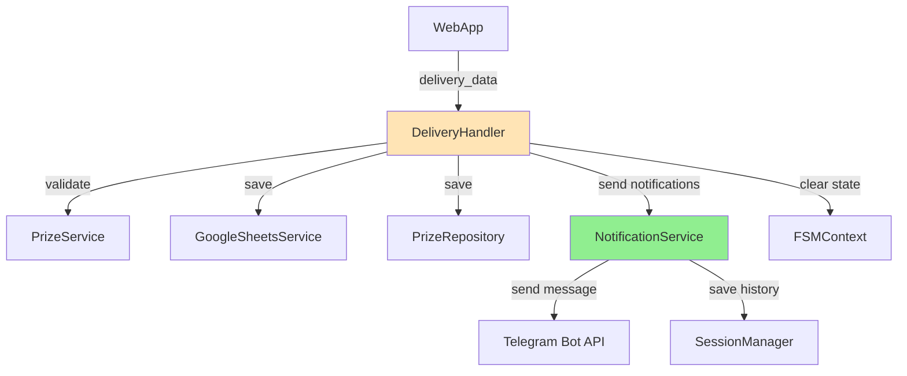
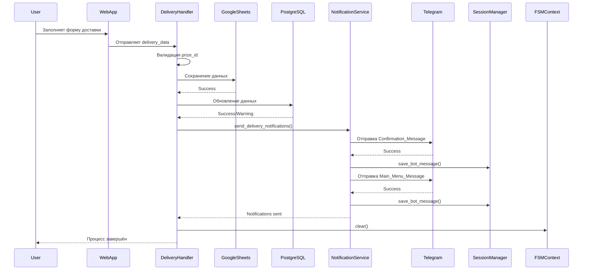
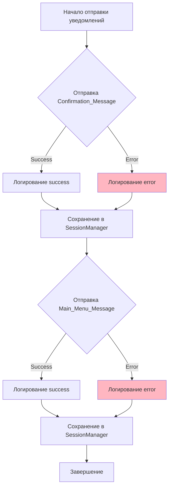

# Design Document: Request Tracking and Chat Notifications

## Введение

Данный документ описывает технический дизайн функциональности отслеживания отправки запроса на получение приза и отправки уведомлений в Telegram чат. Функциональность заменяет текущее одиночное сообщение об успехе на последовательную отправку двух сообщений: подтверждение получения данных и возврат в главное меню.

## Overview

### Цель

Улучшить пользовательский опыт при отправке данных доставки путём:
- Немедленного подтверждения получения данных
- Возврата пользователя в главное меню для продолжения взаимодействия
- Улучшенного логирования для диагностики проблем
- Надёжной обработки ошибок без блокировки пользователя

### Scope

**В рамках проекта:**
- Модификация `DeliveryHandler.handle_delivery_data()` для отправки двух последовательных сообщений
- Создание нового модуля `NotificationService` для управления отправкой уведомлений
- Добавление структурированного логирования событий отправки
- Обработка ошибок отправки сообщений без отката данных
- Сохранение обоих сообщений через `session_manager`

**Вне рамок проекта:**
- Изменение логики сохранения данных в Google Sheets или PostgreSQL
- Модификация WebApp формы доставки
- Изменение FSM состояний или переходов
- Изменение текстов сообщений об ошибках

### Ключевые решения

1. **Создание отдельного NotificationService**: Выделение логики отправки уведомлений в отдельный сервис для соблюдения принципа единственной ответственности и упрощения тестирования

2. **Последовательная отправка без задержки**: Сообщения отправляются последовательно без искусственной задержки между ними для минимизации времени отклика

3. **Graceful degradation при ошибках**: Если первое сообщение не отправилось, система всё равно пытается отправить второе, чтобы пользователь мог продолжить работу

4. **Независимость от session_manager**: Ошибки сохранения в session_manager не блокируют отправку сообщений пользователю

## Architecture

### Общая архитектура



### Последовательность операций



### Обработка ошибок



## Components and Interfaces

### NotificationService

Новый сервис для управления отправкой уведомлений пользователям.

**Расположение:** `telegram-bot/services/notification_service.py`

**Ответственность:**
- Отправка последовательных уведомлений в Telegram
- Логирование событий отправки
- Обработка ошибок отправки
- Сохранение сообщений через SessionManager

**Интерфейс:**

```python
class NotificationService:
    """Сервис для отправки уведомлений пользователям"""
    
    def __init__(
        self,
        bot: Bot,
        session_manager: Optional[SessionManager] = None
    ):
        """
        Args:
            bot: Экземпляр Telegram бота
            session_manager: Менеджер сессий (опционально)
        """
        pass
    
    async def send_delivery_notifications(
        self,
        telegram_id: int,
        prize_id: int,
        session_id: Optional[int] = None
    ) -> NotificationResult:
        """
        Отправляет последовательные уведомления о получении данных доставки
        
        Args:
            telegram_id: Telegram ID пользователя
            prize_id: ID приза
            session_id: ID сессии для сохранения истории (опционально)
            
        Returns:
            NotificationResult с информацией об успешности отправки
        """
        pass
    
    async def _send_confirmation_message(
        self,
        telegram_id: int,
        session_id: Optional[int]
    ) -> bool:
        """Отправляет подтверждающее сообщение"""
        pass
    
    async def _send_main_menu_message(
        self,
        telegram_id: int,
        session_id: Optional[int]
    ) -> bool:
        """Отправляет сообщение с главным меню"""
        pass
    
    async def _save_to_session_manager(
        self,
        session_id: int,
        message_text: str
    ) -> None:
        """Сохраняет сообщение в историю сессии"""
        pass
```

**Зависимости:**
- `aiogram.Bot` - для отправки сообщений
- `SessionManager` - для сохранения истории (опционально)
- `keyboards.reply_keyboards.get_main_menu_keyboard` - для клавиатуры главного меню
- `utils.logging_config.get_logger` - для логирования

### NotificationResult

Data class для результата отправки уведомлений.

**Расположение:** `telegram-bot/services/notification_service.py`

**Структура:**

```python
@dataclass
class NotificationResult:
    """Результат отправки уведомлений"""
    
    confirmation_sent: bool
    """Успешно ли отправлено подтверждающее сообщение"""
    
    main_menu_sent: bool
    """Успешно ли отправлено сообщение с главным меню"""
    
    both_sent: bool
    """Успешно ли отправлены оба сообщения"""
    
    @property
    def at_least_one_sent(self) -> bool:
        """Отправлено ли хотя бы одно сообщение"""
        return self.confirmation_sent or self.main_menu_sent
```

### DeliveryHandler (модификация)

Существующий обработчик данных доставки будет модифицирован для использования `NotificationService`.

**Изменения:**

1. Добавление `NotificationService` в конструктор
2. Замена блока отправки одного сообщения на вызов `notification_service.send_delivery_notifications()`
3. Удаление старого кода отправки сообщения "✅ Спасибо! Ваши данные успешно сохранены..."

**Модифицированный метод:**

```python
async def handle_delivery_data(
    self,
    message: Message,
    state: FSMContext,
    session_id: Optional[int] = None
) -> None:
    """Обрабатывает данные доставки из WebApp"""
    
    # ... существующая логика валидации и сохранения ...
    
    # Сохранение в Google Sheets (критично)
    sheets_success = await self._save_to_sheets(...)
    if not sheets_success:
        await self._send_error_message(...)
        return
    
    # Сохранение в PostgreSQL (некритично)
    postgres_success = await self._save_to_postgres(...)
    
    # НОВОЕ: Отправка уведомлений через NotificationService
    notification_result = await self.notification_service.send_delivery_notifications(
        telegram_id=telegram_id,
        prize_id=prize_id,
        session_id=session_id
    )
    
    # Логирование результата
    logger.info(
        "delivery_notifications_sent",
        telegram_id=telegram_id,
        prize_id=prize_id,
        confirmation_sent=notification_result.confirmation_sent,
        main_menu_sent=notification_result.main_menu_sent
    )
    
    # Сброс FSM состояния
    await state.clear()
```

## Data Models

### Константы сообщений

**Расположение:** `telegram-bot/constants/messages.py` (новый файл)

```python
"""Константы текстов сообщений бота"""

# Сообщения о доставке
DELIVERY_CONFIRMATION_MESSAGE = "Данные получили, скоро отправим приз"
DELIVERY_MAIN_MENU_MESSAGE = "Выберите действие:"

# Сообщения об ошибках (существующие, для справки)
ERROR_MISSING_PRIZE_ID = "Ошибка: отсутствует идентификатор приза"
ERROR_INVALID_PRIZE_ID = "❌ Ошибка: недопустимый идентификатор приза"
ERROR_SERVICE_UNAVAILABLE = "⚠️ Сервис временно недоступен. Попробуйте позже."
ERROR_PRIZE_NOT_FOUND = "Ошибка: приз не найден"
ERROR_SHEETS_SAVE_FAILED = "Произошла техническая ошибка при сохранении данных. Пожалуйста, обратитесь в поддержку."
ERROR_PROCESSING_DATA = "Произошла ошибка при обработке данных. Пожалуйста, попробуйте позже."
ERROR_INVALID_JSON = "Ошибка обработки данных. Пожалуйста, попробуйте снова."
```

### Структура логирования

Все события логируются в структурированном формате с обязательными полями:

```python
{
    "event_type": str,  # Тип события
    "telegram_id": int,  # Telegram ID пользователя
    "prize_id": int,  # ID приза (опционально)
    "session_id": int,  # ID сессии (опционально)
    "timestamp": str,  # ISO 8601 timestamp
    "level": str,  # info, warning, error
    "error": str  # Детали ошибки (только для error level)
}
```

**События:**

- `request_received` - Получен запрос на сохранение данных доставки
- `confirmation_message_sent` - Отправлено подтверждающее сообщение
- `confirmation_message_failed` - Ошибка отправки подтверждающего сообщения
- `main_menu_message_sent` - Отправлено сообщение с главным меню
- `main_menu_message_failed` - Ошибка отправки сообщения с главным меню
- `delivery_notifications_sent` - Завершена отправка уведомлений
- `session_manager_save_failed` - Ошибка сохранения в session_manager


## Correctness Properties

*Свойство (property) — это характеристика или поведение, которое должно выполняться во всех допустимых сценариях работы системы. По сути, это формальное утверждение о том, что система должна делать. Свойства служат мостом между человекочитаемыми спецификациями и машинно-проверяемыми гарантиями корректности.*


### Property 1: Логирование получения запроса

*For any* запроса на сохранение данных доставки с валидными telegram_id и prize_id, система должна залогировать событие "request_received" с этими параметрами

**Validates: Requirements 5.1**

### Property 2: Инициация уведомлений после успешного сохранения

*For any* успешного сохранения данных в Google Sheets, система должна инициировать отправку уведомлений независимо от результата сохранения в PostgreSQL

**Validates: Requirements 1.2, 1.3**

### Property 3: Прерывание при ошибке Sheets

*For any* ошибки сохранения в Google Sheets, система должна прервать процесс и не отправлять уведомления пользователю

**Validates: Requirements 1.4**

### Property 4: Отправка подтверждающего сообщения

*For any* успешного сохранения данных доставки, система должна отправить Confirmation_Message с текстом "Данные получили, скоро отправим приз" в чат пользователя

**Validates: Requirements 2.1, 2.2**

### Property 5: Порядок отправки сообщений

*For any* процесса отправки уведомлений, Confirmation_Message должно быть отправлено строго перед Main_Menu_Message

**Validates: Requirements 2.3, 4.1, 4.2**

### Property 6: Производительность отправки уведомлений

*For any* успешной отправки обоих уведомлений, время между сохранением данных и отправкой второго сообщения не должно превышать 2 секунды

**Validates: Requirements 2.4, 3.4**

### Property 7: Graceful degradation при ошибке первого сообщения

*For any* ошибки отправки Confirmation_Message, система должна залогировать ошибку и продолжить отправку Main_Menu_Message

**Validates: Requirements 2.5, 6.1**

### Property 8: Отправка сообщения с главным меню

*For any* успешной отправки Confirmation_Message (или после ошибки его отправки), система должна отправить Main_Menu_Message с клавиатурой, содержащей кнопку "🎁 Получить приз"

**Validates: Requirements 3.1, 3.2, 3.3**

### Property 9: Сброс FSM состояния

*For any* завершения процесса отправки уведомлений (успешного или с ошибками), система должна сбросить FSM состояние через state.clear()

**Validates: Requirements 3.5**

### Property 10: Завершение обработки

*For any* процесса обработки данных доставки, после отправки уведомлений (или попытки отправки) метод handle_delivery_data должен завершиться

**Validates: Requirements 4.3**

### Property 11: Логирование отправленных сообщений

*For any* успешно отправленного сообщения (Confirmation_Message или Main_Menu_Message), система должна залогировать соответствующее событие ("confirmation_message_sent" или "main_menu_message_sent") с telegram_id

**Validates: Requirements 5.2, 5.3**

### Property 12: Логирование ошибок отправки

*For any* ошибки отправки сообщения, система должна залогировать событие с уровнем "error" и деталями ошибки

**Validates: Requirements 5.4**

### Property 13: Структурированное логирование

*For any* события логирования в процессе обработки доставки, лог должен содержать структурированные поля: event_type, telegram_id, prize_id (где применимо), timestamp

**Validates: Requirements 5.5**

### Property 14: Обработка ошибки второго сообщения

*For any* ошибки отправки Main_Menu_Message, система должна залогировать ошибку и завершить обработку без повторных попыток

**Validates: Requirements 6.2**

### Property 15: Сохранение данных при ошибке отправки

*For any* ошибки отправки уведомлений, ранее сохранённые данные доставки в Google Sheets и PostgreSQL должны остаться неизменными (без отката)

**Validates: Requirements 6.3**

### Property 16: Сохранение сообщений в session_manager

*For any* успешно отправленного сообщения при наличии session_manager и session_id, система должна сохранить текст сообщения через session_manager.save_bot_message()

**Validates: Requirements 8.1, 8.2, 8.3**

### Property 17: Работа без session_manager

*For any* процесса отправки уведомлений при отсутствии session_manager или session_id, система должна успешно отправить оба сообщения без попыток сохранения в историю

**Validates: Requirements 8.4**

### Property 18: Обработка ошибок session_manager

*For any* ошибки сохранения в session_manager, система должна залогировать ошибку и продолжить выполнение без прерывания отправки сообщений

**Validates: Requirements 8.5**

## Error Handling

### Стратегия обработки ошибок

Система использует принцип **graceful degradation** - ошибки не должны блокировать пользователя или приводить к потере данных.

### Категории ошибок

#### 1. Критические ошибки (блокирующие)

Ошибки, которые прерывают процесс и требуют вмешательства пользователя:

- **Ошибка сохранения в Google Sheets**: Данные не сохранены, уведомления не отправляются, пользователь получает сообщение об ошибке
- **Отсутствие prize_id**: Невозможно идентифицировать приз, процесс прерывается
- **Невалидный prize_id**: Приз не принадлежит пользователю, процесс прерывается
- **Приз не найден**: Приз отсутствует в БД, процесс прерывается

**Обработка:**
```python
if not sheets_success:
    logger.error("failed_to_save_delivery_to_sheets", ...)
    await self._send_error_message(message, error_text, state, session_id)
    return  # Прерывание процесса
```

#### 2. Некритические ошибки (предупреждения)

Ошибки, которые логируются, но не блокируют процесс:

- **Ошибка сохранения в PostgreSQL**: Данные уже в Sheets, синхронизация подхватит позже
- **Ошибка отправки Confirmation_Message**: Логируется, но Main_Menu_Message всё равно отправляется
- **Ошибка сохранения в session_manager**: Логируется, но отправка сообщений продолжается

**Обработка:**
```python
if not postgres_success:
    logger.warning("failed_to_save_delivery_to_postgres", ...)
    # Продолжаем выполнение

try:
    await self._send_confirmation_message(...)
except Exception as e:
    logger.error("confirmation_message_failed", ...)
    # Продолжаем отправку второго сообщения
```

#### 3. Ошибки отправки сообщений

**Сценарий 1: Ошибка отправки Confirmation_Message**
- Логируется событие `confirmation_message_failed` с деталями ошибки
- Система продолжает отправку Main_Menu_Message
- Пользователь получает хотя бы главное меню для продолжения работы

**Сценарий 2: Ошибка отправки Main_Menu_Message**
- Логируется событие `main_menu_message_failed` с деталями ошибки
- Процесс завершается
- FSM состояние всё равно сбрасывается

**Сценарий 3: Ошибки обоих сообщений**
- Логируются обе ошибки
- Данные остаются сохранёнными в Sheets/PostgreSQL
- FSM состояние сбрасывается
- Пользователь может повторить попытку через главное меню

### Логирование ошибок

Все ошибки логируются в структурированном формате:

```python
logger.error(
    "event_type",
    telegram_id=telegram_id,
    prize_id=prize_id,
    error=str(e),
    exc_info=True  # Для критических ошибок
)
```

### Retry логика

- **Google Sheets**: Встроенная retry логика в `GoogleSheetsService.save_delivery_data()` (3 попытки с exponential backoff)
- **Отправка сообщений**: Без retry, одна попытка (Telegram API обычно надёжен)
- **PostgreSQL**: Без retry, одна попытка (некритично)

### Откат транзакций

- **Данные доставки**: Не откатываются при ошибках отправки сообщений
- **FSM состояние**: Всегда сбрасывается, даже при ошибках
- **Session history**: Ошибки сохранения не влияют на основной процесс

## Testing Strategy

### Подход к тестированию

Используется **двойной подход** к тестированию:

1. **Unit тесты**: Проверка конкретных примеров, граничных случаев и обработки ошибок
2. **Property-based тесты**: Проверка универсальных свойств на множестве сгенерированных входных данных

Оба типа тестов дополняют друг друга и необходимы для комплексного покрытия.

### Property-Based Testing

**Библиотека:** `pytest-hypothesis` (для Python)

**Конфигурация:**
- Минимум 100 итераций на каждый property-тест
- Каждый тест помечается комментарием с ссылкой на свойство из дизайна

**Формат тега:**
```python
# Feature: request-tracking-and-chat-notifications, Property 1: Логирование получения запроса
@given(telegram_id=st.integers(min_value=1), prize_id=st.integers(min_value=1))
@settings(max_examples=100)
async def test_property_1_request_logging(telegram_id, prize_id):
    ...
```

**Покрываемые свойства:**
- Property 1-18: Все свойства из раздела Correctness Properties

### Unit Testing

**Фокус unit тестов:**

1. **Конкретные примеры:**
   - Отправка уведомлений с валидными данными
   - Корректный текст Confirmation_Message
   - Наличие кнопки "🎁 Получить приз" в Main_Menu_Message

2. **Граничные случаи:**
   - Отсутствие session_manager
   - Отсутствие session_id
   - Пустой telegram_id или prize_id

3. **Обработка ошибок:**
   - Ошибка отправки первого сообщения
   - Ошибка отправки второго сообщения
   - Ошибка сохранения в session_manager
   - Ошибка сохранения в Google Sheets
   - Ошибка сохранения в PostgreSQL

4. **Интеграционные точки:**
   - Взаимодействие DeliveryHandler с NotificationService
   - Взаимодействие NotificationService с Bot API
   - Взаимодействие NotificationService с SessionManager

**Примеры unit тестов:**

```python
@pytest.mark.asyncio
async def test_send_delivery_notifications_success():
    """Тест успешной отправки обоих уведомлений"""
    # Validates: Requirements 2.1, 3.1
    ...

@pytest.mark.asyncio
async def test_send_delivery_notifications_first_message_fails():
    """Тест graceful degradation при ошибке первого сообщения"""
    # Validates: Requirements 2.5, 6.1
    ...

@pytest.mark.asyncio
async def test_send_delivery_notifications_without_session_manager():
    """Тест отправки уведомлений без session_manager"""
    # Validates: Requirements 8.4
    ...

@pytest.mark.asyncio
async def test_confirmation_message_content():
    """Тест содержимого подтверждающего сообщения"""
    # Validates: Requirements 2.2
    ...

@pytest.mark.asyncio
async def test_main_menu_keyboard_button():
    """Тест наличия кнопки 'Получить приз' в главном меню"""
    # Validates: Requirements 3.2
    ...
```

### Тестирование производительности

**Требования:**
- Оба сообщения должны быть отправлены в течение 2 секунд после сохранения данных

**Подход:**
```python
@pytest.mark.asyncio
async def test_notification_performance():
    """Тест производительности отправки уведомлений"""
    # Validates: Requirements 2.4, 3.4
    
    start_time = time.time()
    result = await notification_service.send_delivery_notifications(...)
    elapsed_time = time.time() - start_time
    
    assert result.both_sent
    assert elapsed_time < 2.0
```

### Тестирование логирования

**Подход:** Использование mock logger для проверки вызовов

```python
@pytest.mark.asyncio
async def test_request_received_logging(mock_logger):
    """Тест логирования получения запроса"""
    # Validates: Requirements 5.1
    
    await delivery_handler.handle_delivery_data(...)
    
    mock_logger.info.assert_any_call(
        "request_received",
        telegram_id=123,
        prize_id=456
    )
```

### Регрессионное тестирование

**Цель:** Убедиться, что новая функциональность не нарушает существующую

**Проверяемые области:**
- Сохранение данных в Google Sheets работает как раньше
- Сохранение данных в PostgreSQL работает как раньше
- Валидация prize_id работает как раньше
- Обработка ошибок валидации работает как раньше
- Сброс FSM состояния работает как раньше
- Сообщения об ошибках не изменились

### Покрытие тестами

**Целевое покрытие:**
- NotificationService: 100% (новый код)
- DeliveryHandler (модифицированные части): 100%
- Интеграционные тесты: все сценарии из Requirements

**Метрики:**
- Line coverage: минимум 95%
- Branch coverage: минимум 90%
- Property tests: все 18 свойств покрыты
