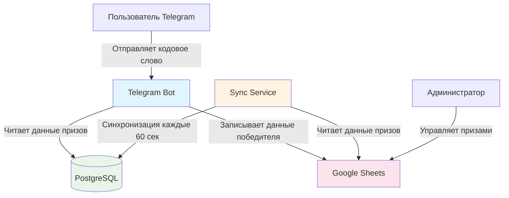
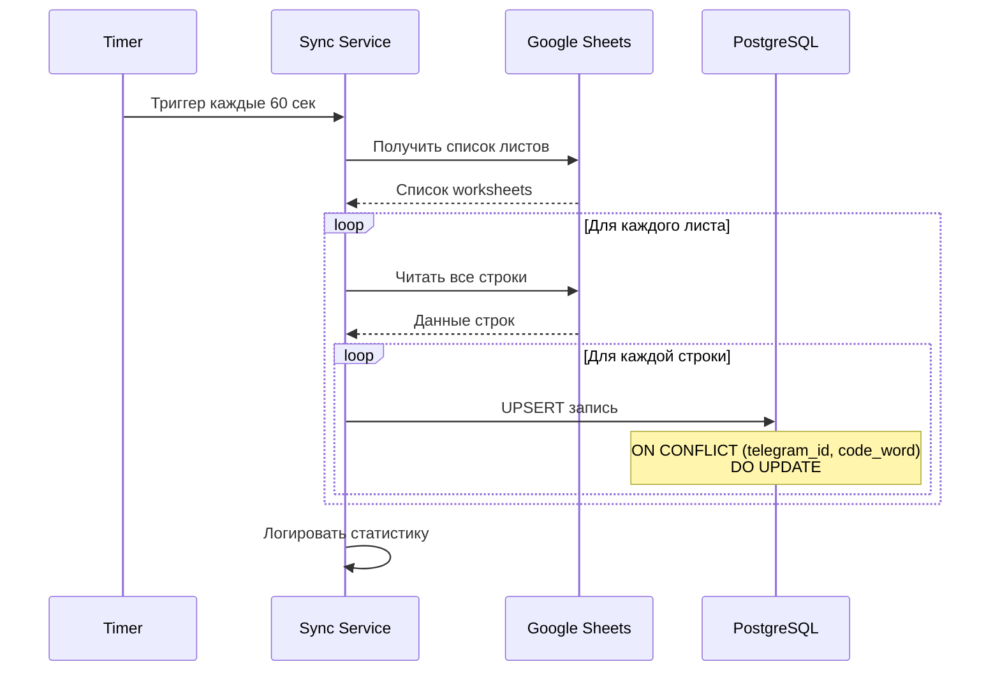
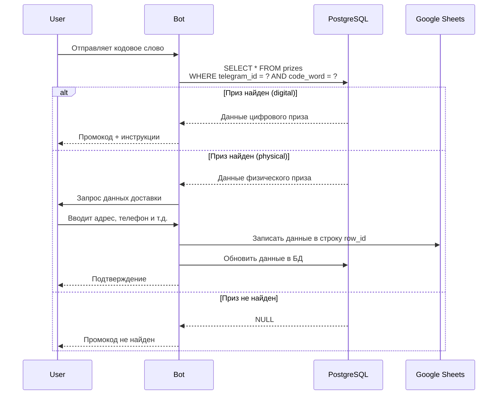

# Технический дизайн: Рефакторинг архитектуры Telegram-бота с PostgreSQL и синхронизацией

## Обзор

Данный документ описывает технический дизайн рефакторинга архитектуры Telegram-бота для перехода от прямых запросов к Google Sheets API на архитектуру с PostgreSQL в качестве основного хранилища данных и периодической синхронизацией.

### Текущая архитектура

В текущей реализации бот выполняет запрос к Google Sheets API при каждом вводе кодового слова пользователем через метод `GoogleSheetsService.find_winner()`. Это создает следующие проблемы:

- Высокая латентность ответа (задержки 1-3 секунды на запрос)
- Быстрое достижение лимитов Google Sheets API (60 запросов в минуту на пользователя)
- Невозможность масштабирования при наплыве пользователей
- Зависимость от доступности внешнего API для критической функциональности

### Целевая архитектура

Новая архитектура разделяет ответственность между компонентами:

1. **PostgreSQL** - основное хранилище данных о призах для быстрого доступа
2. **Sync Service** - автономный сервис синхронизации данных из Google Sheets в PostgreSQL (каждые 60 секунд)
3. **Bot** - работает только с PostgreSQL для проверки промокодов, записывает данные победителей обратно в Google Sheets
4. **Google Sheets** - остается панелью управления для команды (добавление призов, просмотр данных победителей)

### Ключевые преимущества

- **Производительность**: Поиск в PostgreSQL выполняется за <100ms вместо 1-3 секунд
- **Масштабируемость**: Нет ограничений API, система может обрабатывать тысячи запросов в минуту
- **Надежность**: Бот продолжает работать даже при временной недоступности Google Sheets API
- **Модульность**: Четкое разделение ответственности между компонентами

## Архитектура

### Диаграмма компонентов



### Поток данных

#### 1. Синхронизация данных (Sync Service → PostgreSQL)



#### 2. Проверка промокода (User → Bot → PostgreSQL)



### Компоненты системы

#### 1. Prize Model (`database/models/prize.py`)

SQLAlchemy модель для хранения данных о призах.

**Ответственность:**
- Определение структуры таблицы `prizes`
- Валидация типов данных
- Связь с ORM

#### 2. Prize Repository (`database/repositories/prize_repository.py`)

Repository паттерн для работы с таблицей prizes.

**Ответственность:**
- CRUD операции с призами
- Поиск приза по (telegram_id, code_word)
- Upsert операции для синхронизации
- Batch операции для производительности

#### 3. Sync Service (`services/sync_service.py`)

Сервис синхронизации данных из Google Sheets в PostgreSQL.

**Ответственность:**
- Периодическое чтение данных из Google Sheets
- Преобразование данных в формат Prize модели
- Выполнение upsert операций в БД
- Обработка ошибок и retry логика
- Логирование статистики синхронизации

#### 4. Sync Worker (`sync_worker.py`)

Автономный процесс для запуска Sync Service по расписанию.

**Ответственность:**
- Инициализация APScheduler
- Запуск синхронизации каждые 60 секунд
- Graceful shutdown при остановке
- Обработка сигналов ОС

#### 5. Prize Service (модификация `services/prize_service.py`)

Бизнес-логика работы с призами.

**Ответственность:**
- Проверка приза через Prize Repository (вместо Google Sheets)
- Обработка цифровых и физических призов
- Запись данных победителя в Google Sheets (сохраняется)
- Обновление данных в PostgreSQL после записи в Sheets

#### 6. Sync Config (`config.py`)

Конфигурация для Sync Service.

**Ответственность:**
- Параметры синхронизации (интервал, таймауты)
- Feature flag для переключения между старой и новой архитектурой
- Настройки connection pool

## Компоненты и интерфейсы

### 1. Prize Model

**Файл:** `telegram-bot/database/models/prize.py`

```python
from datetime import datetime, timezone
from typing import Optional
from sqlalchemy import BigInteger, String, Text, Integer, DateTime, Index
from sqlalchemy.orm import Mapped, mapped_column
from database.models import Base


class Prize(Base):
    """
    Модель приза из Google Sheets
    
    Хранит информацию о призах для быстрого доступа без обращения к Google Sheets API
    """
    __tablename__ = 'prizes'
    
    # Первичный ключ
    id: Mapped[int] = mapped_column(Integer, primary_key=True, autoincrement=True)
    
    # Telegram ID пользователя
    telegram_id: Mapped[int] = mapped_column(BigInteger, nullable=False)
    
    # Тип приза: 'digital' или 'physical'
    prize_type: Mapped[str] = mapped_column(String(20), nullable=False)
    
    # Данные для цифрового приза
    promo_code: Mapped[Optional[str]] = mapped_column(String(255), nullable=True)
    instructions: Mapped[Optional[str]] = mapped_column(Text, nullable=True)
    
    # Данные для физического приза (адрес доставки)
    last_name: Mapped[Optional[str]] = mapped_column(String(255), nullable=True)
    first_name: Mapped[Optional[str]] = mapped_column(String(255), nullable=True)
    patronymic: Mapped[Optional[str]] = mapped_column(String(255), nullable=True)
    city: Mapped[Optional[str]] = mapped_column(String(255), nullable=True)
    street: Mapped[Optional[str]] = mapped_column(String(255), nullable=True)
    house: Mapped[Optional[str]] = mapped_column(String(50), nullable=True)
    apartment: Mapped[Optional[str]] = mapped_column(String(50), nullable=True)
    phone: Mapped[Optional[str]] = mapped_column(String(50), nullable=True)
    comment: Mapped[Optional[str]] = mapped_column(Text, nullable=True)
    
    # Метаданные синхронизации
    sheet_name: Mapped[str] = mapped_column(String(255), nullable=False)
    code_word: Mapped[str] = mapped_column(String(255), nullable=False)
    row_id: Mapped[int] = mapped_column(Integer, nullable=False)
    
    # Временные метки
    created_at: Mapped[datetime] = mapped_column(
        DateTime(timezone=True),
        nullable=False,
        default=lambda: datetime.now(timezone.utc)
    )
    updated_at: Mapped[datetime] = mapped_column(
        DateTime(timezone=True),
        nullable=False,
        default=lambda: datetime.now(timezone.utc),
        onupdate=lambda: datetime.now(timezone.utc)
    )
    
    # Индексы
    __table_args__ = (
        # Уникальный составной индекс для предотвращения дублирования
        Index('idx_prizes_telegram_code', 'telegram_id', 'code_word', unique=True),
        # Индекс для быстрого поиска по кодовому слову
        Index('idx_prizes_code_word', 'code_word'),
        # Индекс для быстрого поиска по листу
        Index('idx_prizes_sheet_name', 'sheet_name'),
    )
```

### 2. Prize Repository

**Файл:** `telegram-bot/database/repositories/prize_repository.py`

```python
from typing import Optional, List, Dict, Any
from sqlalchemy import select
from sqlalchemy.dialects.postgresql import insert
from sqlalchemy.ext.asyncio import AsyncSession
import structlog

from database.models.prize import Prize
from database.connection import get_database

logger = structlog.get_logger(__name__)


class PrizeRepository:
    """
    Repository для работы с призами
    
    Предоставляет методы для:
    - Поиска приза по telegram_id и code_word
    - Upsert операций для синхронизации
    - Batch операций для производительности
    """
    
    def __init__(self, session: Optional[AsyncSession] = None):
        """
        Инициализирует repository
        
        Args:
            session: Опциональная сессия БД
        """
        self.session = session
    
    async def find_prize(
        self,
        telegram_id: int,
        code_word: str
    ) -> Optional[Prize]:
        """
        Ищет приз по telegram_id и code_word
        
        Args:
            telegram_id: Telegram ID пользователя
            code_word: Кодовое слово
        
        Returns:
            Prize или None если не найден
        """
        # Реализация поиска
        pass
    
    async def upsert_prize(
        self,
        prize_data: Dict[str, Any]
    ) -> Prize:
        """
        Вставляет или обновляет приз
        
        Args:
            prize_data: Данные приза
        
        Returns:
            Созданный или обновленный Prize
        """
        # Реализация upsert
        pass
    
    async def batch_upsert_prizes(
        self,
        prizes_data: List[Dict[str, Any]]
    ) -> int:
        """
        Batch upsert для списка призов
        
        Args:
            prizes_data: Список данных призов
        
        Returns:
            Количество обработанных записей
        """
        # Реализация batch upsert
        pass
    
    async def update_delivery_data(
        self,
        telegram_id: int,
        code_word: str,
        delivery_data: Dict[str, str]
    ) -> bool:
        """
        Обновляет данные доставки для физического приза
        
        Args:
            telegram_id: Telegram ID пользователя
            code_word: Кодовое слово
            delivery_data: Данные доставки
        
        Returns:
            True если успешно обновлено
        """
        # Реализация обновления
        pass
```

### 3. Sync Service

**Файл:** `telegram-bot/services/sync_service.py`

```python
from typing import List, Dict, Any
import structlog
from datetime import datetime

from services.google_sheets_service import GoogleSheetsService
from database.repositories.prize_repository import PrizeRepository
from utils.retry import retry_with_backoff

logger = structlog.get_logger(__name__)


class SyncService:
    """
    Сервис синхронизации данных из Google Sheets в PostgreSQL
    
    Выполняет:
    - Чтение всех листов из Google Sheets
    - Преобразование данных в формат Prize
    - Upsert в PostgreSQL
    - Логирование статистики
    """
    
    def __init__(
        self,
        sheets_service: GoogleSheetsService,
        prize_repository: PrizeRepository
    ):
        """
        Инициализирует сервис синхронизации
        
        Args:
            sheets_service: Сервис для работы с Google Sheets
            prize_repository: Repository для работы с призами
        """
        self.sheets_service = sheets_service
        self.prize_repository = prize_repository
    
    async def sync_all_sheets(self) -> Dict[str, int]:
        """
        Синхронизирует все листы из Google Sheets
        
        Returns:
            Статистика: {
                'sheets_processed': int,
                'records_added': int,
                'records_updated': int,
                'errors': int
            }
        """
        # Реализация синхронизации
        pass
    
    async def sync_sheet(
        self,
        sheet_name: str
    ) -> Dict[str, int]:
        """
        Синхронизирует один лист
        
        Args:
            sheet_name: Название листа
        
        Returns:
            Статистика для листа
        """
        # Реализация синхронизации листа
        pass
```

### 4. Sync Config

**Файл:** `telegram-bot/config.py` (добавление)

```python
@dataclass
class SyncConfig:
    """Конфигурация сервиса синхронизации"""
    sync_interval_seconds: int  # Интервал синхронизации
    use_postgres: bool  # Feature flag для переключения архитектуры
    batch_size: int  # Размер batch для upsert операций
    max_retries: int  # Максимальное количество попыток при ошибке
    
    @classmethod
    def from_env(cls) -> 'SyncConfig':
        """Создаёт конфигурацию из переменных окружения"""
        return cls(
            sync_interval_seconds=int(os.getenv('SYNC_INTERVAL_SECONDS', '60')),
            use_postgres=os.getenv('USE_POSTGRES', 'true').lower() == 'true',
            batch_size=int(os.getenv('SYNC_BATCH_SIZE', '100')),
            max_retries=int(os.getenv('SYNC_MAX_RETRIES', '3'))
        )
```

### 5. Sync Worker

**Файл:** `telegram-bot/sync_worker.py`

```python
import asyncio
import signal
from apscheduler.schedulers.asyncio import AsyncIOScheduler
import structlog

from config import get_config
from database.connection import init_database
from services.google_sheets_service import GoogleSheetsService
from services.sync_service import SyncService
from database.repositories.prize_repository import PrizeRepository

logger = structlog.get_logger(__name__)


class SyncWorker:
    """
    Worker для периодической синхронизации данных
    
    Использует APScheduler для запуска синхронизации по расписанию
    """
    
    def __init__(self):
        """Инициализирует worker"""
        self.scheduler = AsyncIOScheduler()
        self.running = False
    
    async def start(self):
        """Запускает worker"""
        # Реализация запуска
        pass
    
    async def stop(self):
        """Останавливает worker (graceful shutdown)"""
        # Реализация остановки
        pass
    
    async def sync_job(self):
        """Job для синхронизации"""
        # Реализация job
        pass


async def main():
    """Точка входа для sync worker"""
    worker = SyncWorker()
    
    # Обработка сигналов для graceful shutdown
    loop = asyncio.get_event_loop()
    for sig in (signal.SIGTERM, signal.SIGINT):
        loop.add_signal_handler(sig, lambda: asyncio.create_task(worker.stop()))
    
    await worker.start()


if __name__ == '__main__':
    asyncio.run(main())
```

## Модели данных

### Таблица prizes

```sql
CREATE TABLE prizes (
    id SERIAL PRIMARY KEY,
    telegram_id BIGINT NOT NULL,
    prize_type VARCHAR(20) NOT NULL CHECK (prize_type IN ('digital', 'physical')),
    
    -- Данные для цифрового приза
    promo_code VARCHAR(255),
    instructions TEXT,
    
    -- Данные для физического приза
    last_name VARCHAR(255),
    first_name VARCHAR(255),
    patronymic VARCHAR(255),
    city VARCHAR(255),
    street VARCHAR(255),
    house VARCHAR(50),
    apartment VARCHAR(50),
    phone VARCHAR(50),
    comment TEXT,
    
    -- Метаданные синхронизации
    sheet_name VARCHAR(255) NOT NULL,
    code_word VARCHAR(255) NOT NULL,
    row_id INTEGER NOT NULL,
    
    -- Временные метки
    created_at TIMESTAMP WITH TIME ZONE NOT NULL DEFAULT NOW(),
    updated_at TIMESTAMP WITH TIME ZONE NOT NULL DEFAULT NOW(),
    
    -- Уникальный индекс для предотвращения дублирования
    CONSTRAINT uq_prizes_telegram_code UNIQUE (telegram_id, code_word)
);

-- Индексы для производительности
CREATE INDEX idx_prizes_code_word ON prizes(code_word);
CREATE INDEX idx_prizes_sheet_name ON prizes(sheet_name);
CREATE INDEX idx_prizes_telegram_id ON prizes(telegram_id);
```

### Структура данных Google Sheets

Каждый worksheet (лист) представляет одно кодовое слово. Структура столбцов:

| Столбец | Название | Тип | Описание |
|---------|----------|-----|----------|
| A | telegram_id | BIGINT | Telegram ID пользователя |
| B | prize_type | VARCHAR | Тип приза: 'digital' или 'physical' |
| C | promo_code | VARCHAR | Промокод (для digital) |
| D | instructions | TEXT | Инструкции (для digital) |
| E | last_name | VARCHAR | Фамилия (для physical) |
| F | first_name | VARCHAR | Имя (для physical) |
| G | patronymic | VARCHAR | Отчество (для physical) |
| H | city | VARCHAR | Город (для physical) |
| I | street | VARCHAR | Улица (для physical) |
| J | house | VARCHAR | Дом (для physical) |
| K | apartment | VARCHAR | Квартира (для physical) |
| L | phone | VARCHAR | Телефон (для physical) |
| M | comment | TEXT | Комментарий (для physical) |
| N | claimed_at | TIMESTAMP | Время получения приза |

### Маппинг данных

При синхронизации из Google Sheets в PostgreSQL:

```python
prize_data = {
    'telegram_id': int(row[0]),  # Колонка A
    'prize_type': row[1],  # Колонка B
    'promo_code': row[2] if len(row) > 2 else None,  # Колонка C
    'instructions': row[3] if len(row) > 3 else None,  # Колонка D
    'last_name': row[4] if len(row) > 4 else None,  # Колонка E
    'first_name': row[5] if len(row) > 5 else None,  # Колонка F
    'patronymic': row[6] if len(row) > 6 else None,  # Колонка G
    'city': row[7] if len(row) > 7 else None,  # Колонка H
    'street': row[8] if len(row) > 8 else None,  # Колонка I
    'house': row[9] if len(row) > 9 else None,  # Колонка J
    'apartment': row[10] if len(row) > 10 else None,  # Колонка K
    'phone': row[11] if len(row) > 11 else None,  # Колонка L
    'comment': row[12] if len(row) > 12 else None,  # Колонка M
    'sheet_name': worksheet_name,
    'code_word': worksheet_name,  # Кодовое слово = название листа
    'row_id': row_index + 2  # +2 потому что первая строка - заголовки, индексация с 1
}
```


## Correctness Properties

*Свойство (property) - это характеристика или поведение, которое должно выполняться для всех валидных выполнений системы - по сути, формальное утверждение о том, что система должна делать. Свойства служат мостом между человекочитаемыми спецификациями и машинопроверяемыми гарантиями корректности.*

### Property 1: Upsert идемпотентность

*Для любых* данных приза, выполнение upsert операции дважды с одинаковыми данными должно давать тот же результат, что и однократное выполнение. При конфликте уникального индекса (telegram_id, code_word) должно выполняться обновление существующей записи, а не создание дубликата.

**Validates: Requirements 2.4, 8.6**

### Property 2: Корректность маппинга метаданных синхронизации

*Для любой* строки данных из Google Sheets, при синхронизации в PostgreSQL должны корректно заполняться метаданные: sheet_name и code_word должны равняться названию текущего листа (worksheet), а row_id должен равняться номеру строки в Google Sheets (с учетом того, что первая строка - заголовки).

**Validates: Requirements 2.5, 2.6, 2.7**

### Property 3: Поиск приза в PostgreSQL

*Для любого* telegram_id и code_word, при отправке кодового слова пользователем бот должен выполнять поиск в PostgreSQL по составному ключу (telegram_id, code_word) и НЕ должен выполнять запросы к Google Sheets API.

**Validates: Requirements 3.1, 3.2**

### Property 4: Обработка ненайденного приза

*Для любого* telegram_id и code_word, если приз не найден в PostgreSQL, бот должен отправить пользователю сообщение о том, что промокод не найден.

**Validates: Requirements 3.4**

### Property 5: Обработка цифрового приза

*Для любого* найденного приза с prize_type='digital', бот должен отправить пользователю promo_code и instructions из записи Prize.

**Validates: Requirements 3.6**

### Property 6: Обработка физического приза

*Для любого* найденного приза с prize_type='physical', бот должен запустить процесс сбора данных доставки (FSM переход в состояние ожидания ввода адреса).

**Validates: Requirements 3.7**

### Property 7: Производительность поиска

*Для любого* запроса поиска приза в PostgreSQL, время выполнения должно быть не более 500 миллисекунд. В 95% случаев время выполнения должно быть не более 100 миллисекунд.

**Validates: Requirements 3.8, 9.2**

### Property 8: Round-trip синхронизация данных доставки

*Для любых* данных доставки физического приза, после успешной записи в Google Sheets бот должен также обновить соответствующие поля (last_name, first_name, patronymic, city, street, house, apartment, phone, comment) в PostgreSQL. При последующем чтении из PostgreSQL данные должны совпадать с записанными.

**Validates: Requirements 4.8**

### Property 9: Корректность записи данных доставки в Google Sheets

*Для любых* данных доставки физического приза, при записи в Google Sheets бот должен использовать sheet_name и row_id из Prize_Record для определения целевого листа и строки, и должен обновить все указанные колонки (E-M) одним batch update запросом.

**Validates: Requirements 4.1, 4.2, 4.3, 4.4**

### Property 10: Идемпотентность миграции

*Для любой* миграции создания таблицы prizes, выполнение миграции дважды должно давать тот же результат, что и однократное выполнение (использование CREATE TABLE IF NOT EXISTS или проверка существования таблицы).

**Validates: Requirements 10.2**

### Property 11: Чтение данных начиная со второй строки

*Для любого* листа в Google Sheets, при синхронизации Sync Service должен читать данные начиная со второй строки (row index >= 2), пропуская первую строку с заголовками.

**Validates: Requirements 2.3**

## Обработка ошибок

### Стратегия обработки ошибок

Система использует многоуровневую стратегию обработки ошибок:

1. **Retry с экспоненциальной задержкой** - для временных сбоев API
2. **Graceful degradation** - продолжение работы при частичных сбоях
3. **Подробное логирование** - для диагностики проблем
4. **Уведомление пользователя** - при критических ошибках

### Обработка ошибок Google Sheets API

**Временные ошибки (429 Rate Limit, 503 Service Unavailable):**
- Retry до 3 раз с экспоненциальной задержкой (1s, 2s, 4s)
- Логирование каждой попытки
- При исчерпании попыток - логирование ошибки и продолжение со следующим листом

**Постоянные ошибки (404 Not Found, 403 Forbidden):**
- Логирование ошибки с деталями
- Пропуск проблемного листа/строки
- Продолжение синхронизации

**Пример кода:**

```python
@retry_with_backoff(max_retries=3, base_delay=1.0)
async def sync_sheet(self, sheet_name: str):
    try:
        worksheet = self.sheets_service.get_worksheet(sheet_name)
        rows = worksheet.get_all_values()[1:]  # Пропускаем заголовки
        
        for row_index, row in enumerate(rows):
            try:
                await self.prize_repository.upsert_prize(
                    self._map_row_to_prize(row, sheet_name, row_index + 2)
                )
            except Exception as e:
                logger.error(
                    "failed_to_upsert_prize",
                    sheet_name=sheet_name,
                    row_index=row_index + 2,
                    error=str(e)
                )
                # Продолжаем со следующей строкой
                continue
                
    except gspread.exceptions.WorksheetNotFound:
        logger.warning("worksheet_not_found", sheet_name=sheet_name)
        raise  # Retry не поможет
    except gspread.exceptions.APIError as e:
        logger.error("google_sheets_api_error", error=str(e))
        raise  # Retry может помочь
```

### Обработка ошибок PostgreSQL

**Ошибки подключения:**
- Connection pool автоматически переподключается (pool_pre_ping=True)
- При недоступности БД во время синхронизации - логирование и retry в следующем цикле
- При недоступности БД в боте - отправка пользователю сообщения о временной недоступности

**Ошибки транзакций:**
- Автоматический rollback при исключении
- Логирование полного traceback
- Повторная попытка для идемпотентных операций

**Пример кода:**

```python
async def find_prize(self, telegram_id: int, code_word: str) -> Optional[Prize]:
    try:
        async with self.get_session() as session:
            query = select(Prize).where(
                and_(
                    Prize.telegram_id == telegram_id,
                    Prize.code_word == code_word
                )
            )
            result = await session.execute(query)
            return result.scalar_one_or_none()
            
    except asyncpg.exceptions.PostgresConnectionError as e:
        logger.error(
            "database_connection_error",
            telegram_id=telegram_id,
            code_word=code_word,
            error=str(e)
        )
        raise DatabaseUnavailableError("База данных временно недоступна")
    except Exception as e:
        logger.error(
            "unexpected_database_error",
            telegram_id=telegram_id,
            code_word=code_word,
            error=str(e),
            exc_info=True
        )
        raise
```

### Обработка ошибок в Sync Worker

**Graceful Shutdown:**
- Обработка сигналов SIGTERM и SIGINT
- Завершение текущей синхронизации перед остановкой
- Закрытие всех подключений к БД
- Остановка scheduler

**Пример кода:**

```python
class SyncWorker:
    def __init__(self):
        self.scheduler = AsyncIOScheduler()
        self.running = False
        self.current_sync_task = None
    
    async def stop(self):
        """Graceful shutdown"""
        logger.info("sync_worker_stopping")
        self.running = False
        
        # Ждем завершения текущей синхронизации
        if self.current_sync_task and not self.current_sync_task.done():
            logger.info("waiting_for_current_sync_to_complete")
            await asyncio.wait_for(self.current_sync_task, timeout=60.0)
        
        # Останавливаем scheduler
        self.scheduler.shutdown(wait=True)
        
        # Закрываем подключения к БД
        await get_database().close()
        
        logger.info("sync_worker_stopped")
```

### Таймауты

Все операции имеют таймауты для предотвращения зависаний:

- **Поиск в PostgreSQL**: 500ms (hard limit)
- **Синхронизация одного листа**: 60s
- **Запись в Google Sheets**: 10s
- **Graceful shutdown**: 60s

## Стратегия тестирования

### Двойной подход к тестированию

Система использует комбинацию unit тестов и property-based тестов для обеспечения корректности:

**Unit тесты:**
- Проверка конкретных примеров и edge cases
- Тестирование интеграции между компонентами
- Проверка обработки ошибок
- Тестирование логирования

**Property-based тесты:**
- Проверка универсальных свойств на случайных данных
- Минимум 100 итераций на тест
- Использование библиотеки Hypothesis для Python
- Каждый тест ссылается на свойство из дизайна

### Property-Based Testing с Hypothesis

**Конфигурация:**
```python
from hypothesis import given, settings, strategies as st

@settings(max_examples=100)
@given(
    telegram_id=st.integers(min_value=1, max_value=999999999),
    code_word=st.text(min_size=1, max_size=50),
    prize_type=st.sampled_from(['digital', 'physical'])
)
async def test_upsert_idempotency(telegram_id, code_word, prize_type):
    """
    Feature: telegram-bot-postgres-sync
    Property 1: Upsert идемпотентность
    
    Для любых данных приза, выполнение upsert дважды должно давать
    тот же результат, что и однократное выполнение.
    """
    # Arrange
    prize_data = {
        'telegram_id': telegram_id,
        'code_word': code_word,
        'prize_type': prize_type,
        'sheet_name': code_word,
        'row_id': 2
    }
    
    # Act
    result1 = await prize_repository.upsert_prize(prize_data)
    result2 = await prize_repository.upsert_prize(prize_data)
    
    # Assert
    assert result1.id == result2.id
    assert result1.telegram_id == result2.telegram_id
    assert result1.code_word == result2.code_word
```

### Unit тесты для конкретных сценариев

**Примеры unit тестов:**

1. **Тест синхронизации с mock Google Sheets:**
```python
@pytest.mark.asyncio
async def test_sync_service_handles_api_error():
    """
    Проверяет, что Sync Service логирует ошибку API и продолжает работу
    Validates: Requirements 2.8
    """
    # Arrange
    mock_sheets = Mock(spec=GoogleSheetsService)
    mock_sheets.get_all_worksheets.side_effect = gspread.exceptions.APIError("Rate limit")
    
    sync_service = SyncService(mock_sheets, prize_repository)
    
    # Act
    stats = await sync_service.sync_all_sheets()
    
    # Assert
    assert stats['errors'] == 1
    assert "Rate limit" in caplog.text
```

2. **Тест обработки цифрового приза:**
```python
@pytest.mark.asyncio
async def test_bot_sends_digital_prize():
    """
    Проверяет, что бот отправляет промокод для цифрового приза
    Validates: Requirements 3.6
    """
    # Arrange
    prize = Prize(
        telegram_id=123456,
        code_word='test',
        prize_type='digital',
        promo_code='PROMO123',
        instructions='Use at checkout'
    )
    
    # Act
    result = await prize_service.check_prize(123456, 'test')
    
    # Assert
    assert result.status == PrizeStatus.DIGITAL
    assert result.promo_code == 'PROMO123'
    assert result.instructions == 'Use at checkout'
```

3. **Тест graceful shutdown:**
```python
@pytest.mark.asyncio
async def test_sync_worker_graceful_shutdown():
    """
    Проверяет, что worker корректно завершает работу
    Validates: Requirements 8.5
    """
    # Arrange
    worker = SyncWorker()
    await worker.start()
    
    # Имитируем длительную синхронизацию
    worker.current_sync_task = asyncio.create_task(asyncio.sleep(2))
    
    # Act
    start_time = time.time()
    await worker.stop()
    elapsed = time.time() - start_time
    
    # Assert
    assert elapsed >= 2.0  # Дождался завершения синхронизации
    assert not worker.running
    assert worker.scheduler.state == STATE_STOPPED
```

### Integration тесты

**Полный цикл синхронизации:**
```python
@pytest.mark.integration
@pytest.mark.asyncio
async def test_full_sync_cycle():
    """
    Интеграционный тест полного цикла синхронизации
    """
    # Arrange - подготовка тестовых данных в Google Sheets
    test_sheet_name = f"test_{uuid.uuid4()}"
    # ... создание тестового листа
    
    # Act - запуск синхронизации
    sync_service = SyncService(sheets_service, prize_repository)
    stats = await sync_service.sync_all_sheets()
    
    # Assert - проверка данных в PostgreSQL
    prize = await prize_repository.find_prize(123456, test_sheet_name)
    assert prize is not None
    assert prize.prize_type == 'digital'
    
    # Cleanup
    # ... удаление тестового листа
```

### Тестирование производительности

**Benchmark тесты:**
```python
@pytest.mark.benchmark
@pytest.mark.asyncio
async def test_search_performance():
    """
    Проверяет, что поиск выполняется быстро
    Validates: Requirements 3.8, 9.2
    """
    # Arrange - создание 10000 записей
    await create_test_prizes(count=10000)
    
    # Act - измерение времени поиска
    times = []
    for _ in range(100):
        start = time.perf_counter()
        await prize_repository.find_prize(random_telegram_id(), random_code_word())
        elapsed = time.perf_counter() - start
        times.append(elapsed)
    
    # Assert
    assert max(times) < 0.5  # Максимум 500ms
    assert percentile(times, 95) < 0.1  # 95% < 100ms
```

### Покрытие тестами

**Минимальные требования:**
- Unit тесты: 80% покрытие кода
- Property-based тесты: все свойства из дизайна
- Integration тесты: критические пути (синхронизация, проверка приза, запись данных)
- Benchmark тесты: требования к производительности

**Запуск тестов:**
```bash
# Активация виртуального окружения
source venv/bin/activate  # Linux/Mac
# или
venv\Scripts\activate  # Windows

# Все тесты
pytest

# Только unit тесты
pytest -m "not integration and not benchmark"

# Только property-based тесты
pytest -m property

# С покрытием
pytest --cov=. --cov-report=html

# Benchmark тесты
pytest -m benchmark --benchmark-only
```

