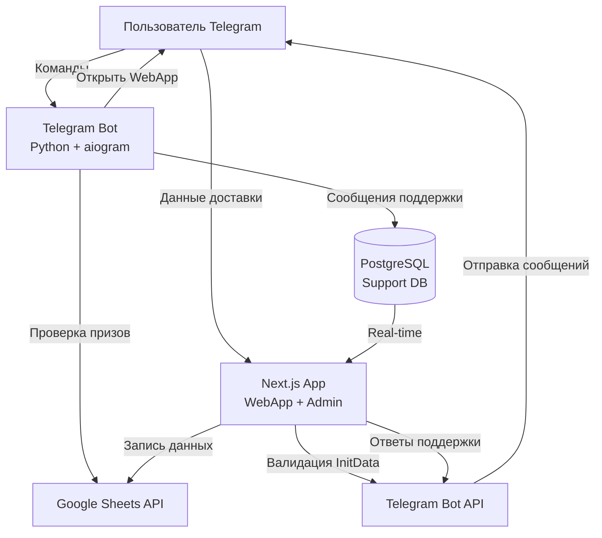

# Документ проектирования: Telegram Bot WebApp System

## Обзор

Система представляет собой трёхкомпонентную архитектуру:

1. **Telegram Bot (Python + aiogram 3.x)** - обрабатывает команды пользователей, управляет FSM-состояниями, интегрируется с Google Sheets
2. **Next.js Application** - предоставляет WebApp для сбора данных доставки и Admin Panel для службы поддержки
3. **PostgreSQL Database** - хранит сообщения службы поддержки с поддержкой real-time обновлений

Система обеспечивает:
- Автоматическую проверку победителей розыгрышей через Google Sheets
- Безопасный сбор данных доставки через Telegram WebApp
- Real-time коммуникацию между пользователями и службой поддержки
- Криптографическую защиту всех взаимодействий

## Архитектура

### Общая схема взаимодействия




### Компонентная архитектура

#### 1. Telegram Bot (Python)

```
telegram-bot/
├── main.py                      # Точка входа, инициализация бота
├── config.py                    # Конфигурация из .env
├── handlers/
│   ├── __init__.py
│   ├── prize_handler.py         # Обработка кодовых слов и выдача призов
│   ├── support_handler.py       # Обработка режима поддержки
│   └── common_handler.py        # Общие команды (/start, /help)
├── services/
│   ├── __init__.py
│   ├── google_sheets_service.py # Работа с Google Sheets API
│   ├── prize_service.py         # Бизнес-логика проверки призов
│   └── support_service.py       # Бизнес-логика поддержки
├── database/
│   ├── __init__.py
│   ├── models.py                # SQLAlchemy модели
│   ├── connection.py            # Подключение к PostgreSQL
│   └── repository.py            # Репозиторий для работы с БД
├── fsm/
│   ├── __init__.py
│   └── states.py                # FSM состояния
└── utils/
    ├── __init__.py
    └── logger.py                # Настройка логирования
```

**Ключевые модули:**

- `prize_handler.py` - обрабатывает кодовые слова, вызывает prize_service для проверки
- `prize_service.py` - взаимодействует с google_sheets_service, определяет тип приза
- `support_handler.py` - перехватывает сообщения в FSM-состоянии, сохраняет в БД
- `support_service.py` - управляет Support_Session, записывает сообщения
- `google_sheets_service.py` - инкапсулирует всю работу с gspread

#### 2. Next.js Application (TypeScript)

```
nextjs-app/
├── app/
│   ├── api/
│   │   ├── delivery/
│   │   │   └── route.ts         # POST endpoint для данных доставки
│   │   ├── support/
│   │   │   ├── messages/
│   │   │   │   └── route.ts     # GET/POST сообщения поддержки
│   │   │   └── sessions/
│   │   │       └── route.ts     # GET активные сессии
│   │   └── auth/
│   │       └── [...nextauth]/
│   │           └── route.ts     # NextAuth.js endpoints
│   ├── webapp/
│   │   └── page.tsx             # Страница WebApp для данных доставки
│   └── admin/
│       └── page.tsx             # Страница админки поддержки
├── components/
│   ├── webapp/
│   │   ├── DeliveryForm.tsx     # Форма данных доставки
│   │   └── FormField.tsx        # Переиспользуемое поле формы
│   └── admin/
│       ├── SessionList.tsx      # Список сессий поддержки
│       ├── ChatWindow.tsx       # Окно переписки
│       └── MessageInput.tsx     # Поле ввода ответа
├── lib/
│   ├── telegram/
│   │   ├── initDataValidator.ts # Валидация InitData
│   │   └── botApi.ts            # Клиент Telegram Bot API
│   ├── google/
│   │   └── sheetsClient.ts      # Клиент Google Sheets API
│   ├── database/
│   │   ├── client.ts            # Prisma/pg клиент
│   │   └── queries.ts           # SQL запросы
│   └── auth/
│       └── authOptions.ts       # Конфигурация NextAuth
├── types/
│   ├── telegram.ts              # Типы Telegram
│   ├── support.ts               # Типы поддержки
│   └── delivery.ts              # Типы данных доставки
└── middleware.ts                # Middleware для защиты роутов
```

**Ключевые модули:**

- `initDataValidator.ts` - криптографическая проверка подписи InitData
- `DeliveryForm.tsx` - форма с валидацией, отправка на API
- `ChatWindow.tsx` - real-time отображение сообщений через WebSocket/Supabase
- `botApi.ts` - отправка сообщений через Telegram Bot API

#### 3. PostgreSQL Database Schema

```sql
-- Таблица сессий поддержки
CREATE TABLE support_sessions (
    id SERIAL PRIMARY KEY,
    telegram_id BIGINT NOT NULL,
    status VARCHAR(20) NOT NULL, -- 'active', 'closed'
    created_at TIMESTAMP DEFAULT NOW(),
    closed_at TIMESTAMP,
    INDEX idx_telegram_id (telegram_id),
    INDEX idx_status (status)
);

-- Таблица сообщений поддержки
CREATE TABLE support_messages (
    id SERIAL PRIMARY KEY,
    session_id INTEGER REFERENCES support_sessions(id),
    telegram_id BIGINT NOT NULL,
    message_type VARCHAR(20) NOT NULL, -- 'from_user', 'from_support'
    message_text TEXT NOT NULL,
    file_id VARCHAR(255), -- для медиа-контента
    created_at TIMESTAMP DEFAULT NOW(),
    delivered BOOLEAN DEFAULT FALSE,
    INDEX idx_session_id (session_id),
    INDEX idx_created_at (created_at)
);
```


## Компоненты и интерфейсы

### 1. Telegram Bot Components

#### PrizeHandler

**Ответственность:** Обработка входящих сообщений с кодовыми словами

```python
class PrizeHandler:
    """Обработчик проверки призов"""
    
    def __init__(self, prize_service: PrizeService):
        self.prize_service = prize_service
    
    async def handle_code_word(self, message: Message) -> None:
        """
        Обрабатывает кодовое слово от пользователя
        
        Args:
            message: Сообщение от пользователя с кодовым словом
        """
        telegram_id = message.from_user.id
        code_word = message.text.strip()
        
        # Проверка приза через сервис
        prize_result = await self.prize_service.check_prize(telegram_id, code_word)
        
        if prize_result.status == PrizeStatus.NOT_FOUND:
            await message.answer("Вы ещё не победили в конкурсе")
        elif prize_result.status == PrizeStatus.DIGITAL:
            await self._send_digital_prize(message, prize_result)
        elif prize_result.status == PrizeStatus.PHYSICAL:
            await self._send_physical_prize_button(message, prize_result)
    
    async def _send_digital_prize(self, message: Message, prize: PrizeResult) -> None:
        """Отправляет цифровой приз (промокод)"""
        text = f"🎉 Поздравляем! Ваш промокод: {prize.promo_code}\n\n{prize.instructions}"
        await message.answer(text)
    
    async def _send_physical_prize_button(self, message: Message, prize: PrizeResult) -> None:
        """Отправляет кнопку для открытия WebApp"""
        webapp_url = f"{config.WEBAPP_URL}?prize_id={prize.id}"
        keyboard = InlineKeyboardMarkup(inline_keyboard=[
            [InlineKeyboardButton(
                text="📦 Указать данные доставки",
                web_app=WebAppInfo(url=webapp_url)
            )]
        ])
        await message.answer("🎉 Поздравляем! Укажите данные для доставки:", reply_markup=keyboard)
```

#### PrizeService

**Ответственность:** Бизнес-логика проверки призов

```python
class PrizeService:
    """Сервис для работы с призами"""
    
    def __init__(self, sheets_service: GoogleSheetsService):
        self.sheets_service = sheets_service
    
    async def check_prize(self, telegram_id: int, code_word: str) -> PrizeResult:
        """
        Проверяет наличие приза для пользователя
        
        Args:
            telegram_id: Telegram ID пользователя
            code_word: Кодовое слово розыгрыша
            
        Returns:
            PrizeResult с информацией о призе
        """
        # Поиск в Google Sheets
        prize_data = await self.sheets_service.find_winner(telegram_id, code_word)
        
        if not prize_data:
            return PrizeResult(status=PrizeStatus.NOT_FOUND)
        
        # Определение типа приза
        if prize_data['prize_type'] == 'digital':
            return PrizeResult(
                status=PrizeStatus.DIGITAL,
                promo_code=prize_data['promo_code'],
                instructions=prize_data['instructions']
            )
        else:
            return PrizeResult(
                status=PrizeStatus.PHYSICAL,
                id=prize_data['row_id']
            )
```

#### GoogleSheetsService

**Ответственность:** Взаимодействие с Google Sheets API

```python
class GoogleSheetsService:
    """Сервис для работы с Google Sheets"""
    
    def __init__(self, credentials_path: str, spreadsheet_id: str):
        self.client = self._init_client(credentials_path)
        self.spreadsheet_id = spreadsheet_id
    
    def _init_client(self, credentials_path: str) -> gspread.Client:
        """Инициализирует клиент gspread"""
        credentials = service_account(filename=credentials_path)
        return gspread.authorize(credentials)
    
    async def find_winner(self, telegram_id: int, code_word: str) -> Optional[Dict]:
        """
        Ищет победителя в таблице
        
        Args:
            telegram_id: Telegram ID для поиска
            code_word: Кодовое слово (определяет worksheet)
            
        Returns:
            Словарь с данными приза или None
        """
        # Выполняется в executor для неблокирующей работы
        loop = asyncio.get_event_loop()
        return await loop.run_in_executor(
            None, 
            self._find_winner_sync, 
            telegram_id, 
            code_word
        )
    
    def _find_winner_sync(self, telegram_id: int, code_word: str) -> Optional[Dict]:
        """Синхронный поиск в таблице"""
        try:
            sheet = self.client.open_by_key(self.spreadsheet_id)
            worksheet = sheet.worksheet(code_word)
            
            # Поиск по столбцу с Telegram ID (предполагаем столбец A)
            cell = worksheet.find(str(telegram_id), in_column=1)
            
            if not cell:
                return None
            
            # Получение данных строки
            row_values = worksheet.row_values(cell.row)
            
            return {
                'row_id': cell.row,
                'telegram_id': int(row_values[0]),
                'prize_type': row_values[1],  # 'digital' или 'physical'
                'promo_code': row_values[2] if row_values[1] == 'digital' else None,
                'instructions': row_values[3] if row_values[1] == 'digital' else None,
            }
        except gspread.exceptions.WorksheetNotFound:
            logger.error(f"Worksheet not found: {code_word}")
            return None
        except Exception as e:
            logger.error(f"Error finding winner: {e}")
            raise
    
    async def save_delivery_data(self, row_id: int, delivery_data: Dict) -> bool:
        """
        Сохраняет данные доставки в таблицу
        
        Args:
            row_id: Номер строки для обновления
            delivery_data: Данные доставки
            
        Returns:
            True если успешно
        """
        loop = asyncio.get_event_loop()
        return await loop.run_in_executor(
            None,
            self._save_delivery_data_sync,
            row_id,
            delivery_data
        )
    
    def _save_delivery_data_sync(self, row_id: int, delivery_data: Dict) -> bool:
        """Синхронное сохранение данных доставки"""
        try:
            sheet = self.client.open_by_key(self.spreadsheet_id)
            worksheet = sheet.get_worksheet(0)  # Первый worksheet
            
            # Обновление ячеек (предполагаем столбцы D-G для данных доставки)
            worksheet.update_cell(row_id, 4, delivery_data['full_name'])
            worksheet.update_cell(row_id, 5, delivery_data['address'])
            worksheet.update_cell(row_id, 6, delivery_data['phone'])
            worksheet.update_cell(row_id, 7, delivery_data.get('comment', ''))
            
            return True
        except Exception as e:
            logger.error(f"Error saving delivery data: {e}")
            return False
```

#### SupportHandler

**Ответственность:** Обработка сообщений в режиме поддержки

```python
class SupportHandler:
    """Обработчик режима поддержки"""
    
    def __init__(self, support_service: SupportService):
        self.support_service = support_service
    
    async def start_support(self, message: Message, state: FSMContext) -> None:
        """Начинает сессию поддержки"""
        telegram_id = message.from_user.id
        
        # Создание сессии
        session_id = await self.support_service.create_session(telegram_id)
        
        # Сохранение session_id в FSM
        await state.update_data(support_session_id=session_id)
        await state.set_state(SupportStates.in_support)
        
        # Отправка подтверждения
        keyboard = ReplyKeyboardMarkup(
            keyboard=[[KeyboardButton(text="Завершить диалог")]],
            resize_keyboard=True
        )
        await message.answer(
            "Вы соединены с поддержкой. Опишите ваш вопрос",
            reply_markup=keyboard
        )
    
    async def handle_support_message(self, message: Message, state: FSMContext) -> None:
        """Обрабатывает сообщение в режиме поддержки"""
        # Проверка на команду завершения
        if message.text == "Завершить диалог":
            await self.end_support(message, state)
            return
        
        # Получение session_id из FSM
        data = await state.get_data()
        session_id = data.get('support_session_id')
        
        # Сохранение сообщения
        await self.support_service.save_message(
            session_id=session_id,
            telegram_id=message.from_user.id,
            message_type='from_user',
            message_text=message.text,
            file_id=message.photo[-1].file_id if message.photo else None
        )
    
    async def end_support(self, message: Message, state: FSMContext) -> None:
        """Завершает сессию поддержки"""
        data = await state.get_data()
        session_id = data.get('support_session_id')
        
        # Закрытие сессии
        await self.support_service.close_session(session_id)
        
        # Выход из FSM
        await state.clear()
        
        # Удаление клавиатуры
        await message.answer(
            "Диалог завершён. Спасибо за обращение!",
            reply_markup=ReplyKeyboardRemove()
        )
```

#### SupportService

**Ответственность:** Бизнес-логика службы поддержки

```python
class SupportService:
    """Сервис для работы с поддержкой"""
    
    def __init__(self, repository: SupportRepository):
        self.repository = repository
    
    async def create_session(self, telegram_id: int) -> int:
        """
        Создаёт новую сессию поддержки
        
        Returns:
            ID созданной сессии
        """
        return await self.repository.create_session(telegram_id)
    
    async def save_message(
        self,
        session_id: int,
        telegram_id: int,
        message_type: str,
        message_text: str,
        file_id: Optional[str] = None
    ) -> None:
        """Сохраняет сообщение в БД"""
        await self.repository.save_message(
            session_id=session_id,
            telegram_id=telegram_id,
            message_type=message_type,
            message_text=message_text,
            file_id=file_id
        )
    
    async def close_session(self, session_id: int) -> None:
        """Закрывает сессию поддержки"""
        await self.repository.close_session(session_id)
```


### 2. Next.js Components

#### InitData Validator

**Ответственность:** Криптографическая проверка InitData от Telegram WebApp

```typescript
import crypto from 'crypto';

interface InitData {
  query_id?: string;
  user?: string;
  auth_date: string;
  hash: string;
  [key: string]: string | undefined;
}

export class InitDataValidator {
  private botToken: string;
  
  constructor(botToken: string) {
    this.botToken = botToken;
  }
  
  /**
   * Валидирует InitData от Telegram WebApp
   * 
   * @param initDataString - Строка InitData от клиента
   * @returns true если подпись валидна
   * @throws Error если подпись невалидна или данные устарели
   */
  validate(initDataString: string): boolean {
    const params = new URLSearchParams(initDataString);
    const hash = params.get('hash');
    
    if (!hash) {
      throw new Error('Hash not found in initData');
    }
    
    // Проверка timestamp (не старше 24 часов)
    const authDate = params.get('auth_date');
    if (!authDate) {
      throw new Error('auth_date not found in initData');
    }
    
    const authTimestamp = parseInt(authDate, 10);
    const currentTimestamp = Math.floor(Date.now() / 1000);
    const maxAge = 24 * 60 * 60; // 24 часа
    
    if (currentTimestamp - authTimestamp > maxAge) {
      throw new Error('InitData is too old');
    }
    
    // Удаление hash из параметров
    params.delete('hash');
    
    // Сортировка параметров и создание data-check-string
    const dataCheckString = Array.from(params.entries())
      .sort(([a], [b]) => a.localeCompare(b))
      .map(([key, value]) => `${key}=${value}`)
      .join('\n');
    
    // Вычисление ожидаемого hash
    const secretKey = crypto
      .createHmac('sha256', 'WebAppData')
      .update(this.botToken)
      .digest();
    
    const expectedHash = crypto
      .createHmac('sha256', secretKey)
      .update(dataCheckString)
      .digest('hex');
    
    // Сравнение hash
    if (hash !== expectedHash) {
      throw new Error('Invalid signature');
    }
    
    return true;
  }
  
  /**
   * Извлекает данные пользователя из InitData
   */
  extractUserData(initDataString: string): { id: number; username?: string } {
    const params = new URLSearchParams(initDataString);
    const userString = params.get('user');
    
    if (!userString) {
      throw new Error('User data not found in initData');
    }
    
    return JSON.parse(userString);
  }
}
```

#### Delivery API Route

**Ответственность:** Обработка данных доставки от WebApp

```typescript
// app/api/delivery/route.ts
import { NextRequest, NextResponse } from 'next/server';
import { InitDataValidator } from '@/lib/telegram/initDataValidator';
import { GoogleSheetsClient } from '@/lib/google/sheetsClient';
import { z } from 'zod';

// Схема валидации данных доставки
const deliverySchema = z.object({
  full_name: z.string().min(2).max(100),
  address: z.string().min(10).max(500),
  phone: z.string().regex(/^\+?[0-9]{10,15}$/),
  comment: z.string().max(500).optional(),
  prize_id: z.number().int().positive(),
  initData: z.string(),
});

export async function POST(request: NextRequest) {
  try {
    // Парсинг тела запроса
    const body = await request.json();
    
    // Валидация схемы
    const validatedData = deliverySchema.parse(body);
    
    // Валидация InitData
    const validator = new InitDataValidator(process.env.BOT_TOKEN!);
    validator.validate(validatedData.initData);
    
    // Извлечение данных пользователя
    const userData = validator.extractUserData(validatedData.initData);
    
    // Сохранение в Google Sheets
    const sheetsClient = new GoogleSheetsClient(
      process.env.GOOGLE_CREDENTIALS_PATH!,
      process.env.SPREADSHEET_ID!
    );
    
    const success = await sheetsClient.saveDeliveryData(
      validatedData.prize_id,
      {
        full_name: validatedData.full_name,
        address: validatedData.address,
        phone: validatedData.phone,
        comment: validatedData.comment || '',
        telegram_id: userData.id,
      }
    );
    
    if (!success) {
      return NextResponse.json(
        { error: 'Failed to save delivery data' },
        { status: 500 }
      );
    }
    
    return NextResponse.json({ success: true });
    
  } catch (error) {
    if (error instanceof z.ZodError) {
      return NextResponse.json(
        { error: 'Validation error', details: error.errors },
        { status: 400 }
      );
    }
    
    if (error instanceof Error && error.message.includes('Invalid signature')) {
      return NextResponse.json(
        { error: 'Invalid signature' },
        { status: 403 }
      );
    }
    
    console.error('Delivery API error:', error);
    return NextResponse.json(
      { error: 'Internal server error' },
      { status: 500 }
    );
  }
}
```

#### DeliveryForm Component

**Ответственность:** Форма сбора данных доставки в WebApp

```typescript
'use client';

import { useState } from 'react';
import { useForm } from 'react-hook-form';
import { zodResolver } from '@hookform/resolvers/zod';
import { z } from 'zod';
import WebApp from '@twa-dev/sdk';

const formSchema = z.object({
  full_name: z.string().min(2, 'Минимум 2 символа').max(100),
  address: z.string().min(10, 'Минимум 10 символов').max(500),
  phone: z.string().regex(/^\+?[0-9]{10,15}$/, 'Неверный формат телефона'),
  comment: z.string().max(500).optional(),
});

type FormData = z.infer<typeof formSchema>;

export function DeliveryForm({ prizeId }: { prizeId: number }) {
  const [isSubmitting, setIsSubmitting] = useState(false);
  const [error, setError] = useState<string | null>(null);
  
  const {
    register,
    handleSubmit,
    formState: { errors },
  } = useForm<FormData>({
    resolver: zodResolver(formSchema),
  });
  
  const onSubmit = async (data: FormData) => {
    setIsSubmitting(true);
    setError(null);
    
    try {
      // Получение InitData от Telegram
      const initData = WebApp.initData;
      
      if (!initData) {
        throw new Error('InitData not available');
      }
      
      // Отправка на API
      const response = await fetch('/api/delivery', {
        method: 'POST',
        headers: {
          'Content-Type': 'application/json',
        },
        body: JSON.stringify({
          ...data,
          prize_id: prizeId,
          initData,
        }),
      });
      
      if (!response.ok) {
        const errorData = await response.json();
        throw new Error(errorData.error || 'Failed to submit');
      }
      
      // Успех - закрытие WebApp
      WebApp.showAlert('Данные успешно сохранены!', () => {
        WebApp.close();
      });
      
    } catch (err) {
      setError(err instanceof Error ? err.message : 'Произошла ошибка');
    } finally {
      setIsSubmitting(false);
    }
  };
  
  return (
    <form onSubmit={handleSubmit(onSubmit)} className="space-y-4 p-4">
      <div>
        <label htmlFor="full_name" className="block text-sm font-medium">
          ФИО *
        </label>
        <input
          {...register('full_name')}
          type="text"
          id="full_name"
          className="mt-1 block w-full rounded-md border-gray-300 shadow-sm"
          disabled={isSubmitting}
        />
        {errors.full_name && (
          <p className="mt-1 text-sm text-red-600">{errors.full_name.message}</p>
        )}
      </div>
      
      <div>
        <label htmlFor="address" className="block text-sm font-medium">
          Адрес доставки *
        </label>
        <textarea
          {...register('address')}
          id="address"
          rows={3}
          className="mt-1 block w-full rounded-md border-gray-300 shadow-sm"
          disabled={isSubmitting}
        />
        {errors.address && (
          <p className="mt-1 text-sm text-red-600">{errors.address.message}</p>
        )}
      </div>
      
      <div>
        <label htmlFor="phone" className="block text-sm font-medium">
          Номер телефона *
        </label>
        <input
          {...register('phone')}
          type="tel"
          id="phone"
          placeholder="+79991234567"
          className="mt-1 block w-full rounded-md border-gray-300 shadow-sm"
          disabled={isSubmitting}
        />
        {errors.phone && (
          <p className="mt-1 text-sm text-red-600">{errors.phone.message}</p>
        )}
      </div>
      
      <div>
        <label htmlFor="comment" className="block text-sm font-medium">
          Комментарий (опционально)
        </label>
        <textarea
          {...register('comment')}
          id="comment"
          rows={2}
          className="mt-1 block w-full rounded-md border-gray-300 shadow-sm"
          disabled={isSubmitting}
        />
      </div>
      
      {error && (
        <div className="rounded-md bg-red-50 p-4">
          <p className="text-sm text-red-800">{error}</p>
        </div>
      )}
      
      <button
        type="submit"
        disabled={isSubmitting}
        className="w-full rounded-md bg-blue-600 px-4 py-2 text-white hover:bg-blue-700 disabled:opacity-50"
      >
        {isSubmitting ? 'Отправка...' : 'Отправить'}
      </button>
    </form>
  );
}
```


#### Support API Routes

**Ответственность:** API для работы с сообщениями поддержки

```typescript
// app/api/support/messages/route.ts
import { NextRequest, NextResponse } from 'next/server';
import { getServerSession } from 'next-auth';
import { authOptions } from '@/lib/auth/authOptions';
import { DatabaseClient } from '@/lib/database/client';
import { TelegramBotApi } from '@/lib/telegram/botApi';

// GET - получение сообщений сессии
export async function GET(request: NextRequest) {
  const session = await getServerSession(authOptions);
  
  if (!session) {
    return NextResponse.json({ error: 'Unauthorized' }, { status: 401 });
  }
  
  const { searchParams } = new URL(request.url);
  const sessionId = searchParams.get('session_id');
  
  if (!sessionId) {
    return NextResponse.json({ error: 'session_id required' }, { status: 400 });
  }
  
  const db = new DatabaseClient();
  const messages = await db.getMessages(parseInt(sessionId));
  
  return NextResponse.json({ messages });
}

// POST - отправка ответа пользователю
export async function POST(request: NextRequest) {
  const session = await getServerSession(authOptions);
  
  if (!session) {
    return NextResponse.json({ error: 'Unauthorized' }, { status: 401 });
  }
  
  try {
    const body = await request.json();
    const { session_id, message_text, telegram_id } = body;
    
    // Валидация
    if (!session_id || !message_text || !telegram_id) {
      return NextResponse.json(
        { error: 'Missing required fields' },
        { status: 400 }
      );
    }
    
    // Сохранение в БД
    const db = new DatabaseClient();
    await db.saveMessage({
      session_id,
      telegram_id,
      message_type: 'from_support',
      message_text,
    });
    
    // Отправка через Telegram Bot API
    const botApi = new TelegramBotApi(process.env.BOT_TOKEN!);
    await botApi.sendMessage(telegram_id, message_text);
    
    return NextResponse.json({ success: true });
    
  } catch (error) {
    console.error('Support message error:', error);
    return NextResponse.json(
      { error: 'Failed to send message' },
      { status: 500 }
    );
  }
}
```

```typescript
// app/api/support/sessions/route.ts
import { NextRequest, NextResponse } from 'next/server';
import { getServerSession } from 'next-auth';
import { authOptions } from '@/lib/auth/authOptions';
import { DatabaseClient } from '@/lib/database/client';

export async function GET(request: NextRequest) {
  const session = await getServerSession(authOptions);
  
  if (!session) {
    return NextResponse.json({ error: 'Unauthorized' }, { status: 401 });
  }
  
  const { searchParams } = new URL(request.url);
  const status = searchParams.get('status') || 'active';
  const page = parseInt(searchParams.get('page') || '1');
  const limit = 50;
  
  const db = new DatabaseClient();
  const sessions = await db.getSessions(status, page, limit);
  
  return NextResponse.json({ sessions });
}
```

#### ChatWindow Component

**Ответственность:** Real-time отображение переписки в админке

```typescript
'use client';

import { useEffect, useState, useRef } from 'react';
import { createClient } from '@supabase/supabase-js';

interface Message {
  id: number;
  message_type: 'from_user' | 'from_support';
  message_text: string;
  created_at: string;
  delivered: boolean;
}

interface ChatWindowProps {
  sessionId: number;
  telegramId: number;
}

export function ChatWindow({ sessionId, telegramId }: ChatWindowProps) {
  const [messages, setMessages] = useState<Message[]>([]);
  const [newMessage, setNewMessage] = useState('');
  const [isSending, setIsSending] = useState(false);
  const messagesEndRef = useRef<HTMLDivElement>(null);
  
  // Инициализация Supabase для real-time
  const supabase = createClient(
    process.env.NEXT_PUBLIC_SUPABASE_URL!,
    process.env.NEXT_PUBLIC_SUPABASE_ANON_KEY!
  );
  
  // Загрузка истории сообщений
  useEffect(() => {
    loadMessages();
  }, [sessionId]);
  
  // Подписка на real-time обновления
  useEffect(() => {
    const channel = supabase
      .channel(`session_${sessionId}`)
      .on(
        'postgres_changes',
        {
          event: 'INSERT',
          schema: 'public',
          table: 'support_messages',
          filter: `session_id=eq.${sessionId}`,
        },
        (payload) => {
          setMessages((prev) => [...prev, payload.new as Message]);
          scrollToBottom();
        }
      )
      .subscribe();
    
    return () => {
      supabase.removeChannel(channel);
    };
  }, [sessionId]);
  
  const loadMessages = async () => {
    const response = await fetch(`/api/support/messages?session_id=${sessionId}`);
    const data = await response.json();
    setMessages(data.messages);
    scrollToBottom();
  };
  
  const scrollToBottom = () => {
    messagesEndRef.current?.scrollIntoView({ behavior: 'smooth' });
  };
  
  const handleSendMessage = async (e: React.FormEvent) => {
    e.preventDefault();
    
    if (!newMessage.trim() || isSending) return;
    
    setIsSending(true);
    
    try {
      const response = await fetch('/api/support/messages', {
        method: 'POST',
        headers: {
          'Content-Type': 'application/json',
        },
        body: JSON.stringify({
          session_id: sessionId,
          telegram_id: telegramId,
          message_text: newMessage,
        }),
      });
      
      if (!response.ok) {
        throw new Error('Failed to send message');
      }
      
      setNewMessage('');
    } catch (error) {
      console.error('Send message error:', error);
      alert('Не удалось отправить сообщение');
    } finally {
      setIsSending(false);
    }
  };
  
  return (
    <div className="flex flex-col h-full">
      {/* Список сообщений */}
      <div className="flex-1 overflow-y-auto p-4 space-y-4">
        {messages.map((message) => (
          <div
            key={message.id}
            className={`flex ${
              message.message_type === 'from_support' ? 'justify-end' : 'justify-start'
            }`}
          >
            <div
              className={`max-w-[70%] rounded-lg p-3 ${
                message.message_type === 'from_support'
                  ? 'bg-blue-600 text-white'
                  : 'bg-gray-200 text-gray-900'
              }`}
            >
              <p className="text-sm whitespace-pre-wrap">{message.message_text}</p>
              <p className="text-xs mt-1 opacity-70">
                {new Date(message.created_at).toLocaleTimeString('ru-RU')}
                {message.message_type === 'from_support' && (
                  <span className="ml-2">
                    {message.delivered ? '✓✓' : '✓'}
                  </span>
                )}
              </p>
            </div>
          </div>
        ))}
        <div ref={messagesEndRef} />
      </div>
      
      {/* Форма отправки */}
      <form onSubmit={handleSendMessage} className="border-t p-4">
        <div className="flex gap-2">
          <input
            type="text"
            value={newMessage}
            onChange={(e) => setNewMessage(e.target.value)}
            placeholder="Введите сообщение..."
            className="flex-1 rounded-md border-gray-300 shadow-sm"
            disabled={isSending}
          />
          <button
            type="submit"
            disabled={isSending || !newMessage.trim()}
            className="px-4 py-2 bg-blue-600 text-white rounded-md hover:bg-blue-700 disabled:opacity-50"
          >
            Отправить
          </button>
        </div>
      </form>
    </div>
  );
}
```

#### SessionList Component

**Ответственность:** Список активных сессий поддержки

```typescript
'use client';

import { useEffect, useState } from 'react';

interface Session {
  id: number;
  telegram_id: number;
  status: string;
  created_at: string;
  unread_count: number;
}

interface SessionListProps {
  onSelectSession: (session: Session) => void;
  selectedSessionId?: number;
}

export function SessionList({ onSelectSession, selectedSessionId }: SessionListProps) {
  const [sessions, setSessions] = useState<Session[]>([]);
  const [isLoading, setIsLoading] = useState(true);
  
  useEffect(() => {
    loadSessions();
    
    // Обновление списка каждые 10 секунд
    const interval = setInterval(loadSessions, 10000);
    return () => clearInterval(interval);
  }, []);
  
  const loadSessions = async () => {
    try {
      const response = await fetch('/api/support/sessions?status=active');
      const data = await response.json();
      setSessions(data.sessions);
    } catch (error) {
      console.error('Load sessions error:', error);
    } finally {
      setIsLoading(false);
    }
  };
  
  if (isLoading) {
    return <div className="p-4">Загрузка...</div>;
  }
  
  if (sessions.length === 0) {
    return (
      <div className="p-4 text-center text-gray-500">
        Нет активных сессий
      </div>
    );
  }
  
  return (
    <div className="divide-y">
      {sessions.map((session) => (
        <button
          key={session.id}
          onClick={() => onSelectSession(session)}
          className={`w-full p-4 text-left hover:bg-gray-50 transition ${
            selectedSessionId === session.id ? 'bg-blue-50' : ''
          }`}
        >
          <div className="flex justify-between items-start">
            <div>
              <p className="font-medium">ID: {session.telegram_id}</p>
              <p className="text-sm text-gray-500">
                {new Date(session.created_at).toLocaleString('ru-RU')}
              </p>
            </div>
            {session.unread_count > 0 && (
              <span className="bg-red-500 text-white text-xs rounded-full px-2 py-1">
                {session.unread_count}
              </span>
            )}
          </div>
        </button>
      ))}
    </div>
  );
}
```

## Модели данных

### Python Models (SQLAlchemy)

```python
# database/models.py
from sqlalchemy import Column, Integer, BigInteger, String, Text, Boolean, DateTime, ForeignKey
from sqlalchemy.ext.declarative import declarative_base
from sqlalchemy.sql import func

Base = declarative_base()

class SupportSession(Base):
    """Модель сессии поддержки"""
    __tablename__ = 'support_sessions'
    
    id = Column(Integer, primary_key=True)
    telegram_id = Column(BigInteger, nullable=False, index=True)
    status = Column(String(20), nullable=False, default='active', index=True)
    created_at = Column(DateTime, server_default=func.now())
    closed_at = Column(DateTime, nullable=True)
    
    def __repr__(self):
        return f"<SupportSession(id={self.id}, telegram_id={self.telegram_id}, status={self.status})>"

class SupportMessage(Base):
    """Модель сообщения поддержки"""
    __tablename__ = 'support_messages'
    
    id = Column(Integer, primary_key=True)
    session_id = Column(Integer, ForeignKey('support_sessions.id'), nullable=False, index=True)
    telegram_id = Column(BigInteger, nullable=False)
    message_type = Column(String(20), nullable=False)  # 'from_user' или 'from_support'
    message_text = Column(Text, nullable=False)
    file_id = Column(String(255), nullable=True)
    created_at = Column(DateTime, server_default=func.now(), index=True)
    delivered = Column(Boolean, default=False)
    
    def __repr__(self):
        return f"<SupportMessage(id={self.id}, session_id={self.session_id}, type={self.message_type})>"
```

### TypeScript Types

```typescript
// types/support.ts
export interface SupportSession {
  id: number;
  telegram_id: number;
  status: 'active' | 'closed';
  created_at: string;
  closed_at?: string;
  unread_count?: number;
}

export interface SupportMessage {
  id: number;
  session_id: number;
  telegram_id: number;
  message_type: 'from_user' | 'from_support';
  message_text: string;
  file_id?: string;
  created_at: string;
  delivered: boolean;
}

// types/delivery.ts
export interface DeliveryData {
  full_name: string;
  address: string;
  phone: string;
  comment?: string;
  prize_id: number;
  telegram_id: number;
}

// types/telegram.ts
export interface TelegramUser {
  id: number;
  first_name: string;
  last_name?: string;
  username?: string;
  language_code?: string;
}

export interface InitDataParsed {
  query_id?: string;
  user?: TelegramUser;
  auth_date: number;
  hash: string;
}
```

### Google Sheets Structure

**Структура таблицы призов:**

| Столбец | Название | Тип данных | Описание |
|---------|----------|------------|----------|
| A | telegram_id | Число | Telegram ID победителя |
| B | prize_type | Текст | 'digital' или 'physical' |
| C | promo_code | Текст | Промокод (для digital) |
| D | instructions | Текст | Инструкция (для digital) |
| E | full_name | Текст | ФИО (заполняется для physical) |
| F | address | Текст | Адрес доставки (заполняется для physical) |
| G | phone | Текст | Телефон (заполняется для physical) |
| H | comment | Текст | Комментарий (заполняется для physical) |
| I | claimed_at | Дата | Дата получения приза |


## Correctness Properties

Свойство корректности (property) — это характеристика или поведение, которое должно выполняться для всех валидных выполнений системы. По сути, это формальное утверждение о том, что система должна делать. Свойства служат мостом между человекочитаемыми спецификациями и машинно-проверяемыми гарантиями корректности.

### Property Reflection

После анализа всех критериев приёмки выявлены следующие группы свойств, которые можно объединить или упростить:

**Группа 1: Проверка и выдача призов**
- Свойства 1.2, 2.1 можно объединить в одно свойство о корректном поиске и извлечении данных приза
- Свойства 2.2, 2.3 можно объединить в одно свойство о структуре сообщения с промокодом

**Группа 2: Сохранение данных**
- Свойства 6.2, 6.3 можно объединить в одно свойство о структуре сохранённого сообщения
- Свойства 8.2, 8.3, 8.4 можно объединить в одно свойство о полном цикле отправки сообщения от поддержки

**Группа 3: Криптографическая валидация**
- Свойства 10.2, 10.3 можно объединить в одно свойство о валидации InitData

**Группа 4: Завершение сессии**
- Свойства 9.1, 9.2 можно объединить в одно свойство о завершении сессии поддержки

### Свойства для тестирования

Property 1: Корректный поиск приза в Google Sheets
*Для любого* Telegram ID и кодового слова, если ID присутствует в таблице, система должна корректно извлечь тип приза и связанные данные (промокод для digital или row_id для physical)
**Validates: Requirements 1.2, 2.1**

Property 2: Структура сообщения с цифровым призом
*Для любого* цифрового приза с промокодом, отправляемое пользователю сообщение должно содержать сам промокод и инструкцию по его использованию
**Validates: Requirements 2.2, 2.3**

Property 3: Отметка о получении приза
*Для любого* выданного приза (цифрового или физического), в Prize_Database должна появиться отметка о времени получения (claimed_at)
**Validates: Requirements 2.4**

Property 4: Отправка кнопки WebApp для физического приза
*Для любого* физического приза, бот должен отправить Inline-кнопку с параметром web_app, содержащую корректный URL с prize_id
**Validates: Requirements 3.1**

Property 5: Передача InitData при открытии WebApp
*Для любого* запроса от WebApp к API, запрос должен содержать InitData для криптографической валидации
**Validates: Requirements 3.4, 4.2, 10.1**

Property 6: Валидация обязательных полей формы
*Для любых* данных формы доставки, если хотя бы одно обязательное поле (ФИО, адрес, телефон) пустое или невалидное, валидация должна вернуть ошибку
**Validates: Requirements 4.1**

Property 7: Криптографическая валидация InitData
*Для любых* InitData с корректной подписью (hash), вычисленной с использованием токена бота, валидация должна пройти успешно; для InitData с некорректной подписью валидация должна вернуть ошибку
**Validates: Requirements 4.3, 10.2, 10.3**

Property 8: Round-trip сохранения данных доставки
*Для любых* валидных данных доставки, после сохранения в Google Sheets и последующего чтения из той же строки, данные должны совпадать с исходными
**Validates: Requirements 4.5**

Property 9: Закрытие WebApp после успешного сохранения
*Для любого* успешного ответа API (HTTP 200) после отправки данных доставки, WebApp должен вызвать функцию закрытия (WebApp.close())
**Validates: Requirements 4.6**

Property 10: Создание сессии поддержки
*Для любого* запроса на создание сессии поддержки, в Support_Database должна появиться новая запись с Telegram_ID пользователя, статусом "active" и timestamp создания
**Validates: Requirements 5.1, 5.5**

Property 11: Переход в FSM состояние поддержки
*Для любого* пользователя, после создания Support_Session, FSM состояние пользователя должно измениться на SupportStates.in_support
**Validates: Requirements 5.2**

Property 12: Отображение кнопки завершения диалога
*Для любого* пользователя в FSM состоянии поддержки, ответ бота должен содержать ReplyKeyboard с кнопкой "Завершить диалог"
**Validates: Requirements 5.3**

Property 13: Перехват и сохранение сообщений в режиме поддержки
*Для любого* сообщения от пользователя в FSM состоянии поддержки (кроме команды завершения), сообщение должно быть сохранено в Support_Database с типом "from_user", текстом сообщения, session_id и timestamp
**Validates: Requirements 6.1, 6.2, 6.3**

Property 14: Изоляция команд в режиме поддержки
*Для любой* стандартной команды бота (кроме завершения диалога), отправленной пользователем в FSM состоянии поддержки, команда не должна выполняться, а сообщение должно быть сохранено как обычное сообщение поддержки
**Validates: Requirements 6.4**

Property 15: Сохранение file_id для медиа-контента
*Для любого* сообщения с медиа-контентом (фото, документы) в режиме поддержки, в Support_Database должен быть сохранён file_id вместе с сообщением
**Validates: Requirements 6.5**

Property 16: Real-time уведомления о новых сообщениях
*Для любого* нового сообщения, записанного в Support_Database, должно быть отправлено уведомление через WebSocket/Supabase Realtime в течение 1 секунды
**Validates: Requirements 7.1**

Property 17: Обновление UI админки без перезагрузки
*Для любого* уведомления о новом сообщении, полученного Admin_Panel, сообщение должно появиться в интерфейсе без вызова полной перезагрузки страницы
**Validates: Requirements 7.2**

Property 18: Отображение полей сообщения в админке
*Для любого* отображаемого сообщения в Admin_Panel, должны быть видны Telegram_ID отправителя, текст сообщения и timestamp
**Validates: Requirements 7.3**

Property 19: Загрузка истории переписки
*Для любой* выбранной Support_Session в Admin_Panel, должна загружаться полная история всех сообщений этой сессии, отсортированных по timestamp
**Validates: Requirements 7.5**

Property 20: Полный цикл отправки сообщения от поддержки
*Для любого* сообщения, отправленного из Admin_Panel, сообщение должно быть: 1) сохранено в Support_Database с типом "from_support", 2) отправлено пользователю через Telegram Bot API с корректным Telegram_ID, 3) отображено в истории переписки с отметкой о доставке
**Validates: Requirements 8.1, 8.2, 8.3, 8.4, 8.5**

Property 21: Завершение сессии поддержки
*Для любой* активной Support_Session, при нажатии кнопки "Завершить диалог", статус сессии должен измениться на "closed", FSM состояние пользователя должно сброситься, и пользователь должен получить подтверждающее сообщение
**Validates: Requirements 9.1, 9.2, 9.4**

Property 22: Восстановление обработки команд после поддержки
*Для любого* пользователя, вышедшего из FSM состояния поддержки, стандартные команды бота должны снова обрабатываться корректно
**Validates: Requirements 9.4**

Property 23: Обновление статуса сессии в админке
*Для любой* завершённой Support_Session, статус сессии в Admin_Panel должен обновиться на "closed" в течение 2 секунд
**Validates: Requirements 9.5**

Property 24: Проверка срока действия InitData
*Для любых* InitData с timestamp старше 24 часов, валидация должна вернуть ошибку "InitData is too old"
**Validates: Requirements 10.6**

Property 25: Проверка аутентификации в админке
*Для любого* запроса к защищённым API endpoints админки без активной сессии NextAuth, запрос должен быть отклонён с HTTP статусом 401
**Validates: Requirements 11.1**

Property 26: Создание сессии после успешной аутентификации
*Для любых* валидных учётных данных, после успешной аутентификации через NextAuth.js, должна быть создана защищённая сессия с токеном
**Validates: Requirements 11.3, 11.4**

Property 27: Экранирование HTML в пользовательском контенте
*Для любого* пользовательского контента, содержащего HTML-теги (например, `<script>`, ``), при отображении в WebApp или Admin_Panel все теги должны быть экранированы (преобразованы в HTML entities)
**Validates: Requirements 12.1**

Property 28: Серверная валидация пользовательского ввода
*Для любого* пользовательского ввода, отправленного на Next.js API, должна выполняться валидация на стороне сервера перед обработкой данных
**Validates: Requirements 12.3**

Property 29: Валидация протокола URL
*Для любого* URL из пользовательского ввода, система должна проверять протокол и разрешать только http и https
**Validates: Requirements 12.5**

Property 30: Отсутствие секретов в логах
*Для любой* ошибки, логируемой системой, лог не должен содержать секретные данные (токены, пароли, API ключи)
**Validates: Requirements 13.5**

Property 31: Retry логика для Google Sheets API
*Для любой* ошибки при работе с Google_Sheets_API, система должна повторить попытку до 3 раз с экспоненциальной задержкой перед тем, как вернуть ошибку пользователю
**Validates: Requirements 16.1**

Property 32: Логирование ошибок БД
*Для любой* ошибки при работе с Support_Database, система должна залогировать ошибку с полным stack trace
**Validates: Requirements 16.3, 16.5**

Property 33: Отображение понятных сообщений об ошибках
*Для любой* ошибки в WebApp, пользователю должно отображаться понятное сообщение об ошибке (не технический stack trace)
**Validates: Requirements 16.4**

Property 34: Пагинация списка сессий
*Для любого* запроса списка Support_Session, если сессий больше 50, API должен вернуть только первые 50 сессий и предоставить возможность загрузки следующей страницы
**Validates: Requirements 17.4**


## Обработка ошибок

### Стратегия обработки ошибок

Система использует многоуровневый подход к обработке ошибок:

1. **Валидация на входе** - проверка данных до начала обработки
2. **Retry логика** - автоматические повторные попытки для временных сбоев
3. **Graceful degradation** - система продолжает работать при частичных сбоях
4. **Информативные сообщения** - понятные сообщения для пользователей
5. **Детальное логирование** - полная информация для отладки

### Категории ошибок

#### 1. Ошибки внешних API (Google Sheets, Telegram)

**Обработка:**
- Retry до 3 раз с экспоненциальной задержкой (1s, 2s, 4s)
- Логирование каждой попытки
- После исчерпания попыток - сообщение пользователю о временной недоступности

```python
async def retry_with_backoff(func, max_retries=3):
    """Выполняет функцию с retry логикой"""
    for attempt in range(max_retries):
        try:
            return await func()
        except Exception as e:
            if attempt == max_retries - 1:
                logger.error(f"All retries exhausted: {e}")
                raise
            
            delay = 2 ** attempt
            logger.warning(f"Attempt {attempt + 1} failed, retrying in {delay}s: {e}")
            await asyncio.sleep(delay)
```

**Примеры сообщений:**
- "Сервис временно недоступен. Пожалуйста, попробуйте позже."
- "Не удалось сохранить данные. Попробуйте ещё раз."

#### 2. Ошибки валидации данных

**Обработка:**
- Немедленный возврат ошибки без retry
- Детальное описание проблемы для пользователя
- HTTP 400 для API запросов

```typescript
// Пример обработки в Next.js API
if (error instanceof z.ZodError) {
  return NextResponse.json(
    { 
      error: 'Ошибка валидации данных',
      details: error.errors.map(e => ({
        field: e.path.join('.'),
        message: e.message
      }))
    },
    { status: 400 }
  );
}
```

**Примеры сообщений:**
- "Поле 'Телефон' должно содержать от 10 до 15 цифр"
- "Поле 'Адрес' обязательно для заполнения"

#### 3. Ошибки безопасности

**Обработка:**
- Немедленный отказ в доступе
- Минимальная информация в ответе (не раскрывать детали)
- Детальное логирование для аудита
- HTTP 403 для невалидных подписей, 401 для неавторизованных

```typescript
if (error.message.includes('Invalid signature')) {
  logger.warn(`Invalid signature attempt from IP: ${request.ip}`);
  return NextResponse.json(
    { error: 'Invalid signature' },
    { status: 403 }
  );
}
```

**Примеры сообщений:**
- "Доступ запрещён"
- "Требуется авторизация"

#### 4. Ошибки базы данных

**Обработка:**
- Логирование с полным stack trace
- Уведомление администратора (через отдельный канал мониторинга)
- Graceful fallback где возможно
- Сообщение пользователю о технической проблеме

```python
try:
    await repository.save_message(...)
except DatabaseError as e:
    logger.error(f"Database error: {e}", exc_info=True)
    await notify_admin(f"Database error in support system: {e}")
    raise ServiceUnavailableError("Не удалось сохранить сообщение")
```

#### 5. Неожиданные ошибки

**Обработка:**
- Catch-all обработчик на верхнем уровне
- Полное логирование с контекстом
- Общее сообщение пользователю
- HTTP 500 для API

```python
@router.message(ExceptionHandler())
async def handle_error(message: Message, exception: Exception):
    """Глобальный обработчик ошибок бота"""
    logger.error(
        f"Unhandled error for user {message.from_user.id}",
        exc_info=exception,
        extra={
            'user_id': message.from_user.id,
            'message_text': message.text,
            'timestamp': datetime.now().isoformat()
        }
    )
    await message.answer("Произошла ошибка. Мы уже работаем над её исправлением.")
```

### Логирование

**Формат логов:** Структурированное JSON логирование

```python
import structlog

logger = structlog.get_logger()

# Пример лога
logger.info(
    "prize_checked",
    telegram_id=user_id,
    code_word=code_word,
    prize_found=True,
    prize_type="digital",
    duration_ms=response_time
)
```

**Уровни логирования:**
- **DEBUG** - детальная информация для разработки
- **INFO** - важные события (проверка приза, создание сессии)
- **WARNING** - потенциальные проблемы (retry попытки)
- **ERROR** - ошибки, требующие внимания
- **CRITICAL** - критические сбои системы

**Что логируется:**
- Все API запросы (без секретных данных)
- Все ошибки с stack trace
- Важные бизнес-события (выдача приза, создание сессии поддержки)
- Метрики производительности (время ответа API)

**Что НЕ логируется:**
- Токены и API ключи
- Пароли
- Полные InitData (только hash для идентификации)
- Персональные данные пользователей (адреса, телефоны) - только ID

## Стратегия тестирования

### Двойной подход к тестированию

Система использует комбинацию unit-тестов и property-based тестов для обеспечения комплексного покрытия:

**Unit-тесты:**
- Проверяют конкретные примеры и сценарии
- Тестируют edge cases
- Проверяют обработку ошибок
- Быстрые и детерминированные

**Property-based тесты:**
- Проверяют универсальные свойства на множестве входных данных
- Генерируют случайные тестовые данные
- Находят неожиданные edge cases
- Минимум 100 итераций на тест

### Инструменты тестирования

#### Python (Bot)

**Фреймворки:**
- `pytest` - основной фреймворк для тестирования
- `pytest-asyncio` - поддержка асинхронных тестов
- `hypothesis` - property-based testing
- `pytest-mock` - мокирование зависимостей

**Пример property-based теста:**

```python
from hypothesis import given, strategies as st
import pytest

@given(
    telegram_id=st.integers(min_value=1, max_value=999999999),
    code_word=st.text(min_size=3, max_size=20)
)
@pytest.mark.asyncio
async def test_property_1_prize_lookup(telegram_id, code_word, mock_sheets_service):
    """
    Property 1: Корректный поиск приза в Google Sheets
    Feature: telegram-bot-webapp-system, Property 1
    """
    # Arrange: добавляем тестовые данные в mock
    prize_data = {
        'telegram_id': telegram_id,
        'prize_type': 'digital',
        'promo_code': 'TEST123',
        'instructions': 'Use code at checkout'
    }
    mock_sheets_service.add_winner(telegram_id, code_word, prize_data)
    
    # Act: выполняем поиск
    result = await mock_sheets_service.find_winner(telegram_id, code_word)
    
    # Assert: проверяем корректность извлечённых данных
    assert result is not None
    assert result['telegram_id'] == telegram_id
    assert result['prize_type'] in ['digital', 'physical']
    if result['prize_type'] == 'digital':
        assert 'promo_code' in result
        assert 'instructions' in result
```

**Пример unit-теста:**

```python
@pytest.mark.asyncio
async def test_empty_promo_code_handling(prize_service):
    """
    Edge case: обработка отсутствующего промокода
    """
    # Arrange: приз без промокода
    telegram_id = 12345
    
    # Act & Assert
    with pytest.raises(MissingPromoCodeError):
        await prize_service.send_digital_prize(telegram_id)
```

#### TypeScript (Next.js)

**Фреймворки:**
- `vitest` - быстрый unit-тестинг
- `@testing-library/react` - тестирование React компонентов
- `fast-check` - property-based testing для TypeScript
- `msw` - мокирование API запросов

**Пример property-based теста:**

```typescript
import fc from 'fast-check';
import { describe, it, expect } from 'vitest';
import { InitDataValidator } from '@/lib/telegram/initDataValidator';

describe('Property 7: Криптографическая валидация InitData', () => {
  it('должна валидировать корректно подписанные InitData', () => {
    /**
     * Feature: telegram-bot-webapp-system, Property 7
     * Для любых InitData с корректной подписью валидация должна пройти успешно
     */
    fc.assert(
      fc.property(
        fc.record({
          query_id: fc.string(),
          user: fc.jsonValue(),
          auth_date: fc.integer({ min: Date.now() / 1000 - 3600, max: Date.now() / 1000 }),
        }),
        (data) => {
          // Arrange: создаём валидные InitData с правильной подписью
          const validator = new InitDataValidator(process.env.BOT_TOKEN!);
          const initDataString = createValidInitData(data);
          
          // Act & Assert: валидация должна пройти
          expect(() => validator.validate(initDataString)).not.toThrow();
        }
      ),
      { numRuns: 100 }
    );
  });
  
  it('должна отклонять InitData с невалидной подписью', () => {
    /**
     * Edge case: невалидная подпись
     */
    fc.assert(
      fc.property(
        fc.string(),
        (invalidHash) => {
          // Arrange: InitData с неправильным hash
          const validator = new InitDataValidator(process.env.BOT_TOKEN!);
          const initDataString = `auth_date=${Date.now()}&hash=${invalidHash}`;
          
          // Act & Assert: должна быть ошибка
          expect(() => validator.validate(initDataString)).toThrow('Invalid signature');
        }
      ),
      { numRuns: 100 }
    );
  });
});
```

**Пример unit-теста компонента:**

```typescript
import { render, screen, fireEvent, waitFor } from '@testing-library/react';
import { describe, it, expect, vi } from 'vitest';
import { DeliveryForm } from '@/components/webapp/DeliveryForm';

describe('DeliveryForm', () => {
  it('должна отображать все обязательные поля', () => {
    /**
     * Example: проверка структуры формы
     * Validates: Requirements 3.5
     */
    render(<DeliveryForm prizeId={1} />);
    
    expect(screen.getByLabelText(/ФИО/i)).toBeInTheDocument();
    expect(screen.getByLabelText(/Адрес доставки/i)).toBeInTheDocument();
    expect(screen.getByLabelText(/Номер телефона/i)).toBeInTheDocument();
    expect(screen.getByLabelText(/Комментарий/i)).toBeInTheDocument();
  });
  
  it('должна показывать ошибку при невалидном телефоне', async () => {
    /**
     * Edge case: невалидный формат телефона
     */
    render(<DeliveryForm prizeId={1} />);
    
    const phoneInput = screen.getByLabelText(/Номер телефона/i);
    fireEvent.change(phoneInput, { target: { value: 'invalid' } });
    fireEvent.submit(screen.getByRole('button', { name: /Отправить/i }));
    
    await waitFor(() => {
      expect(screen.getByText(/Неверный формат телефона/i)).toBeInTheDocument();
    });
  });
});
```

### Тестовое покрытие

**Целевые метрики:**
- Покрытие кода: минимум 80%
- Все критические пути: 100%
- Все property-based тесты: минимум 100 итераций
- Все edge cases: покрыты unit-тестами

**Критические компоненты (требуют 100% покрытия):**
- InitDataValidator (безопасность)
- GoogleSheetsService (интеграция с данными)
- SupportService (критическая функциональность)
- Все API routes (точки входа)

### Интеграционное тестирование

**Подход:**
- Использование тестовых контейнеров для PostgreSQL
- Mock Google Sheets API через тестовые fixtures
- Mock Telegram Bot API для проверки отправки сообщений

**Пример интеграционного теста:**

```python
@pytest.mark.integration
@pytest.mark.asyncio
async def test_full_support_flow(test_db, test_bot):
    """
    Интеграционный тест: полный цикл работы поддержки
    """
    # 1. Пользователь начинает диалог
    user_id = 12345
    await test_bot.send_message(user_id, "Позвать человека")
    
    # 2. Проверяем создание сессии
    session = await test_db.get_active_session(user_id)
    assert session is not None
    assert session.status == 'active'
    
    # 3. Пользователь отправляет сообщение
    await test_bot.send_message(user_id, "У меня проблема с призом")
    
    # 4. Проверяем сохранение сообщения
    messages = await test_db.get_messages(session.id)
    assert len(messages) == 1
    assert messages[0].message_text == "У меня проблема с призом"
    
    # 5. Поддержка отвечает
    await test_bot.send_support_reply(user_id, "Мы поможем вам")
    
    # 6. Проверяем отправку через Telegram API
    assert test_bot.last_sent_message.text == "Мы поможем вам"
    assert test_bot.last_sent_message.chat_id == user_id
    
    # 7. Пользователь завершает диалог
    await test_bot.send_message(user_id, "Завершить диалог")
    
    # 8. Проверяем закрытие сессии
    session = await test_db.get_session(session.id)
    assert session.status == 'closed'
```

### CI/CD Integration

**Автоматический запуск тестов:**
- При каждом push в репозиторий
- При создании pull request
- Перед деплоем в production

**Pipeline:**
1. Lint (flake8, eslint)
2. Type checking (mypy, TypeScript)
3. Unit tests
4. Property-based tests
5. Integration tests
6. Coverage report

**Требования для merge:**
- Все тесты проходят
- Покрытие не снижается
- Нет критических предупреждений линтера

