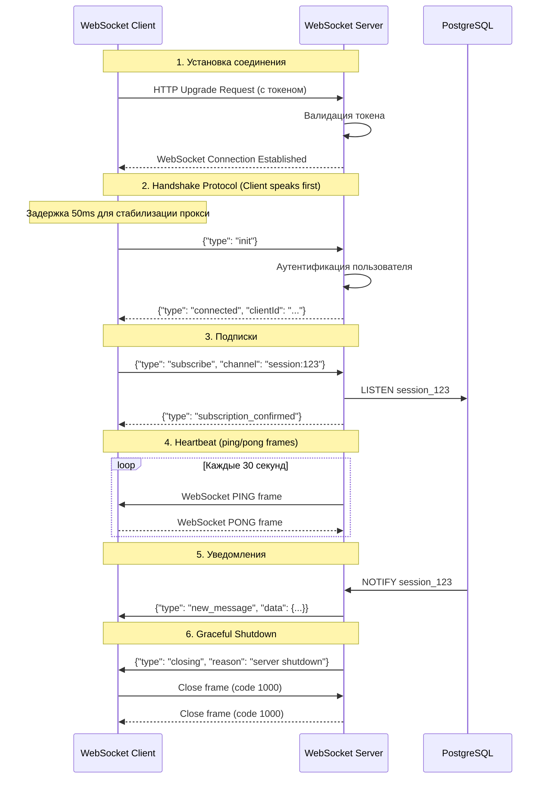
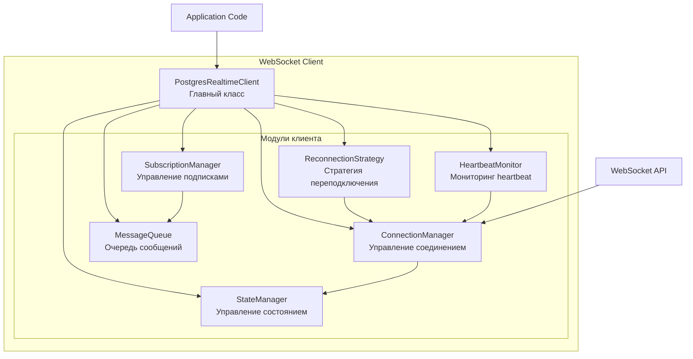
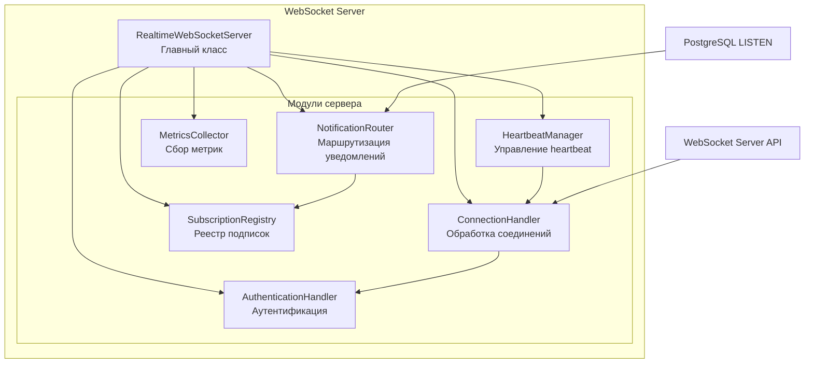

# Технический дизайн: Переработка WebSocket архитектуры

## Обзор

Данный дизайн описывает полную переработку WebSocket архитектуры для устранения критической проблемы аномального закрытия соединений (код 1006) и внедрения надёжных паттернов real-time коммуникации.

### Текущая проблема

Существующая реализация страдает от следующих проблем:
- WebSocket соединение закрывается с кодом 1006 сразу после установки
- Отсутствует чёткий handshake протокол между клиентом и сервером
- Heartbeat механизм работает через JSON сообщения вместо нативных ping/pong frames
- Монолитная структура кода затрудняет поддержку и тестирование
- Нет чёткого управления жизненным циклом соединения

### Цели переработки

1. **Стабильность**: Устранить аномальные закрытия соединений
2. **Модульность**: Разделить код на независимые модули с чёткой ответственностью
3. **Надёжность**: Внедрить проверенные паттерны (handshake, heartbeat, reconnection)
4. **Тестируемость**: Обеспечить возможность unit и property-based тестирования
5. **Масштабируемость**: Создать архитектуру, удобную для расширения

## Архитектура

### Общая схема взаимодействия



### Архитектура клиента



### Архитектура сервера



## Компоненты и интерфейсы

### Клиентские модули

#### 1. ConnectionManager

**Ответственность**: Управление WebSocket соединением и его жизненным циклом.

**Интерфейс**:
```typescript
class ConnectionManager {
  // Установка соединения
  async connect(url: string, token: string): Promise<void>
  
  // Закрытие соединения
  disconnect(code?: number, reason?: string): void
  
  // Отправка сообщения
  send(message: any): boolean
  
  // Получение WebSocket instance
  getWebSocket(): WebSocket | null
  
  // Проверка состояния
  isOpen(): boolean
  
  // События
  on(event: 'open' | 'close' | 'error' | 'message', handler: Function): void
}
```

**Ключевые особенности**:
- Задержка 50ms после HTTP Upgrade для стабилизации прокси
- Установка всех обработчиков событий сразу после создания WebSocket
- Отправка init сообщения для начала handshake
- Обработка всех типов закрытия соединения с правильными кодами

#### 2. SubscriptionManager

**Ответственность**: Управление подписками на каналы уведомлений.

**Интерфейс**:
```typescript
interface Subscription {
  id: string
  channel: string
  type: 'session' | 'all' | 'status'
  sessionId?: number
  onMessage: (message: any) => void
  onError?: (error: Error) => void
}

class SubscriptionManager {
  // Создание подписки
  subscribe(subscription: Omit<Subscription, 'id'>): string
  
  // Удаление подписки
  unsubscribe(subscriptionId: string): void
  
  // Получение всех подписок
  getAll(): Map<string, Subscription>
  
  // Восстановление подписок после переподключения
  restoreAll(sendFn: (message: any) => void): void
  
  // Обработка входящего сообщения
  handleMessage(message: any): void
  
  // Очистка всех подписок
  clear(): void
}
```

**Ключевые особенности**:
- Хранение подписок в Map для быстрого доступа
- Автоматическое восстановление после переподключения
- Поддержка трёх типов подписок: session, all, status
- Вызов callbacks при получении сообщений

#### 3. MessageQueue

**Ответственность**: Буферизация сообщений при разрыве соединения.

**Интерфейс**:
```typescript
class MessageQueue {
  // Добавление сообщения в очередь
  enqueue(message: any): void
  
  // Отправка всех сообщений из очереди
  flush(sendFn: (message: any) => boolean): void
  
  // Получение размера очереди
  size(): number
  
  // Очистка очереди
  clear(): void
  
  // Проверка заполненности
  isFull(): boolean
}
```

**Ключевые особенности**:
- Максимальный размер 100 сообщений
- FIFO порядок обработки
- Удаление старых сообщений при переполнении
- НЕ сохраняет subscribe/unsubscribe сообщения (они восстанавливаются через SubscriptionManager)

#### 4. HeartbeatMonitor

**Ответственность**: Мониторинг активности соединения на стороне клиента.

**Интерфейс**:
```typescript
class HeartbeatMonitor {
  // Запуск мониторинга
  start(): void
  
  // Остановка мониторинга
  stop(): void
  
  // Обновление timestamp последнего сообщения
  updateLastMessageTime(): void
  
  // Проверка активности соединения
  isAlive(): boolean
  
  // Событие при обнаружении "мёртвого" соединения
  onDead(handler: () => void): void
}
```

**Ключевые особенности**:
- Отслеживает время последнего полученного сообщения
- Проверяет активность каждые 10 секунд
- Считает соединение "мёртвым" если нет сообщений 90 секунд
- Автоматически обрабатывает pong frames (браузер делает это автоматически)

#### 5. ReconnectionStrategy

**Ответственность**: Автоматическое переподключение при разрыве соединения.

**Интерфейс**:
```typescript
class ReconnectionStrategy {
  // Попытка переподключения
  reconnect(connectFn: () => Promise<void>): void
  
  // Отмена переподключения
  cancel(): void
  
  // Сброс счётчика попыток
  reset(): void
  
  // Проверка, нужно ли переподключаться
  shouldReconnect(closeCode: number): boolean
  
  // Получение текущей задержки
  getCurrentDelay(): number
}
```

**Ключевые особенности**:
- Экспоненциальная задержка: 1s, 2s, 4s, 8s, 16s, 30s (max)
- НЕ переподключается при кодах: 1000 (normal), 4401 (unauthorized), 4403 (forbidden)
- НЕ переподключается если пользователь не авторизован
- Автоматический сброс счётчика после успешного подключения

#### 6. StateManager

**Ответственность**: Управление состоянием соединения.

**Интерфейс**:
```typescript
type ConnectionState = 'disconnected' | 'connecting' | 'connected' | 'reconnecting'

class StateManager {
  // Получение текущего состояния
  getState(): ConnectionState
  
  // Установка состояния
  setState(state: ConnectionState): void
  
  // Проверка подключения
  isConnected(): boolean
  
  // Подписка на изменения состояния
  onChange(handler: (state: ConnectionState) => void): void
}
```

**Ключевые особенности**:
- Чёткие фазы: disconnected → connecting → connected → reconnecting
- Уведомление подписчиков при изменении состояния
- Синхронизация с WebSocket readyState
- isConnected() возвращает true только когда state === 'connected' И ws.readyState === OPEN

### Серверные модули

#### 1. ConnectionHandler

**Ответственность**: Обработка WebSocket соединений и сообщений.

**Интерфейс**:
```typescript
interface ClientConnection {
  id: string
  ws: WebSocket
  userId: number
  authenticatedAt: Date
  lastPongAt: Date
}

class ConnectionHandler {
  // Обработка нового соединения
  async handleConnection(ws: WebSocket, request: IncomingMessage): Promise<void>
  
  // Обработка сообщения от клиента
  handleMessage(clientId: string, message: string): void
  
  // Отправка сообщения клиенту
  sendToClient(clientId: string, message: any): boolean
  
  // Закрытие соединения
  closeConnection(clientId: string, code: number, reason: string): void
  
  // Получение соединения
  getConnection(clientId: string): ClientConnection | undefined
  
  // Получение всех соединений
  getAllConnections(): Map<string, ClientConnection>
}
```

**Ключевые особенности**:
- Хранение всех активных соединений в Map
- Генерация уникального clientId для каждого соединения
- Обработка всех типов сообщений от клиента
- Логирование всех событий с полным контекстом

#### 2. AuthenticationHandler

**Ответственность**: Аутентификация WebSocket соединений.

**Интерфейс**:
```typescript
class AuthenticationHandler {
  // Валидация токена из URL
  async validateToken(token: string): Promise<{ valid: boolean; userId?: number }>
  
  // Аутентификация init сообщения
  async authenticateInit(clientId: string, token: string): Promise<boolean>
  
  // Проверка прав доступа к каналу
  async canSubscribe(userId: number, channel: string, sessionId?: number): Promise<boolean>
}
```

**Ключевые особенности**:
- Валидация JWT токена из query параметра
- Проверка прав доступа к подпискам
- Закрытие соединения с кодом 4401 при ошибке аутентификации
- Логирование всех попыток аутентификации

#### 3. NotificationRouter

**Ответственность**: Маршрутизация уведомлений от PostgreSQL к клиентам.

**Интерфейс**:
```typescript
class NotificationRouter {
  // Обработка уведомления от PostgreSQL
  async handleNotification(channel: string, payload: string): Promise<void>
  
  // Отправка уведомления подписчикам
  broadcastToSubscribers(channel: string, message: any): void
  
  // Регистрация обработчика для типа уведомления
  registerHandler(type: string, handler: (payload: any) => Promise<void>): void
}
```

**Ключевые особенности**:
- Парсинг JSON payload от PostgreSQL
- Определение типа уведомления (new_message, status_change, type_change)
- Маршрутизация к соответствующим подписчикам
- Обработка ошибок при отправке

#### 4. SubscriptionRegistry

**Ответственность**: Реестр подписок клиентов на каналы.

**Интерфейс**:
```typescript
interface ChannelSubscription {
  clientId: string
  subscriptionId: string
  channel: string
  sessionId?: number
}

class SubscriptionRegistry {
  // Добавление подписки
  add(subscription: ChannelSubscription): void
  
  // Удаление подписки
  remove(subscriptionId: string): void
  
  // Получение подписчиков канала
  getSubscribers(channel: string): Set<string>
  
  // Получение всех подписок клиента
  getClientSubscriptions(clientId: string): ChannelSubscription[]
  
  // Удаление всех подписок клиента
  removeAllForClient(clientId: string): void
}
```

**Ключевые особенности**:
- Двунаправленные индексы: channel → clients и client → subscriptions
- Быстрый поиск подписчиков для канала
- Автоматическая очистка при отключении клиента
- Поддержка множественных подписок одного клиента

#### 5. HeartbeatManager

**Ответственность**: Управление heartbeat механизмом на сервере.

**Интерфейс**:
```typescript
class HeartbeatManager {
  // Запуск heartbeat
  start(): void
  
  // Остановка heartbeat
  stop(): void
  
  // Отправка ping всем клиентам
  sendPingToAll(): void
  
  // Обработка pong от клиента
  handlePong(clientId: string): void
  
  // Проверка "мёртвых" соединений
  checkDeadConnections(): void
}
```

**Ключевые особенности**:
- Отправка WebSocket ping frames каждые 30 секунд
- Отслеживание времени последнего pong от каждого клиента
- Закрытие соединений без pong в течение 60 секунд
- Запуск ТОЛЬКО после handshake (получения init сообщения)

#### 6. MetricsCollector

**Ответственность**: Сбор и логирование метрик.

**Интерфейс**:
```typescript
interface Metrics {
  totalConnections: number
  activeConnections: number
  totalNotifications: number
  totalErrors: number
  totalPongsReceived: number
  lastNotificationAt: Date | null
}

class MetricsCollector {
  // Инкремент метрики
  increment(metric: keyof Metrics): void
  
  // Декремент метрики
  decrement(metric: keyof Metrics): void
  
  // Установка значения
  set(metric: keyof Metrics, value: any): void
  
  // Получение всех метрик
  getAll(): Metrics
  
  // Логирование метрик
  logMetrics(): void
}
```

**Ключевые особенности**:
- Логирование метрик каждые 60 секунд
- Отслеживание всех ключевых событий
- Структурированное логирование с timestamp
- Экспорт метрик для мониторинга

## Модели данных

### Типы сообщений клиента

```typescript
// Инициализация соединения
interface InitMessage {
  type: 'init'
}

// Подписка на канал
interface SubscribeMessage {
  type: 'subscribe'
  channel: 'session' | 'all' | 'status'
  sessionId?: number
  subscriptionId: string
}

// Отписка от канала
interface UnsubscribeMessage {
  type: 'unsubscribe'
  subscriptionId: string
}

// Pong ответ (обрабатывается автоматически браузером)
// Не требует явной обработки в коде

type ClientMessage = InitMessage | SubscribeMessage | UnsubscribeMessage
```

### Типы сообщений сервера

```typescript
// Подтверждение подключения
interface ConnectedMessage {
  type: 'connected'
  clientId: string
}

// Подтверждение подписки
interface SubscriptionConfirmedMessage {
  type: 'subscription_confirmed'
  subscriptionId: string
  channel: string
}

// Новое сообщение
interface NewMessageMessage {
  type: 'new_message'
  data: SupportMessage
}

// Изменение статуса сессии
interface StatusChangeMessage {
  type: 'status_change'
  sessionId: number
  oldStatus: string
  newStatus: string
}

// Изменение типа сессии
interface TypeChangeMessage {
  type: 'type_change'
  sessionId: number
  oldType: string
  newType: string
}

// Ошибка
interface ErrorMessage {
  type: 'error'
  code: string
  message: string
  subscriptionId?: string
}

// Ping (WebSocket frame, не JSON)
// Отправляется через ws.ping()

// Уведомление о закрытии
interface ClosingMessage {
  type: 'closing'
  reason: string
}

type ServerMessage = 
  | ConnectedMessage 
  | SubscriptionConfirmedMessage 
  | NewMessageMessage 
  | StatusChangeMessage 
  | TypeChangeMessage 
  | ErrorMessage 
  | ClosingMessage
```

### Структура состояния клиента

```typescript
interface ClientState {
  // WebSocket соединение
  ws: WebSocket | null
  
  // Состояние соединения
  connectionState: ConnectionState
  
  // ID клиента (присваивается сервером)
  clientId: string | null
  
  // Подписки
  subscriptions: Map<string, Subscription>
  
  // Очередь сообщений
  messageQueue: any[]
  
  // Heartbeat
  lastMessageAt: Date | null
  heartbeatInterval: NodeJS.Timeout | null
  
  // Reconnection
  reconnectAttempts: number
  reconnectTimeout: NodeJS.Timeout | null
}
```

### Структура состояния сервера

```typescript
interface ServerState {
  // WebSocket сервер
  wss: WebSocketServer
  
  // Активные соединения
  connections: Map<string, ClientConnection>
  
  // Реестр подписок
  subscriptions: {
    sessionSubscriptions: Map<number, Set<string>>  // sessionId → Set<clientId>
    allMessagesSubscribers: Set<string>             // clientId
    statusChangeSubscribers: Set<string>            // clientId
  }
  
  // PostgreSQL LISTEN соединение
  pgListenClient: PoolClient | null
  
  // Heartbeat
  heartbeatInterval: NodeJS.Timeout | null
  
  // Метрики
  metrics: Metrics
  
  // Shutdown
  isShuttingDown: boolean
}
```

## Correctness Properties

*Свойство (property) — это характеристика или поведение, которое должно выполняться для всех валидных выполнений системы. По сути, это формальное утверждение о том, что система должна делать. Свойства служат мостом между человекочитаемыми спецификациями и машинно-проверяемыми гарантиями корректности.*

### Prework: Анализ критериев приёмки

#### Требование 1: Стабильное WebSocket соединение

1.1. WHEN WebSocket соединение установлено, THE WebSocket_Client SHALL поддерживать соединение открытым без аномальных закрытий (код 1006)
  **Мысли**: Это общее требование к стабильности соединения. Мы можем проверить, что при нормальной работе (без внешних сбоев) соединение не закрывается с кодом 1006. Это свойство инварианта - соединение должно оставаться открытым.
  **Тестируемость**: yes - property

1.2. WHEN соединение установлено успешно, THE WebSocket_Server SHALL НЕ закрывать соединение преждевременно
  **Мысли**: Это дублирует 1.1 с точки зрения сервера. Если 1.1 проверяет, что соединение не закрывается аномально, это уже покрывает данный критерий.
  **Тестируемость**: redundant (покрывается 1.1)

1.3. THE Connection_Lifecycle SHALL включать чёткие фазы: connecting → authenticating → connected → active
  **Мысли**: Это требование к архитектуре, а не функциональное требование. Мы не можем автоматически проверить "чёткость" фаз.
  **Тестируемость**: no

1.4. WHEN происходит нормальное закрытие, THE WebSocket_Client SHALL использовать код 1000 (normal closure)
  **Мысли**: Это проверка конкретного поведения при закрытии. Мы можем создать сценарий нормального закрытия и проверить код.
  **Тестируемость**: yes - example

1.5. WHEN происходит ошибка, THE WebSocket_Client SHALL использовать соответствующий код закрытия (не 1006)
  **Мысли**: Это свойство для всех типов ошибок. Мы можем генерировать различные ошибочные ситуации и проверять, что код не 1006.
  **Тестируемость**: yes - property

#### Требование 2: Правильный Handshake протокол

2.1. THE Handshake_Protocol SHALL использовать паттерн "Client speaks first"
  **Мысли**: Это ключевое свойство протокола. Для любого соединения клиент должен отправить init первым.
  **Тестируемость**: yes - property

2.2. WHEN WebSocket соединение открыто, THE WebSocket_Client SHALL отправить init сообщение первым
  **Мысли**: Это дублирует 2.1 - оба требуют, чтобы клиент говорил первым.
  **Тестируемость**: redundant (покрывается 2.1)

2.3. WHEN WebSocket_Server получает init сообщение, THE WebSocket_Server SHALL выполнить аутентификацию
  **Мысли**: Это проверка последовательности: init → аутентификация. Это часть round-trip свойства handshake.
  **Тестируемость**: yes - property (часть handshake round-trip)

2.4. WHEN аутентификация успешна, THE WebSocket_Server SHALL отправить connected сообщение
  **Мысли**: Это продолжение 2.3 - часть полного handshake round-trip.
  **Тестируемость**: yes - property (часть handshake round-trip)

2.5. WHEN WebSocket_Client получает connected сообщение, THE WebSocket_Client SHALL перейти в состояние 'connected'
  **Мысли**: Это завершение handshake round-trip. Критерии 2.3, 2.4, 2.5 можно объединить в одно свойство round-trip.
  **Тестируемость**: yes - property (объединить с 2.3, 2.4)

2.6. THE Handshake_Protocol SHALL включать задержку 50ms после HTTP Upgrade
  **Мысли**: Это техническая деталь реализации для совместимости с прокси. Сложно тестировать автоматически.
  **Тестируемость**: no

2.7. WHEN аутентификация не пройдена, THE WebSocket_Server SHALL закрыть соединение с кодом 4401
  **Мысли**: Это конкретный пример поведения при ошибке аутентификации.
  **Тестируемость**: yes - example

#### Требование 3: Надёжный Heartbeat механизм

3.1. THE Heartbeat_Mechanism SHALL использовать WebSocket ping/pong frames
  **Мысли**: Это требование к реализации, не функциональное требование.
  **Тестируемость**: no

3.2. THE WebSocket_Server SHALL отправлять ping frames каждые 30 секунд
  **Мысли**: Это конкретное требование к таймингу. Можно проверить как example.
  **Тестируемость**: yes - example

3.3. WHEN WebSocket_Client получает ping frame, THE WebSocket_Client SHALL автоматически ответить pong frame
  **Мысли**: Это обрабатывается браузером автоматически, не требует тестирования на уровне приложения.
  **Тестируемость**: no

3.4. WHEN WebSocket_Server НЕ получает pong в течение 60 секунд, THE WebSocket_Server SHALL закрыть соединение
  **Мысли**: Это свойство timeout механизма. Можно проверить как example с конкретным таймингом.
  **Тестируемость**: yes - example

3.5. THE Heartbeat_Mechanism SHALL запускаться ТОЛЬКО после получения connected сообщения
  **Мысли**: Это проверка порядка инициализации. Это свойство для всех соединений.
  **Тестируемость**: yes - property

3.6. THE Heartbeat_Mechanism SHALL останавливаться при закрытии соединения
  **Мысли**: Это свойство cleanup. Для любого закрытия heartbeat должен остановиться.
  **Тестируемость**: yes - property

#### Требование 4: Умная стратегия переподключения

4.1. WHEN соединение закрывается аномально, THE Reconnection_Strategy SHALL автоматически переподключиться
  **Мысли**: Это свойство для всех аномальных закрытий. Можно генерировать различные коды закрытия.
  **Тестируемость**: yes - property

4.2. THE Reconnection_Strategy SHALL использовать экспоненциальную задержку
  **Мысли**: Это свойство последовательности задержек. Можно проверить, что каждая следующая задержка больше предыдущей.
  **Тестируемость**: yes - property

4.3. WHEN переподключение успешно, THE Reconnection_Strategy SHALL восстановить все активные подписки
  **Мысли**: Это round-trip свойство: подписки до разрыва = подписки после восстановления.
  **Тестируемость**: yes - property

4.4. WHEN переподключение успешно, THE Reconnection_Strategy SHALL отправить сообщения из очереди
  **Мысли**: Это свойство сохранения сообщений. Сообщения в очереди до переподключения должны быть отправлены после.
  **Тестируемость**: yes - property

4.5. THE Reconnection_Strategy SHALL НЕ переподключаться при нормальном закрытии (код 1000)
  **Мысли**: Это конкретный пример поведения для кода 1000.
  **Тестируемость**: yes - example

4.6. THE Reconnection_Strategy SHALL НЕ переподключаться при ошибке аутентификации (коды 4401, 4403)
  **Мысли**: Это примеры для конкретных кодов. Можно объединить с 4.5 в одно свойство.
  **Тестируемость**: yes - example (объединить с 4.5)

4.7. WHEN пользователь не авторизован, THE Reconnection_Strategy SHALL НЕ пытаться переподключиться
  **Мысли**: Это edge case для неавторизованного пользователя.
  **Тестируемость**: yes - edge-case

#### Требование 5: Менеджер подписок

5.1. THE Subscription_Manager SHALL хранить все активные подписки в Map структуре
  **Мысли**: Это требование к реализации, не функциональное.
  **Тестируемость**: no

5.2. WHEN клиент подписывается на канал, THE Subscription_Manager SHALL сохранить подписку с уникальным ID
  **Мысли**: Это свойство уникальности ID для всех подписок.
  **Тестируемость**: yes - property

5.3. WHEN соединение восстанавливается, THE Subscription_Manager SHALL автоматически восстановить все подписки
  **Мысли**: Это дублирует 4.3.
  **Тестируемость**: redundant (покрывается 4.3)

5.4. WHEN клиент отписывается, THE Subscription_Manager SHALL удалить подписку и уведомить сервер
  **Мысли**: Это round-trip: subscribe → unsubscribe должен вернуть к исходному состоянию.
  **Тестируемость**: yes - property

5.5. THE Subscription_Manager SHALL поддерживать три типа подписок: session, all, status
  **Мысли**: Это требование к функциональности, можно проверить примерами для каждого типа.
  **Тестируемость**: yes - example

5.6. WHEN подписка подтверждена сервером, THE Subscription_Manager SHALL вызвать callback подтверждения
  **Мысли**: Это свойство для всех подписок - callback должен вызываться.
  **Тестируемость**: yes - property

#### Требование 6: Очередь сообщений

6.1. WHEN соединение разорвано, THE Message_Queue SHALL сохранять исходящие сообщения
  **Мысли**: Это свойство буферизации для всех сообщений при разрыве.
  **Тестируемость**: yes - property

6.2. THE Message_Queue SHALL иметь максимальный размер 100 сообщений
  **Мысли**: Это конкретное ограничение, можно проверить примером.
  **Тестируемость**: yes - example

6.3. WHEN очередь заполнена, THE Message_Queue SHALL удалять самые старые сообщения
  **Мысли**: Это свойство FIFO при переполнении.
  **Тестируемость**: yes - property

6.4. WHEN соединение восстановлено, THE Message_Queue SHALL отправить все сохранённые сообщения
  **Мысли**: Это дублирует 4.4.
  **Тестируемость**: redundant (покрывается 4.4)

6.5. THE Message_Queue SHALL НЕ сохранять subscribe/unsubscribe сообщения
  **Мысли**: Это свойство фильтрации для всех сообщений.
  **Тестируемость**: yes - property

6.6. WHEN сообщение отправлено успешно, THE Message_Queue SHALL удалить его из очереди
  **Мысли**: Это свойство очистки для всех отправленных сообщений.
  **Тестируемость**: yes - property

#### Требование 7: Менеджер состояния соединения

7.1. THE State_Manager SHALL поддерживать состояния: disconnected, connecting, connected, reconnecting
  **Мысли**: Это требование к набору состояний, не функциональное.
  **Тестируемость**: no

7.2. WHEN состояние меняется, THE State_Manager SHALL уведомить все заинтересованные компоненты
  **Мысли**: Это свойство уведомлений для всех изменений состояния.
  **Тестируемость**: yes - property

7.3. THE State_Manager SHALL предоставлять метод isConnected()
  **Мысли**: Это требование к API, не функциональное.
  **Тестируемость**: no

7.4. THE State_Manager SHALL предоставлять метод getConnectionState()
  **Мысли**: Это требование к API, не функциональное.
  **Тестируемость**: no

7.5. WHEN WebSocket readyState === OPEN И connectionState === 'connected', THE State_Manager SHALL вернуть true из isConnected()
  **Мысли**: Это свойство согласованности двух состояний.
  **Тестируемость**: yes - property

7.6. THE State_Manager SHALL синхронизировать внутреннее состояние с WebSocket readyState
  **Мысли**: Это общее требование синхронизации, покрывается 7.5.
  **Тестируемость**: redundant (покрывается 7.5)

#### Требование 8: Модульная архитектура

8.1-8.6: Все критерии относятся к структуре кода, не функциональные требования.
  **Тестируемость**: no

#### Требование 9: Обработка ошибок

9.1. WHEN происходит ошибка, THE WebSocket_Client SHALL вызвать onError callback
  **Мысли**: Это свойство для всех ошибок - callback должен вызываться.
  **Тестируемость**: yes - property

9.2. WHEN аутентификация не пройдена, THE WebSocket_Server SHALL отправить сообщение с кодом ошибки
  **Мысли**: Это покрывается 2.7.
  **Тестируемость**: redundant (покрывается 2.7)

9.3. WHEN подписка отклонена, THE WebSocket_Server SHALL отправить error сообщение
  **Мысли**: Это конкретный пример ошибки подписки.
  **Тестируемость**: yes - example

9.4-9.6: Требования к логированию и метрикам, сложно тестировать автоматически.
  **Тестируемость**: no

#### Требование 10: Graceful Shutdown

10.1. WHEN сервер получает SIGTERM, THE WebSocket_Server SHALL начать graceful shutdown
  **Мысли**: Это конкретный пример поведения при сигнале.
  **Тестируемость**: yes - example

10.2. WHEN начинается shutdown, THE WebSocket_Server SHALL отправить closing сообщение всем клиентам
  **Мысли**: Это свойство для всех клиентов при shutdown.
  **Тестируемость**: yes - property

10.3-10.6: Детали процесса shutdown, можно объединить в одно свойство.
  **Тестируемость**: yes - property (объединить)

#### Требование 11: Метрики и мониторинг

11.1-11.6: Требования к метрикам, сложно тестировать автоматически.
  **Тестируемость**: no

#### Требование 12: Совместимость с прокси

12.1-12.6: Требования к работе с прокси, сложно тестировать автоматически в unit-тестах.
  **Тестируемость**: no

#### Требование 13: Тестируемость

13.1-13.6: Требования к тестированию самой системы, не функциональные.
  **Тестируемость**: no

#### Требование 14: Round-trip тестирование протокола

14.1. FOR ALL валидных handshake последовательностей, отправка init → получение connected → отправка subscribe SHALL завершиться успешно
  **Мысли**: Это уже сформулировано как property. Это полный round-trip handshake.
  **Тестируемость**: yes - property

14.2. FOR ALL валидных подписок, отправка subscribe → получение subscription_confirmed → получение уведомлений SHALL работать корректно
  **Мысли**: Это round-trip для подписок.
  **Тестируемость**: yes - property

14.3. FOR ALL сценариев переподключения, разрыв → переподключение → восстановление SHALL восстановить состояние
  **Мысли**: Это покрывается 4.3 и 4.4.
  **Тестируемость**: redundant (покрывается 4.3, 4.4)

14.4. FOR ALL heartbeat циклов, отправка ping → получение pong SHALL поддерживать соединение активным
  **Мысли**: Это round-trip для heartbeat.
  **Тестируемость**: yes - property

14.5-14.6: Общие требования к property-based testing, не конкретные свойства.
  **Тестируемость**: no

### Property Reflection: Устранение избыточности

После анализа выявлены следующие избыточности:

1. **Критерии 1.2 покрывается 1.1** - оба о стабильности соединения
2. **Критерии 2.2 покрывается 2.1** - оба о "client speaks first"
3. **Критерии 2.3, 2.4, 2.5 объединяются** - это части одного handshake round-trip
4. **Критерии 4.5 и 4.6 объединяются** - примеры кодов, при которых не переподключаемся
5. **Критерии 5.3 покрывается 4.3** - оба о восстановлении подписок
6. **Критерии 6.4 покрывается 4.4** - оба об отправке сообщений из очереди
7. **Критерии 7.6 покрывается 7.5** - оба о синхронизации состояний
8. **Критерии 9.2 покрывается 2.7** - оба об ошибке аутентификации
9. **Критерии 10.3-10.6 объединяются** - это части одного graceful shutdown процесса
10. **Критерии 14.3 покрывается 4.3, 4.4** - оба о восстановлении после переподключения

### Финальные Correctness Properties

### Property 1: Отсутствие аномальных закрытий при нормальной работе

*Для любого* установленного WebSocket соединения, при отсутствии внешних сбоев (сетевых проблем, падения сервера), соединение НЕ должно закрываться с кодом 1006 (abnormal closure).

**Validates: Requirements 1.1**

### Property 2: Использование правильных кодов закрытия при ошибках

*Для любой* ошибочной ситуации (ошибка аутентификации, ошибка подписки, таймаут), клиент должен закрывать соединение с соответствующим кодом (4401, 4403, 1008 и т.д.), но НЕ с кодом 1006.

**Validates: Requirements 1.5**

### Property 3: Handshake round-trip (Client speaks first)

*Для любого* нового WebSocket соединения, последовательность handshake должна быть: клиент отправляет init → сервер выполняет аутентификацию → сервер отправляет connected → клиент переходит в состояние 'connected'. Клиент всегда говорит первым.

**Validates: Requirements 2.1, 2.3, 2.4, 2.5, 14.1**

### Property 4: Heartbeat запускается после handshake

*Для любого* WebSocket соединения, heartbeat механизм должен запускаться ТОЛЬКО после получения сообщения 'connected' от сервера, а не сразу после открытия WebSocket.

**Validates: Requirements 3.5**

### Property 5: Heartbeat останавливается при закрытии

*Для любого* закрытия WebSocket соединения (нормального или аномального), heartbeat механизм должен быть остановлен и не должен продолжать отправлять ping frames.

**Validates: Requirements 3.6**

### Property 6: Автоматическое переподключение при аномальном закрытии

*Для любого* аномального закрытия соединения (коды кроме 1000, 4401, 4403), стратегия переподключения должна автоматически инициировать попытку переподключения.

**Validates: Requirements 4.1**

### Property 7: Экспоненциальная задержка при переподключении

*Для любой* последовательности попыток переподключения, задержка между попытками должна увеличиваться экспоненциально: delay(n+1) = min(delay(n) * 2, 30000), начиная с 1000ms.

**Validates: Requirements 4.2**

### Property 8: Восстановление подписок после переподключения

*Для любого* набора активных подписок перед разрывом соединения, после успешного переподключения все эти подписки должны быть автоматически восстановлены (отправлены subscribe сообщения).

**Validates: Requirements 4.3, 5.3, 14.3**

### Property 9: Отправка сообщений из очереди после переподключения

*Для любых* сообщений, добавленных в очередь во время разрыва соединения, после успешного переподключения все эти сообщения должны быть отправлены в порядке FIFO.

**Validates: Requirements 4.4, 6.4, 14.3**

### Property 10: Уникальность ID подписок

*Для любых* двух подписок, созданных SubscriptionManager, их ID должны быть уникальными (не должно быть коллизий).

**Validates: Requirements 5.2**

### Property 11: Subscribe/Unsubscribe round-trip

*Для любой* подписки, последовательность subscribe → unsubscribe должна вернуть систему в исходное состояние (подписка удалена из реестра, сервер уведомлён).

**Validates: Requirements 5.4**

### Property 12: Вызов callback при подтверждении подписки

*Для любой* подписки с указанным callback, при получении сообщения 'subscription_confirmed' от сервера, callback должен быть вызван.

**Validates: Requirements 5.6, 14.2**

### Property 13: Буферизация сообщений при разрыве соединения

*Для любого* сообщения, отправленного через sendMessage() когда соединение разорвано, это сообщение должно быть добавлено в очередь (если это не subscribe/unsubscribe).

**Validates: Requirements 6.1**

### Property 14: FIFO при переполнении очереди

*Для любой* последовательности сообщений, добавляемых в заполненную очередь (размер >= 100), самые старые сообщения должны удаляться первыми (FIFO).

**Validates: Requirements 6.3**

### Property 15: Фильтрация subscribe/unsubscribe в очереди

*Для любых* сообщений типа 'subscribe' или 'unsubscribe', они НЕ должны добавляться в MessageQueue (восстанавливаются через SubscriptionManager).

**Validates: Requirements 6.5**

### Property 16: Удаление сообщения из очереди после отправки

*Для любого* сообщения из очереди, после успешной отправки (sendMessage вернул true), это сообщение должно быть удалено из очереди.

**Validates: Requirements 6.6**

### Property 17: Уведомление при изменении состояния

*Для любого* изменения connectionState в StateManager, все зарегистрированные обработчики onChange должны быть вызваны с новым состоянием.

**Validates: Requirements 7.2**

### Property 18: Согласованность isConnected() с состояниями

*Для любого* момента времени, метод isConnected() должен возвращать true ТОЛЬКО когда connectionState === 'connected' И ws.readyState === WebSocket.OPEN.

**Validates: Requirements 7.5, 7.6**

### Property 19: Вызов onError callback при ошибках

*Для любой* ошибки (ошибка соединения, ошибка подписки, таймаут), если для подписки указан onError callback, он должен быть вызван с объектом Error.

**Validates: Requirements 9.1**

### Property 20: Отправка closing сообщения всем клиентам при shutdown

*Для любого* graceful shutdown сервера, всем активным клиентам должно быть отправлено сообщение типа 'closing' перед закрытием их соединений.

**Validates: Requirements 10.2, 10.3, 10.4, 10.5, 10.6**

### Property 21: Subscription round-trip с уведомлениями

*Для любой* валидной подписки, последовательность subscribe → subscription_confirmed → получение уведомления (при наличии событий) должна работать корректно.

**Validates: Requirements 14.2**

### Property 22: Heartbeat round-trip

*Для любого* активного соединения с запущенным heartbeat, последовательность ping (от сервера) → pong (от клиента) должна поддерживать соединение активным (не закрывать по таймауту).

**Validates: Requirements 14.4**

## Обработка ошибок

### Стратегия обработки ошибок

Система использует многоуровневую стратегию обработки ошибок:

1. **Уровень соединения**: Ошибки WebSocket соединения
2. **Уровень аутентификации**: Ошибки валидации токена и прав доступа
3. **Уровень подписок**: Ошибки при подписке/отписке
4. **Уровень сообщений**: Ошибки при отправке/получении сообщений
5. **Уровень heartbeat**: Ошибки таймаута соединения

### Коды закрытия WebSocket

```typescript
enum CloseCode {
  // Стандартные коды
  NORMAL_CLOSURE = 1000,           // Нормальное закрытие
  GOING_AWAY = 1001,               // Сервер уходит в shutdown
  PROTOCOL_ERROR = 1002,           // Ошибка протокола
  UNSUPPORTED_DATA = 1003,         // Неподдерживаемый тип данных
  INVALID_FRAME_PAYLOAD = 1007,    // Невалидный payload
  POLICY_VIOLATION = 1008,         // Нарушение политики
  MESSAGE_TOO_BIG = 1009,          // Слишком большое сообщение
  INTERNAL_ERROR = 1011,           // Внутренняя ошибка сервера
  
  // Кастомные коды (4000-4999)
  UNAUTHORIZED = 4401,             // Ошибка аутентификации
  FORBIDDEN = 4403,                // Нет прав доступа
  HEARTBEAT_TIMEOUT = 4408,        // Таймаут heartbeat
  SUBSCRIPTION_ERROR = 4409,       // Ошибка подписки
}
```

### Обработка ошибок на клиенте

**ConnectionManager**: Обрабатывает ошибки соединения, логирует с контекстом, уведомляет через callbacks, инициирует переподключение при необходимости.

**SubscriptionManager**: Обрабатывает ошибки подписок, вызывает onError callbacks, удаляет подписки при критических ошибках (FORBIDDEN, INVALID_CHANNEL).

### Обработка ошибок на сервере

**AuthenticationHandler**: Валидирует токены, отправляет error сообщения, закрывает соединения с правильными кодами (4401 для unauthorized).

**NotificationRouter**: Обрабатывает ошибки парсинга уведомлений, инкрементирует метрики ошибок, продолжает работу (не падает на одной ошибке).

### Логирование ошибок

Все ошибки логируются с полным контекстом: timestamp, component, clientId, userId, error message, stack trace.

## Стратегия тестирования

### Двойной подход к тестированию

1. **Unit-тесты**: Конкретные примеры, edge cases, ошибочные ситуации
2. **Property-based тесты**: Универсальные свойства на большом количестве сгенерированных данных

### Property-Based Testing

**Библиотека**: fast-check для TypeScript/JavaScript

**Конфигурация**:
- Минимум 100 итераций на тест
- Комментарий с ссылкой на свойство из дизайна
- Формат: `// Feature: websocket-architecture-refactor, Property N: <название>`
- Использование seed для воспроизводимости

**Генераторы**:
- `tokenArbitrary`: Валидные токены (32-256 символов)
- `subscriptionTypeArbitrary`: Типы подписок (session, all, status)
- `sessionIdArbitrary`: ID сессий (1-1000000)
- `messageArbitrary`: Сообщения различных типов
- `closeCodeArbitrary`: Коды закрытия WebSocket
- `eventSequenceArbitrary`: Последовательности событий

### Примеры тестов

**Property 7 - Экспоненциальная задержка**: Проверяет, что задержки растут как 1s → 2s → 4s → 8s → 16s → 30s (max)

**Property 8 - Восстановление подписок**: Проверяет, что все подписки восстанавливаются после переподключения

**Property 14 - FIFO очередь**: Проверяет, что при переполнении удаляются самые старые сообщения

### Unit-тесты

Фокусируются на конкретных сценариях:
- Нормальное закрытие использует код 1000
- Ошибка аутентификации использует код 4401
- Heartbeat запускается только после connected сообщения
- Поддержка трёх типов подписок
- Обработка отклонённых подписок

### Интеграционные тесты

Проверяют взаимодействие клиент-сервер:
- Полная последовательность handshake
- Подписка с получением уведомлений
- Graceful shutdown с closing сообщением

### Покрытие

- Unit-тесты: 80%+ покрытие кода
- Property-based тесты: Все 22 свойства из дизайна
- Интеграционные тесты: Все критические сценарии

### Continuous Integration

Все тесты выполняются в CI pipeline при каждом push и pull request.

